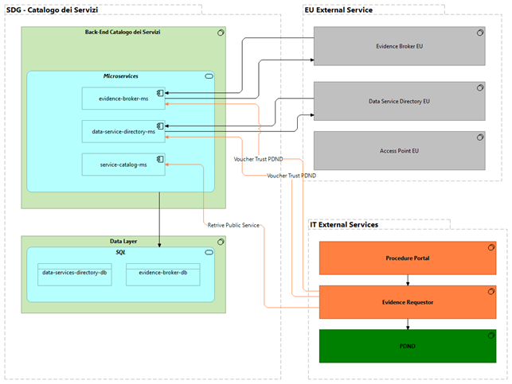
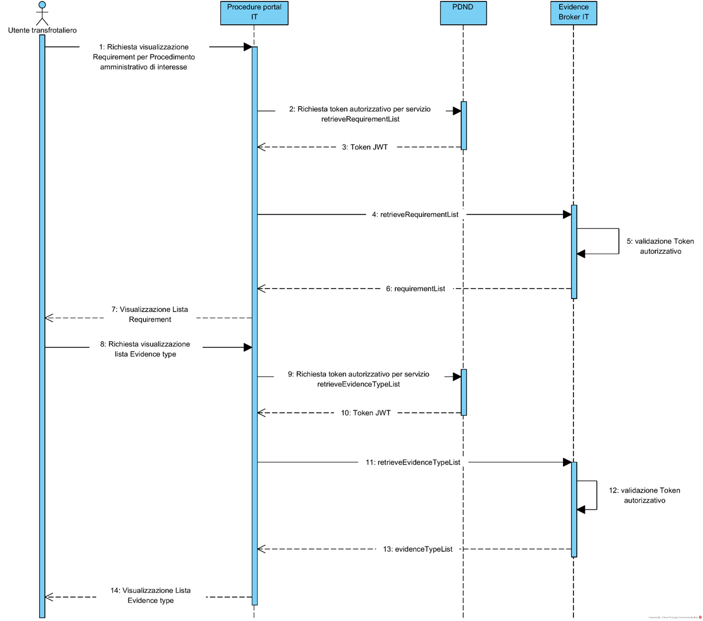

***Accordo quadro di servizi applicativi in ottica Cloud – Lotto 1***

***Progetto Single Digital Gateway (SDG)***

Specifica tecnica

Documento di integrazione

**Versione 1.3.1 – Stato del documento: Bozza per condivisione**

**Classificazione del documento: AgID Internal**

**20 maggio 2022**

# Scopo e Ambito del Documento

## Scopo del documento

Il presente documento è utile alle PA Italiane che scelgono di
realizzare il proprio Procedure Portal integrato con la piattaforma
europea SDG. Le specifiche tecniche contenute permettono al team di
sviluppo del Procedure Portal di implementare le logiche di integrazione
nel rispetto degli standard dettati dalla Comunità Europea.

## Ambito di riferimento

Il sistema informatico oggetto di analisi nel presente documento è
l’integrazione con la piattaforma europea SDG (Single Digital Gateway).

In particolare, i componenti analizzati sono quindi:

1. **Evidence Broker.**

componente architetturale deputato alla consegna dell’elenco di
tipologie di prova (*Evidence Type List*) che consente ai portali delle
PA coinvolte di individuare la Tipologia di Prova (*Evidence Type*)
necessaria per soddisfare una richiesta.

1. **Data Service Directory.**

Componente architetturale deputato alla gestione e condivisione degli
Enti accreditati per l’erogazione (*Evidence Provider*) della Tipologia
di prova (*Evidence Type)*.

1. **Access Point.**

Componente architetturale di rete che rende trasparente agli Enti
Fruitori e agli Enti Erogatori le diverse scelte implementative e
garantisce i livelli di sicurezza necessari nello scambio di dati
cross-border. Interviene attivamente nello scambio di dati tra gli Stati
Membri.

1. Preview Component (Work In Progress. Le specifiche tecniche per
   questo componente sono ancora in corso da parte della CE).

Il Componente architetturale IT deputato alla visualizzazione delle
Evidence in anteprima. Come da Specifiche Tecniche anticipate la preview
è onere del Evidence Provider (e quindi owner) del documento

## Glossario Definizioni ed Acronimi

| **ACRONIMO** | **DESCRIZIONE**                                                              |
| ------------ | ---------------------------------------------------------------------------- |
| PP           | Procedure Portal                                                             |
| PA           | Pubblica Amministrazione                                                     |
| SDG          | Single Digital Gateway                                                       |
| CS           | Catalogo dei Servizi                                                         |
| EB           | Evidence Broker                                                              |
| DSD          | Data Service Directory                                                       |
| PDND         | Piattaforma Digitale Nazionale Dati per l'interoperabilità di dati e servizi |
| BO           | Back office                                                                  |
| OOTS         | Once only technical system                                                   |

# Contesto del progetto

## Diagramma Logico di Architettura

 

L’infrastruttura italiana dell’SDG espone, ad uso dei Procedure Portal
italiani, le REST API dell'Evidence Broker e del Data Service Directory
come da diagramma riportato.

Nel confine logico indicato come “IT External Services” sono contenuti
schematicamente il Procedure Portal ovvero il portale della PA deputato
all’implementazione del Procedimento Amministrativo SDG, l'Evidence
Requestor ovvero il componente che implementa la richiesta di Evidence
necessaria ed il PDND ovvero l’infrastruttura nazionale Dati per
abilitare (authentication and authorization) l’interoperabilità tramite
API tra PA.

Il blocco “EU External Services” indicato in grigio è considerato OOS
(Out Of Scope) in questo contesto in quanto sono i servizi omologhi
degli altri Stati Membri riportati nel diagramma per completezza di
informazione, resi trasparenti a Procedural Portal italiani dalle
componenti nazionali .

L'utente transfrontaliero, nell’intento di recuperare la Prova
(*Evidence*) esegue l’accesso al Procedure Portal e in maniera indiretta
e del tutto trasparente interagisce con i servizi esposti dal SDG
riuscendo così a portare a termine l’operazione di recupero della prova
secondo il principio OOP tramite OOTS.

Per una corretta lettura dello schema le chiamate riportate con le
frecce di colore arancione dal Procedure Portal si avvalgono del
supporto del Evidence Requestor che, ottenuto il voucher dalla PDND, si
rivolge ai sistemi Evidence Broker o Data Service Directory del SDG.

Il voucher implementa il concetto di token autorizzativo per la gestione
della richiesta, pertanto, è un Access Token JWT utilizzato nelle
chiamate delle API REST. I dettagli relativamente agli stessi voucher e
al loro recupero sono oggetto dell’implementazione PDND, di cui
l’ecosistema italiano SDG (componenti nazionali, Procedure Portal
italiani e Data Service italiani) si avvale.

Per permettere un accesso più sicuro ed agevole agli OpenAPI3 generati e
contenuti nel documento è stato creato un repository GitHub reperibile a
questo URL, a cui si può accedere con utenze opportunamente autorizzate
da AgID:

[https://github.com/AgID/sdg_it_architype](https://urldefense.proofpoint.com/v2/url?u=https-3A__github.com_AgID_sdg-5Fit-5Farchitype&d=DwMGaQ&c=eIGjsITfXP_y-DLLX0uEHXJvU8nOHrUK8IrwNKOtkVU&r=CcBA8Bcw3JtEnYhMMAMPCFmIB0_6RwzYnRcZYq4_vD4i39CHclsbDLC1-wbJR_OV&m=FPPtU_bnRexG_xIL1EVbVccauuEqXP74YaeRTfiX6qZKX1U33PQrs6yXj76EYgkY&s=o4eMYPDiSxpU4HGC4vOtQ-_IukRuBr3Ug-Rmx5vZxZs&e=)

# Gestione delle Chiavi per recupero DEGLI URL PER ACCEDERE ALLE Procedure

Sono analizzati i due possibili scenari di integrazione fra il Catalogo
dei Servizi ed il Procedure Portal.

## Scenario di accesso tramite Catalogo dei Servizi.

L’utente transfrontaliero può accedere al sistema SDG per tramite del
portale YourEurope che rappresenta il livello funzionale più alto e Hub
di tutti gli stati membri aderenti al SDG. Tramite YourEurope l’utente
comunitario potrà scegliere la lingua di fruizione del servizio, tra
quelle a disposizione, e di conseguenza lo Stato Membro verso cui
proseguire nella navigazione della richiesta verso il Catalogo dei
Servizi.

La navigazione nel portale del Catalogo dei Servizi avviene in modalità
anonima per selezionare la procedura di interesse.

Il processo termina con il Catalogo dei Servizi che produce una URL di
inoltro verso il Procedure Portal (rif. §5.1) ed in particolare viene
generato un parametro passato nella querystring dell’URL di redirect
noto come “*publicService*” che corrisponde all’identificativo del
Procedimento amministrativo, a livello Europeo, utile a filtrare i
Requirement nella successiva chiamata all’Evidence Broker da parte del
Procedure Portal.

È pertanto necessario che tale parametro, comunicato al Procedure Portal
nella modalità sopra esposta, sia utilizzato nelle successive chiamate
verso il back-end del Catalogo dei Servizi proprio per filtrare il
*Requirement* ed evitare così di recuperare una lista di *Requirement*
troppo ampia rispetto al contesto amministrativo determinato dalla
procedura di interesse dell’utente.

## Scenario di accesso diretto al Procedure Portal

L’utente transfrontaliero però può altresì iniziare il processo di
richiesta delle Evidence, direttamente da un Procedure Portal saltando
di fatto il processo di ricerca e identificazione della procedura sul
Catalogo dei Servizi.

In tal caso il Procedure Portal non sarà invocato tramite la redirect
generata dal Catalogo dei Servizi e di conseguenza non avrà modo di
ricevere e mantenere il codice del *publicService* passato sulla URL di
redirect. In questo caso, dunque, il Procedure Portal nel momento in cui
ha necessità di recuperare i Requirements dall’Evidence Broker, deve
autonomamente provvedere al recupero di tale parametro attraverso
l’invocazione dell’API retrieveIdPublicService (rif. §6.3) al fine di
poterlo passare nell’invocazione dell’API requirementList dell’Evidence
Broker (rif. §6.1).

# Gestione del meccanismo di autenticazione TRAMITE PDND

Al fine d’integrare i servizi esposti dal SDG è necessario registrare
(onboarding) sull’infrastruttura PDND sia le amministrazioni owner di
Evidence Provider che le amministrazione owner di Evidence Requestor in
modo da permettere, per il tramite degli strumenti resi disponibili
dalla stessa infrastruttura PDND, alle prime di registrare le API rese
disponibili all’ecosistema SDG, nel ruolo di Erogatore PDND, alle
seconde di effettuare la richiesta di accesso alle API, nel ruolo di
Fruitore PDND, ad esse necessaria dando seguito alla richiesta di
accesso e alla successiva dichiarazione della finalità.

Come meccanismo di Security la PDND implementa il Voucher di
autorizzazione per l’utilizzo di un e-service per consentire la
comunicazione tra Evidence Provider (Erogatore PDND) e Evidence
Requestor (Fruitore PDND).

L’Access Token emesso dalla PDND consiste in un JWT conforme all’RFC7515
firmato dall’Infrastruttura PDND che svolge il ruolo di Voucher
utilizzato dai Procedure Portal per le chiamate ai servizi del SDG come
riportato di seguito nell’header del messaggio https nella chiamata alle
RestAPI necessarie all’integrazione.

Pertanto, è mandatorio che in tutte le chiamate verso le componenti SDG
sia popolato l’header “Authorization” con auth-scheme valorizzato a
“Bearer” e authorization-parameters valorizzato con l’access token
emesso dalla PDND.

Nel Sequence Diagram seguente è illustrata l’interazione fra il
Procedure Portal, la PDND e le API dell’Evidence Broker all’interno di
SDG in seguito di una richiesta da parte dell’utente transfrontaliero.
Il medesimo meccanismo è applicato anche per l'interazione tra il
Procedure Portal e Data Service Directory IT e tra il Procedure Portal e
Arch Common Service IT.

Il diagramma seguente mostra gli step 2, 3, 11, 12 oggetto di
adeguamento alle nuove specifiche tecniche anticipate dalla CE per cui
potrebbero subire delle modifiche.

Figura 1 - interazione PP con SDG

# Specifiche tecniche delle API relative alle chiamate ricevute dal Procedure Portal

In questo capitolo sono esposte le interfacce richiamabili dal Catalogo
dei Servizi e che i Procedure Portal dovranno esporre.

## Interazione da Catalogo dei Servizi al Procedure Portal

Il catalogo dei servizi, a seguito dell’interazione con l’utente sarà in
grado di selezionare una URL contenente sia il dominio corretto del
Procedure Portal selezionato e sia il Public Service relativo alla
procedura voluta ed indicata dall’utente.

Pertanto, sul front end del catalogo dei servizi, è presente una
*redirect* verso la URL del Procedure Portal individuato alla quale è
aggiunto il parametro *PublicService* utilizzato dal Procedure Portal
per determinare la singola procedura di interesse per l’utente.

Per reindirizzare l’utente alla singola procedura, è aggiunto il valore
del parametro del *PublicService* selezionato, inserito nella URL di
destinazione come *querystring*.

A titolo di esempio è indicata di seguito la modalità di invio del
PublicService:

- https://\<url_procedure_portal\>/procedures?publicService=\<codice_public_service\>

Dove *\<url_procedure_portal\>* e *\<codice_public_service\>* sono
definiti e selezionati dal back end del catalogo dei servizi in base
all’interazione con l’utente.

NB: È in fase di studio di Sicurezza Applicativa la modalità di criptare
il parametro proc-identifier, in input alla successiva chiamata alla API
requirementList dell’Evidence Broker IT.

# Specifiche tecniche delle API relative alle chiamate effettuate dal Procedure Portal

In questo capitolo è esposto l’elenco di API a disposizione dei
Procedure Portal con l’indicazione dei parametri attesi in input, sia
essi mandatori che opzionali, ed i parametri di output.

Sono altresì riportati anche i file OpenAPI 3.0 in modo da semplificare
e standardizzare la documentazione delle API per i servizi RESTful.

Alla ricezione del documento di specifiche tecniche aggiornato
(Technical Design Document) da parte della CE previsto per giugno 2022
sarà possibile integrare il paragrafo con un Sequence Diagram che
esponga l’interazione di dettaglio del Procedure Portal verso SDG.

Al momento è possibile far riferimento al Sequence Diagram mostrato nel
paragrafo *“4. GESTIONE DEL MECCANISMO DI AUTENTICAZIONE TRAMITE PDND”*

Per migliorare la comprensione del capitolo si descrive la struttura dei
paragrafi successivi.

Ogni paragrafo descrive l'API esposta da DSG italiano verso il PP; sono
menzionati i prerequisiti ed i requisiti affinché l'API possa essere
eseguita correttamente nel suo contesto.

I parametri di input all'API sono descritti nella sezione tabellare
INPUT mentre nella sezione OUTPUT è descritta la struttura dati attesa
al termine dell'esecuzione dell'API.

## Recupero RequirementList da Evidence Broker IT

<u>API:</u> /api/v1/requirement/list

<u>Prerequisito</u>: Per accedere al Procedure Portal l’utente dovrà
autenticarsi su di esso mediante nodo di tipo eIDAS, fornendo un primo
consenso ad accedere alle informazioni previste per mezzo del OOTS, con
un livello di autenticazione coerente con quanto previsto dal
procedimento di interesse; in tal senso dovrà essere lo stesso Procedure
Portal a verificare tale aspetto rispetto alle diverse situazioni che
potrebbero verificarsi (es.: accesso diretto, tentativo di accesso
successivo alla scadenza della sessione, riscrittura del URL, redirect
interno di un utente già autenticato, ecc.).

<u>Requisito</u>: Lista dei requisiti previsti per il procedimento
amministrativo d’interesse.

Parametri di input al metodo GET e payload di output

| **PROTOCOL**               | HTTPS                                                    |
| -------------------------- | -------------------------------------------------------- |
| **PATH (Public Exposure)** | https://\<url_service_catalog \>/api/v1/requirement/list |
| **METHOD**                 | GET                                                      |
| **CONTENT TYPE**           | application / xml                                        |

**Parameter description:**

<table style="width:100%;">
<colgroup>
<col style="width: 19%" />
<col style="width: 49%" />
<col style="width: 11%" />
<col style="width: 8%" />
<col style="width: 11%" />
</colgroup>
<thead>
<tr class="header">
<th colspan="5"><strong>INPUT</strong></th>
</tr>
</thead>
<tbody>
<tr class="odd">
<td colspan="5"><strong>HEADER PARAM</strong></td>
</tr>
<tr class="even">
<td><em><strong>Parameter</strong></em></td>
<td><em><strong>Description</strong></em></td>
<td><em><strong>Mandatory / Optional</strong></em></td>
<td>
<em><strong>Max</strong></em>

<em><strong>Length</strong></em>
</td>
<td><em><strong>Type</strong></em></td>
</tr>
<tr class="odd">
<td>Authorization</td>
<td>Bearer <<em>Voucher PDND</em>></td>
<td>M</td>
<td>n/a</td>
<td>String</td>
</tr>
<tr class="even">
<td colspan="5"><strong>BODY PARAM</strong></td>
</tr>
<tr class="odd">
<td><em><strong>Parameter</strong></em></td>
<td><em><strong>Description</strong></em></td>
<td><em><strong>Mandatory / Optional</strong></em></td>
<td><em><strong>Max Length</strong></em></td>
<td><em><strong>Type</strong></em></td>
</tr>
<tr class="even">
<td>queryId</td>
<td>Vincolo: deve sempre essere valorizzato con la seguente
stringa 
“urn:oots:eb:ebxml-regrep:queries:requirementsby-procedure-and-jurisdiction”</td>
<td>M</td>
<td>n/a</td>
<td>String</td>
</tr>
<tr class="odd">
<td>proc-identifier</td>
<td>
L'identificatore della procedura a livello dell'UE è utilizzato
per filtrare solo i requisiti utilizzati nell'ambito della procedura
specifica.

Esempio:

<!-- Procedure Identifier -->

<Identifier>03b82e6a-3227-4751-a815-b570a9c0aeb4</Identifier
>
</td>
<td>M</td>
<td></td>
<td>String</td>
</tr>
<tr class="even">
<td>proc-jurisdiction</td>
<td>
Giurisdizione della Procedure/Procedimento amministrativo al fine
di filtrare i Requirement utilizzati nello Stato Membro.

Vincolo: Codice ISO 3166-2
</td>
<td>O</td>
<td></td>
<td>String</td>
</tr>
</tbody>
</table>

L’attributo status dovrà indicare l’esito dell’elaborazione.

In questo caso lo status dovrà contenere “Success”

<table>
<colgroup>
<col style="width: 19%" />
<col style="width: 56%" />
<col style="width: 11%" />
<col style="width: 12%" />
</colgroup>
<thead>
<tr class="header">
<th colspan="4"><strong>OUTPUT</strong></th>
</tr>
</thead>
<tbody>
<tr class="odd">
<td colspan="4"><strong>HEADER</strong></td>
</tr>
<tr class="even">
<td><em><strong>Parameter</strong></em></td>
<td><em><strong>Description</strong></em></td>
<td><em><strong>Mandatory / Optional</strong></em></td>
<td><em><strong>Type</strong></em></td>
</tr>
<tr class="odd">
<td>TBD</td>
<td></td>
<td></td>
<td></td>
</tr>
<tr class="even">
<td colspan="4"><strong>BODY</strong></td>
</tr>
<tr class="odd">
<td><em><strong>Parameter</strong></em></td>
<td><em><strong>Description</strong></em></td>
<td><em><strong>Mandatory / Optional</strong></em></td>
<td><em><strong>Type</strong></em></td>
</tr>
<tr class="even">
<td>query:QueryResponse</td>
<td>
oggetto Response.

Il nodo deve contenere i seguenti attributi:

xmlns="urn:oasis:names:tc:ebxml-regrep:xsd:lcm:4.0"
xmlns:lcm="urn:oasis:names:tc:ebxml-regrep:xsd:lcm:4.0"
xmlns:query="urn:oasis:names:tc:ebxml-regrep:xsd:query:4.0"
xmlns:rim="urn:oasis:names:tc:ebxml-regrep:xsd:rim:4.0"
xmlns:rs="urn:oasis:names:tc:ebxml-regrep:xsd:rs:4.0"
xmlns:xsi="http://www.w3.org/2001/XMLSchema-instance"
xsi:schemaLocation="urn:oasis:names:tc:ebxml-regrep:xsd:lcm:4.0"
</td>
<td>M</td>
<td>Object</td>
</tr>
<tr class="odd">
<td>requestId</td>
<td>
Attributo del nodo query:QueryResponse

Deve corrispondere all'attributo id dell'oggetto QueryRequest che ha
generato queryResponse.

Esempio:

requestId="c4369c4d-740e-4b64-80f0-7b209a66d629"

Il codice è autogenerato al momento dell’esecuzione della
request.

riferimeto: RegRep4
</td>
<td>M</td>
<td>String</td>
</tr>
<tr class="even">
<td>status</td>
<td>
Attributo del nodo query:QueryResponse

Dovrà essere valorizzato nel seguente modo per indicare
l’elaborazione corretta dell’API:

"urn:oasis:names:tc:ebxmlregrep: ResponseStatusType:Success"
</td>
<td>M</td>
<td>String</td>
</tr>
</tbody>
</table>

***Nodo Padre della seguente lista di nodi figli:*** query:QueryResponse

| ***Parameter***        | ***Description***                  | ***Mandatory / Optional*** | ***Type*** |
| ---------------------- | ---------------------------------- | -------------------------- | ---------- |
| rim:RegistryObjectList | Contiene le informazioni richieste | O                          | Object     |

***Nodo Padre della seguente lista di nodi figli:**
rim:RegistryObjectList*

<table>
<colgroup>
<col style="width: 19%" />
<col style="width: 56%" />
<col style="width: 11%" />
<col style="width: 12%" />
</colgroup>
<thead>
<tr class="header">
<th><em><strong>Parameter</strong></em></th>
<th><em><strong>Description</strong></em></th>
<th><em><strong>Mandatory / Optional</strong></em></th>
<th><em><strong>Type</strong></em></th>
</tr>
</thead>
<tbody>
<tr class="odd">
<td>rim:RegistryObject</td>
<td>Contiene il dettaglio della singola richiesta</td>
<td>O</td>
<td>Object</td>
</tr>
<tr class="even">
<td>id</td>
<td>
Attributo del nodo rim:RegistryObjectList

ID è l’identificativo univoco definito dall’Evidence
Provider
</td>
<td>M</td>
<td>String</td>
</tr>
</tbody>
</table>

***Nodo Padre della seguente lista di nodi figli:** rim:*RegistryObject

<table>
<colgroup>
<col style="width: 19%" />
<col style="width: 56%" />
<col style="width: 11%" />
<col style="width: 12%" />
</colgroup>
<thead>
<tr class="header">
<th><em><strong>Parameter</strong></em></th>
<th><em><strong>Description</strong></em></th>
<th><em><strong>Mandatory / Optional</strong></em></th>
<th><em><strong>Type</strong></em></th>
</tr>
</thead>
<tbody>
<tr class="odd">
<td>Requirement</td>
<td>
Contiene la lista degli oggetti requisiti.

Il nodo deve contenere i seguenti attributi:

xmlns="http://data.europa.eu/sdg#"
xmlns:xsi="http://www.w3.org/2001/XMLSchema-instance"

Contiene la condizione o prerequisito stabilito da un'autorità
competente nel contesto di un SDG online. Procedura, che un cittadino o
un'azienda deve soddisfare per completare la procedura
</td>
<td>O</td>
<td>Object</td>
</tr>
</tbody>
</table>

***Nodo Padre della seguente lista di nodi figli:*** Requirement

| ***Parameter***    | ***Description***                                                                                                                                                                                                       | ***Mandatory / Optional*** | ***Type*** |
| ------------------ | ----------------------------------------------------------------------------------------------------------------------------------------------------------------------------------------------------------------------- | -------------------------- | ---------- |
| Identifier         | Identificativo univoco del requisito                                                                                                                                                                                    | M                          | String     |
| Name               | Nome per identificare il requisito                                                                                                                                                                                      | O                          | String     |
| ReferenceFramework | Il Framework è la piattaforma o portale di riferimento da cui è stato creato il requirement, non rappresenta né identifica i requisiti. (rif. 5.OOTS - Technical Design Documents - Version December 2021.pdf pag. 200) | O                          | Object     |

***Nodo Padre della seguente lista di nodi figli:*** ReferenceFramework

| ***Parameter*** | ***Description***                                                                                               | ***Mandatory / Optional*** | ***Type*** |
| --------------- | --------------------------------------------------------------------------------------------------------------- | -------------------------- | ---------- |
| Identifier      | Codice univoco dell’identificato                                                                                | M                          | String     |
| Title           | Un nome per identificare il framework di riferimento.                                                           | O                          | String     |
| Description     | Descrizione del Framework                                                                                       | O                          | String     |
| RelatedTo       | L'identificatore della procedura SDGR a cui si riferisce questa procedura                                       | O                          | Objet      |
| Jurisdiction    | Livello amministrativo in cui si applica questo quadro di riferimento. Può essere applicato a più giurisdizioni | O                          | Object     |

***Nodo Padre della seguente lista di nodi figli:*** RelatedTo

| ***Parameter*** | ***Description***       | ***Mandatory / Optional*** | ***Type*** |
| --------------- | ----------------------- | -------------------------- | ---------- |
| Identifier      | Link alla norma europea | O                          | String     |

***Nodo Padre della seguente lista di nodi figli:** Jurisdiction*

| ***Parameter*** | ***Description*** | ***Mandatory / Optional*** | ***Type*** |
| --------------- | ----------------- | -------------------------- | ---------- |
| AdminUnitLevel1 | Stato Membro      | M                          | String     |

I codici di stato HTTP vengono consegnati al client nell’intestazione
HTTP.

Riguardano l'esito dell'eventuale elaborazione da pare del server.

| **HTTP Code** | **Result Description**        |
| ------------- | ----------------------------- |
| 200           | Service executed successfully |

### Risposta e Gestione degli errori

E’ gestita la possiblità che l’API non risponda correttamente alle
richieste. Di seguito il payload di output, differente a quello in caso
di successo, contenente le indicazioni per gestire l’eccezione
riscontrata.

L’ attributo status dovrà indicare l’esito dell’elaborazione.

In questo caso lo status dovrà contenere “Failure”

<table>
<colgroup>
<col style="width: 19%" />
<col style="width: 58%" />
<col style="width: 11%" />
<col style="width: 10%" />
</colgroup>
<thead>
<tr class="header">
<th colspan="4"><strong>OUTPUT</strong></th>
</tr>
</thead>
<tbody>
<tr class="odd">
<td colspan="4"><strong>HEADER</strong></td>
</tr>
<tr class="even">
<td><em><strong>Parameter</strong></em></td>
<td><em><strong>Description</strong></em></td>
<td><em><strong>Mandatory / Optional</strong></em></td>
<td><em><strong>Type</strong></em></td>
</tr>
<tr class="odd">
<td>TBD</td>
<td><em>TBD</em></td>
<td></td>
<td></td>
</tr>
<tr class="even">
<td colspan="4"><strong>BODY</strong></td>
</tr>
<tr class="odd">
<td><em><strong>Parameter</strong></em></td>
<td><em><strong>Description</strong></em></td>
<td><em><strong>Mandatory / Optional</strong></em></td>
<td><em><strong>Type</strong></em></td>
</tr>
<tr class="even">
<td>query:QueryResponse</td>
<td>
oggetto Response.

Il nodo deve contenere i seguenti attributi:

xmlns="urn:oasis:names:tc:ebxml-regrep:xsd:lcm:4.0"
xmlns:lcm="urn:oasis:names:tc:ebxml-regrep:xsd:lcm:4.0"
xmlns:query="urn:oasis:names:tc:ebxml-regrep:xsd:query:4.0"
xmlns:rim="urn:oasis:names:tc:ebxml-regrep:xsd:rim:4.0"
xmlns:rs="urn:oasis:names:tc:ebxml-regrep:xsd:rs:4.0"
xmlns:xsi="http://www.w3.org/2001/XMLSchema-instance"
xsi:schemaLocation="urn:oasis:names:tc:ebxml-regrep:xsd:lcm:4.0"
</td>
<td>M</td>
<td>Object</td>
</tr>
<tr class="odd">
<td>requestId</td>
<td>
Attributo del nodo query:QueryResponse

Deve corrispondere all'attributo id dell'oggetto QueryRequest che ha
generato queryResponse.

Esempio:

requestId="c4369c4d-740e-4b64-80f0-7b209a66d629"

Il codice è autogenerato al momento dell’esecuzione della
request.

riferimeto: RegRep4
</td>
<td>M</td>
<td>String</td>
</tr>
<tr class="even">
<td>status</td>
<td>
Attributo del nodo query:QueryResponse

Dovrà essere valorizzato nel seguente modo per indicare
l’elaborazione errata dell’API:
"urn:oasis:nammes:tc:ebxml-regrep:ResponseStatusType:Failure"
</td>
<td>M</td>
<td>String</td>
</tr>
</tbody>
</table>

***Nodo Padre della seguente lista di nodi figli:*** query:QueryResponse

<table style="width:100%;">
<colgroup>
<col style="width: 19%" />
<col style="width: 57%" />
<col style="width: 11%" />
<col style="width: 11%" />
</colgroup>
<thead>
<tr class="header">
<th><em><strong>Parameter</strong></em></th>
<th><em><strong>Description</strong></em></th>
<th><em><strong>Mandatory / Optional</strong></em></th>
<th><em><strong>Type</strong></em></th>
</tr>
</thead>
<tbody>
<tr class="odd">
<td>rs:Exception</td>
<td>Contiene le informazioni relativa all’eccezione sollevata.</td>
<td>M</td>
<td>Object</td>
</tr>
<tr class="even">
<td>xsi:type</td>
<td>
Attributo del nodo rs:Exception

Indica a quale categoria appartiene l’errore riscontrato.
</td>
<td>M</td>
<td>String</td>
</tr>
<tr class="odd">
<td>severity</td>
<td>
Attributo del nodo rs:Exception

Indica la gravità dell’eccezione riscontrata.

L’attributo dovrà essere valorizzato nel seguente modo:
"urn:oasis:names:tc:ebxml-regrep:ErrorSeverityType:Error"
</td>
<td>M</td>
<td>String</td>
</tr>
<tr class="even">
<td>message</td>
<td>
Attributo del nodo rs:Exception

Contiene il messaggio in lingua inglese come indicato nella tabella
degli scenari di errori.

Esempio:

"List of requirements requested is empty"
</td>
<td>M</td>
<td>String</td>
</tr>
<tr class="odd">
<td>code</td>
<td>
Attributo del nodo rs:Exception

Codice corrispondente allo stato del sistema relativo allo stato
dell’elaborazione della richiesta. Se i codici di errore specifici non
coprono il motivo dell'errore, utilizzare il codice di errore
generico

Esempio: code=’EB:ERR:0001’
</td>
<td>O</td>
<td>String</td>
</tr>
</tbody>
</table>

I codici di stato HTTP vengono consegnati al client nell’intestazione
HTTP.

Riguardano l'esito dell'eventuale elaborazione da parte del server.

| **HTTP Code** | **Result Description** |
| ------------- | ---------------------- |
| 400           | Bad Request            |

Ogni servizio dovrà gestire tutti gli scenari di errori elencati di
seguito.

<table>
<colgroup>
<col style="width: 15%" />
<col style="width: 24%" />
<col style="width: 29%" />
<col style="width: 29%" />
</colgroup>
<thead>
<tr class="header">
<th><strong>Code</strong></th>
<th><strong>Type</strong></th>
<th><strong>Message</strong></th>
<th><strong>Description</strong></th>
</tr>
</thead>
<tbody>
<tr class="odd">
<td>EB:ERR:0001</td>
<td>
rs:ObjectNotFoundEx

ceptionType
</td>
<td>List of requirements requested is empty</td>
<td>La lista dei Requirement è vuota</td>
</tr>
<tr class="even">
<td>EB:ERR:0002</td>
<td>
rs:ObjectNotFoundEx

ceptionType
</td>
<td>The requirement requested, represented by the requirement id, does
not exist</td>
<td>Requirement non trovato</td>
</tr>
<tr class="odd">
<td>EB:ERR:0003</td>
<td>
rs:InvalidRequestExc

eptionType
</td>
<td>The jurisdiction level code query parameter is invalid or
unknown</td>
<td>Codice del livello di giurisdizione sconosciuto</td>
</tr>
<tr class="even">
<td>EB:ERR:0004</td>
<td>
rs:InvalidRequestExc

eptionType
</td>
<td>The value of the procedureid query parameter is invalid or
unknown</td>
<td>Procedimento amministrativo sconosciuto</td>
</tr>
<tr class="odd">
<td>EB:ERR:0005</td>
<td>
rs:InvalidRequestExc

eptionType
</td>
<td>The value of the procedure implementation country query parameter is
invalid or unknown</td>
<td>Codice del Paese sconosciuto</td>
</tr>
<tr class="even">
<td>EB:ERR:0006</td>
<td>
rs:InvalidRequestExc

eptionType
</td>
<td>The requested Query does not exist</td>
<td>Query sconosciuta</td>
</tr>
</tbody>
</table>

Di seguito la lista dei codici di stato http per indicare il successo o
il fallimento di una request

**Codici di successo**

- **200 OK** - Request succeeded. Response included

- **201 Created** - Resource created. URL to new resource in Location
  header

- **204 No Content** - Request succeeded, but no response body

> **Codici di errore**

- **400 Bad Request** - Could not parse request

- **401 Unauthorized** - No authentication credentials provided or
  authentication failed

- **403 Forbidden** - Authenticated user does not have access (da non
  utilizzare)

- **404 Not Found** - Resource not found

- **415 Unsupported Media Type** - POST/PUT/PATCH request occurred
  without a **application/json content type**

- **422 Unprocessable Entry** - A request to modify or create a
  resource failed due to a validation error

- **429 Too Many Requests** - Request rejected due to rate limiting

- **500, 501, 502, 503, etc** - An internal server error occurred

La gestione impropria degli errori può introdurre una serie di problemi
di sicurezza per un sito web. Il problema più comune è quando vengono
visualizzati messaggi di errore degli ambienti interni dettagliati come
stack traces, database dumps e codici di errore all’utente finale
(Hacker).

Questi messaggi rivelano dettagli di implementazione che non dovrebbero
mai essere divulgati.

Tali dettagli o incongruenze (ad esempio “file not found” ed “access
denied”) possono fornire agli hacker indizi importanti su potenziali
difetti nel sito da sfruttare per potenziali attacchi mirati.

Pertanto, questi errori devono essere gestiti secondo uno schema ben
congegnato che fornirà un messaggio di errore significativo all'utente,
informazioni diagnostiche ai gestori del sito e nessuna informazione
utile a un utente malintenzionato.

Per tali ragioni di sicurezza verranno generati i codici di stato
elencati in precedenza per cui l’API Gateway restituirà In modo standard
i codici **401, 403, 415, 422, 429 ed i 501, 502,503** in dettaglio,
mentre le funzioni implementate lato backend dell’SDG restituiranno
codici **200,400 e 500**. Tutti customizzati in maniera tale che non
vengano esportati dati utili e di dettaglio dell’infrastruttura e della
web app.

### OpenAPI3

Di seguito la specifica OpenAPI3 per l’API retrieveRequirementList:

[retrieveRequirementList](openapi/retrieveRequirementListv09_20220518.yml)

## Recupero EvidenceTypeList da Evidence Broker IT

<u>API:</u> retrieveEvidenceTypeList

<u>Prerequisito</u>: Procedure portal chiede all’Evidence Broker IT
l’elenco delle Tipologie di prova relativi al Requisito selezionato
dall’utente.

<u>Requisito</u>: La lista conterrà le Tipologie di prova.

| **PROTOCOL**                | HTTPS                                                      |
| --------------------------- | ---------------------------------------------------------- |
| **PATH (Private Exposure)** | https://\<url_service_catalog \>/api/v1/evidence-type/list |
| **METHOD**                  | GET                                                        |
| **CONTENT TYPE**            | application / xml                                          |

**Parameter description:**

<table>
<colgroup>
<col style="width: 19%" />
<col style="width: 46%" />
<col style="width: 15%" />
<col style="width: 8%" />
<col style="width: 9%" />
</colgroup>
<thead>
<tr class="header">
<th colspan="5"><strong>INPUT</strong></th>
</tr>
</thead>
<tbody>
<tr class="odd">
<td colspan="5"><strong>HEADER PARAM</strong></td>
</tr>
<tr class="even">
<td><em><strong>Parameter</strong></em></td>
<td><em><strong>Description</strong></em></td>
<td><em><strong>Mandatory / Optional</strong></em></td>
<td>
<em><strong>Max</strong></em>

<em><strong>Length</strong></em>
</td>
<td><em><strong>Type</strong></em></td>
</tr>
<tr class="odd">
<td>Authorization</td>
<td>Bearer <<em>Voucher PDND</em>></td>
<td>M</td>
<td>n/a</td>
<td>String</td>
</tr>
<tr class="even">
<td colspan="5"><strong>BODY PARAM</strong></td>
</tr>
<tr class="odd">
<td><em><strong>Parameter</strong></em></td>
<td><em><strong>Description</strong></em></td>
<td><em><strong>Mandatory / Optional</strong></em></td>
<td>
<em><strong>Max</strong></em>

<em><strong>Length</strong></em>
</td>
<td><em><strong>Type</strong></em></td>
</tr>
<tr class="even">
<td>queryId</td>
<td>
Vincolo: deve sempre essere valorizzato con la seguente
stringa 
“urn:oots:eb:ebxml-regrep:queries:evidencetypes-

by-requirement-and-jurisdiction”.
</td>
<td>M</td>
<td>n/a</td>
<td>String</td>
</tr>
<tr class="odd">
<td>requirement-id</td>
<td>Identificativo del Requirement.</td>
<td>M</td>
<td>n/a</td>
<td>String</td>
</tr>
<tr class="even">
<td>country-code</td>
<td>Codice del Paese in cui devono essere ricercate le Evidence
Type.</td>
<td>O</td>
<td>n/a</td>
<td>string</td>
</tr>
<tr class="odd">
<td>jurisdiction-admin-l2</td>
<td>
Identificativo dell’unità territoriale per la statistica (secondo
livello di identificazione amministrativa).

Vincolo: Codice NUTS, può essere valorizzato solo in combinazione con
il country-code.
</td>
<td>O</td>
<td>n/a</td>
<td>String</td>
</tr>
<tr class="even">
<td>jurisdiction-admin-l3</td>
<td>
Identificativo dell’unità amministrativa locale.

Vincolo: Codice LAU, può essere valorizzato solo in combinazione con
il country-code.
</td>
<td>O</td>
<td>n/a</td>
<td>String</td>
</tr>
</tbody>
</table>

L’ attributo status dovrà indicare l’esito dell’elaborazione.

In questo caso lo status dovrà contenere “Success”

<table>
<colgroup>
<col style="width: 19%" />
<col style="width: 56%" />
<col style="width: 11%" />
<col style="width: 12%" />
</colgroup>
<thead>
<tr class="header">
<th colspan="4"><strong>OUTPUT</strong></th>
</tr>
</thead>
<tbody>
<tr class="odd">
<td colspan="4"><strong>HEADER</strong></td>
</tr>
<tr class="even">
<td><em><strong>Parameter</strong></em></td>
<td><em><strong>Description</strong></em></td>
<td><em><strong>Mandatory / Optional</strong></em></td>
<td><em><strong>Type</strong></em></td>
</tr>
<tr class="odd">
<td>TBD</td>
<td></td>
<td></td>
<td></td>
</tr>
<tr class="even">
<td colspan="4"><strong>BODY</strong></td>
</tr>
<tr class="odd">
<td><em><strong>Parameter</strong></em></td>
<td><em><strong>Description</strong></em></td>
<td><em><strong>Mandatory / Optional</strong></em></td>
<td><em><strong>Type</strong></em></td>
</tr>
<tr class="even">
<td>query:QueryResponse</td>
<td>
oggetto Response.

Il nodo deve contenere i seguenti attributi:

xmlns="urn:oasis:names:tc:ebxml-regrep:xsd:lcm:4.0"
xmlns:lcm="urn:oasis:names:tc:ebxml-regrep:xsd:lcm:4.0"
xmlns:query="urn:oasis:names:tc:ebxml-regrep:xsd:query:4.0"
xmlns:rim="urn:oasis:names:tc:ebxml-regrep:xsd:rim:4.0"
xmlns:rs="urn:oasis:names:tc:ebxml-regrep:xsd:rs:4.0"
xmlns:xsi="http://www.w3.org/2001/XMLSchema-instance"
xsi:schemaLocation="urn:oasis:names:tc:ebxml-regrep:xsd:lcm:4.0"
</td>
<td>M</td>
<td>Object</td>
</tr>
<tr class="odd">
<td>requestId</td>
<td>
Attributo del nodo query:QueryResponse

Deve corrispondere all'attributo id dell'oggetto QueryRequest che ha
generato queryResponse.

Esempio:

requestId="c4369c4d-740e-4b64-80f0-7b209a66d629"

Il codice è autogenerato al momento dell’esecuzione della
request.

riferimeto: RegRep4
</td>
<td>M</td>
<td>String</td>
</tr>
<tr class="even">
<td>status</td>
<td>
Attributo del nodo query:QueryResponse

Dovrà essere valorizzato nel seguente modo per indicare
l’elaborazione corretta dell’API:

"urn:oasis:names:tc:ebxmlregrep: ResponseStatusType:Success"
</td>
<td>M</td>
<td>String</td>
</tr>
</tbody>
</table>

***Nodo Padre della seguente lista di nodi figli:*** query:QueryResponse

| ***Parameter***        | ***Description***                  | ***Mandatory / Optional*** | ***Type*** |
| ---------------------- | ---------------------------------- | -------------------------- | ---------- |
| rim:RegistryObjectList | Contiene le informazioni richieste | O                          | Object     |

***Nodo Padre della seguente lista di nodi figli:**
rim:RegistryObjectList*

<table>
<colgroup>
<col style="width: 19%" />
<col style="width: 56%" />
<col style="width: 11%" />
<col style="width: 12%" />
</colgroup>
<thead>
<tr class="header">
<th><em><strong>Parameter</strong></em></th>
<th><em><strong>Description</strong></em></th>
<th><em><strong>Mandatory / Optional</strong></em></th>
<th><em><strong>Type</strong></em></th>
</tr>
</thead>
<tbody>
<tr class="odd">
<td>rim:RegistryObject</td>
<td>Contiene il dettaglio della singola richiesta</td>
<td>O</td>
<td>Object</td>
</tr>
<tr class="even">
<td>id</td>
<td>
Attributo del nodo rim:RegistryObjectList

ID è l’identificativo univoco dell’EvidenceTypeList
</td>
<td>M</td>
<td>String</td>
</tr>
</tbody>
</table>

***Nodo Padre della seguente lista di nodi figli:** rim:*RegistryObject

<table>
<colgroup>
<col style="width: 19%" />
<col style="width: 56%" />
<col style="width: 11%" />
<col style="width: 12%" />
</colgroup>
<thead>
<tr class="header">
<th><em><strong>Parameter</strong></em></th>
<th><em><strong>Description</strong></em></th>
<th><em><strong>Mandatory / Optional</strong></em></th>
<th><em><strong>Type</strong></em></th>
</tr>
</thead>
<tbody>
<tr class="odd">
<td>Requirement</td>
<td>
Contiene la lista degli oggetti requisiti.

Il nodo deve contenere i seguenti attributi:

xmlns="http://data.europa.eu/sdg#"
xmlns:xsi="http://www.w3.org/2001/XMLSchema-instance"

Contiene la condizione o prerequisito stabilito da un'autorità
competente nel contesto di un SDG online. Procedura, che un cittadino o
un'azienda deve soddisfare per completare la procedura
</td>
<td>O</td>
<td>Object</td>
</tr>
</tbody>
</table>

***Nodo Padre della seguente lista di nodi figli:*** Requirement

| ***Parameter***    | ***Description***                                                                                                                                                              | ***Mandatory / Optional*** | ***Type*** |
| ------------------ | ------------------------------------------------------------------------------------------------------------------------------------------------------------------------------ | -------------------------- | ---------- |
| Identifier         | Identificativo univoco del requisito                                                                                                                                           | M                          | String     |
| Name               | Nome per identificare il requisito                                                                                                                                             | O                          | String     |
| ReferenceFramework | Contiene i requisiti identificati e derivati dall’EB limitatamente alle procedure implementate (rif. 5.OOTS - Technical Design Documents - Version December 2021.pdf pag. 200) | O                          | Object     |
| EvidenceTypeList   | Un elenco di tipi di prove, per ciascuno dei quali deve essere fornita una prova corrispondente.                                                                               | O                          | Object     |

***Nodo Padre della seguente lista di nodi figli:*** ReferenceFramework

| ***Parameter*** | ***Description***                                                                                               | ***Mandatory / Optional*** | ***Type*** |
| --------------- | --------------------------------------------------------------------------------------------------------------- | -------------------------- | ---------- |
| Identifier      | Codice univoco dell’identificato                                                                                | M                          | String     |
| Title           | Un nome per identificare il framework di riferimento.                                                           | O                          | String     |
| Description     | Una breve spiegazione che aiuti a chiarire la comprensione del requisito di cui viene creata un'istanza.        | O                          | String     |
| RelatedTo       | L'identificatore della procedura SDGR a cui si riferisce questa procedura                                       | O                          | Object     |
| Jurisdiction    | Livello amministrativo in cui si applica questo quadro di riferimento. Può essere applicato a più giurisdizioni | M                          | Object     |

***Nodo Padre della seguente lista di nodi figli:*** RelatedTo

| ***Parameter*** | ***Description***        | ***Mandatory / Optional*** | ***Type*** |
| --------------- | ------------------------ | -------------------------- | ---------- |
| Identifier      | Link alla norma europea. | O                          | String     |

***Nodo Padre della seguente lista di nodi figli:** Jurisdiction*

| ***Parameter*** | ***Description*** | ***Mandatory / Optional*** | ***Type*** |
| --------------- | ----------------- | -------------------------- | ---------- |
| AdminUnitLevel1 | Stato Membro      | M                          | String     |

***Nodo Padre della seguente lista di nodi figli:** EvidenceTypeList*

| ***Parameter*** | ***Description***                                                                                     | ***Mandatory / Optional*** | ***Type*** |
| --------------- | ----------------------------------------------------------------------------------------------------- | -------------------------- | ---------- |
| Identifier      | Identificativo della lista Tipologie di prova                                                         | M                          | String     |
| Name            | Nome identificativo                                                                                   | O                          | String     |
| Description     | Breve descrizione su natura, attributi, usi o altra informazione aggiuntiva esplicativa del requisito | O                          | String     |
| EvidenceType    | Identificativo del tipo di prova.                                                                     | M                          | Object     |

***Nodo Padre della seguente lista di nodi figli:** EvidenceType*

| ***Parameter*** | ***Description***                                                                                                     | ***Mandatory / Optional*** | ***Type*** |
| --------------- | --------------------------------------------------------------------------------------------------------------------- | -------------------------- | ---------- |
| Identifier      | Identificativo della Tipologie di prova                                                                               | O                          | String     |
| Description     | Una breve spiegazione sulla natura che aiuti a chiarire la comprensione del requisito di cui viene creata un'istanza. | O                          | String     |
| Jurisdiction    | Contiene la lista delle Giurisdizioni a cui si applica questo tipo di prova.                                          | O                          | Object     |

***Nodo Padre della seguente lista di nodi figli:** Jurisdiction*

<table>
<colgroup>
<col style="width: 19%" />
<col style="width: 56%" />
<col style="width: 11%" />
<col style="width: 12%" />
</colgroup>
<thead>
<tr class="header">
<th><em><strong>Parameter</strong></em></th>
<th><em><strong>Description</strong></em></th>
<th><em><strong>Mandatory / Optional</strong></em></th>
<th><em><strong>Type</strong></em></th>
</tr>
</thead>
<tbody>
<tr class="odd">
<td>AdminUnitLevel1</td>
<td>
Il livello 1 si riferisce all'unità amministrativa più alta per
l'indirizzo, quasi sempre un paese.

ISO code
</td>
<td>O</td>
<td>String</td>
</tr>
<tr class="even">
<td>dminUnitLevel2</td>
<td>
Il livello 2 si riferisce alla regione dell'indirizzo, di solito
una contea, uno stato o un'altra area simile che in genere comprende
diverse località.

NUTS Code
</td>
<td>O</td>
<td>String</td>
</tr>
<tr class="odd">
<td>AdminUnitLevel3</td>
<td>
Il livello 3 si riferisce al comune.

LAU Code
</td>
<td>O</td>
<td>String</td>
</tr>
</tbody>
</table>

I codici di stato HTTP vengono consegnati al client nell’intestazione
HTTP.

Riguardano l'esito dell'eventuale elaborazione da pare del server.

| **HTTP Code** | **Result Description**        |
| ------------- | ----------------------------- |
| 200           | Service executed successfully |

### Risposta e Gestione degli errori

E’ gestita la possiblità che l’API non risponda correttamente alle
richieste. Di seguito il payload di output, differente a quello in caso
di successo, contenente le indicazioni per gestire l’eccezione
riscontrata.

L’ attributo status dovrà indicare l’esito dell’elaborazione.

In questo caso lo status dovrà contenere “Failure”

<table>
<colgroup>
<col style="width: 19%" />
<col style="width: 56%" />
<col style="width: 11%" />
<col style="width: 12%" />
</colgroup>
<thead>
<tr class="header">
<th colspan="4"><strong>OUTPUT</strong></th>
</tr>
</thead>
<tbody>
<tr class="odd">
<td colspan="4"><strong>HEADER</strong></td>
</tr>
<tr class="even">
<td><em><strong>Parameter</strong></em></td>
<td><em><strong>Description</strong></em></td>
<td><em><strong>Mandatory / Optional</strong></em></td>
<td><em><strong>Type</strong></em></td>
</tr>
<tr class="odd">
<td>TBD</td>
<td><em>TBD</em></td>
<td></td>
<td></td>
</tr>
<tr class="even">
<td colspan="4"><strong>BODY</strong></td>
</tr>
<tr class="odd">
<td><em><strong>Parameter</strong></em></td>
<td><em><strong>Description</strong></em></td>
<td><em><strong>Mandatory / Optional</strong></em></td>
<td><em><strong>Type</strong></em></td>
</tr>
<tr class="even">
<td>query:QueryResponse</td>
<td>
oggetto Response.

Il nodo deve contenere i seguenti attributi:

xmlns="urn:oasis:names:tc:ebxml-regrep:xsd:lcm:4.0"
xmlns:lcm="urn:oasis:names:tc:ebxml-regrep:xsd:lcm:4.0"
xmlns:query="urn:oasis:names:tc:ebxml-regrep:xsd:query:4.0"
xmlns:rim="urn:oasis:names:tc:ebxml-regrep:xsd:rim:4.0"
xmlns:rs="urn:oasis:names:tc:ebxml-regrep:xsd:rs:4.0"
xmlns:xsi="http://www.w3.org/2001/XMLSchema-instance"
xsi:schemaLocation="urn:oasis:names:tc:ebxml-regrep:xsd:lcm:4.0"
</td>
<td>M</td>
<td>Object</td>
</tr>
<tr class="odd">
<td>requestId</td>
<td>
Attributo del nodo query:QueryResponse

Deve corrispondere all'attributo id dell'oggetto QueryRequest che ha
generato queryResponse.

Esempio:

requestId="c4369c4d-740e-4b64-80f0-7b209a66d629"

Il codice è autogenerato al momento dell’esecuzione della
request.

riferimeto: RegRep4
</td>
<td>M</td>
<td>String</td>
</tr>
<tr class="even">
<td>status</td>
<td>
Attributo del nodo query:QueryResponse

Dovrà essere valorizzato nel seguente modo per indicare
l’elaborazione errata dell’API:
"urn:oasis:nammes:tc:ebxml-regrep:ResponseStatusType:Failure"
</td>
<td>M</td>
<td>String</td>
</tr>
</tbody>
</table>

***Nodo Padre della seguente lista di nodi figli:*** query:QueryResponse

<table>
<colgroup>
<col style="width: 19%" />
<col style="width: 56%" />
<col style="width: 11%" />
<col style="width: 12%" />
</colgroup>
<thead>
<tr class="header">
<th><em><strong>Parameter</strong></em></th>
<th><em><strong>Description</strong></em></th>
<th><em><strong>Mandatory / Optional</strong></em></th>
<th><em><strong>Type</strong></em></th>
</tr>
</thead>
<tbody>
<tr class="odd">
<td>rs:Exception</td>
<td>Contiene le informazioni relativa all’eccezione sollevata.</td>
<td>M</td>
<td>Object</td>
</tr>
<tr class="even">
<td>xsi:type</td>
<td>
Attributo del nodo rs:Exception

Indica a quale categoria appartiene l’errore riscontrato.
</td>
<td>M</td>
<td>String</td>
</tr>
<tr class="odd">
<td>severity</td>
<td>
Attributo del nodo rs:Exception

Indica la gravità dell’eccezione riscontrata.

L’attributo dovrà essere valorizzato nel seguente modo:

"urn:oasis:names:tc:ebxml-regrep:ErrorSeverityType:Error"
</td>
<td>M</td>
<td>String</td>
</tr>
<tr class="even">
<td>message</td>
<td>
Attributo del nodo rs:Exception

Contiene il messaggio in lingua inglese come indicato nella tabella
degli scenari di errori.

Esempio:

"List of requirements requested is empty"
</td>
<td>M</td>
<td>String</td>
</tr>
<tr class="odd">
<td>code</td>
<td>
Attributo del nodo rs:Exception

Codice corrispondente allo stato del sistema relativo allo stato
dell’elaborazione della richiesta. Se i codici di errore specifici non
coprono il motivo dell'errore, utilizzare il codice di errore
generico

Esempio: code=’EB:ERR:0001’
</td>
<td>O</td>
<td>String</td>
</tr>
</tbody>
</table>

I codici di stato HTTP vengono consegnati al client nell’intestazione
HTTP. Riguardano l'esito dell'eventuale elaborazione da pare del server.

| **HTTP Code** | **Result Description** |
| ------------- | ---------------------- |
| 400           | Bad Request            |

Ogni servizio dovrà gestire tutti gli scenari di errori elencati di
seguito.

<table>
<colgroup>
<col style="width: 16%" />
<col style="width: 19%" />
<col style="width: 32%" />
<col style="width: 32%" />
</colgroup>
<thead>
<tr class="header">
<th><strong>Code</strong></th>
<th><strong>Description</strong></th>
<th><strong>Type</strong></th>
<th><strong>Message</strong></th>
</tr>
</thead>
<tbody>
<tr class="odd">
<td>EB:ERR:0001</td>
<td>La lista dei Requirement è vuota</td>
<td>
rs:ObjectNotFoundEx

ceptionType
</td>
<td>List of requirements requested is empty</td>
</tr>
<tr class="even">
<td>EB:ERR:0002</td>
<td>Requirement non trovato</td>
<td>
rs:ObjectNotFoundEx

ceptionType
</td>
<td>The requirement requested, represented by the requirement id, does
not exist</td>
</tr>
<tr class="odd">
<td>EB:ERR:0003</td>
<td>Codice del livello di giurisdizione sconosciuto</td>
<td>
rs:InvalidRequestExc

eptionType
</td>
<td>The jurisdiction level code query parameter is invalid or
unknown</td>
</tr>
<tr class="even">
<td>EB:ERR:0004</td>
<td>Procedimento amministrativo sconosciuto</td>
<td>
rs:InvalidRequestExc

eptionType
</td>
<td>The value of the procedureid query parameter is invalid or
unknown</td>
</tr>
<tr class="odd">
<td>EB:ERR:0005</td>
<td>Codice del Paese sconosciuto</td>
<td>
rs:InvalidRequestExc

eptionType
</td>
<td>The value of the procedure implementation country query parameter is
invalid or unknown</td>
</tr>
<tr class="even">
<td>EB:ERR:0006</td>
<td>Query sconosciuta</td>
<td>
rs:InvalidRequestExc

eptionType
</td>
<td>The requested Query does not exist</td>
</tr>
</tbody>
</table>

Di seguito la lista dei codici di stato http per indicare il successo o
il fallimento di una request

**Codici di successo**

- **200 OK** - Request succeeded. Response included

- **201 Created** - Resource created. URL to new resource in Location
  header

- **204 No Content** - Request succeeded, but no response body

**Codici di errore**

- **400 Bad Request** - Could not parse request

- **401 Unauthorized** - No authentication credentials provided or
  authentication failed

- **403 Forbidden** - Authenticated user does not have access (da non
  utilizzare)

- **404 Not Found** - Resource not found

- **415 Unsupported Media Type** - POST/PUT/PATCH request occurred
  without a **application/json content type**

- **422 Unprocessable Entry** - A request to modify or create a
  resource failed due to a validation error

- **429 Too Many Requests** - Request rejected due to rate limiting

- **500, 501, 502, 503, etc** - An internal server error occurred

Per il dettaglio fare [riferimento al Capitolo
6.1.1](#risposta-e-gestione-degli-errori)

### OpenAPI 3

Di seguito la specifica OpenAPI 3 per l’API retrieveEvidenceTypeList:

[retrieveEvidenceTypeList](openapi/retrieveEvidenceTypeListv08_20220519.yml)

## Recupero IdPublicService

<u>API:</u> /api/v1/public-service/id/

<u>Prerequisito</u>: Aver ottenuto il token JWT dalla PDND

<u>Requisito</u>: L’utente di backend invoca in GET il metodo
retrieveIdPublicService passando in input il parametro identificatore
del tipo di PublicService da recuperare

| **PROTOCOL**                | HTTPS                                                     |
| --------------------------- | --------------------------------------------------------- |
| **PATH (Private Exposure)** | https://\<url_service_catalog\>/api/v1/public-service/id/ |
| **METHOD**                  | GET                                                       |
| **CONTENT TYPE**            | **application / json**                                    |

N.B.: il Content Type di questa API è in formato JSON utilizzato per
rendere meno complessa l’integrazione e la lavorazione dei dati
restituiti. A livello di Specifiche Tecniche della CE tale formato è
consentito.

**Parameter description:**

<table>
<colgroup>
<col style="width: 19%" />
<col style="width: 46%" />
<col style="width: 15%" />
<col style="width: 8%" />
<col style="width: 9%" />
</colgroup>
<thead>
<tr class="header">
<th colspan="5"><strong>INPUT</strong></th>
</tr>
</thead>
<tbody>
<tr class="odd">
<td colspan="5"><strong>HEADER PARAM</strong></td>
</tr>
<tr class="even">
<td><em><strong>Parameter</strong></em></td>
<td><em><strong>Description</strong></em></td>
<td><em><strong>Mandatory / Optional</strong></em></td>
<td>
<em><strong>Max</strong></em>

<em><strong>Length</strong></em>
</td>
<td><em><strong>Type</strong></em></td>
</tr>
<tr class="odd">
<td>Authorization</td>
<td>Bearer <<em>Voucher PDND</em>></td>
<td>M</td>
<td>n/a</td>
<td>String</td>
</tr>
<tr class="even">
<td colspan="5"><strong>BODY PARAM</strong></td>
</tr>
<tr class="odd">
<td><em><strong>Parameter</strong></em></td>
<td><em><strong>Description</strong></em></td>
<td><em><strong>Mandatory / Optional</strong></em></td>
<td>
<em><strong>Max</strong></em>

<em><strong>Length</strong></em>
</td>
<td><em><strong>Type</strong></em></td>
</tr>
<tr class="even">
<td>name</td>
<td>Nome del procedimento amministrativo</td>
<td>M</td>
<td></td>
<td>string</td>
</tr>
<tr class="odd">
<td>publicOrganizationId</td>
<td>Identificativo dell’ente del procedimento amministrativo</td>
<td>M</td>
<td></td>
<td>string</td>
</tr>
</tbody>
</table>

| **OUTPUT**            |                   |                            |            |
| --------------------- | ----------------- | -------------------------- | ---------- |
| **HEADER**            |                   |                            |            |
| ***Parameter***       | ***Description*** | ***Mandatory / Optional*** | ***Type*** |
| TBD                   | *TBD*             |                            |            |
| **BODY**              |                   |                            |            |
| ***Parameter***       | ***Description*** | ***Mandatory / Optional*** | ***Type*** |
| publicServiceResponse | Oggetto Response  | M                          | Object     |

***Nodo Padre della seguente lista di nodi figli:***
publicServiceResponse

| ***Parameter*** | ***Description***                                                                                                                       | ***Mandatory / Optional*** | ***Type*** |
| --------------- | --------------------------------------------------------------------------------------------------------------------------------------- | -------------------------- | ---------- |
| code            | Rif [response code](https://ts.accenture.com/sites/CNCC-AGID/Shared%20Documents/General/ServiceCatalog_1.0_ST.docx#_Response_and_Error) | M                          | String     |
| description     | Eventuale descrizione code                                                                                                              | M                          | String     |
| message         | Eventuale messaggio di errore                                                                                                           | O                          | String     |
| publicService   | Array di oggetti JSON                                                                                                                   | M                          | Object     |

***Nodo Padre della seguente lista di nodi figli:*** publicService

<table>
<colgroup>
<col style="width: 19%" />
<col style="width: 56%" />
<col style="width: 11%" />
<col style="width: 12%" />
</colgroup>
<thead>
<tr class="header">
<th><em><strong>Parameter</strong></em></th>
<th><em><strong>Description</strong></em></th>
<th><em><strong>Mandatory / Optional</strong></em></th>
<th><em><strong>Type</strong></em></th>
</tr>
</thead>
<tbody>
<tr class="odd">
<td>publicServiceId</td>
<td>
Identificativo tecnico della tabella del procedimento
amministrativo

Esempio:

publicServiceId=101
</td>
<td>M</td>
<td>integer</td>
</tr>
<tr class="even">
<td>euId</td>
<td>
Identificativo univoco definito dalla Comunità Europea del
procedimento amministrativo

Esempio:

euId=”P17.1”
</td>
<td>M</td>
<td>string</td>
</tr>
<tr class="odd">
<td>name</td>
<td>
Nome del procedimento amministrativo

Esempio:

name=”Anagrafica Light”
</td>
<td>M</td>
<td>string</td>
</tr>
<tr class="even">
<td>description</td>
<td>
Descrizione del procedimento amministrativo

Esempio:

description=”Secondo questa procedura, le autorità competenti (regimi
pensionistici e assicurativi obbligatori) sono tenute ad accettare la
domanda di registrazione di un datore di lavoro per via
elettronica.”
</td>
<td>M</td>
<td>string</td>
</tr>
<tr class="odd">
<td>publicOrganization</td>
<td>Oggetto JSON relativo alla Pubblica Amministrazione di
appartenenza</td>
<td>M</td>
<td>object</td>
</tr>
</tbody>
</table>

***Nodo Padre della seguente lista di nodi figli:*** publicOrganization

<table>
<colgroup>
<col style="width: 19%" />
<col style="width: 56%" />
<col style="width: 11%" />
<col style="width: 12%" />
</colgroup>
<thead>
<tr class="header">
<th><em><strong>Parameter</strong></em></th>
<th><em><strong>Description</strong></em></th>
<th><em><strong>Mandatory / Optional</strong></em></th>
<th><em><strong>Type</strong></em></th>
</tr>
</thead>
<tbody>
<tr class="odd">
<td>publicOrganizationId</td>
<td>
Identificativo della Pubblica Amministrazione di appartenenza

Esempio:

publicOrganizationId=”P06”
</td>
<td>M</td>
<td>String</td>
</tr>
<tr class="even">
<td>preferredLabel</td>
<td>
Etichetta preferita per l’identificazione della Pubblica
Amministrazione di appartenenza

Esempio:

preferredLabel=”inail”
</td>
<td>M</td>
<td>String</td>
</tr>
<tr class="odd">
<td>locationGeographicId</td>
<td>
Identificativo per la Locazione geografica della Pubblica
Amministrazione di appartenenza

Esempio:

locationGeographicId=”GI6”
</td>
<td>M</td>
<td>String</td>
</tr>
</tbody>
</table>

I codici di stato HTTP vengono consegnati al client nell’intestazione
HTTP. Riguardano l'esito dell'eventuale elaborazione da pare del server.

| **HTTP Code** | **Result Description**        |
| ------------- | ----------------------------- |
| 200           | Service executed successfully |

### Risposta e Gestione degli errori

E’ gestita la possibilità che l’API non risponda correttamente alle
richieste. Di seguito il payload di output, differente a quello in caso
di successo, contenente le indicazioni per gestire l’eccezione
riscontrata

| **OUTPUT**                |                                                                |                            |            |
| ------------------------- | -------------------------------------------------------------- | -------------------------- | ---------- |
| **HEADER**                |                                                                |                            |            |
| ***Parameter***           | ***Description***                                              | ***Mandatory / Optional*** | ***Type*** |
| TBD                       | *TBD*                                                          |                            |            |
| **BODY**                  |                                                                |                            |            |
| ***Parameter***           | ***Description***                                              | ***Mandatory / Optional*** | ***Type*** |
| publicServiceListResponse | oggetto Response                                               | M                          | Object     |
| code                      | Codice d’errore riscontrato                                    | M                          | String     |
| message                   | Messaggio di errore riscontrato                                | M                          | String     |
| description               | Descrizione di dettaglio dello specifico problema verificatosi | O                          | String     |

I codici di stato HTTP vengono consegnati al client nell’intestazione
HTTP.

Riguardano l'esito dell'eventuale elaborazione da parte del server.

| **HTTP Code** | **Result Description** |
| ------------- | ---------------------- |
| 400           | Bad Request            |

Di seguito la lista dei codici di stato http per indicare il successo o
il fallimento di una request

**Codici di successo**

- **200 OK** - Request succeeded. Response included

- **201 Created** - Resource created. URL to new resource in Location
  header

- **204 No Content** - Request succeeded, but no response body

> **Codici di errore**

- **400 Bad Request** - Could not parse request

- **401 Unauthorized** - No authentication credentials provided or
  
  > authentication failed

- **402 No Rows Selected** - There is not any row extracted

- **403 Forbidden** - Authenticated user does not have access

- **404 Not Found** - Resource not found

- **429 Too Many Requests** - Request rejected due to rate limiting

- **500, 501, 502, 503, etc** - An internal server error occurred

Per il dettaglio fare [riferimento al Capitolo
6.1.1](#risposta-e-gestione-degli-errori)

### OpenAPI 3

Di seguito la specifica OpenAPI 3 per l’API retrieveIdPublicService:

[retrieveIdPublicService](openapi/retrieveIdPublicServicev06_20220531.yml)

## Recupero DataServiceList da Data Service Directory IT

<u>API:</u> /api/v1/data-service/list/

<u>Prerequisito</u>: selezione della Tipologia di prova di interesse
dall'Evidence broker

<u>Requisito</u>: Recuperare dal Data Service Directory l’identificativo
e le informazioni descrittive dell’Ente Erogatore

| **PROTOCOL**               | HTTPS                                                      |
| -------------------------- | ---------------------------------------------------------- |
| **PATH (Public Exposure)** | https://\<url_service_catalog \>/api/v1/data-service/list/ |
| **METHOD**                 | GET                                                        |
| **CONTENT TYPE**           | application / xml                                          |

**Parameter description:**

<table style="width:100%;">
<colgroup>
<col style="width: 19%" />
<col style="width: 49%" />
<col style="width: 11%" />
<col style="width: 8%" />
<col style="width: 11%" />
</colgroup>
<thead>
<tr class="header">
<th colspan="5"><strong>INPUT</strong></th>
</tr>
</thead>
<tbody>
<tr class="odd">
<td colspan="5"><strong>HEADER PARAM</strong></td>
</tr>
<tr class="even">
<td><em><strong>Parameter</strong></em></td>
<td><em><strong>Description</strong></em></td>
<td><em><strong>Mandatory / Optional</strong></em></td>
<td>
<em><strong>Max</strong></em>

<em><strong>Length</strong></em>
</td>
<td><em><strong>Type</strong></em></td>
</tr>
<tr class="odd">
<td>Authorization</td>
<td>Bearer <<em>Voucher PDND</em>></td>
<td>M</td>
<td>n/a</td>
<td>String</td>
</tr>
<tr class="even">
<td colspan="5"><strong>BODY PARAM</strong></td>
</tr>
<tr class="odd">
<td><em><strong>Parameter</strong></em></td>
<td><em><strong>Description</strong></em></td>
<td><em><strong>Mandatory / Optional</strong></em></td>
<td><em><strong>Max Length</strong></em></td>
<td><em><strong>Type</strong></em></td>
</tr>
<tr class="even">
<td>queryId</td>
<td>
Vincolo: deve sempre essere valorizzato con la seguente
stringa

“urn:oots:dsd:ebxmlregrep:queries:dataservices-by-evidencetypeand-jurisdiction”
</td>
<td>M</td>
<td></td>
<td>String</td>
</tr>
<tr class="odd">
<td>evidenceType</td>
<td>
Identificativo del tipo di prova.

<em>Il campo è EvidenceType, ricevuto dall’output
dell’EvidenceTypeList</em>
</td>
<td>M</td>
<td></td>
<td>String</td>
</tr>
<tr class="even">
<td>countryCode</td>
<td>2 lettere ISO 3166-1 alpha-2 del prefisso internazionale.</td>
<td>M</td>
<td></td>
<td>String</td>
</tr>
<tr class="odd">
<td>adminUnitL2</td>
<td>Codice NUTS da 3 a 6 lettere.</td>
<td>O</td>
<td></td>
<td>String</td>
</tr>
<tr class="even">
<td>adminUnitL3</td>
<td>Codice LAU</td>
<td>O</td>
<td></td>
<td>String</td>
</tr>
<tr class="odd">
<td>userIdentificationOrigin</td>
<td>Locazione utente dello schema eID usato per l’autenticazione.DEVE
essere un codice paese di due lettere di ISO 3166-1 alpha-2.</td>
<td>M</td>
<td></td>
<td>String</td>
</tr>
</tbody>
</table>

La response di questa API potrebbe restituire un elenco possibilmente
vuoto di tuple (assenza di data service) anche se la richiesta HTTP è
stata completata correttamente.

L’ attributo status dovrà indicare l’esito dell’elaborazione.

In questo caso lo status dovrà contenere “Success”

<table>
<colgroup>
<col style="width: 19%" />
<col style="width: 56%" />
<col style="width: 11%" />
<col style="width: 12%" />
</colgroup>
<thead>
<tr class="header">
<th colspan="4"><strong>OUTPUT</strong></th>
</tr>
</thead>
<tbody>
<tr class="odd">
<td colspan="4"><strong>HEADER</strong></td>
</tr>
<tr class="even">
<td><em><strong>Parameter</strong></em></td>
<td><em><strong>Description</strong></em></td>
<td><em><strong>Mandatory / Optional</strong></em></td>
<td><em><strong>Type</strong></em></td>
</tr>
<tr class="odd">
<td>TBD</td>
<td></td>
<td></td>
<td></td>
</tr>
<tr class="even">
<td colspan="4"><strong>BODY</strong></td>
</tr>
<tr class="odd">
<td><em><strong>Parameter</strong></em></td>
<td><em><strong>Description</strong></em></td>
<td><em><strong>Mandatory / Optional</strong></em></td>
<td><em><strong>Type</strong></em></td>
</tr>
<tr class="even">
<td>query:QueryResponse</td>
<td>
oggetto Response.

Il nodo deve contenere i seguenti attributi:

xmlns="urn:oasis:names:tc:ebxml-regrep:xsd:lcm:4.0"
xmlns:lcm="urn:oasis:names:tc:ebxml-regrep:xsd:lcm:4.0"
xmlns:query="urn:oasis:names:tc:ebxml-regrep:xsd:query:4.0"
xmlns:rim="urn:oasis:names:tc:ebxml-regrep:xsd:rim:4.0"
xmlns:rs="urn:oasis:names:tc:ebxml-regrep:xsd:rs:4.0"
xmlns:xsi="http://www.w3.org/2001/XMLSchema-instance"
xsi:schemaLocation="urn:oasis:names:tc:ebxml-regrep:xsd:lcm:4.0"
</td>
<td>M</td>
<td>Object</td>
</tr>
<tr class="odd">
<td>requestId</td>
<td>
Attributo del nodo query:QueryResponse

Deve corrispondere all'attributo id dell'oggetto QueryRequest che ha
generato queryResponse.

Esempio:

requestId="c4369c4d-740e-4b64-80f0-7b209a66d629"

Il codice è autogenerato al momento dell’esecuzione della
request.

riferimeto: RegRep4
</td>
<td>M</td>
<td>String</td>
</tr>
<tr class="even">
<td>status</td>
<td>
Attributo del nodo query:QueryResponse

Dovrà essere valorizzato nel seguente modo per indicare
l’elaborazione corretta dell’API:

"urn:oasis:names:tc:ebxmlregrep: ResponseStatusType:Success"
</td>
<td>M</td>
<td>String</td>
</tr>
</tbody>
</table>

***Nodo Padre della seguente lista di nodi figli:*** query:QueryResponse

| ***Parameter***        | ***Description***                  | ***Mandatory / Optional*** | ***Type*** |
| ---------------------- | ---------------------------------- | -------------------------- | ---------- |
| rim:RegistryObjectList | Contiene le informazioni richieste | O                          | Object     |

***Nodo Padre della seguente lista di nodi figli:**
rim:RegistryObjectList*

<table>
<colgroup>
<col style="width: 19%" />
<col style="width: 56%" />
<col style="width: 11%" />
<col style="width: 12%" />
</colgroup>
<thead>
<tr class="header">
<th><em><strong>Parameter</strong></em></th>
<th><em><strong>Description</strong></em></th>
<th><em><strong>Mandatory / Optional</strong></em></th>
<th><em><strong>Type</strong></em></th>
</tr>
</thead>
<tbody>
<tr class="odd">
<td>rim:RegistryObject</td>
<td>Contiene il dettaglio della singola richiesta</td>
<td>O</td>
<td>Object</td>
</tr>
<tr class="even">
<td>id</td>
<td>
Attributo del nodo rim:RegistryObjectList

ID è l’identificativo univoco definito dall’Evidence
Provider
</td>
<td>M</td>
<td>String</td>
</tr>
</tbody>
</table>

***Nodo Padre della seguente lista di nodi figli:** rim:*RegistryObject

<table>
<colgroup>
<col style="width: 19%" />
<col style="width: 56%" />
<col style="width: 11%" />
<col style="width: 12%" />
</colgroup>
<thead>
<tr class="header">
<th><em><strong>Parameter</strong></em></th>
<th><em><strong>Description</strong></em></th>
<th><em><strong>Mandatory / Optional</strong></em></th>
<th><em><strong>Type</strong></em></th>
</tr>
</thead>
<tbody>
<tr class="odd">
<td>rim:slot</td>
<td>Sezione dedicata all’estrazione</td>
<td>O</td>
<td>Object</td>
</tr>
<tr class="even">
<td>name</td>
<td>
Attributo del nodo rim:slot

Name è l’identificativo della query.

In questo caso “DataServiceEvidenceType”
</td>
<td>M</td>
<td>String</td>
</tr>
</tbody>
</table>

***Nodo Padre della seguente lista di nodi figli:** rim:*slot

<table>
<colgroup>
<col style="width: 19%" />
<col style="width: 56%" />
<col style="width: 11%" />
<col style="width: 12%" />
</colgroup>
<thead>
<tr class="header">
<th><em><strong>Parameter</strong></em></th>
<th><em><strong>Description</strong></em></th>
<th><em><strong>Mandatory / Optional</strong></em></th>
<th><em><strong>Type</strong></em></th>
</tr>
</thead>
<tbody>
<tr class="odd">
<td>rim:SlotValue</td>
<td>Valori estratti dalla sezione definita</td>
<td>O</td>
<td>Object</td>
</tr>
<tr class="even">
<td>xsi:type</td>
<td>
Tipologia d’estrazione dovrà essere valorizzata con

“rim:AnyValueType”
</td>
<td>M</td>
<td>String</td>
</tr>
</tbody>
</table>

***Nodo Padre della seguente lista di nodi figli:** rim:*SlotValue

<table>
<colgroup>
<col style="width: 19%" />
<col style="width: 56%" />
<col style="width: 11%" />
<col style="width: 12%" />
</colgroup>
<thead>
<tr class="header">
<th><em><strong>Parameter</strong></em></th>
<th><em><strong>Description</strong></em></th>
<th><em><strong>Mandatory / Optional</strong></em></th>
<th><em><strong>Type</strong></em></th>
</tr>
</thead>
<tbody>
<tr class="odd">
<td>DataServiceEvidenceType</td>
<td>
oggetto Response.

Il nodo deve contenere i seguenti attributi:

xmlns="http://data.europa.eu/sdg#"
xmlns:xsi="http://www.w3.org/2001/XMLSchema-instance"
</td>
<td>O</td>
<td>Object</td>
</tr>
</tbody>
</table>

***Nodo Padre della seguente lista di nodi figli:***
DataServiceEvidenceType

<table>
<colgroup>
<col style="width: 19%" />
<col style="width: 56%" />
<col style="width: 11%" />
<col style="width: 12%" />
</colgroup>
<thead>
<tr class="header">
<th><em><strong>Parameter</strong></em></th>
<th><em><strong>Description</strong></em></th>
<th><em><strong>Mandatory / Optional</strong></em></th>
<th><em><strong>Type</strong></em></th>
</tr>
</thead>
<tbody>
<tr class="odd">
<td>Identifier</td>
<td>
Tipologia di Prova (Evidence Type) Metadata

Identificatore univoco fornito dal Data Service per identificare in
modo univoco il tipo di prova ed i metadati correlati.
</td>
<td>M</td>
<td>String</td>
</tr>
<tr class="even">
<td>EvidenceTypeClassification</td>
<td>Informazioni sulla classificazione. Usato per il collegamento con
l’Evidence Broker</td>
<td>O</td>
<td>String</td>
</tr>
<tr class="odd">
<td>Title</td>
<td>Titolo relativo alle informazioni sulla classificazione</td>
<td>O</td>
<td>String</td>
</tr>
<tr class="even">
<td>DistributedAs</td>
<td>Lista delle multiple distribuzioni disponibili per Tipologia di
Prova del Servizio Dati</td>
<td>M</td>
<td>Object</td>
</tr>
<tr class="odd">
<td>AccessService</td>
<td>
Servizio di accesso rappresenta il Servizio dati che notifica la
prova per conto di un Fornitore di prove.

E’ consentito avere Servizi ad accesso multiplo (Multiple Access
Services) al quale è associato un singolo Fornitore di prove (Evidence
Provider).
</td>
<td>M</td>
<td>Object</td>
</tr>
<tr class="even">
<td>AuthenticationLevelOfAssurance</td>
<td>Livello di garanzia richiesto dell'autenticazione dell'utente.</td>
<td>M</td>
<td>String</td>
</tr>
<tr class="odd">
<td>EvidenceSubjectLevelOfAssurance</td>
<td>Il livello minimo di proprietà del livello di garanzia deve avere
per essere preso in considerazione per l’account del record del soggetto
da parte di questo set di dati. Corrisponde alle capacità eIDAS.</td>
<td>O</td>
<td>String</td>
</tr>
<tr class="even">
<td>EvidenceSubjectIdentifierScheme</td>
<td>L'indicazione degli schemi di identificazione è supportata dalla
corrispondenza del record del soggetto.</td>
<td>O</td>
<td>String</td>
</tr>
<tr class="odd">
<td>EvidenceProviderDeterminationContext</td>
<td>Le informazioni necessarie per selezionare il provider di prove da
utilizzare per questo tipo di prova associato</td>
<td>O</td>
<td>String</td>
</tr>
<tr class="even">
<td>UserIdentityAttributeType</td>
<td>
Mappare tutti gli attributi che riconducono alla corretta
identificazione.

Il nodo deve contenere il seguente attributo:

levelOfAssurance="http://eidas.europa.eu/LoA/High"

Possono essere aggiunti i seguenti attributi:

indica se l’attributo aggiuntivo è necessario o meno. In caso di
necessità indicherà l’univocità della richiesta.

mandatory="false"

Utilizzato in caso di fornire un meccanismo di filtraggio per il
richiedente di prove

userIdentificationOrigin="NL"
</td>
<td>M</td>
<td>String</td>
</tr>
<tr class="odd">
<td>EvidenceSubjectNature</td>
<td>
Indica il tipo di persona da autenticare. Sono consentite 2
tipologie attualmente:

Una persona fisica, utilizzando l'URI predefinito eIDAS <a
href="http://eidas.europa.eu/attributes/naturalperson">http://eidas.europa.eu/attributes/naturalperson</a>

Una persona giuridica, che utilizza l'URI predefinito eIDAS <a
href="http://eidas.europa.eu/attributes/legalperson">http://eidas.europa.eu/attributes/legalperson</a>
</td>
<td>O</td>
<td>String</td>
</tr>
</tbody>
</table>

***Nodo Padre della seguente lista di nodi figli:*** DistributedAs

| ***Parameter*** | ***Description***                                                                                                                                                                                                                                                                               | ***Mandatory / Optional*** | ***Type*** |
| --------------- | ----------------------------------------------------------------------------------------------------------------------------------------------------------------------------------------------------------------------------------------------------------------------------------------------- | -------------------------- | ---------- |
| Format          | formati disponibili per il tipo di prova in formato strutturato come XML, JSON o non strutturato come PDF.                                                                                                                                                                                      | M                          | String     |
| ConformsTo      | Solo per formati strutturati come XML, JSON, RDF il servizio dati può fornire una dichiarazione di conformità per indicare il profilo di conformità semantica e tecnica. L’URL che punta a una voce del repository semantico OOTS che contiene tutte le informazioni rilevanti di tale profilo. | O                          | String     |

***Nodo Padre della seguente lista di nodi figli:*** AccessService

<table>
<colgroup>
<col style="width: 19%" />
<col style="width: 56%" />
<col style="width: 11%" />
<col style="width: 12%" />
</colgroup>
<thead>
<tr class="header">
<th><em><strong>Parameter</strong></em></th>
<th><em><strong>Description</strong></em></th>
<th><em><strong>Mandatory / Optional</strong></em></th>
<th><em><strong>Type</strong></em></th>
</tr>
</thead>
<tbody>
<tr class="odd">
<td>Identifier</td>
<td>Identificatore del servizio di accesso. E’utilizzato
dall'infrastruttura eDelivery per estrarre e utilizzare il PMode
preconfigurato appropriato per l'invio della richiesta di prove</td>
<td>O</td>
<td>String</td>
</tr>
<tr class="even">
<td>schemeID</td>
<td>
Attributo del nodo Identifier.

Per l’associazione del partyid-type far riferimento (CEF eDelivery
ebcore Party Identifier) link:
http://docs.oasis-open.org/ebcore/PartyIdType/v1.0/PartyIdType-1.0.pdf

Esempio:

schemeID="urn:oasis:names:tc:ebcore:partyid-type:iso6523:0060"
</td>
<td>M</td>
<td>String</td>
</tr>
<tr class="odd">
<td>AccessURL</td>
<td>URL del servizio d’accesso.</td>
<td>M</td>
<td>String</td>
</tr>
<tr class="even">
<td>ConformsTo</td>
<td>
Versione e Profilo dell’Evidence Exchange Message Data Model.

Attualmente la sola valorizzazione consentita è:
“oots:edm-1.0”
</td>
<td>M</td>
<td>String</td>
</tr>
<tr class="odd">
<td>Publisher</td>
<td>
Informazioni sull’accesso del Fornitore di Prove (Evidence
Provider)

fornisce il nome, l'ubicazione e la giurisdizione del fornitore di
prove, utilizzato dal richiedente di prove (Evidence Requester) per
filtrare e selezionare il fornitore di prove corretto.
</td>
<td>M</td>
<td>Object</td>
</tr>
</tbody>
</table>

***Nodo Padre della seguente lista di nodi figli:*** Publisher

<table>
<colgroup>
<col style="width: 19%" />
<col style="width: 56%" />
<col style="width: 11%" />
<col style="width: 12%" />
</colgroup>
<thead>
<tr class="header">
<th><em><strong>Parameter</strong></em></th>
<th><em><strong>Description</strong></em></th>
<th><em><strong>Mandatory / Optional</strong></em></th>
<th><em><strong>Type</strong></em></th>
</tr>
</thead>
<tbody>
<tr class="odd">
<td>Identifier</td>
<td>Identificazione univoca per l’agente.</td>
<td>O</td>
<td>String</td>
</tr>
<tr class="even">
<td>schemeID</td>
<td>
Attributo del nodo Identifier.

L’attributo è utilizzato per identificare il contesto in cui è
indicato l’Identifier.

Esempio:

schemeID="1204"
</td>
<td>M</td>
<td>String</td>
</tr>
<tr class="odd">
<td>Name</td>
<td>Etichetta associata all’agente.</td>
<td>O</td>
<td>String</td>
</tr>
<tr class="even">
<td>Address</td>
<td>
Una posizione del fornitore di prove sotto forma di
indirizzo.

Se la giurisdizione basata sul territorio fisico non può essere
fornita, l'indirizzo può essere fornito per facilitare il requisito
funzionale per determinare il fornitore di prove in base alle
informazioni sulla posizione.
</td>
<td>O</td>
<td>Object</td>
</tr>
<tr class="odd">
<td>Jurisdiction</td>
<td>La giurisdizione spaziale del fornitore di prove. Il codice dovrebbe
riflettere la demarcazione geografica più precisa per la giurisdizione
applicabile nell'elenco dei codici utilizzati. Esempio: codice LAU o
NUTS per Vienna</td>
<td>M</td>
<td>Object</td>
</tr>
</tbody>
</table>

***Nodo Padre della seguente lista di nodi figli:*** Address

<table>
<colgroup>
<col style="width: 19%" />
<col style="width: 56%" />
<col style="width: 11%" />
<col style="width: 12%" />
</colgroup>
<thead>
<tr class="header">
<th><em><strong>Parameter</strong></em></th>
<th><em><strong>Description</strong></em></th>
<th><em><strong>Mandatory / Optional</strong></em></th>
<th><em><strong>Type</strong></em></th>
</tr>
</thead>
<tbody>
<tr class="odd">
<td>FullAddress</td>
<td>Indirizzo completo del Fornitore delle Tipologie di Prova (Evidence
Provider).</td>
<td>O</td>
<td>String</td>
</tr>
<tr class="even">
<td>AdminUnitLevel1</td>
<td>
Unità di amministrazione relativi all'esercizio dei diritti
giurisdizionali.

Il livello 1 si riferisce all'unità amministrativa più alta per
l'indirizzo, quasi sempre un paese.
</td>
<td>O</td>
<td>String</td>
</tr>
<tr class="odd">
<td>AdminUnitLevel2</td>
<td>
Unità di amministrazione relativi all'esercizio dei diritti
giurisdizionali.

Il livello 2 si riferisce alla regione dell'indirizzo, di solito una
contea, uno stato o un'altra area simile che in genere comprende diverse
località.
</td>
<td>O</td>
<td>String</td>
</tr>
<tr class="even">
<td>AdminUnitLevel3</td>
<td>
Unità di amministrazione relativi all'esercizio dei diritti
giurisdizionali.

Il livello 3 si riferisce al comune.
</td>
<td>O</td>
<td>String</td>
</tr>
</tbody>
</table>

***Nodo Padre della seguente lista di nodi figli:*** Jurisdiction

<table>
<colgroup>
<col style="width: 19%" />
<col style="width: 56%" />
<col style="width: 11%" />
<col style="width: 12%" />
</colgroup>
<thead>
<tr class="header">
<th><em><strong>Parameter</strong></em></th>
<th><em><strong>Description</strong></em></th>
<th><em><strong>Mandatory / Optional</strong></em></th>
<th><em><strong>Type</strong></em></th>
</tr>
</thead>
<tbody>
<tr class="odd">
<td>AdminUnitLevel1</td>
<td>
Unità di amministrazione relativi all'esercizio dei diritti
giurisdizionali.

Il livello 1 si riferisce all'unità amministrativa più alta per
l'indirizzo, quasi sempre un paese.
</td>
<td>O</td>
<td>String</td>
</tr>
<tr class="even">
<td>AdminUnitLevel2</td>
<td>
Unità di amministrazione relativi all'esercizio dei diritti
giurisdizionali.

Il livello 2 si riferisce alla regione dell'indirizzo, di solito una
contea, uno stato o un'altra area simile che in genere comprende diverse
località.
</td>
<td>O</td>
<td>String</td>
</tr>
<tr class="odd">
<td>AdminUnitLevel3</td>
<td>
Unità di amministrazione relativi all'esercizio dei diritti
giurisdizionali.

Il livello 3 si riferisce al comune.
</td>
<td>O</td>
<td>String</td>
</tr>
</tbody>
</table>

I codici di stato HTTP vengono consegnati al client nell’intestazione
HTTP.

Riguardano l'esito dell'eventuale elaborazione da pare del server.

| **HTTP Code** | **Result Description**        |
| ------------- | ----------------------------- |
| 200           | Service executed successfully |

### Risposta e Gestione degli errori

E’ gestita la possiblità che l’API non risponda correttamente alle
richieste. Di seguito il payload di output, differente a quello in caso
di successo, contenente le indicazioni per gestire l’eccezione
riscontrata.

L’ attributo status dovrà indicare l’esito dell’elaborazione.

In questo caso lo status dovrà contenere “Failure”

<table>
<colgroup>
<col style="width: 19%" />
<col style="width: 56%" />
<col style="width: 11%" />
<col style="width: 12%" />
</colgroup>
<thead>
<tr class="header">
<th colspan="4"><strong>OUTPUT</strong></th>
</tr>
</thead>
<tbody>
<tr class="odd">
<td colspan="4"><strong>HEADER</strong></td>
</tr>
<tr class="even">
<td><em><strong>Parameter</strong></em></td>
<td><em><strong>Description</strong></em></td>
<td><em><strong>Mandatory / Optional</strong></em></td>
<td><em><strong>Type</strong></em></td>
</tr>
<tr class="odd">
<td>TBD</td>
<td><em>TBD</em></td>
<td></td>
<td></td>
</tr>
<tr class="even">
<td colspan="4"><strong>BODY</strong></td>
</tr>
<tr class="odd">
<td><em><strong>Parameter</strong></em></td>
<td><em><strong>Description</strong></em></td>
<td><em><strong>Mandatory / Optional</strong></em></td>
<td><em><strong>Type</strong></em></td>
</tr>
<tr class="even">
<td>query:QueryResponse</td>
<td>
oggetto Response.

Il nodo deve contenere i seguenti attributi:

xmlns="urn:oasis:names:tc:ebxml-regrep:xsd:lcm:4.0"
xmlns:lcm="urn:oasis:names:tc:ebxml-regrep:xsd:lcm:4.0"
xmlns:query="urn:oasis:names:tc:ebxml-regrep:xsd:query:4.0"
xmlns:rim="urn:oasis:names:tc:ebxml-regrep:xsd:rim:4.0"
xmlns:rs="urn:oasis:names:tc:ebxml-regrep:xsd:rs:4.0"
xmlns:xsi="http://www.w3.org/2001/XMLSchema-instance"
xsi:schemaLocation="urn:oasis:names:tc:ebxml-regrep:xsd:lcm:4.0"
</td>
<td>M</td>
<td>Object</td>
</tr>
<tr class="odd">
<td>requestId</td>
<td>
Attributo del nodo query:QueryResponse

Deve corrispondere all'attributo id dell'oggetto QueryRequest che ha
generato queryResponse.

Esempio:

requestId="c4369c4d-740e-4b64-80f0-7b209a66d629"

Il codice è autogenerato al momento dell’esecuzione della
request.

riferimeto: RegRep4
</td>
<td>M</td>
<td>String</td>
</tr>
<tr class="even">
<td>status</td>
<td>
Attributo del nodo query:QueryResponse

Dovrà essere valorizzato nel seguente modo per indicare
l’elaborazione errata dell’API:
"urn:oasis:nammes:tc:ebxml-regrep:ResponseStatusType:Failure"
</td>
<td>M</td>
<td>String</td>
</tr>
</tbody>
</table>

***Nodo Padre della seguente lista di nodi figli:*** query:QueryResponse

<table>
<colgroup>
<col style="width: 19%" />
<col style="width: 56%" />
<col style="width: 11%" />
<col style="width: 12%" />
</colgroup>
<thead>
<tr class="header">
<th><em><strong>Parameter</strong></em></th>
<th><em><strong>Description</strong></em></th>
<th><em><strong>Mandatory / Optional</strong></em></th>
<th><em><strong>Type</strong></em></th>
</tr>
</thead>
<tbody>
<tr class="odd">
<td>rs:Exception</td>
<td>Contiene le informazioni relativa all’eccezione sollevata.</td>
<td>M</td>
<td>Object</td>
</tr>
<tr class="even">
<td>xsi:type</td>
<td>
Attributo del nodo rs:Exception

Indica a quale categoria appartiene l’errore riscontrato.
</td>
<td>M</td>
<td>String</td>
</tr>
<tr class="odd">
<td>severity</td>
<td>
Attributo del nodo rs:Exception

Indica la gravità dell’eccezione riscontrata.

L’attributo dovrà essere valorizzato nel seguente modo:

"urn:oasis:names:tc:ebxml-regrep:ErrorSeverityType:Error"
</td>
<td>M</td>
<td>String</td>
</tr>
<tr class="even">
<td>message</td>
<td>
Attributo del nodo rs:Exception

Contiene il messaggio in lingua inglese come indicato nella tabella
degli scenari di errori.

Esempio:

"List of requirements requested is empty"
</td>
<td>M</td>
<td>String</td>
</tr>
<tr class="odd">
<td>code</td>
<td>
Attributo del nodo rs:Exception

Codice corrispondente allo stato del sistema relativo allo stato
dell’elaborazione della richiesta. Se i codici di errore specifici non
coprono il motivo dell'errore, utilizzare il codice di errore
generico

Esempio: code=’DSD:ERR:0001’
</td>
<td>O</td>
<td>String</td>
</tr>
</tbody>
</table>

***Nodo Padre della seguente lista di nodi figli:*** rs:Exception

<table>
<colgroup>
<col style="width: 19%" />
<col style="width: 56%" />
<col style="width: 11%" />
<col style="width: 12%" />
</colgroup>
<thead>
<tr class="header">
<th><em><strong>Parameter</strong></em></th>
<th><em><strong>Description</strong></em></th>
<th><em><strong>Mandatory / Optional</strong></em></th>
<th><em><strong>Type</strong></em></th>
</tr>
</thead>
<tbody>
<tr class="odd">
<td>rim:Slot</td>
<td>Sezione dedicata all’estrazione</td>
<td>O</td>
<td>Object</td>
</tr>
<tr class="even">
<td>name</td>
<td>
Attributo del nodo rim:Slot

Opzionale:

name="JurisdictionDetermination"

name="UserRequestedClassificationConcepts"
</td>
<td>O</td>
<td>String</td>
</tr>
</tbody>
</table>

***Nodo Padre della seguente lista di nodi figli:*** rim:Slot

<table>
<colgroup>
<col style="width: 19%" />
<col style="width: 56%" />
<col style="width: 11%" />
<col style="width: 12%" />
</colgroup>
<thead>
<tr class="header">
<th><em><strong>Parameter</strong></em></th>
<th><em><strong>Description</strong></em></th>
<th><em><strong>Mandatory / Optional</strong></em></th>
<th><em><strong>Type</strong></em></th>
</tr>
</thead>
<tbody>
<tr class="odd">
<td>rim:SlotValue</td>
<td>Sezione dedicata all’estrazione</td>
<td>O</td>
<td>Object</td>
</tr>
<tr class="even">
<td>xsi:type</td>
<td>
Attributo del nodo SlotValue

Valorizzazione possibile del parametro xsi:type:

xsi:type="rim:AnyValueType"
</td>
<td>M</td>
<td>String</td>
</tr>
</tbody>
</table>

***Nodo Padre della seguente lista di nodi figli:*** rim:SlotValue

| ***Parameter***                               | ***Description***                                                                              | ***Mandatory / Optional*** | ***Type*** |
| --------------------------------------------- | ---------------------------------------------------------------------------------------------- | -------------------------- | ---------- |
| sdg:EvidenceProviderJurisdictionDetermination | Contestualizzazione dell’utente con una sua proprietà specifica ed il tipo della prova emessa. | O                          | Object     |
| sdg:EvidenceProviderClassification            | per supportare un meccanismo di filtraggio sul lato richiedente di prove.                      | O                          | Object     |

***Nodo Padre della seguente lista di nodi figli:***
sdg:EvidenceProviderJurisdictionDetermination

| ***Parameter***           | ***Description***                                                                                                     | ***Mandatory / Optional*** | ***Type*** |
| ------------------------- | --------------------------------------------------------------------------------------------------------------------- | -------------------------- | ---------- |
| sdg:JurisdictionContextId | response della Data Service Directory all’utente                                                                      | O                          | String     |
| sdg:JurisdictionContext   | Il contesto della giurisdizione stessa. Nella lingua da visualizzare nell’interfaccia utente del richiedente di prove | O                          | String     |
| sdg:JurisdictionLevel     | Il livello di giurisdizione richiesto, definendo la granularità richiesta della giurisdizione.                        | O                          | String     |

***Nodo Padre della seguente lista di nodi figli:***
sdg:EvidenceProviderClassification

| ***Parameter***           | ***Description***            | ***Mandatory / Optional*** | ***Type*** |
| ------------------------- | ---------------------------- | -------------------------- | ---------- |
| sdg:ClassificationConcept | Classificazione del concetto | O                          | Object     |

***Nodo Padre della seguente lista di nodi figli:***
sdg:ClassificationConcept

<table>
<colgroup>
<col style="width: 19%" />
<col style="width: 56%" />
<col style="width: 11%" />
<col style="width: 12%" />
</colgroup>
<thead>
<tr class="header">
<th><em><strong>Parameter</strong></em></th>
<th><em><strong>Description</strong></em></th>
<th><em><strong>Mandatory / Optional</strong></em></th>
<th><em><strong>Type</strong></em></th>
</tr>
</thead>
<tbody>
<tr class="odd">
<td>sdg:Identifier</td>
<td>
Identificatore del filtro

Esempio:

<sdg:Identifier>TypeOfInsurance</sdg:Identifier>
</td>
<td>O</td>
<td>String</td>
</tr>
<tr class="even">
<td>sdg:Type</td>
<td>
Tipo di dato

Esempio:

<sdg:Type>String</sdg:Type>
</td>
<td>O</td>
<td>String</td>
</tr>
<tr class="odd">
<td>sdg:ValueExpression</td>
<td>
Sintassi filtro attraverso Espressione Regolare

Esempio:

<sdg:ValueExpression>^\d{5}$</sdg:ValueExpression>
</td>
<td>O</td>
<td>String</td>
</tr>
<tr class="even">
<td>sdg:Description</td>
<td>
Descrizione del filtro

Esempio:

<sdg:Description lang="en">Type of
insurance</sdg:Description>
</td>
<td>O</td>
<td>Object</td>
</tr>
<tr class="odd">
<td>lang</td>
<td>
Attributo del nodo sdg:Description

Specifica il linguaggio

Esempio:

lang="en"
</td>
<td>O</td>
<td>String</td>
</tr>
</tbody>
</table>

I codici di stato HTTP vengono consegnati al client nell’intestazione
HTTP. Riguardano l'esito dell'eventuale elaborazione da pare del server.

| **HTTP Code** | **Result Description** |
| ------------- | ---------------------- |
| 400           | Bad Request            |

Ogni servizio dovrà gestire tutti gli scenari di errori elencati di
seguito.

| **Code**     | **Description**                                                                    | **Type**                        | **Message**                                                                |
| ------------ | ---------------------------------------------------------------------------------- | ------------------------------- | -------------------------------------------------------------------------- |
| DSD:ERR:0001 | Non sono stati trovati servizi dati in base ai parametri specificati               | rs:ObjectNotFoundEx ceptionType | No Data Services were found based on the given parameters                  |
| DSD:ERR:0002 | Le prove richieste non possono essere trovate                                      | rs:ObjectNotFoundEx ceptionType | The Evidence requested cannot be found                                     |
| DSD:ERR:0003 | I parametri di query non seguono la specifica di query                             | rs:InvalidRequestExce ptionType | The query parameters do not follow the query specification                 |
| DSD:ERR:0004 | La query richiesta non esiste                                                      | rs:InvalidRequestExce ptionType | The requested Query does not exist                                         |
| DSD:ERR:0005 | La query richiede che gli attributi aggiuntivi inclusi vengano forniti dall'utente | rs:ObjectNotFoundEx ceptionType | The query requires the incuded extra attributes to be provided by the user |

Di seguito la lista dei codici di stato http per indicare il successo o
il fallimento di una request

**Codici di successo**

- **200 OK** - Request succeeded. Response included

- **201 Created** - Resource created. URL to new resource in Location
  header

- **204 No Content** - Request succeeded, but no response body

**Codici di errore**

- **400 Bad Request** - Could not parse request

- **401 Unauthorized** - No authentication credentials provided or
  authentication failed

- **403 Forbidden** - Authenticated user does not have access (da non
  utilizzare)

- **404 Not Found** - Resource not found

- **415 Unsupported Media Type** - POST/PUT/PATCH request occurred
  without a **application/json content type**

- **422 Unprocessable Entry** - A request to modify or create a
  resource failed due to a validation error

- **429 Too Many Requests** - Request rejected due to rate limiting

- **500, 501, 502, 503, etc** - An internal server error occurred

Per il dettaglio fare [riferimento al Capitolo
6.1.1](#risposta-e-gestione-degli-errori)

### OpenAPI 3

Di seguito la specifica OpenAPI 3 per l’API retrieveDataServiceList:

[retrieveDataServiceList](openapi/retrieveDataServiceListv09_20220520.yml)

## Recupero Evidence da Data Service IT per richiesta pervenuta su AP del SDG EU

Attenzione: Il servizio è da considerare ancora “rolling” in attesa
della documentazione di specifiche tecniche definitiva da parte della CE
che illustrino le modalità di integrazione con il SDG, pertanto non è
ancora disponibile in GitHub

<u>API:</u>/api/v1/exchange-data/list/

<u>Prerequisito</u>: aver eseguito la retrieveDataServiceList per
recuperare dal Data Service Directory l’identificativo e le informazioni
descrittive dell’Ente Erogatore

<u>Requisito</u>: recupero delle Tipologie di Prova

| **PROTOCOL**               | HTTPS                                                       |
| -------------------------- | ----------------------------------------------------------- |
| **PATH (Public Exposure)** | https://\<url_service_catalog \>/api/v1/exchange-data/list/ |
| **METHOD**                 | GET                                                         |
| **CONTENT TYPE**           | application /xml                                            |

**Parameter description:**

<table>
<colgroup>
<col style="width: 19%" />
<col style="width: 49%" />
<col style="width: 11%" />
<col style="width: 8%" />
<col style="width: 11%" />
</colgroup>
<thead>
<tr class="header">
<th colspan="5"><strong>INPUT</strong></th>
</tr>
</thead>
<tbody>
<tr class="odd">
<td colspan="5"><strong>HEADER PARAM</strong></td>
</tr>
<tr class="even">
<td><em><strong>Parameter</strong></em></td>
<td><em><strong>Description</strong></em></td>
<td><em><strong>Mandatory / Optional</strong></em></td>
<td>
<em><strong>Max</strong></em>

<em><strong>Length</strong></em>
</td>
<td><em><strong>Type</strong></em></td>
</tr>
<tr class="odd">
<td>Authorization</td>
<td>Bearer <<em>Voucher PDND</em>></td>
<td>M</td>
<td>n/a</td>
<td>String</td>
</tr>
<tr class="even">
<td colspan="5"><strong>BODY PARAM</strong></td>
</tr>
<tr class="odd">
<td><em><strong>Parameter</strong></em></td>
<td><em><strong>Description</strong></em></td>
<td><em><strong>Mandatory / Optional</strong></em></td>
<td><em><strong>Max Length</strong></em></td>
<td><em><strong>Type</strong></em></td>
</tr>
<tr class="even">
<td>query:QueryRequest</td>
<td>
oggetto Request.

Il nodo deve contenere i seguenti attributi:

xmlns:xsi="http://www.w3.org/2001/XMLSchema-instance"

xmlns:rs="urn:oasis:names:tc:ebxml-regrep:xsd:rs:4.0"

xmlns:rim="urn:oasis:names:tc:ebxml-regrep:xsd:rim:4.0"

xmlns:query="urn:oasis:names:tc:ebxml-regrep:xsd:query:4.0"

xmlns:xlink="http://www.w3.org/1999/xlink"
</td>
<td>M</td>
<td></td>
<td>Object</td>
</tr>
<tr class="odd">
<td>id</td>
<td>
Attributo del nodo query: QueryRequest

La richiesta di prove deve essere identificata.
</td>
<td>M</td>
<td></td>
<td>UUID</td>
</tr>
<tr class="even">
<td>rim:Slot</td>
<td>
Slot di primo livello, che forniscono metadati sulla risposta e
sul fornitore di prove.

Il rim:Slot è opzionale. Il rim:Slot si considera mandatorio dalla
valorizzazione dell’attributo name
</td>
<td>O</td>
<td></td>
<td>Object</td>
</tr>
<tr class="odd">
<td>query:ResponseOption</td>
<td>L'elemento dell'opzione di risposta deve essere impostato come
"LeafClassWithRepositoryItem" per indicare all'EP che è richiesto un
elenco di certificati</td>
<td>M</td>
<td></td>
<td>Object</td>
</tr>
<tr class="even">
<td>query:Query</td>
<td>Il valore dell'attributo queryDefinition nell'elemento Query deve
essere sempre "DocumentQuery" per lo Step 1 - Richieste di
documenti.</td>
<td>M</td>
<td></td>
<td>Object</td>
</tr>
</tbody>
</table>

***Nodo Padre della seguente lista di nodi figli:*** rim:Slot

<table>
<colgroup>
<col style="width: 19%" />
<col style="width: 49%" />
<col style="width: 11%" />
<col style="width: 8%" />
<col style="width: 11%" />
</colgroup>
<thead>
<tr class="header">
<th><em><strong>Parameter</strong></em></th>
<th><em><strong>Description</strong></em></th>
<th><em><strong>Mandatory / Optional</strong></em></th>
<th><em><strong>Max Length</strong></em></th>
<th><em><strong>Type</strong></em></th>
</tr>
</thead>
<tbody>
<tr class="odd">
<td>Name</td>
<td>
Attributo del nodo rim:Slot

Lista di valorizzazioni possibili del parametro name:

name="Procedure"

name="Requirement"
</td>
<td>O</td>
<td></td>
<td>String</td>
</tr>
<tr class="even">
<td>rim:SlotValue</td>
<td>Il nodo SlotValue è da considerarsi mandatorio in relazione alla
valorizzazione dell’attributo name del nodo rim:Slot</td>
<td>M</td>
<td></td>
<td>Object</td>
</tr>
</tbody>
</table>

***Nodo Padre della seguente lista di nodi figli:*** rim:SlotValue

<table>
<colgroup>
<col style="width: 19%" />
<col style="width: 49%" />
<col style="width: 11%" />
<col style="width: 8%" />
<col style="width: 11%" />
</colgroup>
<thead>
<tr class="header">
<th><em><strong>Parameter</strong></em></th>
<th><em><strong>Description</strong></em></th>
<th><em><strong>Mandatory / Optional</strong></em></th>
<th><em><strong>Max Length</strong></em></th>
<th><em><strong>Type</strong></em></th>
</tr>
</thead>
<tbody>
<tr class="odd">
<td>xsi:type</td>
<td>
Attributo del nodo SlotValue

Lista di valorizzazioni possibili del parametro xsi:type:

xsi:type="rim:InternationalStringValueType"

xsi:type="rim:CollectionValueType"
</td>
<td>M</td>
<td></td>
<td>String</td>
</tr>
<tr class="even">
<td>collectionType</td>
<td>
Attributo del nodo SlotValue

Lista di valorizzazioni possibili del parametro collectionType:

collectionType="urn:oasis:names:tc:ebxmlregrep:

CollectionType:Set"
</td>
<td>O</td>
<td></td>
<td>String</td>
</tr>
<tr class="odd">
<td>rim:Value</td>
<td>Lista di valorizzazoni</td>
<td>O</td>
<td></td>
<td>Object</td>
</tr>
<tr class="even">
<td>rim:Element</td>
<td>Lista degli elementi</td>
<td>O</td>
<td></td>
<td>Object</td>
</tr>
</tbody>
</table>

***Nodo Padre della seguente lista di nodi figli:*** rim:Value

| ***Parameter***     | ***Description***                                                                                       | ***Mandatory / Optional*** | ***Max Length*** | ***Type*** |
| ------------------- | ------------------------------------------------------------------------------------------------------- | -------------------------- | ---------------- | ---------- |
| rim:LocalizedString | Rappresenta la sequenza di stringhe, formalizzate da attributi, di localizzazione relative all’istanza. | O                          |                  | Object     |

***Nodo Padre della seguente lista di nodi figli:*** rim:LocalizedString

<table>
<colgroup>
<col style="width: 19%" />
<col style="width: 49%" />
<col style="width: 11%" />
<col style="width: 8%" />
<col style="width: 11%" />
</colgroup>
<thead>
<tr class="header">
<th><em><strong>Parameter</strong></em></th>
<th><em><strong>Description</strong></em></th>
<th><em><strong>Mandatory / Optional</strong></em></th>
<th><em><strong>Max Length</strong></em></th>
<th><em><strong>Type</strong></em></th>
</tr>
</thead>
<tbody>
<tr class="odd">
<td>value</td>
<td>
Attributo del nodo rim:LocalizedString

Specifica il particolare luogo.

Esempio:

value="Procedure 4 of Annex 2"
</td>
<td>O</td>
<td></td>
<td>String</td>
</tr>
<tr class="even">
<td>xml:lang</td>
<td>
Attributo del nodo rim:LocalizedString

Il linguaggio deve essere specificato usando 2 lettere del ISO
639-1

Esempio:

ml:lang="ΕΝ"
</td>
<td>O</td>
<td></td>
<td>String</td>
</tr>
</tbody>
</table>

***Nodo Padre della seguente lista di nodi figli:*** rim:Value

<table>
<colgroup>
<col style="width: 19%" />
<col style="width: 49%" />
<col style="width: 11%" />
<col style="width: 8%" />
<col style="width: 11%" />
</colgroup>
<thead>
<tr class="header">
<th><em><strong>Parameter</strong></em></th>
<th><em><strong>Description</strong></em></th>
<th><em><strong>Mandatory / Optional</strong></em></th>
<th><em><strong>Max Length</strong></em></th>
<th><em><strong>Type</strong></em></th>
</tr>
</thead>
<tbody>
<tr class="odd">
<td>xsi:type</td>
<td>
Attributo del nodo SlotValue

Lista di valorizzazioni possibili del parametro xsi:type:

xsi:type="rim:InternationalStringValueType"

xsi:type="rim:CollectionValueType"
</td>
<td>O</td>
<td></td>
<td>String</td>
</tr>
</tbody>
</table>

***Nodo Padre della seguente lista di nodi figli:*** rim:Element

<table>
<colgroup>
<col style="width: 19%" />
<col style="width: 49%" />
<col style="width: 11%" />
<col style="width: 8%" />
<col style="width: 11%" />
</colgroup>
<thead>
<tr class="header">
<th><em><strong>Parameter</strong></em></th>
<th><em><strong>Description</strong></em></th>
<th><em><strong>Mandatory / Optional</strong></em></th>
<th><em><strong>Max Length</strong></em></th>
<th><em><strong>Type</strong></em></th>
</tr>
</thead>
<tbody>
<tr class="odd">
<td>xsi:type</td>
<td>
Attributo del nodo rim:Element

Lista di valorizzazioni possibili del parametro xsi:type:

xsi:type="rim:AnyValueType"
</td>
<td>O</td>
<td></td>
<td>String</td>
</tr>
</tbody>
</table>

***Nodo Padre della seguente lista di nodi figli:*** rim:Slot

<table>
<colgroup>
<col style="width: 19%" />
<col style="width: 49%" />
<col style="width: 11%" />
<col style="width: 8%" />
<col style="width: 11%" />
</colgroup>
<thead>
<tr class="header">
<th><em><strong>Parameter</strong></em></th>
<th><em><strong>Description</strong></em></th>
<th><em><strong>Mandatory / Optional</strong></em></th>
<th><em><strong>Max Length</strong></em></th>
<th><em><strong>Type</strong></em></th>
</tr>
</thead>
<tbody>
<tr class="odd">
<td>Name</td>
<td>
Attributo del nodo rim:Slot

Lista di valorizzazioni possibili del parametro name:

name="SpecificationIdentifier"

name="IssueDateTime"

name="PossibilityForReview"

name="ExplicitRequestGiven"

name="EvidenceRequester"

name="EvidenceProvider"
</td>
<td>M</td>
<td></td>
<td>String</td>
</tr>
<tr class="even">
<td>SlotValue</td>
<td>Il nodo SlotValue è da considerarsi mandatorio in relazione alla
valorizzazione dell’attributo name del nodo rim:Slot</td>
<td>M</td>
<td></td>
<td>Object</td>
</tr>
</tbody>
</table>

***Nodo Padre della seguente lista di nodi figli:*** SlotValue

<table>
<colgroup>
<col style="width: 19%" />
<col style="width: 49%" />
<col style="width: 11%" />
<col style="width: 8%" />
<col style="width: 11%" />
</colgroup>
<thead>
<tr class="header">
<th><em><strong>Parameter</strong></em></th>
<th><em><strong>Description</strong></em></th>
<th><em><strong>Mandatory / Optional</strong></em></th>
<th><em><strong>Max Length</strong></em></th>
<th><em><strong>Type</strong></em></th>
</tr>
</thead>
<tbody>
<tr class="odd">
<td>xsi:type</td>
<td>
Attributo del nodo SlotValue

Lista di valorizzazioni possibili del parametro xsi:type:

xsi:type="rim:StringValueType"

xsi:type="rim:DateTimeValueType"

xsi:type="rim:BooleanValueType"

xsi:type="rim:AnyValueType"
</td>
<td>M</td>
<td></td>
<td>String</td>
</tr>
<tr class="even">
<td>rim:Value</td>
<td>Lista di valorizzazoni</td>
<td>M</td>
<td></td>
<td>Object</td>
</tr>
<tr class="odd">
<td>Agent</td>
<td>Nodo mandatory solo per lo Slot name="EvidenceRequester".</td>
<td>O</td>
<td></td>
<td>Object</td>
</tr>
</tbody>
</table>

***Nodo Padre della seguente lista di nodi figli:*** Agent

<table>
<colgroup>
<col style="width: 19%" />
<col style="width: 49%" />
<col style="width: 11%" />
<col style="width: 8%" />
<col style="width: 11%" />
</colgroup>
<thead>
<tr class="header">
<th><em><strong>Parameter</strong></em></th>
<th><em><strong>Description</strong></em></th>
<th><em><strong>Mandatory / Optional</strong></em></th>
<th><em><strong>Max Length</strong></em></th>
<th><em><strong>Type</strong></em></th>
</tr>
</thead>
<tbody>
<tr class="odd">
<td>Identifier</td>
<td>Identificativo del richiedente la prova</td>
<td>M</td>
<td></td>
<td>String</td>
</tr>
<tr class="even">
<td>schemeID</td>
<td>
Attributo del nodo Identifier

Esempio:

schemeID="VATRegistration"
</td>
<td>M</td>
<td></td>
<td>String</td>
</tr>
<tr class="odd">
<td>Name</td>
<td>Nome del richiedente la prova</td>
<td>M</td>
<td></td>
<td>String</td>
</tr>
<tr class="even">
<td>Address</td>
<td>Oggetto fisico che descrive la locazione di proprietà del
richiedente.</td>
<td>O</td>
<td></td>
<td>Object</td>
</tr>
</tbody>
</table>

***Nodo Padre della seguente lista di nodi figli:*** Address

<table>
<colgroup>
<col style="width: 19%" />
<col style="width: 49%" />
<col style="width: 11%" />
<col style="width: 8%" />
<col style="width: 11%" />
</colgroup>
<thead>
<tr class="header">
<th><em><strong>Parameter</strong></em></th>
<th><em><strong>Description</strong></em></th>
<th><em><strong>Mandatory / Optional</strong></em></th>
<th><em><strong>Max Length</strong></em></th>
<th><em><strong>Type</strong></em></th>
</tr>
</thead>
<tbody>
<tr class="odd">
<td>FullAddress</td>
<td>Indirizzo completo</td>
<td>O</td>
<td></td>
<td>String</td>
</tr>
<tr class="even">
<td>Thoroughfare</td>
<td>Dettagli per il passaggio da una posizione ad un'altra. Il dettaglio
potrebbe riguardare un corso d’acqua, strada o qualche altra
caratteristica del territorio.</td>
<td>O</td>
<td></td>
<td>String</td>
</tr>
<tr class="odd">
<td>LocatorDesignator</td>
<td>Un numero o una sequenza di caratteri che consente a un utente o a
un'applicazione di interpretare, analizzare e formattare il
localizzatore all'interno dell'ambito pertinente. Un localizzatore può
includere più designatori di localizzatori.</td>
<td>O</td>
<td></td>
<td>String</td>
</tr>
<tr class="even">
<td>PostName</td>
<td>
Città o divisione postale dell’indirizzo.

Esempio: LiverPool
</td>
<td>O</td>
<td></td>
<td>String</td>
</tr>
<tr class="odd">
<td>AdminUnitLevel1</td>
<td>
Stato Membro

Esempio: GB
</td>
<td>O</td>
<td></td>
<td>String</td>
</tr>
<tr class="even">
<td>PostCode</td>
<td>
Codice di suddivisione dell’indirizzo postale.

Zip code, CAP (Codice di Avviamento Postale)
</td>
<td>O</td>
<td></td>
<td>String</td>
</tr>
</tbody>
</table>

***Nodo Padre della seguente lista di nodi figli:***
query:ResponseOption

<table>
<colgroup>
<col style="width: 19%" />
<col style="width: 49%" />
<col style="width: 11%" />
<col style="width: 8%" />
<col style="width: 11%" />
</colgroup>
<thead>
<tr class="header">
<th><em><strong>Parameter</strong></em></th>
<th><em><strong>Description</strong></em></th>
<th><em><strong>Mandatory / Optional</strong></em></th>
<th><em><strong>Max Length</strong></em></th>
<th><em><strong>Type</strong></em></th>
</tr>
</thead>
<tbody>
<tr class="odd">
<td>returnType</td>
<td>
Attributo del nodo query:ResponseOption

Valorizzare obbligatoriamente con:

returnType=”LeafClassWithRepositoryItem"
</td>
<td>M</td>
<td></td>
<td>String</td>
</tr>
</tbody>
</table>

***Nodo Padre della seguente lista di nodi figli:*** query:Query

<table>
<colgroup>
<col style="width: 19%" />
<col style="width: 49%" />
<col style="width: 11%" />
<col style="width: 8%" />
<col style="width: 11%" />
</colgroup>
<thead>
<tr class="header">
<th><em><strong>Parameter</strong></em></th>
<th><em><strong>Description</strong></em></th>
<th><em><strong>Mandatory / Optional</strong></em></th>
<th><em><strong>Max Length</strong></em></th>
<th><em><strong>Type</strong></em></th>
</tr>
</thead>
<tbody>
<tr class="odd">
<td>queryDefinition</td>
<td>
Attributo del nodo query:Query

Valorizzare:

queryDefinition =”queryDefinition”

per Richieste di documenti.
</td>
<td>M</td>
<td></td>
<td>String</td>
</tr>
<tr class="even">
<td>rim:Slot</td>
<td>
Slot contiene dati che descrivono il Rappresentante Legale di
un'azienda. Può essere utilizzato sia con uno slot LegalPerson che con
uno slot NaturalPerson.

Il rim:Slot è opzionale. Il rim:Slot si considera mandatorio dalla
valorizzazione dell’attributo name
</td>
<td>O</td>
<td></td>
<td>Object</td>
</tr>
<tr class="odd">
<td>name</td>
<td>
Attributo del nodo rim:Slot

Lista di valorizzazioni possibili del parametro name:

name="AuthorizedRepresentative"

name="EvidenceRequest"

name=”NaturalPerson” in alternativa al name=“LegalPerson”

name=”UnRequestestedInformationConcepts”
</td>
<td>O</td>
<td></td>
<td>String</td>
</tr>
</tbody>
</table>

***Nodo Padre della seguente lista di nodi figli:*** rim:Slot

<table>
<colgroup>
<col style="width: 19%" />
<col style="width: 49%" />
<col style="width: 11%" />
<col style="width: 8%" />
<col style="width: 11%" />
</colgroup>
<thead>
<tr class="header">
<th><em><strong>Parameter</strong></em></th>
<th><em><strong>Description</strong></em></th>
<th><em><strong>Mandatory / Optional</strong></em></th>
<th><em><strong>Max Length</strong></em></th>
<th><em><strong>Type</strong></em></th>
</tr>
</thead>
<tbody>
<tr class="odd">
<td>rim:SlotValue</td>
<td>Valori estratti dalla sezione definita</td>
<td>O</td>
<td></td>
<td>Object</td>
</tr>
<tr class="even">
<td>xsi:type</td>
<td>
Tipologia d’estrazione dovrà essere valorizzata con

“rim:AnyValueType”
</td>
<td>M</td>
<td></td>
<td>String</td>
</tr>
</tbody>
</table>

***Nodo Padre della seguente lista di nodi figli:*** rim:SlotValue

<table>
<colgroup>
<col style="width: 19%" />
<col style="width: 49%" />
<col style="width: 11%" />
<col style="width: 8%" />
<col style="width: 11%" />
</colgroup>
<thead>
<tr class="header">
<th><em><strong>Parameter</strong></em></th>
<th><em><strong>Description</strong></em></th>
<th><em><strong>Mandatory / Optional</strong></em></th>
<th><em><strong>Max Length</strong></em></th>
<th><em><strong>Type</strong></em></th>
</tr>
</thead>
<tbody>
<tr class="odd">
<td>Person</td>
<td>
E’ da considerare mandatory per lo Slot

name="AuthorizedRepresentative"

name=”NaturalPerson”

Il nodo deve contenere i seguenti attributi:

xmlns="http://data.europa.eu/sdg#"

xmlns:xsi="http://www.w3.org/2001/XMLSchemainstance"

xsi:schemaLocation="http://data.europa.eu/sdg# ../sdg.xsd"
</td>
<td>O</td>
<td></td>
<td>Object</td>
</tr>
<tr class="even">
<td>LegalPerson</td>
<td>
E’ da considerare mandatory per lo Slot

name=”LegalPerson”

Il nodo deve contenere il seguente attributo:

xmlns="http://data.europa.eu/sdg#"
</td>
<td>O</td>
<td></td>
<td>Object</td>
</tr>
<tr class="odd">
<td>rim:Element</td>
<td>
E’ da considerare mandatory per lo Slot

name=”UserRequestedInformationConcepts”

ed altri attributi sono definiti nel seguente modo:

xsi:type="rim:CollectionValueType"

collectionType="urn:oasis:names:tc:ebxml-regrep:CollectionType:Set"

Il nodo deve contenere il seguente attributo:

xsi:type=”rim:AnyValueType”
</td>
<td>O</td>
<td></td>
<td>Object</td>
</tr>
<tr class="even">
<td>DataServiceEvidenceType</td>
<td>
E’ da considerare mandatory per lo Slot

name="EvidenceRequest"

Il nodo deve contenere il seguente attributo:

xmlns="https://data.europa.eu/sdg#"
</td>
<td>O</td>
<td></td>
<td>Object</td>
</tr>
</tbody>
</table>

***Nodo Padre della seguente lista di nodi figli:*** Person

<table>
<colgroup>
<col style="width: 19%" />
<col style="width: 49%" />
<col style="width: 11%" />
<col style="width: 8%" />
<col style="width: 11%" />
</colgroup>
<thead>
<tr class="header">
<th><em><strong>Parameter</strong></em></th>
<th><em><strong>Description</strong></em></th>
<th><em><strong>Mandatory / Optional</strong></em></th>
<th><em><strong>Max Length</strong></em></th>
<th><em><strong>Type</strong></em></th>
</tr>
</thead>
<tbody>
<tr class="odd">
<td>Identifier</td>
<td>
Identificativo dell’agente. Sono previsti più identificativi
specializzati dagli attributi.

<Identifier SchemeID="eIDAS">

<!-- eIDAS Identifier -->

<Identifier SchemeID="eIDAS"
levelOfAssurance="http://eidas.europa.eu/LoA/High">

<!-- Additional Attribute, as declared in DSD. Mapping is done
using the schemeID, It has no level of assurance -->

<Identifier SchemeID="VAT">
</td>
<td>M</td>
<td></td>
<td>String</td>
</tr>
<tr class="even">
<td>FamilyName</td>
<td>
Da considerare mandatory per (Minimum

Data Set) MDS

Identificativo condiviso tra membri di famiglia ovvero
cognome.
</td>
<td>O</td>
<td></td>
<td>String</td>
</tr>
<tr class="odd">
<td>levelOfAssurance</td>
<td>
Attributo del nodo FamilyName

Esempio:

levelOfAssurance="http://eidas.europa.eu/LoA/High"
</td>
<td>O</td>
<td></td>
<td>String</td>
</tr>
<tr class="even">
<td>GivenName</td>
<td>
Da considerare mandatory per (Minimum

Data Set) MDS

nome o nomi che identificano un individuo
</td>
<td>O</td>
<td></td>
<td>String</td>
</tr>
<tr class="odd">
<td>levelOfAssurance</td>
<td>
Attributo del nodo GivenName

Esempio:

levelOfAssurance="http://eidas.europa.eu/LoA/High"
</td>
<td>O</td>
<td></td>
<td>String</td>
</tr>
<tr class="even">
<td>DateOfBirth</td>
<td>
Da considerare mandatory per (Minimum

Data Set) MDS

Data di nascita
</td>
<td>O</td>
<td></td>
<td>String</td>
</tr>
<tr class="odd">
<td>levelOfAssurance</td>
<td>
Attributo del nodo DateOfBirth

Esempio:

levelOfAssurance="http://eidas.europa.eu/LoA/High"
</td>
<td>O</td>
<td></td>
<td>String</td>
</tr>
<tr class="even">
<td>BirthName</td>
<td>
Da considerare opzionale per (Minimum

Data Set) MDS

Nome e Cognome all’atto di nascita
</td>
<td>O</td>
<td></td>
<td>String</td>
</tr>
<tr class="odd">
<td>levelOfAssurance</td>
<td>
Attributo del nodo BirthName

Esempio:

levelOfAssurance="http://eidas.europa.eu/LoA/High"
</td>
<td>O</td>
<td></td>
<td>String</td>
</tr>
<tr class="even">
<td>PlaceOfBirth</td>
<td>
Da considerare opzionale per (Minimum

Data Set) MDS

Locazione alla data di nascita
</td>
<td>O</td>
<td></td>
<td>Object</td>
</tr>
<tr class="odd">
<td>levelOfAssurance</td>
<td>
Attributo del nodo PlaceOfBirth

Esempio:

levelOfAssurance="http://eidas.europa.eu/LoA/High"
</td>
<td>O</td>
<td></td>
<td>String</td>
</tr>
<tr class="even">
<td>CurrentAddress</td>
<td>
Da considerare opzionale per (Minimum

Data Set) MDS

Domicilio.

L’indirizzo attuale dove vive il richiedente
</td>
<td>O</td>
<td></td>
<td>Object</td>
</tr>
<tr class="odd">
<td>levelOfAssurance</td>
<td>
Attributo del nodo CurrentAddress

Esempio:

levelOfAssurance="http://eidas.europa.eu/LoA/High"
</td>
<td>O</td>
<td></td>
<td>String</td>
</tr>
<tr class="even">
<td>Gender</td>
<td>distinzione di genere dal punto di vista culturale</td>
<td>O</td>
<td></td>
<td>String</td>
</tr>
<tr class="odd">
<td>levelOfAssurance</td>
<td>
Attributo del nodo Gender

Esempio:

levelOfAssurance="http://eidas.europa.eu/LoA/High"
</td>
<td>O</td>
<td></td>
<td>String</td>
</tr>
</tbody>
</table>

***Nodo Padre della seguente lista di nodi figli:*** PlaceOfBirth

<table>
<colgroup>
<col style="width: 19%" />
<col style="width: 49%" />
<col style="width: 11%" />
<col style="width: 8%" />
<col style="width: 11%" />
</colgroup>
<thead>
<tr class="header">
<th><em><strong>Parameter</strong></em></th>
<th><em><strong>Description</strong></em></th>
<th><em><strong>Mandatory / Optional</strong></em></th>
<th><em><strong>Max Length</strong></em></th>
<th><em><strong>Type</strong></em></th>
</tr>
</thead>
<tbody>
<tr class="odd">
<td>AdminUnitLevel1</td>
<td>
Stato Membro

Esempio: GB
</td>
<td>O</td>
<td></td>
<td>String</td>
</tr>
</tbody>
</table>

***Nodo Padre della seguente lista di nodi figli:*** CurrentAddress

<table>
<colgroup>
<col style="width: 19%" />
<col style="width: 49%" />
<col style="width: 11%" />
<col style="width: 8%" />
<col style="width: 11%" />
</colgroup>
<thead>
<tr class="header">
<th><em><strong>Parameter</strong></em></th>
<th><em><strong>Description</strong></em></th>
<th><em><strong>Mandatory / Optional</strong></em></th>
<th><em><strong>Max Length</strong></em></th>
<th><em><strong>Type</strong></em></th>
</tr>
</thead>
<tbody>
<tr class="odd">
<td>FullAddress</td>
<td>Indirizzo completo</td>
<td>O</td>
<td></td>
<td>String</td>
</tr>
<tr class="even">
<td>AdminUnitLevel1</td>
<td>
Stato Membro

Esempio: GB
</td>
<td>O</td>
<td></td>
<td>String</td>
</tr>
</tbody>
</table>

***Nodo Padre della seguente lista di nodi figli:*** LegalPerson

<table>
<colgroup>
<col style="width: 19%" />
<col style="width: 49%" />
<col style="width: 11%" />
<col style="width: 8%" />
<col style="width: 11%" />
</colgroup>
<thead>
<tr class="header">
<th><em><strong>Parameter</strong></em></th>
<th><em><strong>Description</strong></em></th>
<th><em><strong>Mandatory / Optional</strong></em></th>
<th><em><strong>Max Length</strong></em></th>
<th><em><strong>Type</strong></em></th>
</tr>
</thead>
<tbody>
<tr class="odd">
<td>Identifier</td>
<td>
Identificativo dell’agente. Sono previsti più identificativi
specializzati dagli attributi.

<!-- eIDAS Authentication Attributes -->

<Identifier SchemeID="eIDAS"
levelOfAssurance="http://eidas.europa.eu/LoA/High">

Qualsiasi altro identificatore che non proviene dagli attributi di
idenitificazione eIDAS

<Identifier SchemeID="GLN">
</td>
<td>M</td>
<td></td>
<td>String</td>
</tr>
<tr class="even">
<td>LegalIdentifier</td>
<td>
L'identificativo giuridico indica il rapporto tra una persona
giuridica e l'autorità presso la quale è registrata.

Esempio:

<LegalIdentifier SchemeID="TaxReference"
levelOfAssurance="http://eidas.europa.eu/LoA/High">
</td>
<td>O</td>
<td></td>
<td>String</td>
</tr>
<tr class="odd">
<td>LegalName</td>
<td>
Il nome legale dell'azienda.

Esempio:

<LegalName
levelOfAssurance="http://eidas.europa.eu/LoA/High">
</td>
<td>O</td>
<td></td>
<td>String</td>
</tr>
<tr class="even">
<td>RegisteredAddress</td>
<td>indirizzo a cui possono essere inviate comunicazioni formali</td>
<td>O</td>
<td></td>
<td>Object</td>
</tr>
<tr class="odd">
<td>AlternativeName</td>
<td>Nome commerciale o forme alternative del nome di una persona
giuridica. Non utilizzato per la traduzione del nome alternativo.</td>
<td>O</td>
<td></td>
<td>String</td>
</tr>
</tbody>
</table>

***Nodo Padre della seguente lista di nodi figli:*** RegisteredAddress

<table>
<colgroup>
<col style="width: 19%" />
<col style="width: 49%" />
<col style="width: 11%" />
<col style="width: 8%" />
<col style="width: 11%" />
</colgroup>
<thead>
<tr class="header">
<th><em><strong>Parameter</strong></em></th>
<th><em><strong>Description</strong></em></th>
<th><em><strong>Mandatory / Optional</strong></em></th>
<th><em><strong>Max Length</strong></em></th>
<th><em><strong>Type</strong></em></th>
</tr>
</thead>
<tbody>
<tr class="odd">
<td>FullAddress</td>
<td>Indirizzo completo</td>
<td>O</td>
<td></td>
<td>String</td>
</tr>
<tr class="even">
<td>levelOfAssurance</td>
<td>
Attributo del nodo FullAddress

Esempio:

levelOfAssurance="http://eidas.europa.eu/LoA/High"
</td>
<td>O</td>
<td></td>
<td>String</td>
</tr>
<tr class="odd">
<td>PostOfficeBox</td>
<td>Il numero della casella postale.</td>
<td>O</td>
<td></td>
<td>String</td>
</tr>
<tr class="even">
<td>levelOfAssurance</td>
<td>
Attributo del nodo PoBox

Esempio:

levelOfAssurance="http://eidas.europa.eu/LoA/High"
</td>
<td>O</td>
<td></td>
<td>String</td>
</tr>
<tr class="odd">
<td>LocatorDesignator</td>
<td>Un numero o una sequenza di caratteri che consente a un utente o a
un'applicazione di interpretare, analizzare e formattare il
localizzatore all'interno dell'ambito pertinente. Un localizzatore può
includere più designatori di localizzatori.</td>
<td>O</td>
<td></td>
<td>String</td>
</tr>
<tr class="even">
<td>levelOfAssurance</td>
<td>
Attributo del nodo LocatorDesignator

Esempio:

levelOfAssurance="http://eidas.europa.eu/LoA/High"
</td>
<td>O</td>
<td></td>
<td>String</td>
</tr>
<tr class="odd">
<td>Thoroughfare</td>
<td>Dettagli per il passaggio da una posizione ad un'altra. Il dettaglio
potrebbe riguardare un corso d’acqua, strada o qualche altra
caratteristica del territorio.</td>
<td>O</td>
<td></td>
<td>String</td>
</tr>
<tr class="even">
<td>levelOfAssurance</td>
<td>
Attributo del nodo Thoroughfare

Esempio:

levelOfAssurance="http://eidas.europa.eu/LoA/High"
</td>
<td>O</td>
<td></td>
<td>String</td>
</tr>
<tr class="odd">
<td>AdminUnitLevel1</td>
<td>
Stato Membro

Esempio: SE
</td>
<td>O</td>
<td></td>
<td>String</td>
</tr>
<tr class="even">
<td>levelOfAssurance</td>
<td>
Attributo del nodo AdminUnitLevel1

Esempio:

levelOfAssurance="http://eidas.europa.eu/LoA/High"
</td>
<td>O</td>
<td></td>
<td>String</td>
</tr>
</tbody>
</table>

***Nodo Padre della seguente lista di nodi figli:*** rim:Element

| ***Parameter***        | ***Description*** | ***Mandatory / Optional*** | ***Max Length*** | ***Type*** |
| ---------------------- | ----------------- | -------------------------- | ---------------- | ---------- |
| sdg:InformationConcept |                   |                            |                  | Object     |

***Nodo Padre della seguente lista di nodi figli:***
sdg:InformationConcept

| ***Parameter***     | ***Description***                                                                                                                                                                    | ***Mandatory / Optional*** | ***Max Length*** | ***Type*** |
| ------------------- | ------------------------------------------------------------------------------------------------------------------------------------------------------------------------------------ | -------------------------- | ---------------- | ---------- |
| sdg:Identifier      | Un riferimento inequivocabile al concetto di informazione                                                                                                                            | M                          |                  | String     |
| sdg:Type            | Una classificazione del concetto di informazione                                                                                                                                     | M                          |                  | String     |
| sdg:ValueExpression | Espressione (funzione) del valore previsto.                                                                                                                                          | O                          |                  | String     |
| sdg:Description     | Una breve spiegazione sulla natura, gli attributi, gli usi o qualsiasi altra informazione aggiuntiva che aiuti a chiarire la comprensione dell'istanza del Concetto di Informazione. | O                          |                  | String     |
| sdg:SupportedValue  | Il valore fornito dall'utente per il concetto di informazione specifica                                                                                                              | M                          |                  | Object     |

***Nodo Padre della seguente lista di nodi figli:*** sdg:SupportedValue

| ***Parameter*** | ***Description***                              | ***Mandatory / Optional*** | ***Max Length*** | ***Type*** |
| --------------- | ---------------------------------------------- | -------------------------- | ---------------- | ---------- |
| sdg:StringValue | Stringa del concetto di informazione specifico | M                          |                  | String     |

***Nodo Padre della seguente lista di nodi figli:***
DataServiceEvidenceType

| ***Parameter*** | ***Description***                                                                                                                                | ***Mandatory / Optional*** | ***Max Length*** | ***Type*** |
| --------------- | ------------------------------------------------------------------------------------------------------------------------------------------------ | -------------------------- | ---------------- | ---------- |
| Identifier      | Identificativo recuperato dalla directory di Data Services                                                                                       | M                          |                  | String     |
| Distribution    | distribuzione selezionata richiesta. Deve essere una delle distribuzioni fornite dal DSD per questo specifico tipo di evidenza del servizio dati | M                          |                  | Object     |

***Nodo Padre della seguente lista di nodi figli:*** Distribution

<table>
<colgroup>
<col style="width: 19%" />
<col style="width: 49%" />
<col style="width: 11%" />
<col style="width: 8%" />
<col style="width: 11%" />
</colgroup>
<thead>
<tr class="header">
<th><em><strong>Parameter</strong></em></th>
<th><em><strong>Description</strong></em></th>
<th><em><strong>Mandatory / Optional</strong></em></th>
<th><em><strong>Max Length</strong></em></th>
<th><em><strong>Type</strong></em></th>
</tr>
</thead>
<tbody>
<tr class="odd">
<td>Format</td>
<td>
Rappresentazione tecnica della prova

Esempio:

application/xml
</td>
<td>M</td>
<td></td>
<td>String</td>
</tr>
<tr class="even">
<td>ConformsTo</td>
<td>
Uno schema registrato o un profilo dell'applicazione nel
repository semantico che descrive il contenuto delle prove fornite in
questa rappresentazione.

Esempio:

https://semic.org/sa/common/birthcert-1.0.0
</td>
<td>O</td>
<td></td>
<td>String</td>
</tr>
<tr class="odd">
<td>Transformation</td>
<td>
Identificatore di una trasformazione. Ciò consente la separazione
della funzionalità dall'implementazione.

Ad esempio il XSLT rappresenta i dati XML.

Esempio:

https://semic.org/sa/transformations/birthcert-1.0.0/ageof-majority
</td>
<td>O</td>
<td></td>
<td>String</td>
</tr>
</tbody>
</table>

L’ attributo status dovrà indicare l’esito dell’elaborazione.

In questo caso lo status dovrà contenere “Success”

<table>
<colgroup>
<col style="width: 19%" />
<col style="width: 56%" />
<col style="width: 11%" />
<col style="width: 12%" />
</colgroup>
<thead>
<tr class="header">
<th colspan="4"><strong>OUTPUT</strong></th>
</tr>
</thead>
<tbody>
<tr class="odd">
<td colspan="4"><strong>HEADER</strong></td>
</tr>
<tr class="even">
<td><em><strong>Parameter</strong></em></td>
<td><em><strong>Description</strong></em></td>
<td><em><strong>Mandatory / Optional</strong></em></td>
<td><em><strong>Type</strong></em></td>
</tr>
<tr class="odd">
<td>TBD</td>
<td></td>
<td></td>
<td></td>
</tr>
<tr class="even">
<td colspan="4"><strong>BODY</strong></td>
</tr>
<tr class="odd">
<td><em><strong>Parameter</strong></em></td>
<td><em><strong>Description</strong></em></td>
<td><em><strong>Mandatory / Optional</strong></em></td>
<td><em><strong>Type</strong></em></td>
</tr>
<tr class="even">
<td>query:QueryResponse</td>
<td>
oggetto Response.

Il nodo deve contenere i seguenti attributi:

xmlns:query="urn:oasis:names:tc:ebxml-regrep:xsd:query:4.0"
xmlns:rim="urn:oasis:names:tc:ebxml-regrep:xsd:rim:4.0"
xmlns:rs="urn:oasis:names:tc:ebxml-regrep:xsd:rs:4.0"
xmlns:xsi="http://www.w3.org/2001/XMLSchema-instance"
xmlns:xlink="http://www.w3.org/1999/xlink"
</td>
<td>M</td>
<td>Object</td>
</tr>
<tr class="odd">
<td>requestId</td>
<td>
Attributo del nodo query:QueryResponse

Deve corrispondere all'attributo id dell'oggetto QueryRequest che ha
generato queryResponse.
</td>
<td>M</td>
<td>String</td>
</tr>
<tr class="even">
<td>status</td>
<td>
Attributo del nodo query:QueryResponse

Dovrà essere valorizzato nel seguente modo per indicare
l’elaborazione corretta dell’API:

"urn:oasis:names:tc:ebxmlregrep: ResponseStatusType:Success"

Se lo stato specifico della reponse non è ancora disponibile,
valorizzare

"urn:oasis:names:tc:ebxmlregrep:
ResponseStatusType:Unavailable"
</td>
<td>M</td>
<td>String</td>
</tr>
</tbody>
</table>

***Nodo Padre della seguente lista di nodi figli:*** query:QueryResponse

<table>
<colgroup>
<col style="width: 19%" />
<col style="width: 56%" />
<col style="width: 11%" />
<col style="width: 12%" />
</colgroup>
<thead>
<tr class="header">
<th><em><strong>Parameter</strong></em></th>
<th><em><strong>Description</strong></em></th>
<th><em><strong>Mandatory / Optional</strong></em></th>
<th><em><strong>Type</strong></em></th>
</tr>
</thead>
<tbody>
<tr class="odd">
<td>rim:Slot</td>
<td>Sezione dedicata all’estrazione</td>
<td>O</td>
<td>Object</td>
</tr>
<tr class="even">
<td>name</td>
<td>
Attributo del nodo rim:Slot

Mandatory:

name="EvidenceResponseIdentifier"

name="SpecificationIdentifier"

name="IssueDateTime"

name=”EvidenceRequester”

name=”EvidenceProvider”

Opzionale:

name=”ResponseAvailableDateTime”
</td>
<td>O</td>
<td>String</td>
</tr>
<tr class="odd">
<td>rim:RegistryObjectList</td>
<td>Contiene le informazioni richieste</td>
<td>O</td>
<td>Object</td>
</tr>
</tbody>
</table>

***Nodo Padre della seguente lista di nodi figli:*** rim:Slot

<table>
<colgroup>
<col style="width: 19%" />
<col style="width: 56%" />
<col style="width: 11%" />
<col style="width: 12%" />
</colgroup>
<thead>
<tr class="header">
<th><em><strong>Parameter</strong></em></th>
<th><em><strong>Description</strong></em></th>
<th><em><strong>Mandatory / Optional</strong></em></th>
<th><em><strong>Type</strong></em></th>
</tr>
</thead>
<tbody>
<tr class="odd">
<td>rim:SlotValue</td>
<td>Sezione dedicata all’estrazione</td>
<td>O</td>
<td>Object</td>
</tr>
<tr class="even">
<td>xsi:type</td>
<td>
Attributo del nodo SlotValue

Lista di valorizzazioni possibili del parametro xsi:type:

xsi:type="rim:StringValueType"

xsi:type="rim:DateTimeValueType"

xsi:type="rim:AnyValueType"
</td>
<td>M</td>
<td>String</td>
</tr>
</tbody>
</table>

***Nodo Padre della seguente lista di nodi figli:*** rim:SlotValue

<table>
<colgroup>
<col style="width: 19%" />
<col style="width: 56%" />
<col style="width: 11%" />
<col style="width: 12%" />
</colgroup>
<thead>
<tr class="header">
<th><em><strong>Parameter</strong></em></th>
<th><em><strong>Description</strong></em></th>
<th><em><strong>Mandatory / Optional</strong></em></th>
<th><em><strong>Type</strong></em></th>
</tr>
</thead>
<tbody>
<tr class="odd">
<td>rim:Value</td>
<td>
Valore associato allo slot specifico

Per rim:Slot name="EvidenceResponseIdentifier" e rim:SlotValue
xsi:type="rim:StringValueType", l’identificatore univoco della response
generata dal fornitore di prove, ad esempio è una striga simile:

<rim:Value>530ad1e2-5eaf-4a9a-8192-227432eea95d</rim:Value>

Per rim:Slot name="SpecificationIdentifier" e rim:SlotValue
xsi:type="rim:StringValueType", esprime la versione della specifica
utilizzata per la creazione del documento di riferimento, ad esempio p
una stringa simile:

<rim:Value>oots-edm:v1.0</rim:Value>

Per rim:Slot name="IssueDateTime" e rim:SlotValue
xsi:type="rim:DateTimeValueType">, è la data e l'ora di creazione del
documento a cui si fa riferimento da valorizzare in formato ISO
timestamp. Ad esempio:

<rim:Value>2020-02-14T19:20:30+01:00</rim:Value>

Per rim:Slot name="ResponseAvailableDateTime" e rim:SlotValue
xsi:type="rim:DateTimeValueType", è utilizzato per esprimere l'ultimo
momento entro il quale tali prove tardive possono essere rese
disponibili.

Questo slot deve essere utilizzato solo con lo stato Query Response
impostato sullo stato di risposta "Unavailable". In tal caso, il
contenuto dell'elemento QueryResponse deve contenere un oggetto
RegistryObjectList (possibilmente vuoto).

è la data e l'ora di creazione del documento a cui si fa riferimento
da valorizzare in formato ISO timestamp. Ad esempio:

<rim:Value>2025-02-14T19:20:30+01:00</rim:Value>
</td>
<td>M</td>
<td>String</td>
</tr>
<tr class="even">
<td>Agent</td>
<td>
Per rim:Slot name="EvidenceProvider" e rim:SlotValue
xsi:type="rim:AnyValueType", è utilizzato per descrivere
un'organizzazione che fornisce dati o documenti richiesti da un Evidence
Requester.

Il nodo Agent deve contenere i seguenti attributi:

xmlns="http://data.europa.eu/sdg#"
xmlns:xsi="http://www.w3.org/2001/XMLSchema-instance"
xsi:schemaLocation="http://data.europa.eu/sdg# ../sdg.xsd"
</td>
<td>M</td>
<td>Object</td>
</tr>
</tbody>
</table>

***Nodo Padre della seguente lista di nodi figli:*** Agent

| ***Parameter*** | ***Description***                                                      | ***Mandatory / Optional*** | ***Type*** |
| --------------- | ---------------------------------------------------------------------- | -------------------------- | ---------- |
| Identifier      | Identificativo del richiedente la prova                                | M                          | String     |
| Name            | Nome del richiedente la prova                                          | M                          | String     |
| Address         | Oggetto fisico che descrive la locazione di proprietà del richiedente. | O                          | Object     |

***Nodo Padre della seguente lista di nodi figli:*** Address

<table>
<colgroup>
<col style="width: 19%" />
<col style="width: 56%" />
<col style="width: 11%" />
<col style="width: 12%" />
</colgroup>
<thead>
<tr class="header">
<th><em><strong>Parameter</strong></em></th>
<th><em><strong>Description</strong></em></th>
<th><em><strong>Mandatory / Optional</strong></em></th>
<th><em><strong>Type</strong></em></th>
</tr>
</thead>
<tbody>
<tr class="odd">
<td>AdminUnitLevel1</td>
<td>
Stato Membro

Esempio: GB
</td>
<td>O</td>
<td>String</td>
</tr>
</tbody>
</table>

***Nodo Padre della seguente lista di nodi figli:**
rim:RegistryObjectList*

<table>
<colgroup>
<col style="width: 19%" />
<col style="width: 56%" />
<col style="width: 11%" />
<col style="width: 12%" />
</colgroup>
<thead>
<tr class="header">
<th><em><strong>Parameter</strong></em></th>
<th><em><strong>Description</strong></em></th>
<th><em><strong>Mandatory / Optional</strong></em></th>
<th><em><strong>Type</strong></em></th>
</tr>
</thead>
<tbody>
<tr class="odd">
<td>rim:RegistryObject</td>
<td>Contiene il dettaglio della singola richiesta</td>
<td>O</td>
<td>Object</td>
</tr>
<tr class="even">
<td>id</td>
<td>
Attributo del nodo rim:RegistryObjectList

ID è l’identificativo univoco definito dall’Evidence
Provider
</td>
<td>M</td>
<td>String</td>
</tr>
</tbody>
</table>

***Nodo Padre della seguente lista di nodi figli:** rim:*RegistryObject

<table>
<colgroup>
<col style="width: 19%" />
<col style="width: 56%" />
<col style="width: 11%" />
<col style="width: 12%" />
</colgroup>
<thead>
<tr class="header">
<th><em><strong>Parameter</strong></em></th>
<th><em><strong>Description</strong></em></th>
<th><em><strong>Mandatory / Optional</strong></em></th>
<th><em><strong>Type</strong></em></th>
</tr>
</thead>
<tbody>
<tr class="odd">
<td>rim:slot</td>
<td>Sezione dedicata all’estrazione</td>
<td>O</td>
<td>Object</td>
</tr>
<tr class="even">
<td>name</td>
<td>
Attributo del nodo rim:slot

Name è l’identificativo della query.

In questo caso “EvidenceMetadata”
</td>
<td>M</td>
<td>String</td>
</tr>
<tr class="odd">
<td>rim:RepositoryItemRef</td>
<td>contiene il collegamento all'allegato AS4 che contenente la
distribuzione descritta nello slot EvidenceMetadata</td>
<td>M</td>
<td>String</td>
</tr>
</tbody>
</table>

***Nodo Padre della seguente lista di nodi figli:** rim:*slot

<table>
<colgroup>
<col style="width: 19%" />
<col style="width: 56%" />
<col style="width: 11%" />
<col style="width: 12%" />
</colgroup>
<thead>
<tr class="header">
<th><em><strong>Parameter</strong></em></th>
<th><em><strong>Description</strong></em></th>
<th><em><strong>Mandatory / Optional</strong></em></th>
<th><em><strong>Type</strong></em></th>
</tr>
</thead>
<tbody>
<tr class="odd">
<td>rim:SlotValue</td>
<td>Valori estratti dalla sezione definita</td>
<td>O</td>
<td>Object</td>
</tr>
<tr class="even">
<td>xsi:type</td>
<td>
Tipologia d’estrazione dovrà essere valorizzata con

“rim:AnyValueType”
</td>
<td>M</td>
<td>String</td>
</tr>
</tbody>
</table>

***Nodo Padre della seguente lista di nodi figli:** rim:*SlotValue

<table>
<colgroup>
<col style="width: 19%" />
<col style="width: 56%" />
<col style="width: 11%" />
<col style="width: 12%" />
</colgroup>
<thead>
<tr class="header">
<th><em><strong>Parameter</strong></em></th>
<th><em><strong>Description</strong></em></th>
<th><em><strong>Mandatory / Optional</strong></em></th>
<th><em><strong>Type</strong></em></th>
</tr>
</thead>
<tbody>
<tr class="odd">
<td>Evidence</td>
<td>
oggetto Response.

Il nodo deve contenere i seguenti attributi:

xmlns="http://data.europa.eu/sdg#"
xmlns:xsi="http://www.w3.org/2001/XMLSchema-instance"
</td>
<td>O</td>
<td>Object</td>
</tr>
</tbody>
</table>

***Nodo Padre della seguente lista di nodi figli:** Evidence*

| ***Parameter***  | ***Description***                                                         | ***Mandatory / Optional*** | ***Type*** |
| ---------------- | ------------------------------------------------------------------------- | -------------------------- | ---------- |
| Identifier       | Identificativo di una prova                                               | M                          | String     |
| IsAbout          | Soggetto probatorio                                                       | M                          | Object     |
| IssuingAuthority | Il fornitore di prove ovvero l'agente che rilascia le prove               | M                          | Object     |
| IsConformantTo   | Tipo di prova                                                             | M                          | Object     |
| IssuingDate      | La data e l'ora in cui le prove sono state emesse dal fornitore di prove. | M                          | String     |
| Distribution     | Le distribuzioni fornite dal fornitore di prove di queste prove.          | M                          | Object     |
| ValidityPeriod   | Il periodo di validità delle prove garantito dal fornitore di prove.      | O                          | Object     |

***Nodo Padre della seguente lista di nodi figli:** IsAbout*

<table>
<colgroup>
<col style="width: 19%" />
<col style="width: 56%" />
<col style="width: 11%" />
<col style="width: 12%" />
</colgroup>
<thead>
<tr class="header">
<th><em><strong>Parameter</strong></em></th>
<th><em><strong>Description</strong></em></th>
<th><em><strong>Mandatory / Optional</strong></em></th>
<th><em><strong>Type</strong></em></th>
</tr>
</thead>
<tbody>
<tr class="odd">
<td>NaturalPerson</td>
<td>
Da considerare mandatory per (Minimum

Data Set) MDS per confermare la corrispondenza dell'identità
</td>
<td>M</td>
<td>Object</td>
</tr>
</tbody>
</table>

***Nodo Padre della seguente lista di nodi figli:*** NaturalPerson

<table>
<colgroup>
<col style="width: 19%" />
<col style="width: 56%" />
<col style="width: 11%" />
<col style="width: 12%" />
</colgroup>
<thead>
<tr class="header">
<th><em><strong>Parameter</strong></em></th>
<th><em><strong>Description</strong></em></th>
<th><em><strong>Mandatory / Optional</strong></em></th>
<th><em><strong>Type</strong></em></th>
</tr>
</thead>
<tbody>
<tr class="odd">
<td>Identifier</td>
<td>Identificatore della prova</td>
<td>M</td>
<td>String</td>
</tr>
<tr class="even">
<td>SchemeID</td>
<td>
Identificatore dell'utente memorizzato nell'origine dati.

Esempio:

<Identifier
SchemeID="VAT">BE0099888223</Identifier>
</td>
<td>O</td>
<td>String</td>
</tr>
<tr class="odd">
<td>FamilyName</td>
<td>
Da considerare mandatory per (Minimum

Data Set) MDS

Identificativo condiviso tra membri di famiglia ovvero
cognome.
</td>
<td>O</td>
<td>String</td>
</tr>
<tr class="even">
<td>GivenName</td>
<td>
Da considerare mandatory per (Minimum

Data Set) MDS

nome o nomi che identificano un individuo
</td>
<td>O</td>
<td>String</td>
</tr>
<tr class="odd">
<td>DateOfBirth</td>
<td>Il giorno in cui è nato</td>
<td>O</td>
<td>String</td>
</tr>
<tr class="even">
<td>BirthName</td>
<td>
Da considerare mandatory per (Minimum

Data Set) MDS

Data di nascita
</td>
<td>O</td>
<td>String</td>
</tr>
<tr class="odd">
<td>PlaceOfBirth</td>
<td>
Da considerare opzionale per (Minimum

Data Set) MDS

Locazione alla data di nascita
</td>
<td>O</td>
<td>Object</td>
</tr>
</tbody>
</table>

***Nodo Padre della seguente lista di nodi figli:*** PlaceOfBirth

<table>
<colgroup>
<col style="width: 19%" />
<col style="width: 56%" />
<col style="width: 11%" />
<col style="width: 12%" />
</colgroup>
<thead>
<tr class="header">
<th><em><strong>Parameter</strong></em></th>
<th><em><strong>Description</strong></em></th>
<th><em><strong>Mandatory / Optional</strong></em></th>
<th><em><strong>Type</strong></em></th>
</tr>
</thead>
<tbody>
<tr class="odd">
<td>AdminUnitLevel1</td>
<td>
Stato Membro

Esempio: GB
</td>
<td>O</td>
<td>String</td>
</tr>
</tbody>
</table>

***Nodo Padre della seguente lista di nodi figli:*** IssuingAuthority

<table>
<colgroup>
<col style="width: 19%" />
<col style="width: 56%" />
<col style="width: 11%" />
<col style="width: 12%" />
</colgroup>
<thead>
<tr class="header">
<th><em><strong>Parameter</strong></em></th>
<th><em><strong>Description</strong></em></th>
<th><em><strong>Mandatory / Optional</strong></em></th>
<th><em><strong>Type</strong></em></th>
</tr>
</thead>
<tbody>
<tr class="odd">
<td>Identifier</td>
<td>Identificativo dell’autorità rilasciante</td>
<td>M</td>
<td>String</td>
</tr>
<tr class="even">
<td>SchemeID</td>
<td>
Attributo definito nel seguente modo:

<Identifier SchemeID="VAT">
</td>
<td>M</td>
<td>String</td>
</tr>
<tr class="odd">
<td>Name</td>
<td>
Esempio:

<Name>Population Registry</Name>
</td>
<td>M</td>
<td>String</td>
</tr>
</tbody>
</table>

***Nodo Padre della seguente lista di nodi figli:*** IsConformantTo

| ***Parameter*** | ***Description***                                                                     | ***Mandatory / Optional*** | ***Type*** |
| --------------- | ------------------------------------------------------------------------------------- | -------------------------- | ---------- |
| Identifier      | Identificatore del tipo di prova che sono stati registrati nel Data Service Directory | M                          | String     |

***Nodo Padre della seguente lista di nodi figli:*** Distribution

<table>
<colgroup>
<col style="width: 19%" />
<col style="width: 56%" />
<col style="width: 11%" />
<col style="width: 12%" />
</colgroup>
<thead>
<tr class="header">
<th><em><strong>Parameter</strong></em></th>
<th><em><strong>Description</strong></em></th>
<th><em><strong>Mandatory / Optional</strong></em></th>
<th><em><strong>Type</strong></em></th>
</tr>
</thead>
<tbody>
<tr class="odd">
<td>Format</td>
<td>
Rappresentazione tecnica della prova

Esempio:

<Format>application/pdf</Format>
</td>
<td>M</td>
<td>String</td>
</tr>
</tbody>
</table>

***Nodo Padre della seguente lista di nodi figli:*** ValidityPeriod

| ***Parameter*** | ***Description***                                                 | ***Mandatory / Optional*** | ***Type*** |
| --------------- | ----------------------------------------------------------------- | -------------------------- | ---------- |
| StartDate       | Partenza del Periodo di Validità garantito dal fornitore di prove | M                          | String     |
| EndDate         | Fine del Periodo di Validità garantito dal fornitore di prove     | M                          | String     |

I codici di stato HTTP vengono consegnati al client nell’intestazione
HTTP.

Riguardano l'esito dell'eventuale elaborazione da pare del server.

| **HTTP Code** | **Result Description**        |
| ------------- | ----------------------------- |
| 200           | Service executed successfully |

### Risposta e Gestione degli errori

Attenzione: Il servizio è da considerare ancora “rolling” in attesa
della documentazione di specifiche tecniche definitiva da parte della CE
che illustrino le modalità di integrazione con il SDG pertanto non è
ancora disponibile in GitHub

E’ gestita la possiblità che l’API non risponda correttamente alle
richieste. Di seguito il payload di output, differente a quello in caso
di successo, contenente le indicazioni per gestire l’eccezione
riscontrata.

L’ attributo status dovrà indicare l’esito dell’elaborazione.

In questo caso lo status dovrà contenere “Failure”

<table>
<colgroup>
<col style="width: 19%" />
<col style="width: 56%" />
<col style="width: 11%" />
<col style="width: 12%" />
</colgroup>
<thead>
<tr class="header">
<th colspan="4"><strong>OUTPUT</strong></th>
</tr>
</thead>
<tbody>
<tr class="odd">
<td colspan="4"><strong>HEADER</strong></td>
</tr>
<tr class="even">
<td><em><strong>Parameter</strong></em></td>
<td><em><strong>Description</strong></em></td>
<td><em><strong>Mandatory / Optional</strong></em></td>
<td><em><strong>Type</strong></em></td>
</tr>
<tr class="odd">
<td>TBD</td>
<td><em>TBD</em></td>
<td></td>
<td></td>
</tr>
<tr class="even">
<td colspan="4"><strong>BODY</strong></td>
</tr>
<tr class="odd">
<td><em><strong>Parameter</strong></em></td>
<td><em><strong>Description</strong></em></td>
<td><em><strong>Mandatory / Optional</strong></em></td>
<td><em><strong>Type</strong></em></td>
</tr>
<tr class="even">
<td>query:QueryResponse</td>
<td>
oggetto Response.

Il nodo deve contenere i seguenti attributi:

xmlns:xsi="http://www.w3.org/2001/XMLSchema-instance"
xmlns:rs="urn:oasis:names:tc:ebxml-regrep:xsd:rs:4.0"
xmlns:rim="urn:oasis:names:tc:ebxml-regrep:xsd:rim:4.0"
xmlns:query="urn:oasis:names:tc:ebxml-regrep:xsd:query:4.0"
xmlns:xlink="http://www.w3.org/1999/xlink"
</td>
<td>M</td>
<td>Object</td>
</tr>
<tr class="odd">
<td>requestId</td>
<td>
Attributo del nodo query:QueryResponse

Deve corrispondere all'attributo id dell'oggetto QueryRequest che ha
generato queryResponse.

Esempio:

requestId="c4369c4d-740e-4b64-80f0-7b209a66d629"
</td>
<td>M</td>
<td>String</td>
</tr>
<tr class="even">
<td>status</td>
<td>
Attributo del nodo query:QueryResponse

Dovrà essere valorizzato nel seguente modo per indicare
l’elaborazione errata dell’API:
"urn:oasis:nammes:tc:ebxml-regrep:ResponseStatusType:Failure"
</td>
<td>M</td>
<td>String</td>
</tr>
</tbody>
</table>

***Nodo Padre della seguente lista di nodi figli:*** query:QueryResponse

<table>
<colgroup>
<col style="width: 19%" />
<col style="width: 56%" />
<col style="width: 11%" />
<col style="width: 12%" />
</colgroup>
<thead>
<tr class="header">
<th><em><strong>Parameter</strong></em></th>
<th><em><strong>Description</strong></em></th>
<th><em><strong>Mandatory / Optional</strong></em></th>
<th><em><strong>Type</strong></em></th>
</tr>
</thead>
<tbody>
<tr class="odd">
<td>rim:Slot</td>
<td>Sezione dedicata all’estrazione</td>
<td>M</td>
<td>Object</td>
</tr>
<tr class="even">
<td>name</td>
<td>
Attributo del nodo rim:Slot

name="SpecificationIdentifier"

name="EvidenceResponseIdentifier"

name="ErrorProvider"

name="EvidenceRequester"
</td>
<td>M</td>
<td>String</td>
</tr>
<tr class="odd">
<td>rs:Exception</td>
<td>Contiene le informazioni relativa all’eccezione sollevata.</td>
<td>M</td>
<td>Object</td>
</tr>
<tr class="even">
<td>xsi:type</td>
<td>
Attributo del nodo rs:Exception

Indica a quale categoria appartiene l’errore riscontrato.
</td>
<td>M</td>
<td>String</td>
</tr>
<tr class="odd">
<td>severity</td>
<td>
Attributo del nodo rs:Exception

Indica la gravità dell’eccezione riscontrata.

L’attributo dovrà essere valorizzato nel seguente modo:

"urn:oasis:names:tc:ebxml-regrep:ErrorSeverityType:Error"
</td>
<td>M</td>
<td>String</td>
</tr>
<tr class="even">
<td>message</td>
<td>
Attributo del nodo rs:Exception

Contiene il messaggio in lingua inglese come indicato nella tabella
degli scenari di errori.

Esempio:

"List of requirements requested is empty"
</td>
<td>M</td>
<td>String</td>
</tr>
<tr class="odd">
<td>detail</td>
<td>Deve contenere informazioni dettagliate sull'errore, ad esempio
informazioni tecniche o una traccia dello stack.</td>
<td>O</td>
<td>String</td>
</tr>
<tr class="even">
<td>code</td>
<td>Deve contenere un valore appropriato per l'errore.</td>
<td>O</td>
<td>String</td>
</tr>
</tbody>
</table>

***Nodo Padre della seguente lista di nodi figli:*** rim:Slot

<table>
<colgroup>
<col style="width: 19%" />
<col style="width: 56%" />
<col style="width: 11%" />
<col style="width: 12%" />
</colgroup>
<thead>
<tr class="header">
<th><em><strong>Parameter</strong></em></th>
<th><em><strong>Description</strong></em></th>
<th><em><strong>Mandatory / Optional</strong></em></th>
<th><em><strong>Type</strong></em></th>
</tr>
</thead>
<tbody>
<tr class="odd">
<td>rim:SlotValue</td>
<td>Sezione dedicata all’estrazione</td>
<td>O</td>
<td>Object</td>
</tr>
<tr class="even">
<td>xsi:type</td>
<td>
Attributo del nodo SlotValue

Lista di valorizzazioni possibili del parametro xsi:type:

xsi:type="rim:AnyValueType"

xsi:type="rim:StringValueType"
</td>
<td>M</td>
<td>String</td>
</tr>
</tbody>
</table>

***Nodo Padre della seguente lista di nodi figli:*** rim:SlotValue

<table>
<colgroup>
<col style="width: 19%" />
<col style="width: 56%" />
<col style="width: 11%" />
<col style="width: 12%" />
</colgroup>
<thead>
<tr class="header">
<th><em><strong>Parameter</strong></em></th>
<th><em><strong>Description</strong></em></th>
<th><em><strong>Mandatory / Optional</strong></em></th>
<th><em><strong>Type</strong></em></th>
</tr>
</thead>
<tbody>
<tr class="odd">
<td>rim:Value</td>
<td>
Valore associato allo slot specifico

Per rim:Slot name="SpecificationIdentifier" e rim:SlotValue
xsi:type="rim:StringValueType", indica la versione della specifica
utilizzata per la creazione del documento di riferimento, ad esempio è
una striga simile:

<rim:Value>oots-edm:v1.0</rim:Value>

Per rim:Slot name="EvidenceResponseIdentifier" e rim:SlotValue
xsi:type="rim:StringValueType", fornisce l’identificatore univoco alla
Response del messaggio, ad esempio è una striga simile:

<rim:Value>530ad1e2-5eaf-4a9a-8192-227432eea95d</rim:Value>
</td>
<td>M</td>
<td>String</td>
</tr>
<tr class="even">
<td>Agent</td>
<td>
Valore associato allo slot specifico

Per rim:Slot name="ErrorProvider" e rim:SlotValue
xsi:type="rim:AnyValueType"

e

Per rim:Slot name="EvidenceRequester" e rim:SlotValue
xsi:type="rim:AnyValueType"
</td>
<td>M</td>
<td>Object</td>
</tr>
<tr class="odd">
<td>xmlns</td>
<td>
Attributo del nodo Agent

Valorizzato nel seguente modo:

xmlns="https://data.europa.eu/sdg/xml#"
</td>
<td>M</td>
<td>String</td>
</tr>
</tbody>
</table>

***Nodo Padre della seguente lista di nodi figli:*** Agent

<table>
<colgroup>
<col style="width: 19%" />
<col style="width: 56%" />
<col style="width: 11%" />
<col style="width: 12%" />
</colgroup>
<thead>
<tr class="header">
<th><em><strong>Parameter</strong></em></th>
<th><em><strong>Description</strong></em></th>
<th><em><strong>Mandatory / Optional</strong></em></th>
<th><em><strong>Type</strong></em></th>
</tr>
</thead>
<tbody>
<tr class="odd">
<td>Identifier</td>
<td>Identificativo del fornitore della prova</td>
<td>M</td>
<td>String</td>
</tr>
<tr class="even">
<td>schemeID</td>
<td>
Per il caso rim:Slot name="ErrorProvider" e rim:SlotValue
xsi:type="rim:AnyValueType"

Attributo del nodo Identifier

Esempio:

schemeID="ZZZ"

Per il caso di rim:Slot name="EvidenceRequester" e rim:SlotValue
xsi:type="rim:AnyValueType"

Attributo del nodo Identifier

Esempio:

schemeID="VATRegistration"
</td>
<td>M</td>
<td>String</td>
</tr>
<tr class="odd">
<td>Name</td>
<td>Nome del fornitore della prova</td>
<td>M</td>
<td>String</td>
</tr>
<tr class="even">
<td>Address</td>
<td>Oggetto fisico che descrive la locazione di proprietà del
fornitore.</td>
<td>O</td>
<td>Object</td>
</tr>
</tbody>
</table>

***Nodo Padre della seguente lista di nodi figli:*** Address

<table>
<colgroup>
<col style="width: 19%" />
<col style="width: 56%" />
<col style="width: 11%" />
<col style="width: 12%" />
</colgroup>
<thead>
<tr class="header">
<th><em><strong>Parameter</strong></em></th>
<th><em><strong>Description</strong></em></th>
<th><em><strong>Mandatory / Optional</strong></em></th>
<th><em><strong>Type</strong></em></th>
</tr>
</thead>
<tbody>
<tr class="odd">
<td>FullAddress</td>
<td>Indirizzo completo</td>
<td>O</td>
<td>String</td>
</tr>
<tr class="even">
<td>Thoroughfare</td>
<td>Dettagli per il passaggio da una posizione ad un'altra. Il dettaglio
potrebbe riguardare un corso d’acqua, strada o qualche altra
caratteristica del territorio.</td>
<td>O</td>
<td>String</td>
</tr>
<tr class="odd">
<td>LocatorDesignator</td>
<td>Un numero o una sequenza di caratteri che consente a un utente o a
un'applicazione di interpretare, analizzare e formattare il
localizzatore all'interno dell'ambito pertinente. Un localizzatore può
includere più designatori di localizzatori.</td>
<td>O</td>
<td>String</td>
</tr>
<tr class="even">
<td>PostName</td>
<td>
Città o divisione postale dell’indirizzo.

Esempio: LiverPool
</td>
<td>O</td>
<td>String</td>
</tr>
<tr class="odd">
<td>AdminUnitLevel1</td>
<td>
Stato Membro

Esempio: GB
</td>
<td>O</td>
<td>String</td>
</tr>
<tr class="even">
<td>PostCode</td>
<td>
Codice di suddivisione dell’indirizzo postale.

Zip code, CAP (Codice di Avviamento Postale)
</td>
<td>O</td>
<td>String</td>
</tr>
</tbody>
</table>

***Nodo Padre della seguente lista di nodi figli:*** rs:Exception

<table>
<colgroup>
<col style="width: 19%" />
<col style="width: 56%" />
<col style="width: 11%" />
<col style="width: 12%" />
</colgroup>
<thead>
<tr class="header">
<th><em><strong>Parameter</strong></em></th>
<th><em><strong>Description</strong></em></th>
<th><em><strong>Mandatory / Optional</strong></em></th>
<th><em><strong>Type</strong></em></th>
</tr>
</thead>
<tbody>
<tr class="odd">
<td>rim:Slot</td>
<td>Sezione dedicata all’estrazione</td>
<td>M</td>
<td>Object</td>
</tr>
<tr class="even">
<td>name</td>
<td>
Attributo del nodo rim:Slot

name="Timestamp"

name="Reauthentication"

name="UserRequestedInformationConcepts"
</td>
<td>M</td>
<td>String</td>
</tr>
<tr class="odd">
<td>xmlns:xsi</td>
<td>
per rim:Slot name="UserRequestedInformationConcepts" è necessario
inserit

xmlns:xsi="http://www.w3.org/2001/XMLSchema-instance"
</td>
<td>O</td>
<td>String</td>
</tr>
<tr class="even">
<td>xmlns:rim</td>
<td>
per rim:Slot name="UserRequestedInformationConcepts" è necessario
inserit

xmlns:rim="urn:oasis:names:tc:ebxml-regrep:xsd:rim:4.0"
</td>
<td>O</td>
<td>String</td>
</tr>
<tr class="odd">
<td>xmlns:sdg</td>
<td>
per rim:Slot name="UserRequestedInformationConcepts" è necessario
inserit

xmlns:sdg="http://data.europa.eu/sdg#"
</td>
<td>O</td>
<td>String</td>
</tr>
</tbody>
</table>

***Nodo Padre della seguente lista di nodi figli:*** rim:Slot

<table>
<colgroup>
<col style="width: 19%" />
<col style="width: 56%" />
<col style="width: 11%" />
<col style="width: 12%" />
</colgroup>
<thead>
<tr class="header">
<th><em><strong>Parameter</strong></em></th>
<th><em><strong>Description</strong></em></th>
<th><em><strong>Mandatory / Optional</strong></em></th>
<th><em><strong>Type</strong></em></th>
</tr>
</thead>
<tbody>
<tr class="odd">
<td>rim:SlotValue</td>
<td>Sezione dedicata all’estrazione</td>
<td>O</td>
<td>Object</td>
</tr>
<tr class="even">
<td>xsi:type</td>
<td>
Attributo del nodo SlotValue

Lista di valorizzazioni possibili del parametro xsi:type:

xsi:type="rim:DateTimeValueType"

xsi:type="rim:VocabularyTermValueType"

xsi:type="rim:CollectionValueType"
</td>
<td>M</td>
<td>String</td>
</tr>
<tr class="odd">
<td>collectionType</td>
<td>
Attributo del nodo rim:SlotValue

per rim:Slot name="UserRequestedInformationConcepts" è necessario
inserit

collectionType="urn:oasis:names:tc:ebxml-regrep:CollectionType:Set"
</td>
<td>O</td>
<td>String</td>
</tr>
</tbody>
</table>

***Nodo Padre della seguente lista di nodi figli:*** rim:SlotValue

<table>
<colgroup>
<col style="width: 19%" />
<col style="width: 56%" />
<col style="width: 11%" />
<col style="width: 12%" />
</colgroup>
<thead>
<tr class="header">
<th><em><strong>Parameter</strong></em></th>
<th><em><strong>Description</strong></em></th>
<th><em><strong>Mandatory / Optional</strong></em></th>
<th><em><strong>Type</strong></em></th>
</tr>
</thead>
<tbody>
<tr class="odd">
<td>rim:Value</td>
<td>
Valore associato allo slot specifico

Per rim:Slot name="Timestamp"e rim:SlotValue
xsi:type="rim:DateTimeValueType" indica la data e l’ora della creazione
dell’errore, ad esempio è una striga simile:

<rim:Value>2020-02-14T19:20:30

+01:00</rim:Value>

Per rim:Slot name="Reauthentication" e rim:SlotValue
xsi:type="rim:VocabularyTermValueType", è richiesta del fornitore di
prove all'utente di autenticarsi nuovamente, ad esempio è una striga
simile:

<rim:Value term="iso3166-1-alpha2">AT</rim:Value>

term="iso3166-1-alpha2" indica il vocabolario utilizzato attualmente
ma potrebbe evolvere.
</td>
<td>M</td>
<td>String</td>
</tr>
<tr class="even">
<td>rim:Element</td>
<td>
Quando il provider di prove non è in grado di avere una
corrispondenza univoca, è in grado di restituire un'eccezione che
richiede attributi che devono essere forniti dall'utente.

Ogni elemento della raccolta esprime tale attributo
richiedente.
</td>
<td>O</td>
<td>Object</td>
</tr>
<tr class="odd">
<td>xsi:type</td>
<td>
Attributo del nodo rim:Element

Valorizzare nel seguente modo:

xsi:type="rim:AnyValueType"
</td>
<td>M</td>
<td>String</td>
</tr>
</tbody>
</table>

***Nodo Padre della seguente lista di nodi figli:*** rim:Element

| ***Parameter***        | ***Description***                           | ***Mandatory / Optional*** | ***Type*** |
| ---------------------- | ------------------------------------------- | -------------------------- | ---------- |
| sdg:InformationConcept | struttura InformationConcept del CCCEV v2.0 | M                          | Object     |

***Nodo Padre della seguente lista di nodi figli:***
sdg:InformationConcept

| ***Parameter***     | ***Description***                                                                      | ***Mandatory / Optional*** | ***Type*** |
| ------------------- | -------------------------------------------------------------------------------------- | -------------------------- | ---------- |
| sdg:Identifier      | identificatore del concetto                                                            | M                          | String     |
| sdg:Type            | il tipo previsto del valore di risposta                                                | M                          | String     |
| sdg:ValueExpression | un'espressione del valore, in genere utilizzando la sintassi dell'espressione regolare | M                          | String     |
| sdg:Description     | una descrizione potenzialmente fornita in più lingue                                   | M                          | String     |

I codici di stato HTTP vengono consegnati al client nell’intestazione
HTTP. Riguardano l'esito dell'eventuale elaborazione da pare del server.

| **HTTP Code** | **Result Description** |
| ------------- | ---------------------- |
| 400           | Bad Request            |

### OpenAPI 3

Attenzione: Il servizio è da considerare ancora “rolling” in attesa
della documentazione di specifiche tecniche definitiva da parte della CE
che illustrino le modalità di integrazione con il SDG, pertanto non è
ancora disponibile in GitHub

# Integrazione con Preview Space NAZIONALE

Attenzione: Il servizio è da considerare ancora “rolling” in attesa
della documentazione di specifiche tecniche definitiva da parte della CE
che illustrino le modalità di integrazione con il SDG, pertanto non è
ancora presente in GitHub

# Storico delle modifiche al documento (Changelog)

<table>
<colgroup>
<col style="width: 9%" />
<col style="width: 29%" />
<col style="width: 15%" />
<col style="width: 45%" />
</colgroup>
<thead>
<tr class="header">
<th><strong>Vers.</strong></th>
<th><strong>Paragrafi modificati</strong></th>
<th><strong>Tipo di modifica</strong></th>
<th><strong>Modifica apportata</strong></th>
</tr>
</thead>
<tbody>
<tr class="odd">
<td>1.0</td>
<td>Tutti</td>
<td>Creazione</td>
<td>Creazione del documento e documentazione delle API dell’Evidence
Broker</td>
</tr>
<tr class="even">
<td rowspan="7">1.1</td>
<td>RECUPERO DATASERVICELIST DA DATA SERVICE DIRECTORY IT</td>
<td>Creazione</td>
<td>Aggiunta del paragrafo</td>
</tr>
<tr class="odd">
<td>Tutti</td>
<td>Integrazione</td>
<td>Modificato il paragrafo per allineare il parametro QueryResponse
alla documentazione ufficiale europea ricevuta</td>
</tr>
<tr class="even">
<td>RECUPERO IDPUBLICSERVICELIST\Swagger</td>
<td>Correzione</td>
<td>modificato lo swagger http 200</td>
</tr>
<tr class="odd">
<td>Tutti</td>
<td>Correzione</td>
<td>Modifica Campi mandatory/optional in conformità alla documentazione
ufficiale europea ricevuta. Ove necessario sono stati introdotti nuovi
campi.</td>
</tr>
<tr class="even">
<td>Tutti</td>
<td>Correzione</td>
<td>Adeguamento swagger http 200</td>
</tr>
<tr class="odd">
<td>RECUPERO DATASERVICELIST DA DATA SERVICE DIRECTORY IT</td>
<td>Correzione</td>
<td>Modificati parametri di input</td>
</tr>
<tr class="even">
<td>RECUPERO DATASERVICELIST DA DATA SERVICE DIRECTORY IT\swagger</td>
<td>Integrazione</td>
<td>Aggiunto lo swagger http 400</td>
</tr>
<tr class="odd">
<td rowspan="3">1.2</td>
<td>Tutti</td>
<td>Correzione</td>
<td>Unificazione file Swagger http 200 ed http 400</td>
</tr>
<tr class="even">
<td>GESTIONE DELLE CHIAVI PER RECUPERO DELLE PROCEDURE</td>
<td>Correzione</td>
<td>Eliminata immagine in attesa di sostituzione</td>
</tr>
<tr class="odd">
<td>RECUPERO DATASERVICELIST DA DATA SERVICE DIRECTORY IT\RISPOSTA E
GESTIONE DEGLI ERRORI</td>
<td>Integrazione</td>
<td>Integrata la struttura rim:Slot all’rs:Exception</td>
</tr>
<tr class="even">
<td></td>
<td>RECUPERO REQUIREMENTLIST DA EVIDENCE BROKER IT</td>
<td>Correzione</td>
<td>Eliminata la struttura IssuedBy</td>
</tr>
<tr class="odd">
<td></td>
<td>RECUPERO EVIDENCETYPELIST DA EVIDENCE BROKER IT</td>
<td>Correzione</td>
<td>Eliminata la struttura IssuedBy</td>
</tr>
<tr class="even">
<td></td>
<td>RECUPERO DATASERVICELIST DA DATA SERVICE DIRECTORY IT\RISPOSTA E
GESTIONE DEGLI ERRORI</td>
<td>Correzione</td>
<td>Adeguato prefisso DSD al codice d’errore</td>
</tr>
<tr class="odd">
<td>1.3</td>
<td>Tutti</td>
<td>Correzione</td>
<td>Controllo e adeguamento dei tipi di dato e della obbligatorietà dei
campi</td>
</tr>
<tr class="even">
<td>1.3.1</td>
<td>RECUPERO REQUIREMENTLIST DA EVIDENCE BROKER IT</td>
<td>Correzione</td>
<td>
allegati:

http 200 - Response XML: retrieveRequirement - estratto PDF
V2.xml

http 400 - Response XML: retrieveRequirement - BadResponse V2.xml

OpenAPI3: retrieveRequirementListv09_20220518.yml
</td>
</tr>
<tr class="odd">
<td></td>
<td>RECUPERO EVIDENCETYPELIST DA EVIDENCE BROKER IT</td>
<td>Correzione</td>
<td>
allegati:

http 200 - Response XML: evidence type list - estratto PDF V2.xml

http 400 - Response XML: evidence type list - BadResponse V2.xml

OpenAPI3: retrieveEvidenceTypeListv08_20220519.yml
</td>
</tr>
<tr class="even">
<td></td>
<td>RECUPERO IDPUBLICSERVICELIST</td>
<td>Integrazione</td>
<td>
Allegato:

http 200 - Response JSON: retrieveIdPublicServiceList -
V1.json
</td>
</tr>
<tr class="odd">
<td></td>
<td>RECUPERO IDPUBLICSERVICELIST</td>
<td>Correzione</td>
<td>
OpenAPI3:

retrieveIdPublicServiceListv04_20220519.yml
</td>
</tr>
<tr class="even">
<td></td>
<td>RECUPERO DATASERVICELIST DA DATA SERVICE DIRECTORY IT</td>
<td>Correzione</td>
<td>
allegati:

http 200 - Response XML: retrieveDataServiceList - estratto PDF
V2.xml

http 400 - retrieveDataServiceList - BadResponse V2.xml

OpenAPI3: retrieveDataServiceListv09_20220520.yml
</td>
</tr>
<tr class="odd">
<td rowspan="4">1.3.2</td>
<td>RECUPERO IDPUBLICSERVICE</td>
<td>Correzione</td>
<td>
allegati:

retrieveIdPublicService - V3.json

retrieveIdPublicServicev06_20220531.yml
</td>
</tr>
<tr class="even">
<td>SCENARIO DI ACCESSO DIRETTO AL PROCEDURE PORTAL</td>
<td>Correzione</td>
<td>rinominato retrieveIdPublicServiceList in
retrieveIdPublicService</td>
</tr>
<tr class="odd">
<td>6.1.1 RISPOSTA E GESTIONE DEGLI ERRORI</td>
<td>Correzione</td>
<td>Chiarito concetto.</td>
</tr>
<tr class="even">
<td>6.4.2 RISPOSTA E GESTIONE DEGLI ERRORI</td>
<td>Correzione</td>
<td>Sostituito tabella per gli scenari degli errori</td>
</tr>
</tbody>
</table>
