***Accordo quadro di servizi applicativi in ottica Cloud – Lotto 1***

***Progetto Single Digital Gateway (SDG)***

Integrazione SDG con Procedure Portal

Documento di Specifica Tecnica

**Versione 1.5.5**

**Stato del documento: Final**

**Classificazione del documento: AgID Internal**

**08 febbraio 2023**

| **Lista di Distribuzione** |                                    |
|----------------------------|------------------------------------|
| **Nominativo**             | **Indirizzo di posta elettronica** |
| Claudio DISTEFANO          | distefano@agid.gov.it              |
| Alessandra PIERONI         | pieroni@agid.gov.it                |
| Antonio BARBIERI           | antonio.barbieri@agid.gov.it       |
| Vincenzo TRAVASCIO         | vincenzo.travascio@agid.gov.it     |

| **Destinatari Esterni** |                                    |
|-------------------------|------------------------------------|
| **Nominativo**          | **Indirizzo di posta elettronica** |
| Alessio MARIANI         | alessio.mariani@accenture.com      |
| Silvia BAROCCI          | silvia.barocci@accenture.com       |
| Domenicantonio ROMEI    | domenicantonio.romei@accenture.com |
| Giuseppe OTTAVIANI      | giuseppe.ottaviani@accenture.com   |
| Massimo BILVI           | massimo.bilvi@accenture.com        |
| Antonio RITACCA         | antonio.ritacca@accenture.com      |
| Luca MELE               | l.mele@accenture.com               |

**Storia del documento**

| **DATA**          | **VERS.** | **DESCRIZIONE**                                                                             | **CAP. / SEZ. MODIFICATI** |
|----------------|--------|--------------------------|-----------------------|
| 31 marzo 2022     | 1.0       | Creazione del documento                                                                     | Tutti                      |
| 08 aprile 2022    | 1.1       | Integrazione API DSD                                                                        | Come da Changelog in calce |
| 13 maggio 2022    | 1.2       | Completamento dei punti aperti e emissione swagger ed esempi                                | Come da Changelog in calce |
| 19 maggio 2022    | 1.3       | Razionalizzazione esempi e adeguamento OpenAPI3                                             | Come da Changelog in calce |
| 20 maggio 2022    | 1.3.1     | Completamento idPublicServiceList e DataServiceList                                         | Come da Changelog in calce |
| 01 giugno 2022    | 1.3.2     | Correzioni                                                                                  | Come da Changelog in calce |
| 18 luglio 2022    | 1.4       | Integrazione                                                                                | Come da Changelog in calce |
| 30 settembre 2022 | 1.5       | Revisione e modifiche necessarie alla versione di Giugno 2022 del Technical Design Document | Come da Changelog in calce |
| 5 ottobre 2022    | 1.5.1     | Integrazione e correzione                                                                   | Come da Changelog in calce |
| 20 gennaio 2023   | 1.5.2     | Integrazione                                                                                | Come da Changelog in calce |
| 24 gennaio 2023   | 1.5.3     | Integrazione e correzione                                                                   | Come da Changelog in calce |
| 01 febbraio 2023  | 1.5.4     | Correzione                                                                                  | Come da Changelog in calce |
| 08 febbraio 2023  | 1.5.5     | Correzione   

**Emissione del documento**

<table>
<colgroup>
<col style="width: 14%" />
<col style="width: 8%" />
<col style="width: 6%" />
<col style="width: 28%" />
<col style="width: 27%" />
<col style="width: 14%" />
</colgroup>
<thead>
<tr class="header">
<th></th>
<th colspan="2"><strong>DATA</strong></th>
<th><strong>NOMINATIVO</strong></th>
<th><strong>AREA/FUNZIONE</strong></th>
<th><strong>DIREZIONE</strong></th>
</tr>
</thead>
<tbody>
<tr class="odd">
<td><strong>Redatto da:</strong></td>
<td colspan="2">2022-03-31</td>
<td>Accenture</td>
<td></td>
<td>Fornitore</td>
</tr>
<tr class="even">
<td><strong>Verificato da:</strong></td>
<td colspan="2"></td>
<td>Accenture</td>
<td>Centro di Competenza SDG</td>
<td>Fornitore</td>
</tr>
<tr class="odd">
<td><strong>Approvato da:</strong></td>
<td colspan="2"></td>
<td>Dott. Antonio BARBIERI 
(AGID)</td>
<td>Area Trasformazione Digitale</td>
<td>IT</td>
</tr>
<tr class="even">
<td colspan="2"></td>
<td></td>
<td></td>
<td></td>
<td></td>
</tr>
</tbody>
</table>

# Scopo e Ambito del Documento

## Scopo del documento 

Il presente documento, con riferimento ai requisiti tecnici definiti dal
Technical Design Document (TDD - cfr. DC_01) e alla soluzione
architetturale prevista per l’implementazione italiana, ha l’obiettivo
di descrivere le API messe a disposizione dalle Componenti Nazionali SDG
IT a supporto dei Procedure Portal delle PA italiane che partecipano al
Once Only Technical System (OOTS) del Single Digital Gateway (SDG).

## Ambito di riferimento

L’ambito di riferimento è relativo alle Componenti Nazionali SDG IT che
concorrono ai processi necessari al completamento del Procedimento
amministrativo di interesse da parte dell’Utente transfrontaliero su un
Procedure Portal italiano.

Nello specifico, gli attori previsti sono i seguenti:

-   **Procedure Portal italiano**

Sistema online di una Pubblica amministrazione italiana che consente
agli utenti, compresi gli utenti transfrontalieri di un altro Stato
membro della UE, di eseguire un Procedimento amministrativo

-   **Data Service italiano**

Sistema online gestito da un’Autorità competente italiana (Evidence
Provider) che ha il compito di fornire una Evidence a fronte di una
Richiesta di Evidence

-   **Catalogo dei Servizi SDG IT**

Componente applicativo dell’infrastruttura SDG IT che consente alle PA
italiane di censire i Procedimenti amministrativi di interesse ed
associarli ai Requirement definiti a livello europeo

-   **Evidence Broker SDG IT**

Componente applicativo dell’infrastruttura SDG IT che fornisce i dati
relativi ai Requirement e alle liste di Evidence Type definite a livello
europeo

-   **Data Service Directory SDG IT**

Componente applicativo dell’infrastruttura SDG IT che fornisce i dati
relativi ai Data Service offerti dagli Evidence Provider e i dati
richiesti all’Utente transfrontaliero per il recupero della Evidence

-   **Architecture Common Services SDG IT**

Componente applicativo dell’infrastruttura SDG IT che espone, ai
Procedure Portal italiani e Data Service italiani, le API per generare
l’URL che reindirizza l’Utente sul Preview Space SDG IT. Il componente
consente inoltre l’interazione con l’Access point SDG IT per scambiare i
messaggi SBD necessari ai processi OOTS

-   **Preview Space SDG IT**

Componente applicativo dell’infrastruttura SDG IT che permette
all’Utente transfrontaliero di poter eseguire la preview della Evidence
oggetto del Recupero

## Glossario Definizioni ed Acronimi

| **ACRONIMO** | **DESCRIZIONE**                                                              |
|------------------|------------------------------------------------------|
| ACS          | Architecture Common Services                                                 |
| AP           | Access Point                                                                 |
| BO           | Back Office                                                                  |
| CS           | Catalogo dei Servizi                                                         |
| DSD          | Data Service Directory                                                       |
| EB           | Evidence Broker                                                              |
| EREQ         | Evidence Request                                                             |
| ERES         | Evidence Response                                                            |
| M / O        | Mandatory / Optional (= Obbligatorio / Facoltativo)                          |
| n/a          | not applicable                                                               |
| OOTS         | Once Only Technical System                                                   |
| PA           | Pubblica Amministrazione                                                     |
| PDND         | Piattaforma Digitale Nazionale Dati per l'interoperabilità di dati e servizi |
| PP           | Procedure Portal                                                             |
| PS           | Preview Space                                                                |
| SBD          | Standard Business Document (come definito dallo standard SBDH di UN/CEFACT)  |
| SD           | Sequence Diagram                                                             |
| SDG          | Single Digital Gateway                                                       |
| SM oppure MS | Stato Membro                                                                 |

## Riferimenti

<table>
<colgroup>
<col style="width: 10%" />
<col style="width: 39%" />
<col style="width: 50%" />
</colgroup>
<thead>
<tr class="header">
<th><strong>ID</strong></th>
<th><strong>Titolo / Versione</strong></th>
<th><strong>Descrizione</strong></th>
</tr>
</thead>
<tbody>
<tr class="odd">
<td>DC_01</td>
<td>Technical Design Document / Giugno 2022</td>
<td>Documento che fornisce l’architettura di alto livello del Once-Only
Technical System sulla base della SDG Regulation e dell’OOTS
Implementing Act</td>
</tr>
<tr class="even">
<td>DC_02</td>
<td>Linee Guida PDND per interoperabilità / Bozza</td>
<td><a
href="https://docs.italia.it/AgID/documenti-in-consultazione/lg-pdnd-docs/it/bozza/index.html">Linee
Guida sull’infrastruttura tecnologica della Piattaforma Digitale
Nazionale Dati</a> per l’interoperabilità dei sistemi informativi e
delle basi di dati (italia.it) 
[URL:
https://docs.italia.it/AgID/documenti-in-consultazione/lg-pdnd-docs/it/bozza/index.html]</td>
</tr>
<tr class="odd">
<td>DC_03</td>
<td>PDND-Interop tech v4.1</td>
<td>Documento che descrive il flusso logico dei processi di
comunicazione tra PDND Interop e gli Aderenti (Fruitori e/o Erogatori) e
il funzionamento delle principali API messe a disposizione della
piattaforma PDND-Interop a supporto degli Aderenti.</td>
</tr>
</tbody>
</table>

# Contesto del progetto

## Diagramma Logico di Architettura

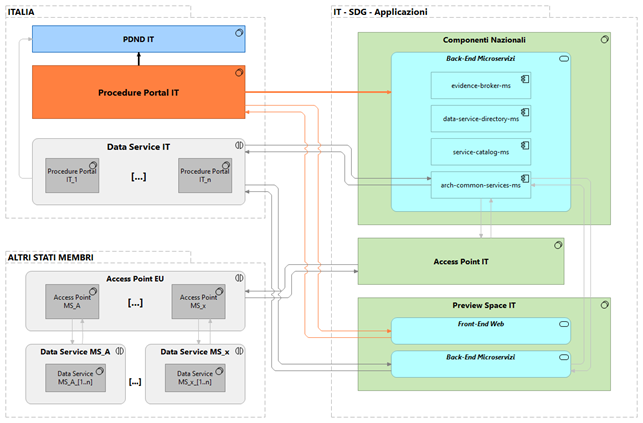

 Figura 1 – Diagramma logico dell’infrastruttura SDG IT e degli attori
esterni coinvolti

L’infrastruttura SDG italiana comprende i seguenti componenti
applicativi:

-   **Componenti Nazionali SDG IT**

Contenitore per il Catalogo dei servizi, l’Evidence Broker, il Data
Service Directory e l’Architecture Common Services

-   **Access point IT**

Componente applicativo che soddisfa i requisiti OOTS per l’eDelivery e
lo scambio sicuro di messaggi SBD

-   **Preview Space IT**

Componente applicativo dell’infrastruttura SDG IT che permette
all’Utente transfrontaliero di poter eseguire la preview della Evidence
oggetto del Recupero

Queste componenti cooperano in maniera centralizzata al fine di esporre
servizi da/per i Procedure Portal italiani e i Data Service italiani che
offrono servizi in scope con i processi OOTS.

In particolare, l’**Architecture Common Services** è il componente che
si interfaccia con l’Access point SDG IT al fine di garantire lo scambio
di messaggi SBD contenenti le seguenti tipologie di richiesta:

-   **Evidence Request**

> Inviata dal Procedure Portal a seguito di una richiesta di recupero
> avviata dall’Utente transfrontaliero e contenente le informazioni
> necessarie al recupero della Evidence

-   **Evidence Response**

Generata dal Data Service dell’Evidence Provider a fronte della
ricezione di una Evidence Request. Contiene la Evidence recuperata.

-   **Evidence Error**

Generata dal Data Service dell’Evidence Provider, può indicare una
eccezione verificatasi durante il processo di Recupero oppure l’URL da
restituire all’Utente transfrontaliero per essere reindirizzato sul
Preview Space SDG IT

Nel confine logico indicato come “Italia”, vengono rappresentati il
Procedure Portal italiano e la Piattaforma Digitale Nazionale Dati
(PDND), l’infrastruttura nazionale che concretizza il principio
“Once-Only”, abilitando l’interoperabilità dei sistemi informativi e
delle banche dati degli Enti e dei gestori di servizi pubblici. Nel
blocco è stato riportato anche un insieme di Data Services italiani per
completezza di informazione ma, di fatto, non in scope con il presente
documento in quanto non sono previste interazioni dirette con i
Procedure Portal.

Il blocco logico “Altri stati membri” è considerato OOS (Out Of Scope)
in questo contesto, in quanto rappresenta i servizi omologhi degli altri
Stati Membri, riportati nel presente documento solo per completezza di
informazione e miglior riferimento al Technical Design Document (cfr.
DC_01) ma di fatto resi trasparenti ai Procedure Portal italiani
dall’infrastruttura SDG IT.

## Autenticazione e Autorizzazione tramite PDND

L’infrastruttura Componenti Nazionali SDG IT è censita come aderente
alla Piattaforma Digitale Nazionale Dati (PDND) e rende disponibili i
propri servizi (e-services) ad altri soggetti aderenti a tale
piattaforma per consentire la fruizione di dati in suo possesso o
l’integrazione tra i processi (cfr. DC_02).

Di fatto, nel contesto PDND, l’infrastruttura Componenti Nazionali SDG
IT assume il ruolo di **Erogatore** dei servizi esposti ai Procedure
Portal delle PA italiane, i quali, a loro volta assumono il ruolo di
**Fruitore**.

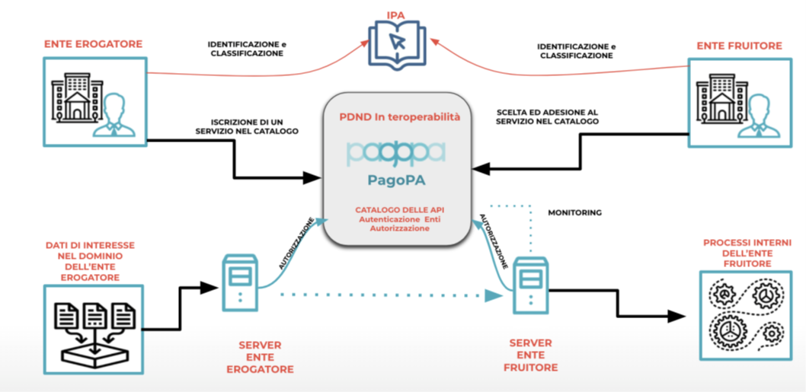

Figura 2 – Rappresentazione dei processi offerti dalla PDND

Come riportato in Figura 2, la piattaforma PDND non si interpone nelle
comunicazioni machine-to-machine tra Fruitore ed Erogatore, ma si occupa
di autenticare e autorizzare il Fruitore tramite distribuzione di un
Authorization Token OAuth 2.0.

La PDND, per ogni e-service, eroga al Fruitore questo token solo se:

-   esiste una richiesta di fruizione del servizio in stato attivo;

-   il Fruitore ha dichiarato le finalità di accesso associate alla
    richiesta di fruizione.

Il Fruitore dovrà passare all’Erogatore l’access token ricevuto dalla
PDND in ogni chiamata effettuata verso l’e-service dell’Erogatore e
quest’ultimo provvederà alla verifica del token tramite chiave pubblica.

L’Access Token emesso dalla PDND consiste in un JWT conforme
all’RFC7515, il suo utilizzo è obbligatorio per tutte le chiamate verso
i servizi esposti dai Componenti Nazionali SDG IT. Nello specifico, per
ogni chiamata, deve essere popolato l’header “Authorization” con:

-   auth-scheme valorizzato a “Bearer”

-   authorization-parameters valorizzato con l’access token emesso dalla
    PDND (cfr. DC_03).

La Figura 3, estratta dalla documentazione tecnica della PDND, modella
il processo di Richiesta di un access token e la fruizione di un
servizio.

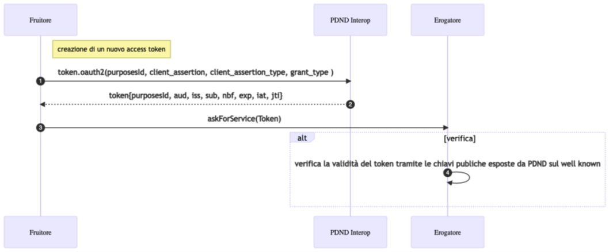

Figura 3 - Richiesta di un access token e fruizione del servizio

## Processi in ambito Procedure Portal

Come richiesto dai requisiti tecnici espressi dalla normativa di
riferimento (cfr. DC_01), il processo OOTS di recupero della Evidence
per la copertura dei Requirement definiti per lo specifico Procedimento
amministrativo dovrà essere eseguito dall’Utente transfrontaliero sul
Procedure Portal italiano (PP).

In seguito a selezione del Procedimento amministrativo di interesse, il
PP dovrà permettere all’Utente transfrontaliero la visualizzazione dei
Requirement per esso definiti e, per ognuno di questi, le liste di
Evidence type necessarie a soddisfarli. Le informazioni relative a
Requirement ed Evidence type saranno restituite al PP dall’Evidence
Broker SDG IT.

Una volta selezionata la Evidence type di interesse, l’Utente
transfrontaliero, tramite impostazione dello Stato Membro da cui intende
recuperare la Evidence, dovrà poter visualizzare sul PP l’elenco dei
Data Service che permettono tale processo. La lista dei Data Service
sarà restituita al PP dal Data Service Directory SDG IT.

L’Utente transfrontaliero dovrà selezionare il Data Service di interesse
ed avviare il Recupero della Evidence. Per avviare tale processo, il PP
dovrà generare una “Evidence Request 1” e fornirla, insieme ai dati
necessari alla creazione del messaggio SBD, all’Architecture Common
Services SDG IT. Le casistiche ad oggi previste per il contenuto della
Evidence Response 1 generata dal Data Service e recuperata
dall’Architecture Common Services SDG IT sono le seguenti:

1.  se il Data Service ha individuato la lista di Evidence di interesse
    e può fornirne una preview, la Evidence Response 1 conterrà l’URL
    per il Preview Space SDG IT;

2.  se il Data Service ha individuato la lista di Evidence di interesse,
    ma non può fornirne una anteprima, la Evidence Response 1 conterrà
    la lista di Evidence recuperate;

3.  se Il Data Service non ha individuato nessuna Evidence, viene
    restituito un Evidence error e il processo di recupero dovrà essere
    interrotto.

Se il PP ha ricevuto una Evidence Response 1 contente l’URL per accedere
al Preview Space SDG IT, la renderà disponibile all’Utente
transfrontaliero. Alla selezione dell’URL da parte dell’utente,
parallelamente all’accesso al Preview Space SDG IT, il PP dovrà generare
una Evidence Request 2 per informare, tramite l’Architecture Common
Services SDG IT, il Data Service che l’utente ha intenzione di
visualizzare l’anteprima e fornirla, insieme ai dati necessari alla
creazione del messaggio SBD.

Al termine del processo di anteprima della Evidence, l’Utente sarà
reindirizzato sul Procedure Portal e il Data Service restituirà
l’Evidence Response 2 con l’esito di tale processo all’ACS SDG IT. Gli
esiti possibili saranno i seguenti:

1.  se l’utente ha accettato almeno un elemento della lista delle
    Evidence visualizzate in anteprima, la Evidence Response 2 conterrà
    la lista delle Evidence selezionate dall’utente;

2.  se l’utente non ha accettato almeno un elemento della lista delle
    Evidence visualizzate in anteprima, la Evidence Response 2 sarà di
    tipo Evidence error.

Nella Figura 4 vengono riportate le interazioni previste tra Procedure
Portal e componenti della infrastruttura SDG IT per il processo OOTS di
Recupero Evidence ai fini del completamento di un Procedimento
amministrativo.

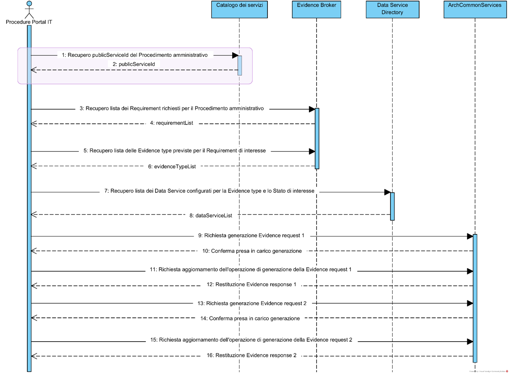Figura
4 - Interazione previste tra PP IT e Componenti Nazionali SDG IT

Nei paragrafi seguenti, per ogni passo del processo ipotizzato, viene
riportata una descrizione del processo e la API che i Componenti
Nazionali SDG IT pubblicano sulla PDND come Erogatore.

### Redirect da Catalogo dei servizi IT verso Procedure Portal

L’Utente transfrontaliero ha la possibilità di accedere al Procedimento
amministrativo di interesse sul Procedure Portal della PA italiana in
seguito a navigazione sul Catalogo dei Servizi SDG IT e selezione
dell’URL ad esso relativa (passo 1 del SD riportato in Figura 4). In
questo caso, la chiamata può contenere due parametri, passati nella
queryString:

-   *publicService* (che corrisponde all’identificativo del Procedimento
    amministrativo) dovrà essere utilizzato per l’estrazione della lista
    di Requirement associati al Procedimento amministrativo di interesse
    (par. 2.3.3).

-   *lang* parametro opzionale che contiene il codice della lingua
    selezionata sul Catalogo dei Servizi dall’utente e che viene passato
    al Procedure Portal in modo da conservare la scelta della lingua
    dell’applicazione già effettuata sul Catalogo dei Servizi. Tale
    codice va espresso secondo lo standard ISO 639-1:2002.

Per la specifica tecnica della redirect si faccia riferimento al par.
3.1.

###  Recupero publicServiceID da Catalogo dei servizi IT

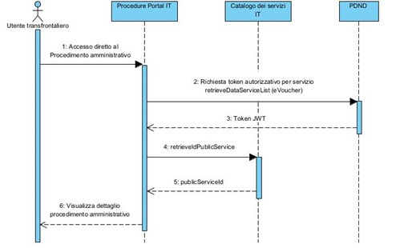

Figura 5 – Interazione tra PP e CS IT per recupero publicServiceID

L’Utente transfrontaliero potrebbe accedere al Procedimento
amministrativo di interesse sul Procedure Portal della PA italiana senza
effettuare navigazione sul Catalogo dei Servizi SDG IT.

In questo caso, per poter richiedere l’estrazione della lista di
Requirement associati al Procedimento amministrativo di interesse (par.
2.3.3), occorre disporre del *publicServiceId* che può essere recuperato
tramite l’API *retrieveIdPublicService* (par. 3.2).

### Recupero lista Requirement da Evidence Broker 

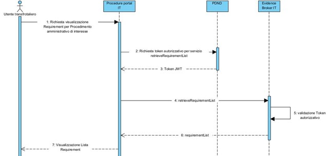

Figura 6 – Interazione tra PP ed EB per recupero lista di Requirement

Il Procedure Portal (PP) ha la possibilità di invocare un servizio
pubblico esposto dall’Evidence Broker SDG IT per recuperare la lista dei
Requirement che l’Utente transfrontaliero dovrà soddisfare al fine di
istanziare il Procedimento amministrativo di suo interesse (passo 3 del
SD riportato in Figura 4).

L’API resa disponibile è *retrieveRequirementList* (par.3.3).

### Recupero lista Evidence Type da Evidence Broker

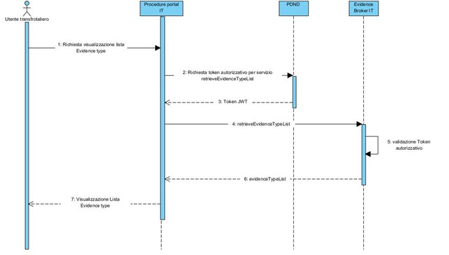

Figura 7 – Interazione tra PP ed EB per recupero lista di Evidence type

Il Procedure Portal (PP) ha la possibilità di invocare un servizio
pubblico esposto dall’Evidence Broker SDG IT (EB) per recuperare la
lista degli Evidence Type che soddisfano il Requirement selezionato
dall’Utente transfrontaliero (passo 5 del SD riportato in Figura 4).

L’API resa disponibile è *retrieveEvidenceTypeList* (par. 3.4).

### Recupero lista Data Service da Data Service Directory

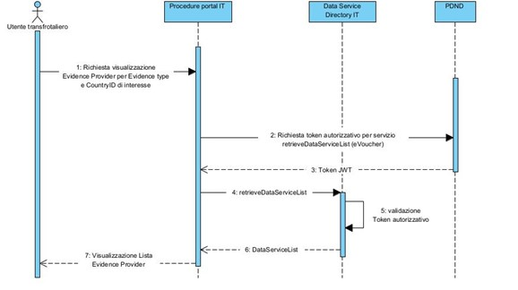

Figura 8 – Interazione tra PP e DSD per recupero lista dei data service

Il Procedure Portal (PP) ha la possibilità di recuperare dal Data
Service Directory SDG IT (DSD) l’identificativo e le informazioni
relative ai Data Service che possono produrre le Evidence richieste per
l’Evidence type e lo Stato Membro selezionato dall’Utente
transfrontaliero. Il DSD restituirà, oltre le informazioni previste dal
Technical Design Document di Giugno 2022 (cfr. DC_01), le informazioni
relative agli attributi aggiuntivi (ad es. Codice fiscale).

L’API esposta dal DSD è *retrieveDataServiceList* (par. 3.5).

### Richiesta invio Evidence Request 1

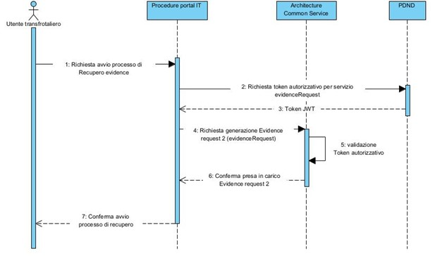

Figura 9 – Interazione tra PP e ACS SDG IT per invio Evidence Request 1

L’Utente transfrontaliero, tramite Procedure Portal, deve avere la
possibilità di avviare il processo di recupero della Evidence. A seguito
di avvio di tale processo, il Procedure Portal dovrà inoltrare al Data
Service selezionato dall’Utente transfrontaliero l’Evidence Request 1,
contenente le informazioni necessarie al processo, attraverso
l’invocazione dell’API e*videnceRequest* (par. 3.6). Il risultato di
questa richiesta (detta “Evidence Response 1”) dovrà essere recuperato
in seguito a un’ulteriore chiamata, così come descritta al par. 2.3.7.

###  Verifica generazione Evidence Response 1

Figura 10 - Interazione tra PP e ACS SDG IT per recupero Evidence Response
1

Il Procedure Portal può verificare l’avvenuta generazione di una
Evidence Response 1, correlata ad una Evidence Request 1 precedentemente
inviata (par. 2.3.6) attraverso l’utilizzo dell’apposita API esposta
dall’Architecture Common Services SDG IT *evidenceResponse* (par. 3.7).

### Richiesta invio Evidence Request 2 

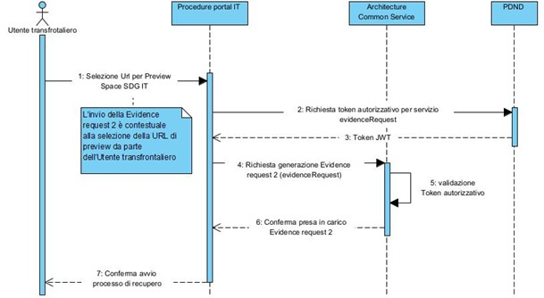

Figura 11 – Integrazione tra PP e ACS SDG IT per invio Evidence Request 2
verso il Data Service

Nel caso in cui il Procedure Portal abbia ricevuto un’Evidence Response
1 contenente un URL di preview, potrà fornirla all’Utente
transfrontaliero. Alla selezione del link da parte dell’Utente, il
Procedure Portal dovrà fornire all’ACS SDG IT l’Evidence Response 2 da
inoltrare al Data Service di interesse. Il processo può essere avviato
attraverso la API *evidenceRequest* (par. 3.8) e dovrà essere avviato in
parallelo rispetto all’accesso dell’Utente transfrontaliero sul Preview
Space SDG IT.

### Verifica generazione Evidence Response 2

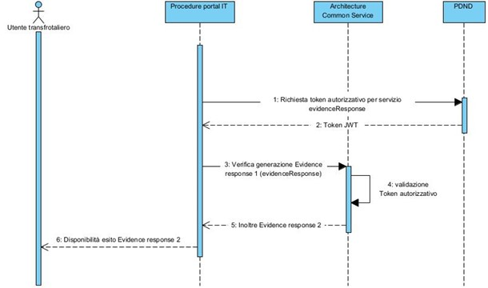

Figura 12 - Integrazione tra PP e ACS SDG IT per invio Evidence Request 2
verso il Data Service

Il Procedure Portal può verificare l’avvenuta generazione di una
Evidence Response 2 correlata ad una Evidence Request 2 precedentemente
inviata attraverso l’utilizzo della apposita API esposta
dall’Architecture Common Services SDG IT *evicenceResponse* (par. 3.9).
Nel caso in cui l’Utente transfrontaliero abbia accettato una o più
Evidence, queste saranno contenute nell’Evidence Response 2.

### Servizio validazione Codice fiscale

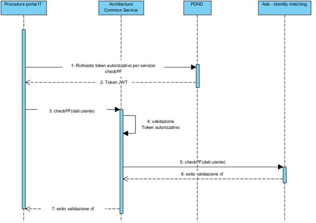

Figura 13 - Integrazione tra PP e ACS SDG IT per servizio checkPF presso
Agenzia delle Entrate

L’Architecture Common Services SDG IT espone un servizio che, a fronte
dell’invio di una richiesta contenente i dati personali di un utente
(Codice fiscale, Nome, Cognome, Sesso, Data di nascita, Provincia di
nascita, Stato di nascita), richiama l’omonimo servizio esposto
dall’Agenzia dell’entrate per la verifica di correttezza del Codice
fiscale.

Ai soggetti, che dovranno inserire i dati previsti e su indicati dai
vari Procedure Portal che si avvarranno del servizio, dovrà essere
richiesto di inserire i dati così esattamente come riportati sul
tesserino di codice fiscale o sul certificato di attribuzione del codice
fiscale.

L’API esposta è *checkPF* (par. 3.10).

# Specifiche tecniche

Nei paragrafi successivi verranno descritti i servizi che il Procedure
Portal dovrà invocare per l’istanziazione dei processi di interesse,
riportando per ciascun servizio i dettagli relativi a:

-   l’URL o l’endpoint e la modalità della chiamata;

-   i prerequisiti necessari;

-   il requisito soddisfatto dalla chiamata;

-   relativamente all’API le API:

    -   il formato della richiesta (input);

    -   il formato della risposta (output);

    -   gli esiti attesi della chiamata (se diversi dal default);

    -   la gestione dei codici di errore applicativo;

    -   i riferimenti per lo standard OpenAPI 3.

Sono stati aggiunti inoltre i paragrafi 3.11, per elencare i tipi di
errore applicativo gestiti, e il paragrafo 3.11, con l’elenco dei codici
di stato validi in generale per lo standard HTTP e restituiti da tutte
le componenti applicative coinvolte nei processi.

**ASSUNZIONI COMUNI PER TUTTE LE API**

Si evidenzia che per accedere al Procedure Portal, l’utente dovrà
autenticarsi su di esso mediante nodo eIDAS, fornendo un primo consenso
ad accedere alle informazioni previste per mezzo del OOTS, con un
livello di autenticazione coerente con quanto previsto dal procedimento
di interesse; il Procedure Portal dovrà verificare tale aspetto rispetto
alle diverse situazioni che potrebbero verificarsi (ad es. accesso
diretto, tentativo di accesso successivo alla scadenza della sessione,
riscrittura dell’URL, *redirect* interno di un utente già autenticato,
ecc.).

1.  **Invocazione**

Tutte le chiamate di seguito elencate presuppongono il passaggio del
Voucher (token JWT) precedentemente generato dalla Piattaforma Digitale
Nazionale Dati in fase di accesso utente. Questo prerequisito viene
referenziato più avanti per brevità con la dicitura “Possesso del token
JWT dalla PDND”.

1.  **Esiti di default delle chiamate**

> I codici di stato HTTP vengono restituiti al client nell’intestazione
> HTTP e riguardano l'esito dell'eventuale elaborazione da parte del
> server. Il codice atteso per un’elaborazione di API avvenuta con
> successo, se non diversamente specificato, è sempre il seguente:

| **HTTP Code** | **Result Description**   |
|---------------|--------------------------|
| **200**       | **Successful operation** |

> Il codice atteso invece per un’elaborazione di API non corretta, se
> non diversamente specificato, sono sempre i seguenti:

| **HTTP Code** | **Result Description**    |
|---------------|---------------------------|
| **400**       | **Bad Request**           |
| **500**       | **Internal Server Error** |

> Gli altri codici di stato HTTP previsti e gestiti al livello dell’API
> gateway sono elencati al par. 3.11.
>
> Per quanto riguarda l’ambito applicativo, le API indicheranno tramite
> l’attributo “status” l’esito dell’elaborazione, che potrà assumere
> ResponseStatusType di valore:

-   “Success” in caso positivo;

-   “Failure” o “Unavailable” in caso negativo.

1.  **GESTIONE DEGLI ERRORI**

La gestione impropria degli errori può introdurre una serie di problemi
di sicurezza per un sito Web. Il problema più comune è quando vengono
visualizzati messaggi di errore degli ambienti interni dettagliati come
stack trace, database dump e codici di errore all’utente finale
(*hacker* ostile). Questi messaggi rivelano dettagli di implementazione
che non dovrebbero mai essere divulgati. Tali dettagli o incongruenze
(ad esempio “*file not found*” e “*access denied*”) possono fornire agli
utenti malintenzionati indizi importanti su potenziali difetti nel sito
da sfruttare per potenziali attacchi mirati.

Pertanto, questi errori devono essere gestiti secondo uno schema ben
congegnato che fornirà un messaggio di errore significativo all'utente,
informazioni diagnostiche ai gestori del sito e nessuna informazione
utile a un utente malintenzionato.

Per tali ragioni di sicurezza, verranno generati i codici di stato
elencati in precedenza per cui l’API Gateway restituirà in modo standard
i codici 401, 403, 415, 422, 429 e i 501, 502, 503 in dettaglio. Le
funzioni implementate lato back-end dell’SDG restituiranno i codici
generici 200, 400 e 500, tutti personalizzati in maniera tale che non
vengano esportati dati utili e di dettaglio dell’infrastruttura e della
Web app.

1.  **REPOSITORY UFFICIALE E CODICI DI ESEMPIO**

Per comodità di consultazione, sono stati riportati nel documento vari
esempi ed estratti relativi alle strutture dei messaggi o alle sintassi
delle invocazioni. Si noti però che, come unica fonte autoritativa e
aggiornata per l’implementazione del codice, occorre sempre far
riferimento al **repository GitHub**, gestito da AgID, per le Componenti
Nazionali SDG, reperibile (previa autorizzazione all’accesso e
autenticazione) al seguente indirizzo:

-   [https://github.com/AgID/sdg_it_architype/tree/master/SDG -
    Componenti
    Nazionali](https://github.com/AgID/sdg_it_architype/tree/master/SDG%20-%20Componenti%20Nazionali)

## Redirect da Catalogo dei servizi IT verso Procedure Portal

<u>URL</u>: *https://\<dominio_procedure_portal\>/procedures/*

<u>Prerequisiti</u>:

1.  la PA di riferimento deve aver censito il Procedimento
    amministrativo sul Catalogo dei servizi IT e aver impostato
    correttamente l’URL di *redirect* verso la pagina del Procedure
    Portal di interesse;

2.  l’Utente transfrontaliero sta navigando il Procedimento
    amministrativo di interesse sul Catalogo dei Servizi IT.

<u>Requisito</u>: gestione e corretto indirizzamento dell’utente che non
fa accesso diretto sul Procedure Portal, provenendo da altra risorsa.

<table>
<colgroup>
<col style="width: 24%" />
<col style="width: 75%" />
</colgroup>
<thead>
<tr class="header">
<th><strong>PROTOCOL</strong></th>
<th>HTTPS</th>
</tr>
</thead>
<tbody>
<tr class="odd">
<td><strong>URL</strong></td>
<td>https://&lt;dominio_procedure_portal&gt;/procedures/</td>
</tr>
<tr class="even">
<td><strong>METHOD</strong></td>
<td>GET</td>
</tr>
<tr class="odd">
<td><strong>CONTENT TYPE</strong></td>
<td><strong>n/a</strong></td>
</tr>
<tr class="even">
<td><strong>QUERY STRING</strong></td>
<td><table>
<colgroup>
<col style="width: 25%" />
<col style="width: 63%" />
<col style="width: 10%" />
<col style="width: 0%" />
</colgroup>
<thead>
<tr class="header">
<th>NOME PARAM.</th>
<th>TIPO VALORE</th>
<th>M / O</th>
<th></th>
</tr>
</thead>
<tbody>
<tr class="odd">
<td>publicService</td>
<td><strong>Public Service ID come da Catalogo Servizi</strong></td>
<td colspan="2"><strong>O</strong></td>
</tr>
<tr class="even">
<td>lang</td>
<td><strong>Codice lingua formato ISO 639-1:2002
(2-letter)</strong></td>
<td colspan="2"><strong>O</strong></td>
</tr>
</tbody>
</table></td>
</tr>
</tbody>
</table>

### Descrizione chiamata

Sul front-end dei Componenti Nazionali, è presente un *redirect* verso
l’URL del Procedure Portal individuato, al quale possono essere aggiunti
gli attributi publicService e lang, inseriti nell’indirizzo di
destinazione come parametri di tipo *querystring*.

Viene riportata di seguito, a titolo di esempio, la sintassi dell’URL
censito sulle Componenti Nazionali SDG IT che permette il *redirect*
dell’Utente transfrontaliero verso il Procedure Portal:

-   https://\<dominio_procedure_portal\>/procedures?publicService=\<codice_public_service\>&lang=\<codice_lingua\>

dove *\<dominio_procedure_portal\>*, *\<codice_public_service\>* e
*\<codice_lingua\>* sono definiti e selezionati dal back-end delle
Componenti Nazionali in base all’interazione con l’utente. Inoltre, la
configurazione dei valori *\<dominio_procedure_portal\>* e
*\<codice_public_service\>* deve essere predisposta dalla PA relativa al
Procedure Portal sul Catalogo dei Servizi IT.

Il codice HTTP atteso per un esito di ricezione avvenuta con successo è
il seguente:

| **HTTP Code** | **Result Description** |
|---------------|------------------------|
| **200**       | **OK**                 |

## Recupero IdPublicService da Catalogo dei servizi IT

<u>API</u>: **retrieveIdPublicService**

<u>Prerequisiti</u>:

1.  possesso del token JWT dalla PDND;

2.  possesso parametro ipaCode, identificativo dell’ente del
    PublicService.

<u>Requisito</u>: recupero dell’identificativo di PublicService,
passando in input il parametro identificativo dell’ente del servizio di
interesse.

| **PROTOCOL**                | HTTPS                                                                         |
|----------------|--------------------------------------------------------|
| **PATH (Private Exposure)** | https://\<dominio_service_catalog\>/servicecatalogue/v1/publicService/mapping |
| **METHOD**                  | GET                                                                           |
| **CONTENT TYPE**            | application/json                                                              |

### Input

**Descrizione parametri per request**

| **INPUT** |
|-----------|

<table>
<colgroup>
<col style="width: 19%" />
<col style="width: 56%" />
<col style="width: 7%" />
<col style="width: 7%" />
<col style="width: 9%" />
</colgroup>
<thead>
<tr class="header">
<th colspan="5"><strong>HEADER PARAM</strong></th>
</tr>
</thead>
<tbody>
<tr class="odd">
<td><em><strong>Parameter</strong></em></td>
<td><em><strong>Description</strong></em></td>
<td><em><strong>M / O</strong></em></td>
<td><em><strong>Max 
Len</strong></em></td>
<td><em><strong>Type</strong></em></td>
</tr>
<tr class="even">
<td>Authorization</td>
<td>Bearer &lt;<em>Voucher PDND</em>&gt;</td>
<td>M</td>
<td>n/a</td>
<td>String</td>
</tr>
</tbody>
</table>

<table>
<colgroup>
<col style="width: 19%" />
<col style="width: 56%" />
<col style="width: 7%" />
<col style="width: 7%" />
<col style="width: 9%" />
</colgroup>
<thead>
<tr class="header">
<th colspan="5"><strong>BODY PARAM</strong></th>
</tr>
</thead>
<tbody>
<tr class="odd">
<td><em><strong>Parameter</strong></em></td>
<td><em><strong>Description</strong></em></td>
<td><em><strong>M / O</strong></em></td>
<td><em><strong>Max 
Len</strong></em></td>
<td><em><strong>Type</strong></em></td>
</tr>
<tr class="even">
<td>name</td>
<td>Nome del procedimento amministrativo</td>
<td>M</td>
<td></td>
<td>String</td>
</tr>
<tr class="odd">
<td>ipaCode</td>
<td>Codice IPA, identificativo dell’ente del procedimento
amministrativo</td>
<td>M</td>
<td></td>
<td>String</td>
</tr>
</tbody>
</table>

### Output e Gestione degli errori

**Descrizione parametri per response OK**

| **OUTPUT**            |                   |             |            |
|-----------------------|-------------------|-------------|------------|
| **HEADER**            |                   |             |            |
| ***Parameter***       | ***Description*** | ***M / O*** | ***Type*** |
| n/a                   | *n/a*             |             |            |
| **BODY**              |                   |             |            |
| ***Parameter***       | ***Description*** | ***M / O*** | ***Type*** |
| publicServiceResponse | Oggetto Response  | M           | Object     |

***Nodo Padre della seguente lista di nodi figli:*
publicServiceResponse**

| ***Parameter*** | ***Description***                                                                                                                       | ***M / O*** | ***Type*** |
|-----------------|------------------------------------------|------|--------|
| code            | Rif [response code](https://ts.accenture.com/sites/CNCC-AGID/Shared%20Documents/General/ServiceCatalog_1.0_ST.docx#_Response_and_Error) | M           | String     |
| description     | Eventuale descrizione code                                                                                                              | M           | String     |
| message         | Eventuale messaggio di errore                                                                                                           | O           | String     |
| publicService   | Oggetto JSON                                                                                                                            | M           | Object     |

***Nodo Padre della seguente lista di nodi figli:* publicService**

<table>
<colgroup>
<col style="width: 22%" />
<col style="width: 60%" />
<col style="width: 7%" />
<col style="width: 9%" />
</colgroup>
<thead>
<tr class="header">
<th><em><strong>Parameter</strong></em></th>
<th><em><strong>Description</strong></em></th>
<th><em><strong>M / O</strong></em></th>
<th><em><strong>Type</strong></em></th>
</tr>
</thead>
<tbody>
<tr class="odd">
<td><em><strong>publicServiceId</strong></em></td>
<td>
<em>Identificativo tecnico del servizio</em>

<em>Esempio:</em>

<em>publicServiceId=101</em>
</td>
<td><em><strong>M</strong></em></td>
<td><em><strong>Integer</strong></em></td>
</tr>
<tr class="even">
<td><em><strong>euPublicServiceId</strong></em></td>
<td>
<em>Identificativo univoco definito dalla Comunità Europea del
procedimento amministrativo</em>

<em>Esempio:</em>

<em>euPublicServiceId=”P17.1”</em>
</td>
<td><em><strong>M</strong></em></td>
<td><em><strong>String</strong></em></td>
</tr>
<tr class="odd">
<td>name</td>
<td>
Nome del procedimento amministrativo

Esempio:

name=”Anagrafica Light”
</td>
<td>M</td>
<td>String</td>
</tr>
<tr class="even">
<td>description</td>
<td>
Descrizione del procedimento amministrativo

Esempio:

description=”Secondo questa procedura, le autorità competenti (regimi
pensionistici e assicurativi obbligatori) sono tenute ad accettare la
domanda di registrazione di un datore di lavoro per via
elettronica.”
</td>
<td>M</td>
<td>String</td>
</tr>
<tr class="odd">
<td>publicOrganization</td>
<td>Oggetto JSON relativo alla Pubblica Amministrazione di
appartenenza</td>
<td>M</td>
<td>Object</td>
</tr>
</tbody>
</table>

***Nodo Padre della seguente lista di nodi figli:* publicOrganization**

<table>
<colgroup>
<col style="width: 22%" />
<col style="width: 60%" />
<col style="width: 7%" />
<col style="width: 9%" />
</colgroup>
<thead>
<tr class="header">
<th><em><strong>Parameter</strong></em></th>
<th><em><strong>Description</strong></em></th>
<th><em><strong>M / O</strong></em></th>
<th><em><strong>Type</strong></em></th>
</tr>
</thead>
<tbody>
<tr class="odd">
<td>publicOrganizationId</td>
<td>Identificativo della Pubblica Amministrazione di appartenenza</td>
<td>M</td>
<td>integer</td>
</tr>
<tr class="even">
<td>preferredLabel</td>
<td>
Etichetta preferita per l’identificazione della Pubblica
Amministrazione di appartenenza

Esempio:

preferredLabel=”inail”
</td>
<td>M</td>
<td>String</td>
</tr>
<tr class="odd">
<td>locationGeographicId</td>
<td>
Identificativo per la Locazione geografica della Pubblica
Amministrazione di appartenenza

Esempio:

locationGeographicId=”GI6”
</td>
<td>M</td>
<td>String</td>
</tr>
<tr class="even">
<td>ipaCode</td>
<td>
Codice ipa dell’ente

Esempio:

ipaCode=”P06”
</td>
<td>M</td>
<td>String</td>
</tr>
</tbody>
</table>

**Descrizione parametri per response KO**

| **OUTPUT** |
|------------|

| **HEADER**      |                   |             |            |
|-----------------|-------------------|-------------|------------|
| ***Parameter*** | ***Description*** | ***M / O*** | ***Type*** |
| *n/a*           | *n/a*             |             |            |

| **BODY**                  |                                                                |             |            |
|------------------|----------------------------------------|------|---------|
| ***Parameter***           | ***Description***                                              | ***M / O*** | ***Type*** |
| publicServiceListResponse | oggetto Response                                               | M           | Object     |
| code                      | Codice d’errore riscontrato                                    | M           | String     |
| message                   | Messaggio di errore riscontrato                                | M           | String     |
| description               | Descrizione di dettaglio dello specifico problema verificatosi | O           | String     |

I codici di stato HTTP vengono consegnati al client nell’intestazione
HTTP e riguardano l'esito dell'eventuale elaborazione da parte del
server.

Per la lista completa dei codici di stato HTTP, si fa riferimento al
par. 3.11.

### OpenAPI 3

Di seguito la specifica OpenAPI 3 per l’API retrieveIdPublicService:

[retrieveIdPublicService](openapi/retrieveIdPublicServicev06_20220531.yml)
## Recupero RequirementList da Evidence Broker IT

<u>API</u>: **retrieveRequirementList**

<u>Prerequisito</u>:

1.  possesso del token JWT dalla PDND.

<u>Requisito</u>: lista dei requisiti previsti per il procedimento
amministrativo d’interesse.

| **PROTOCOL**               | HTTPS                                                       |
|-------------------|-----------------------------------------------------|
| **PATH (Public Exposure)** | https://\<dominio_service_catalog\>/api/v1/requirement/list |
| **METHOD**                 | GET                                                         |
| **CONTENT TYPE**           | application/xml                                             |

### Input

**Descrizione parametri per request**

<table>
<colgroup>
<col style="width: 15%" />
<col style="width: 59%" />
<col style="width: 6%" />
<col style="width: 8%" />
<col style="width: 10%" />
</colgroup>
<thead>
<tr class="header">
<th colspan="5"><strong>INPUT</strong></th>
</tr>
</thead>
<tbody>
<tr class="odd">
<td colspan="5"><strong>HEADER PARAM</strong></td>
</tr>
<tr class="even">
<td><em><strong>Parameter</strong></em></td>
<td><em><strong>Description</strong></em></td>
<td><em><strong>M / O</strong></em></td>
<td><em><strong>Max 
Len</strong></em></td>
<td><em><strong>Type</strong></em></td>
</tr>
<tr class="odd">
<td>Authorization</td>
<td>Bearer &lt;<em>Voucher PDND</em>&gt;</td>
<td>M</td>
<td>n/a</td>
<td>String</td>
</tr>
</tbody>
</table>

<table>
<colgroup>
<col style="width: 15%" />
<col style="width: 59%" />
<col style="width: 6%" />
<col style="width: 8%" />
<col style="width: 10%" />
</colgroup>
<thead>
<tr class="header">
<th colspan="5"><strong>BODY PARAM</strong></th>
</tr>
<tr class="odd">
<th><em><strong>Parameter</strong></em></th>
<th><em><strong>Description</strong></em></th>
<th><em><strong>M / O</strong></em></th>
<th><em><strong>Max Len</strong></em></th>
<th><em><strong>Type</strong></em></th>
</tr>
</thead>
<tbody>
<tr class="odd">
<td>queryId</td>
<td>Vincolo: deve sempre essere valorizzato con la seguente
stringa 
“urn:oots:eb:ebxml-regrep:queries:requirementsby-procedure-and-jurisdiction”</td>
<td>M</td>
<td>n/a</td>
<td>String</td>
</tr>
<tr class="even">
<td>procedure-id</td>
<td>
L'identificatore della procedura a livello dell'UE è utilizzato
per filtrare solo i requisiti utilizzati nell'ambito della procedura
specifica.

Esempio:

&lt;!-- Procedure Identifier --&gt;

&lt;Identifier&gt;03b82e6a-3227-4751-a815-b570a9c0aeb4&lt;/Identifier
&gt;
</td>
<td>O</td>
<td></td>
<td>String</td>
</tr>
<tr class="odd">
<td>country-code</td>
<td>
Giurisdizione della Procedure/Procedimento amministrativo
utilizato al fine di filtrare i Requirement utilizzati solo in uno
specifico Stato Membro.

Vincolo: Codice ISO 3166-2

Obbligatorio nel caso sia valorizzato il procedure-id.
</td>
<td>O</td>
<td></td>
<td>String</td>
</tr>
<tr class="even">
<td>jurisdiction-admin-l2</td>
<td>
Codice di amministrazione di secondo livello per la giurisdizione
dell’evidenceType. DEVE essere combinato con il country-code

Vincolo: Codice Nuts
</td>
<td>O</td>
<td></td>
<td>String</td>
</tr>
<tr class="odd">
<td>jurisdiction-admin-l3</td>
<td>
Codice di amministrazione di terzo livello per la giurisdizione
dell’evidenceType. DEVE essere combinato con il country-code

Vincolo: Codice LAU
</td>
<td>O</td>
<td></td>
<td>String</td>
</tr>
</tbody>
</table>

### Output e Gestione degli errori

**Descrizione parametri per response OK**

| **OUTPUT**      |                   |             |            |
|-----------------|-------------------|-------------|------------|
| **HEADER**      |                   |             |            |
| ***Parameter*** | ***Description*** | ***M / O*** | ***Type*** |
| n/a             | *n/a*             |             |            |

<table>
<colgroup>
<col style="width: 19%" />
<col style="width: 54%" />
<col style="width: 13%" />
<col style="width: 12%" />
</colgroup>
<thead>
<tr class="header">
<th colspan="4"><strong>BODY</strong></th>
</tr>
</thead>
<tbody>
<tr class="odd">
<td><em><strong>Parameter</strong></em></td>
<td><em><strong>Description</strong></em></td>
<td><em><strong>M / O</strong></em></td>
<td><em><strong>Type</strong></em></td>
</tr>
<tr class="even">
<td>query:QueryResponse</td>
<td>
oggetto Response.

Il nodo deve contenere i seguenti attributi:

xmlns="urn:oasis:names:tc:ebxml-regrep:xsd:lcm:4.0"
xmlns:lcm="urn:oasis:names:tc:ebxml-regrep:xsd:lcm:4.0"
xmlns:query="urn:oasis:names:tc:ebxml-regrep:xsd:query:4.0"
xmlns:rim="urn:oasis:names:tc:ebxml-regrep:xsd:rim:4.0"
xmlns:rs="urn:oasis:names:tc:ebxml-regrep:xsd:rs:4.0"
xmlns:xsi="http://www.w3.org/2001/XMLSchema-instance"
xsi:schemaLocation="urn:oasis:names:tc:ebxml-regrep:xsd:lcm:4.0"
</td>
<td>M</td>
<td>Object</td>
</tr>
<tr class="odd">
<td>status</td>
<td>
Attributo del nodo query:QueryResponse

Dovrà essere valorizzato nel seguente modo per indicare
l’elaborazione corretta dell’API:

"urn:oasis:names:tc:ebxmlregrep: ResponseStatusType:Success"
</td>
<td>M</td>
<td>String</td>
</tr>
</tbody>
</table>

***Nodo Padre della seguente lista di nodi figli:*
query**:**QueryResponse**

| ***Parameter***        | ***Description***                  | ***M / O*** | ***Type*** |
|----------------|------------------------------------|-----------|----------|
| rim:RegistryObjectList | Contiene le informazioni richieste | M           | Object     |

***Nodo Padre della seguente lista di nodi figli:*
rim:RegistryObjectList**

<table>
<colgroup>
<col style="width: 21%" />
<col style="width: 51%" />
<col style="width: 13%" />
<col style="width: 12%" />
</colgroup>
<thead>
<tr class="header">
<th><em><strong>Parameter</strong></em></th>
<th><em><strong>Description</strong></em></th>
<th><em><strong>M / O</strong></em></th>
<th><em><strong>Type</strong></em></th>
</tr>
</thead>
<tbody>
<tr class="odd">
<td>rim:RegistryObject</td>
<td>Contiene il dettaglio della singola richiesta</td>
<td>O</td>
<td>List Object</td>
</tr>
<tr class="even">
<td>id</td>
<td>
Attributo del nodo rim:RegistryObjectList

ID è l’identificativo univoco definito del Requirement
</td>
<td>M</td>
<td>String</td>
</tr>
</tbody>
</table>

***Nodo Padre della seguente lista di nodi figli:* rim:RegistryObject**

<table style="width:100%;">
<colgroup>
<col style="width: 19%" />
<col style="width: 55%" />
<col style="width: 13%" />
<col style="width: 11%" />
</colgroup>
<thead>
<tr class="header">
<th><em><strong>Parameter</strong></em></th>
<th><em><strong>Description</strong></em></th>
<th><em><strong>M / O</strong></em></th>
<th><em><strong>Type</strong></em></th>
</tr>
</thead>
<tbody>
<tr class="odd">
<td>rim:slot</td>
<td>Lo slot è un contenitore di oggetti slotValue</td>
<td>M</td>
<td>Object</td>
</tr>
<tr class="even">
<td>name</td>
<td>
Attributo del nodo rim:slot

Name è l’identificativo della query.

In questo caso “Requirement”
</td>
<td>M</td>
<td>String</td>
</tr>
</tbody>
</table>

***Nodo Padre della seguente lista di nodi figli:* rim:slot**

<table style="width:100%;">
<colgroup>
<col style="width: 19%" />
<col style="width: 56%" />
<col style="width: 12%" />
<col style="width: 11%" />
</colgroup>
<thead>
<tr class="header">
<th><em><strong>Parameter</strong></em></th>
<th><em><strong>Description</strong></em></th>
<th><em><strong>M / O</strong></em></th>
<th><em><strong>Type</strong></em></th>
</tr>
</thead>
<tbody>
<tr class="odd">
<td>rim:SlotValue</td>
<td>slotValue è un contenitore per gli attributi e i metadati specifici
del Requisito</td>
<td>M</td>
<td>Object</td>
</tr>
<tr class="even">
<td>xsi:type</td>
<td>
Attributo del nodo rim:slotValue

valorizzato con “rim:AnyValueType”
</td>
<td>M</td>
<td>String</td>
</tr>
</tbody>
</table>

***Nodo Padre della seguente lista di nodi figli:* rim:SlotValue**

<table style="width:100%;">
<colgroup>
<col style="width: 19%" />
<col style="width: 56%" />
<col style="width: 12%" />
<col style="width: 11%" />
</colgroup>
<thead>
<tr class="header">
<th><em><strong>Parameter</strong></em></th>
<th><em><strong>Description</strong></em></th>
<th><em><strong>M / O</strong></em></th>
<th><em><strong>Type</strong></em></th>
</tr>
</thead>
<tbody>
<tr class="odd">
<td>Requirement</td>
<td>
Contiene l’oggetto requirement.

Il nodo deve contenere i seguenti attributi:

xmlns="http://data.europa.eu/sdg#"
xmlns:xsi="http://www.w3.org/2001/XMLSchema-instance"

Contiene la condizione o prerequisito stabilito da un'autorità
competente nel contesto di un SDG online. Procedura, che un cittadino o
un'azienda deve soddisfare per completare la procedura
</td>
<td>M</td>
<td>Object</td>
</tr>
</tbody>
</table>

***Nodo Padre della seguente lista di nodi figli:* Requirement**

| ***Parameter***    | ***Description***                                                                                                                                                                     | ***M / O*** | ***Type***  |
|---------------|---------------------------------------|---------|----------|
| Identifier         | Identificativo univoco del requisito                                                                                                                                                  | M           | String      |
| Name               | Nome per identificare il requisito                                                                                                                                                    | M           | String      |
| ReferenceFramework | Il Framework è la piattaforma o portale di riferimento da cui è stato creato il requirement, non rappresenta né identifica i requisiti. (rif. Technical Design Document (cfr. DC_01)) | O           | List Object |

***Nodo Padre della seguente lista di nodi figli:* ReferenceFramework**

| ***Parameter*** | ***Description***                                                                                               | ***M / O*** | ***Type***  |
|---------------|---------------------------------------|----------|---------|
| Identifier      | Codice univoco dell’identificato                                                                                | M           | String      |
| Title           | Un nome per identificare il framework di riferimento.                                                           | O           | String      |
| Description     | Descrizione del Framework                                                                                       | O           | String      |
| RelatedTo       | L'identificatore della procedura SDGR a cui si riferisce questa procedura                                       | O           | List Objet  |
| Jurisdiction    | Livello amministrativo in cui si applica questo quadro di riferimento. Può essere applicato a più giurisdizioni | O           | List Object |

***Nodo Padre della seguente lista di nodi figli:* RelatedTo**

| ***Parameter*** | ***Description***       | ***M / O*** | ***Type*** |
|-----------------|-------------------------|-------------|------------|
| Identifier      | Link alla norma europea | M           | String     |

***Nodo Padre della seguente lista di nodi figli:* Jurisdiction**

| ***Parameter*** | ***Description***                                                                                                                                                     | ***M / O*** | ***Type*** |
|---------------|-----------------------------------------|----------|-------|
| AdminUnitLevel1 | Level 1 fa riferimento alla più alta unità amministrativa a cui la giurisdizione fa riferimento, solitamente la nazione.                                              | M           | String     |
| AdminUnitLevel2 | Level 2 fa riferimento alla regione associata alla giurisdizione, solitamente una circoscrizione o un distretto o un'altra area geografica che comprende più località | O           | String     |
| AdminUnitLevel3 | Level 3 fa riferimento solitamente alla municipalità                                                                                                                  | O           | String     |

**Descrizione parametri per response con esito KO**

| **OUTPUT**      |                   |             |            |
|-----------------|-------------------|-------------|------------|
| **HEADER**      |                   |             |            |
| ***Parameter*** | ***Description*** | ***M / O*** | ***Type*** |
| *n/a*           | *n/a*             |             |            |

<table>
<colgroup>
<col style="width: 20%" />
<col style="width: 59%" />
<col style="width: 12%" />
<col style="width: 8%" />
</colgroup>
<thead>
<tr class="header">
<th colspan="4"><strong>BODY</strong></th>
</tr>
<tr class="odd">
<th><em><strong>Parameter</strong></em></th>
<th><em><strong>Description</strong></em></th>
<th><em><strong>M / O</strong></em></th>
<th><em><strong>Type</strong></em></th>
</tr>
</thead>
<tbody>
<tr class="odd">
<td>query:QueryResponse</td>
<td>
oggetto Response.

Il nodo deve contenere i seguenti attributi:

xmlns="urn:oasis:names:tc:ebxml-regrep:xsd:lcm:4.0"
xmlns:lcm="urn:oasis:names:tc:ebxml-regrep:xsd:lcm:4.0"
xmlns:query="urn:oasis:names:tc:ebxml-regrep:xsd:query:4.0"
xmlns:rim="urn:oasis:names:tc:ebxml-regrep:xsd:rim:4.0"
xmlns:rs="urn:oasis:names:tc:ebxml-regrep:xsd:rs:4.0"
xmlns:xsi="http://www.w3.org/2001/XMLSchema-instance"
xsi:schemaLocation="urn:oasis:names:tc:ebxml-regrep:xsd:lcm:4.0"
</td>
<td>M</td>
<td>Object</td>
</tr>
<tr class="even">
<td>requestId</td>
<td>
Attributo del nodo query:QueryResponse

Deve corrispondere all'attributo id dell'oggetto QueryRequest che ha
generato queryResponse.

Esempio:

requestId="c4369c4d-740e-4b64-80f0-7b209a66d629"

Il codice è autogenerato al momento dell’esecuzione della
request.
</td>
<td>M</td>
<td>String</td>
</tr>
<tr class="odd">
<td>status</td>
<td>
Attributo del nodo query:QueryResponse

Dovrà essere valorizzato nel seguente modo per indicare
l’elaborazione dell’API:
"urn:oasis:nammes:tc:ebxml-regrep:ResponseStatusType:Failure"
</td>
<td>M</td>
<td>String</td>
</tr>
</tbody>
</table>

***Nodo Padre della seguente lista di nodi figli:* query:QueryResponse**

<table>
<colgroup>
<col style="width: 19%" />
<col style="width: 56%" />
<col style="width: 12%" />
<col style="width: 11%" />
</colgroup>
<thead>
<tr class="header">
<th><em><strong>Parameter</strong></em></th>
<th><em><strong>Description</strong></em></th>
<th><em><strong>M / O</strong></em></th>
<th><em><strong>Type</strong></em></th>
</tr>
</thead>
<tbody>
<tr class="odd">
<td>rs:Exception</td>
<td>Contiene le informazioni relativa all’eccezione sollevata.</td>
<td>M</td>
<td>Object</td>
</tr>
<tr class="even">
<td>xsi:type</td>
<td>
Attributo del nodo rs:Exception

Indica a quale categoria appartiene l’errore riscontrato.
</td>
<td>M</td>
<td>String</td>
</tr>
<tr class="odd">
<td>severity</td>
<td>
Attributo del nodo rs:Exception

Indica la gravità dell’eccezione riscontrata.

L’attributo dovrà essere valorizzato nel seguente modo:
"urn:oasis:names:tc:ebxml-regrep:ErrorSeverityType:Error"
</td>
<td>M</td>
<td>String</td>
</tr>
<tr class="even">
<td>message</td>
<td>
Attributo del nodo rs:Exception

Contiene il messaggio in lingua inglese come indicato nella tabella
degli scenari di errori.

Esempio:

"List of requirements requested is empty"
</td>
<td>M</td>
<td>String</td>
</tr>
<tr class="odd">
<td>code</td>
<td>
Attributo del nodo rs:Exception

Codice corrispondente allo stato del sistema relativo allo stato
dell’elaborazione della richiesta. Se i codici di errore specifici non
coprono il motivo dell'errore, utilizzare il codice di errore
generico

Esempio: code=’EB:ERR:0001’
</td>
<td>O</td>
<td>String</td>
</tr>
</tbody>
</table>

I codici di stato HTTP vengono consegnati al client nell’intestazione
HTTP e riguardano l'esito dell'eventuale elaborazione da parte del
server.

Per la lista completa dei codici di stato HTTP, si fa riferimento al
par. 3.11.

### OpenAPI 3

Di seguito la specifica OpenAPI3 per l’API retrieveRequirementList:

[retrieveRequirementList](openapi/retrieveRequirementListv10_20220518.yml)
## Recupero EvidenceTypeList da Evidence Broker IT

<u>API:</u> **retrieveEvidenceTypeList**

<u>Prerequisiti</u>:

1.  possesso del token JWT dalla PDND;

2.  il Procedure Portal chiede all’Evidence Broker IT l’elenco delle
    Tipologie di Prova relativi al Requisito selezionato dall’utente.

<u>Requisito</u>: La lista ottenuta conterrà le Tipologie di Evidence.

| **PROTOCOL**                | HTTPS                                                         |
|-------------------|-----------------------------------------------------|
| **PATH (Private Exposure)** | https://\<dominio_service_catalog\>/api/v1/evidence-type/list |
| **METHOD**                  | GET                                                           |
| **CONTENT TYPE**            | application/xml                                               |

### Input

**Descrizione parametri per request**

| **INPUT** |
|-----------|

<table>
<colgroup>
<col style="width: 19%" />
<col style="width: 46%" />
<col style="width: 15%" />
<col style="width: 8%" />
<col style="width: 9%" />
</colgroup>
<thead>
<tr class="header">
<th colspan="5"><strong>HEADER PARAM</strong></th>
</tr>
</thead>
<tbody>
<tr class="odd">
<td><em><strong>Parameter</strong></em></td>
<td><em><strong>Description</strong></em></td>
<td><em><strong>M / O</strong></em></td>
<td>
<em><strong>Max</strong></em>

<em><strong>Len</strong></em>
</td>
<td><em><strong>Type</strong></em></td>
</tr>
<tr class="even">
<td>Authorization</td>
<td>Bearer &lt;<em>Voucher PDND</em>&gt;</td>
<td>M</td>
<td>n/a</td>
<td>String</td>
</tr>
</tbody>
</table>

<table>
<colgroup>
<col style="width: 19%" />
<col style="width: 46%" />
<col style="width: 15%" />
<col style="width: 8%" />
<col style="width: 9%" />
</colgroup>
<thead>
<tr class="header">
<th colspan="5"><strong>BODY PARAM</strong></th>
</tr>
<tr class="odd">
<th><em><strong>Parameter</strong></em></th>
<th><em><strong>Description</strong></em></th>
<th><em><strong>M / O</strong></em></th>
<th>
<em><strong>Max</strong></em>

<em><strong>Len</strong></em>
</th>
<th><em><strong>Type</strong></em></th>
</tr>
</thead>
<tbody>
<tr class="odd">
<td>queryId</td>
<td>
Vincolo: deve sempre essere valorizzato con la seguente
stringa 
“urn:oots:eb:ebxml-regrep:queries:evidencetypes-

by-requirement-and-jurisdiction”.
</td>
<td>M</td>
<td>n/a</td>
<td>String</td>
</tr>
<tr class="even">
<td>requirement-id</td>
<td>Identificativo del Requirement.</td>
<td>M</td>
<td>n/a</td>
<td>String</td>
</tr>
<tr class="odd">
<td>country-code</td>
<td>Codice del Paese in cui devono essere ricercate le Evidence
Type.</td>
<td>O</td>
<td>n/a</td>
<td>string</td>
</tr>
<tr class="even">
<td>jurisdiction-admin-l2</td>
<td>
Identificativo dell’unità territoriale per la statistica (secondo
livello di identificazione amministrativa).

Vincolo: Codice NUTS, può essere valorizzato solo in combinazione con
il country-code.
</td>
<td>O</td>
<td>n/a</td>
<td>String</td>
</tr>
<tr class="odd">
<td>jurisdiction-admin-l3</td>
<td>
Identificativo dell’unità amministrativa locale.

Vincolo: Codice LAU, può essere valorizzato solo in combinazione con
il country-code.
</td>
<td>O</td>
<td>n/a</td>
<td>String</td>
</tr>
</tbody>
</table>

### Output e Gestione degli errori

**Descrizione parametri per response con esito OK**

| **OUTPUT** |
|------------|

| **HEADER**      |                   |             |            |
|-----------------|-------------------|-------------|------------|
| ***Parameter*** | ***Description*** | ***M / O*** | ***Type*** |
| n/a             | ***n/a***         |             |            |

<table>
<colgroup>
<col style="width: 19%" />
<col style="width: 55%" />
<col style="width: 12%" />
<col style="width: 12%" />
</colgroup>
<thead>
<tr class="header">
<th colspan="4"><strong>BODY</strong></th>
</tr>
<tr class="odd">
<th><em><strong>Parameter</strong></em></th>
<th><em><strong>Description</strong></em></th>
<th><em><strong>M / O</strong></em></th>
<th><em><strong>Type</strong></em></th>
</tr>
</thead>
<tbody>
<tr class="odd">
<td>query:QueryResponse</td>
<td>
oggetto Response.

Il nodo deve contenere i seguenti attributi:

xmlns="urn:oasis:names:tc:ebxml-regrep:xsd:lcm:4.0"
xmlns:lcm="urn:oasis:names:tc:ebxml-regrep:xsd:lcm:4.0"
xmlns:query="urn:oasis:names:tc:ebxml-regrep:xsd:query:4.0"
xmlns:rim="urn:oasis:names:tc:ebxml-regrep:xsd:rim:4.0"
xmlns:rs="urn:oasis:names:tc:ebxml-regrep:xsd:rs:4.0"
xmlns:xsi="http://www.w3.org/2001/XMLSchema-instance"
xsi:schemaLocation="urn:oasis:names:tc:ebxml-regrep:xsd:lcm:4.0"
</td>
<td>M</td>
<td>Object</td>
</tr>
<tr class="even">
<td>status</td>
<td>
Attributo del nodo query:QueryResponse

Dovrà essere valorizzato nel seguente modo per indicare
l’elaborazione corretta dell’API:

"urn:oasis:names:tc:ebxmlregrep: ResponseStatusType:Success"
</td>
<td>M</td>
<td>String</td>
</tr>
</tbody>
</table>

***Nodo Padre della seguente lista di nodi figli:* query:QueryResponse**

| ***Parameter***        | ***Description***                  | ***M / O*** | ***Type*** |
|----------------|-------------------------------------|----------|----------|
| rim:RegistryObjectList | Contiene le informazioni richieste | M           | Object     |

***Nodo Padre della seguente lista di nodi figli:*
rim:RegistryObjectList**

<table>
<colgroup>
<col style="width: 19%" />
<col style="width: 56%" />
<col style="width: 11%" />
<col style="width: 12%" />
</colgroup>
<thead>
<tr class="header">
<th><em><strong>Parameter</strong></em></th>
<th><em><strong>Description</strong></em></th>
<th><em><strong>M / O</strong></em></th>
<th><em><strong>Type</strong></em></th>
</tr>
</thead>
<tbody>
<tr class="odd">
<td>rim:RegistryObject</td>
<td>Contiene il dettaglio della singola richiesta</td>
<td>O</td>
<td>List Object</td>
</tr>
<tr class="even">
<td>id</td>
<td>
Attributo del nodo rim:RegistryObjectList

ID è l’identificativo univoco dell’EvidenceTypeList
</td>
<td>M</td>
<td>String</td>
</tr>
</tbody>
</table>

***Nodo Padre della seguente lista di nodi figli: rim:RegistryObject***

<table style="width:100%;">
<colgroup>
<col style="width: 19%" />
<col style="width: 56%" />
<col style="width: 12%" />
<col style="width: 11%" />
</colgroup>
<thead>
<tr class="header">
<th><em><strong>Parameter</strong></em></th>
<th><em><strong>Description</strong></em></th>
<th><em><strong>M / O</strong></em></th>
<th><em><strong>Type</strong></em></th>
</tr>
</thead>
<tbody>
<tr class="odd">
<td>rim:slot</td>
<td>Lo slot è un contenitore di oggetti slotValue</td>
<td>M</td>
<td>Object</td>
</tr>
<tr class="even">
<td>name</td>
<td>
Attributo del nodo rim:slot

Name è l’identificativo della query.

In questo caso “Requirement”
</td>
<td>M</td>
<td>String</td>
</tr>
</tbody>
</table>

***Nodo Padre della seguente lista di nodi figli:* rim:slot**

<table style="width:100%;">
<colgroup>
<col style="width: 19%" />
<col style="width: 56%" />
<col style="width: 12%" />
<col style="width: 11%" />
</colgroup>
<thead>
<tr class="header">
<th><em><strong>Parameter</strong></em></th>
<th><em><strong>Description</strong></em></th>
<th><em><strong>M / O</strong></em></th>
<th><em><strong>Type</strong></em></th>
</tr>
</thead>
<tbody>
<tr class="odd">
<td>rim:SlotValue</td>
<td>slotValue è un contenitore per gli attributi e i metadati specifici
del Requisito</td>
<td>M</td>
<td>Object</td>
</tr>
<tr class="even">
<td>xsi:type</td>
<td>
Attributo del nodo rim:slotValue

valorizzato con “rim:AnyValueType”
</td>
<td>M</td>
<td>String</td>
</tr>
</tbody>
</table>

***Nodo Padre della seguente lista di nodi figli: rim*:SlotValue**

<table style="width:100%;">
<colgroup>
<col style="width: 19%" />
<col style="width: 56%" />
<col style="width: 12%" />
<col style="width: 11%" />
</colgroup>
<thead>
<tr class="header">
<th><em><strong>Parameter</strong></em></th>
<th><em><strong>Description</strong></em></th>
<th><em><strong>M / O</strong></em></th>
<th><em><strong>Type</strong></em></th>
</tr>
</thead>
<tbody>
<tr class="odd">
<td>Requirement</td>
<td>
Contiene l’oggetto requirement.

Il nodo deve contenere i seguenti attributi:

xmlns="http://data.europa.eu/sdg#"
xmlns:xsi="http://www.w3.org/2001/XMLSchema-instance"

Contiene la condizione o prerequisito stabilito da un'autorità
competente nel contesto di un SDG online. Procedura, che un cittadino o
un'azienda deve soddisfare per completare la procedura
</td>
<td>M</td>
<td>Object</td>
</tr>
</tbody>
</table>

***Nodo Padre della seguente lista di nodi figli:* Requirement**

| ***Parameter***    | ***Description***                                                                                                                            | ***M / O*** | ***Type***  |
|---------------|---------------------------------------|----------|---------|
| Identifier         | Identificativo univoco del requisito                                                                                                         | M           | String      |
| Name               | Nome per identificare il requisito                                                                                                           | M           | String      |
| ReferenceFramework | Contiene i requisiti identificati e derivati dall’EB limitatamente alle procedure implementate (rif. Technical Design Document (cfr. DC_01)) | O           | List Object |
| EvidenceTypeList   | Un elenco di tipi di prove, per ciascuno dei quali deve essere fornita una prova corrispondente.                                             | M           | List Object |

***Nodo Padre della seguente lista di nodi figli:* ReferenceFramework**

| ***Parameter*** | ***Description***                                                                                               | ***M / O*** | ***Type***  |
|---------------|---------------------------------------|----------|---------|
| Identifier      | Codice univoco dell’identificato                                                                                | M           | String      |
| Title           | Un nome per identificare il framework di riferimento.                                                           | O           | String      |
| Description     | Una breve spiegazione che aiuti a chiarire la comprensione del requisito di cui viene creata un'istanza.        | O           | String      |
| RelatedTo       | L'identificatore della procedura SDGR a cui si riferisce questa procedura                                       | O           | Object      |
| Jurisdiction    | Livello amministrativo in cui si applica questo quadro di riferimento. Può essere applicato a più giurisdizioni | M           | List Object |

***Nodo Padre della seguente lista di nodi figli:* RelatedTo**

| ***Parameter*** | ***Description***        | ***M / O*** | ***Type*** |
|-----------------|--------------------------|-------------|------------|
| Identifier      | Link alla norma europea. | M           | String     |

***Nodo Padre della seguente lista di nodi figli:* Jurisdiction**

| ***Parameter*** | ***Description*** | ***M / O*** | ***Type*** |
|-----------------|-------------------|-------------|------------|
| AdminUnitLevel1 | Stato Membro      | M           | String     |

***Nodo Padre della seguente lista di nodi figli:* EvidenceTypeList**

<table style="width:100%;">
<colgroup>
<col style="width: 19%" />
<col style="width: 56%" />
<col style="width: 12%" />
<col style="width: 11%" />
</colgroup>
<thead>
<tr class="header">
<th><em><strong>Parameter</strong></em></th>
<th><em><strong>Description</strong></em></th>
<th><em><strong>M / O</strong></em></th>
<th><em><strong>Type</strong></em></th>
</tr>
</thead>
<tbody>
<tr class="odd">
<td>Identifier</td>
<td>Identificativo della lista Tipologie di prova</td>
<td>M</td>
<td>String</td>
</tr>
<tr class="even">
<td>Name</td>
<td>Nome identificativo. E’ una lista per la gestione del
multilingua</td>
<td>O</td>
<td>List String</td>
</tr>
<tr class="odd">
<td>lang</td>
<td>
Attributo del nodo name. La lingua del name codificato come

ISO 639-1 codice di due lettere.
</td>
<td>O</td>
<td>string</td>
</tr>
<tr class="even">
<td>EvidenceType</td>
<td>Identificativo del tipo di prova.</td>
<td>M</td>
<td>List Object</td>
</tr>
</tbody>
</table>

***Nodo Padre della seguente lista di nodi figli:* EvidenceType**

<table style="width:100%;">
<colgroup>
<col style="width: 19%" />
<col style="width: 56%" />
<col style="width: 12%" />
<col style="width: 11%" />
</colgroup>
<thead>
<tr class="header">
<th><em><strong>Parameter</strong></em></th>
<th><em><strong>Description</strong></em></th>
<th><em><strong>M / O</strong></em></th>
<th><em><strong>Type</strong></em></th>
</tr>
</thead>
<tbody>
<tr class="odd">
<td>EvidenceTypeClassification</td>
<td>
Classificazione del tipo di prova.

Un URI che punta all’evidenceType. La classificazione si collega
all’evidenceType del repository semantico (Evidence Broker)
</td>
<td>M</td>
<td>string</td>
</tr>
<tr class="even">
<td>Title</td>
<td>Un nome per identificare l’Evidence Type. Cardinalità illimitata per
supportare più lingue</td>
<td>M</td>
<td>string</td>
</tr>
<tr class="odd">
<td>@lang</td>
<td>Attributo del nodo “Title”. La lingua del titolo codificato come
codice di due lettere ISO 639-1. Valore di default "en"</td>
<td>M</td>
<td>string</td>
</tr>
<tr class="even">
<td>Description</td>
<td>Una descrizione dell’Evidence Type. Cardinalità illimitata per
supportare più lingue.</td>
<td>O</td>
<td>string</td>
</tr>
<tr class="odd">
<td>@lang</td>
<td>Attributo del nodo “Description”. La lingua della descrizione
codificata come codice di due lettere ISO 639-1. Valore di default
"en"</td>
<td>M</td>
<td>string</td>
</tr>
<tr class="even">
<td>Jurisdiction</td>
<td>Contiene la lista di Giurisdizioni a cui si applica questo tipo di
Prova</td>
<td>M</td>
<td>List Object</td>
</tr>
</tbody>
</table>

***Nodo Padre della seguente lista di nodi figli:* Jurisdiction**

<table style="width:100%;">
<colgroup>
<col style="width: 19%" />
<col style="width: 56%" />
<col style="width: 12%" />
<col style="width: 11%" />
</colgroup>
<thead>
<tr class="header">
<th><em><strong>Parameter</strong></em></th>
<th><em><strong>Description</strong></em></th>
<th><em><strong>M / O</strong></em></th>
<th><em><strong>Type</strong></em></th>
</tr>
</thead>
<tbody>
<tr class="odd">
<td>AdminUnitLevel1</td>
<td>
Il livello 1 si riferisce all'unità amministrativa più alta per
l'indirizzo, quasi sempre un paese.

ISO code
</td>
<td>M</td>
<td>String</td>
</tr>
<tr class="even">
<td>AdminUnitLevel2</td>
<td>
Il livello 2 si riferisce alla regione dell'indirizzo, di solito
una contea, uno stato o un'altra area simile che in genere comprende
diverse località.

NUTS Code
</td>
<td>O</td>
<td>String</td>
</tr>
<tr class="odd">
<td>AdminUnitLevel3</td>
<td>
Il livello 3 si riferisce al comune.

LAU Code
</td>
<td>O</td>
<td>String</td>
</tr>
</tbody>
</table>

I codici di stato HTTP vengono restituiti al client nell’intestazione
HTTP. Riguardano l'esito dell'eventuale elaborazione da pare del server.
Il codice atteso per elaborazione avvenuta con successo è: **200 OK**.

**Descrizione parametri per response con esito KO**

| **OUTPUT**      |                   |             |            |
|-----------------|-------------------|-------------|------------|
| **HEADER**      |                   |             |            |
| ***Parameter*** | ***Description*** | ***M / O*** | ***Type*** |
| *n/a*           | *n/a*             |             |            |

<table>
<colgroup>
<col style="width: 19%" />
<col style="width: 56%" />
<col style="width: 11%" />
<col style="width: 12%" />
</colgroup>
<thead>
<tr class="header">
<th colspan="4"><strong>BODY</strong></th>
</tr>
</thead>
<tbody>
<tr class="odd">
<td><em><strong>Parameter</strong></em></td>
<td><em><strong>Description</strong></em></td>
<td><em><strong>M / O</strong></em></td>
<td><em><strong>Type</strong></em></td>
</tr>
<tr class="even">
<td>query:QueryResponse</td>
<td>
oggetto Response.

Il nodo deve contenere i seguenti attributi:

xmlns="urn:oasis:names:tc:ebxml-regrep:xsd:lcm:4.0"
xmlns:lcm="urn:oasis:names:tc:ebxml-regrep:xsd:lcm:4.0"
xmlns:query="urn:oasis:names:tc:ebxml-regrep:xsd:query:4.0"
xmlns:rim="urn:oasis:names:tc:ebxml-regrep:xsd:rim:4.0"
xmlns:rs="urn:oasis:names:tc:ebxml-regrep:xsd:rs:4.0"
xmlns:xsi="http://www.w3.org/2001/XMLSchema-instance"
xsi:schemaLocation="urn:oasis:names:tc:ebxml-regrep:xsd:lcm:4.0"
</td>
<td>M</td>
<td>Object</td>
</tr>
<tr class="odd">
<td>status</td>
<td>
Attributo del nodo query:QueryResponse

Dovrà essere valorizzato nel seguente modo per indicare
l’elaborazione errata dell’API:
"urn:oasis:nammes:tc:ebxml-regrep:ResponseStatusType:Failure"
</td>
<td>M</td>
<td>String</td>
</tr>
</tbody>
</table>

***Nodo Padre della seguente lista di nodi figli:* query:QueryResponse**

<table>
<colgroup>
<col style="width: 19%" />
<col style="width: 56%" />
<col style="width: 11%" />
<col style="width: 12%" />
</colgroup>
<thead>
<tr class="header">
<th><em><strong>Parameter</strong></em></th>
<th><em><strong>Description</strong></em></th>
<th><em><strong>M / O</strong></em></th>
<th><em><strong>Type</strong></em></th>
</tr>
</thead>
<tbody>
<tr class="odd">
<td>rs:Exception</td>
<td>Contiene le informazioni relativa all’eccezione sollevata.</td>
<td>M</td>
<td>Object</td>
</tr>
<tr class="even">
<td>xsi:type</td>
<td>
Attributo del nodo rs:Exception

Indica a quale categoria appartiene l’errore riscontrato.
</td>
<td>M</td>
<td>String</td>
</tr>
<tr class="odd">
<td>severity</td>
<td>
Attributo del nodo rs:Exception

Indica la gravità dell’eccezione riscontrata.

L’attributo dovrà essere valorizzato nel seguente modo:

"urn:oasis:names:tc:ebxml-regrep:ErrorSeverityType:Error"
</td>
<td>M</td>
<td>String</td>
</tr>
<tr class="even">
<td>message</td>
<td>
Attributo del nodo rs:Exception

Contiene il messaggio in lingua inglese come indicato nella tabella
degli scenari di errori.

Esempio:

"List of requirements requested is empty"
</td>
<td>M</td>
<td>String</td>
</tr>
<tr class="odd">
<td>code</td>
<td>
Attributo del nodo rs:Exception

Codice corrispondente allo stato del sistema relativo allo stato
dell’elaborazione della richiesta. Se i codici di errore specifici non
coprono il motivo dell'errore, utilizzare il codice di errore
generico

Esempio: code=’EB:ERR:0001’
</td>
<td>O</td>
<td>String</td>
</tr>
</tbody>
</table>

Il servizio dovrà gestire tutti gli scenari di errori elencati di
seguito.

<table style="width:100%;">
<colgroup>
<col style="width: 14%" />
<col style="width: 26%" />
<col style="width: 29%" />
<col style="width: 29%" />
</colgroup>
<thead>
<tr class="header">
<th><strong>Code</strong></th>
<th><strong>Description</strong></th>
<th><strong>Type</strong></th>
<th><strong>Message</strong></th>
</tr>
</thead>
<tbody>
<tr class="odd">
<td>EB:ERR:0001</td>
<td>La lista dei Requirement è vuota</td>
<td>
rs:ObjectNotFoundEx

ceptionType
</td>
<td>List of requirements requested is empty</td>
</tr>
<tr class="even">
<td>EB:ERR:0002</td>
<td>Requirement non trovato</td>
<td>
rs:ObjectNotFoundEx

ceptionType
</td>
<td>The requirement requested, represented by the requirement id, does
not exist</td>
</tr>
<tr class="odd">
<td><strong>EB:ERR:0003</strong></td>
<td>Parametri di query errati</td>
<td>rs:InvalidRequestExceptionType</td>
<td>The query parameters do not follow the query specification</td>
</tr>
<tr class="even">
<td><strong>EB:ERR:0004</strong></td>
<td>Codice del livello di giurisdizione sconosciuto</td>
<td>rs:InvalidRequestExceptionType</td>
<td>The jurisdiction level code query parameter is invalid or
unknown</td>
</tr>
<tr class="odd">
<td><strong>EB:ERR:0005</strong></td>
<td>Procedimento amministrativo sconosciuto</td>
<td>rs:InvalidRequestExceptionType</td>
<td>The value of the procedureid query parameter is invalid or
unknown</td>
</tr>
<tr class="even">
<td><strong>EB:ERR:0006</strong></td>
<td>Codice del Paese sconosciuto</td>
<td>rs:InvalidRequestExceptionType</td>
<td>The value of the procedure implementation country query parameter is
invalid or unknown</td>
</tr>
<tr class="odd">
<td><strong>EB:ERR:0007</strong></td>
<td>Query sconosciuta</td>
<td>rs:InvalidRequestExceptionType</td>
<td>The requested Query does not exist</td>
</tr>
</tbody>
</table>

I codici di stato HTTP vengono consegnati al client nell’intestazione
HTTP e riguardano l'esito dell'eventuale elaborazione da parte del
server.

Per la lista completa dei codici di stato HTTP, si fa riferimento al
par. 3.11.

### OpenAPI 3

Di seguito la specifica OpenAPI 3 per l’API retrieveEvidenceTypeList:

[retrieveEvidenceTypeList](openapi/retrieveEvidenceTypeListv09_20220707.yml)
																		
## Recupero DataServiceList da Data Service Directory IT

<u>API:</u> **retrieveDataServiceList**

<u>Prerequisiti</u>:

1.  possesso del token JWT dalla PDND;

2.  conoscenza della Tipologia di Evidence di interesse dall'Evidence
    Broker;

3.  \[solo per i Procedure Portal italiani\] possesso dei dati
    aggiuntivi richiesti (ad es. Codice Fiscale) tramite parametro
    sdg:UserIdentityAttribute.

<u>Requisito</u>: recupero dal Data Service Directory l’identificativo e
le informazioni descrittive dell’Ente Erogatore.

| **PROTOCOL**               | HTTPS                                                         |
|-------------------|-----------------------------------------------------|
| **PATH (Public Exposure)** | https://\<dominio_service_catalog\>/api/v1/data-service/list/ |
| **METHOD**                 | GET                                                           |
| **CONTENT TYPE**           | application/xml                                               |

### Input

**Descrizione parametri per request**

| **INPUT** |
|-----------|

| **HEADER PARAM** |                           |             |               |            |
|--------------|--------------------------------------|------|------|---------|
| ***Parameter***  | ***Description***         | ***M / O*** | ***Max Len*** | ***Type*** |
| Authorization    | Bearer \<*Voucher PDND*\> | M           | n/a           | String     |

<table style="width:100%;">
<colgroup>
<col style="width: 19%" />
<col style="width: 54%" />
<col style="width: 7%" />
<col style="width: 7%" />
<col style="width: 11%" />
</colgroup>
<thead>
<tr class="header">
<th colspan="5"><strong>BODY PARAM</strong></th>
</tr>
<tr class="odd">
<th><em><strong>Parameter</strong></em></th>
<th><em><strong>Description</strong></em></th>
<th><em><strong>M / O</strong></em></th>
<th><em><strong>Max Len</strong></em></th>
<th><em><strong>Type</strong></em></th>
</tr>
</thead>
<tbody>
<tr class="odd">
<td>queryId</td>
<td>
Vincolo: deve sempre essere valorizzato con la seguente
stringa

“urn:oots:dsd:ebxmlregrep:queries:dataservices-by-evidencetypeand-jurisdiction”
</td>
<td>M</td>
<td></td>
<td>String</td>
</tr>
<tr class="even">
<td>evidenceTypeClassification</td>
<td>Classificazione dell’evidenceType. Chiave di collegamento con
l’evidenceBorker</td>
<td>M</td>
<td></td>
<td>String</td>
</tr>
<tr class="odd">
<td>evidenceTypeId</td>
<td>
Identificativo del dataServiceEvidenceType.

<em>Il parametro DEVE essere utilizzato quando si risponde a
un'eccezione DSD ricevuta, fornendo l'id del DataServiceEvidenceType
selezionato trovato nell'eccezione.</em> Fare riferimento al capitolo
3.1 del Technical Design Document di Giugno 2022 (cfr. DC_01)
</td>
<td>O</td>
<td></td>
<td>String</td>
</tr>
<tr class="even">
<td>countryCode</td>
<td>2 lettere ISO 3166-1 alpha-2 del prefisso internazionale</td>
<td>M</td>
<td></td>
<td>String</td>
</tr>
<tr class="odd">
<td>jurisdiction-admin-l2</td>
<td>Codice NUTS da 3 a 6 lettere</td>
<td>O</td>
<td></td>
<td>String</td>
</tr>
<tr class="even">
<td>jurisdiction-admin-l3</td>
<td>Codice LAU</td>
<td>O</td>
<td></td>
<td>String</td>
</tr>
<tr class="odd">
<td>jurisdiction-context-id</td>
<td>Utilizzato per fornire l'ID del jurisdictionContext utilizzato per
la query. Il parametro DEVE essere utilizzato quando si risponde a
un'eccezione DSD ricevuta, fornendo il Jurisdiction Context Id trovato
nell'eccezione. Fare riferimento al capitolo 3.1 del Technical Design
Document di Giugno 2022 (cfr. DC_01)</td>
<td>O</td>
<td></td>
<td>String</td>
</tr>
<tr class="even">
<td><em>Eventuale lista (in append alla querystring) di coppie
chiave/valore di attributi aggiuntivi necessari per finalizzare la
chiamata</em></td>
<td>A seguito di un ’eccezione DSD:ERR:0005 per ogni
classificationConcept della sezione EvidenProviderClassification della
response, sarà necessario aggiungere in query string una o più coppiae
chiave/valore, dove la chiave corrisponde al campo identifer, e il
valore è una stringa che rispetti type, valueExpression e description
del classificationConcept</td>
<td>O</td>
<td></td>
<td>string</td>
</tr>
</tbody>
</table>

### Output e Gestione degli errori

**Descrizione parametri per response con esito OK**

La response di questa API potrebbe restituire un elenco vuoto di tuple
(assenza di data service) anche se la richiesta HTTP è stata completata
correttamente.

| **OUTPUT**      |                   |             |            |
|-----------------|-------------------|-------------|------------|
| **HEADER**      |                   |             |            |
| ***Parameter*** | ***Description*** | ***M / O*** | ***Type*** |
| n/a             | *n/a*             |             |            |

<table>
<colgroup>
<col style="width: 19%" />
<col style="width: 63%" />
<col style="width: 7%" />
<col style="width: 9%" />
</colgroup>
<thead>
<tr class="header">
<th colspan="4"><strong>BODY</strong></th>
</tr>
<tr class="odd">
<th><em><strong>Parameter</strong></em></th>
<th><em><strong>Description</strong></em></th>
<th><em><strong>M / O</strong></em></th>
<th><em><strong>Type</strong></em></th>
</tr>
</thead>
<tbody>
<tr class="odd">
<td>query:QueryResponse</td>
<td>
oggetto Response.

Il nodo deve contenere i seguenti attributi:

xmlns="urn:oasis:names:tc:ebxml-regrep:xsd:lcm:4.0"
xmlns:lcm="urn:oasis:names:tc:ebxml-regrep:xsd:lcm:4.0"
xmlns:query="urn:oasis:names:tc:ebxml-regrep:xsd:query:4.0"
xmlns:rim="urn:oasis:names:tc:ebxml-regrep:xsd:rim:4.0"
xmlns:rs="urn:oasis:names:tc:ebxml-regrep:xsd:rs:4.0"
xmlns:xsi="http://www.w3.org/2001/XMLSchema-instance"
xsi:schemaLocation="urn:oasis:names:tc:ebxml-regrep:xsd:lcm:4.0"
</td>
<td>M</td>
<td>Object</td>
</tr>
<tr class="even">
<td>status</td>
<td>
Attributo del nodo query:QueryResponse

Dovrà essere valorizzato nel seguente modo per indicare
l’elaborazione corretta dell’API:

"urn:oasis:names:tc:ebxmlregrep: ResponseStatusType:Success"
</td>
<td>M</td>
<td>String</td>
</tr>
</tbody>
</table>

***Nodo Padre della seguente lista di nodi figli:* query:QueryResponse**

| ***Parameter***        | ***Description***                  | ***M / O*** | ***Type*** |
|------------------|-----------------------------------------|------|--------|
| rim:RegistryObjectList | Contiene le informazioni richieste | O           | Object     |

***Nodo Padre della seguente lista di nodi figli:*
rim:RegistryObjectList**

<table>
<colgroup>
<col style="width: 23%" />
<col style="width: 59%" />
<col style="width: 7%" />
<col style="width: 9%" />
</colgroup>
<thead>
<tr class="header">
<th><em><strong>Parameter</strong></em></th>
<th><em><strong>Description</strong></em></th>
<th><em><strong>M / O</strong></em></th>
<th><em><strong>Type</strong></em></th>
</tr>
</thead>
<tbody>
<tr class="odd">
<td>rim:RegistryObject</td>
<td>Contiene il dettaglio della singola richiesta</td>
<td>O</td>
<td>Object</td>
</tr>
<tr class="even">
<td>id</td>
<td>
Attributo del nodo rim:RegistryObjectList

ID è l’identificativo univoco definito dall’Evidence
Provider
</td>
<td>M</td>
<td>String</td>
</tr>
</tbody>
</table>

***Nodo Padre della seguente lista di nodi figli:* rim:RegistryObject**

<table>
<colgroup>
<col style="width: 23%" />
<col style="width: 59%" />
<col style="width: 7%" />
<col style="width: 9%" />
</colgroup>
<thead>
<tr class="header">
<th><em><strong>Parameter</strong></em></th>
<th><em><strong>Description</strong></em></th>
<th><em><strong>M / O</strong></em></th>
<th><em><strong>Type</strong></em></th>
</tr>
</thead>
<tbody>
<tr class="odd">
<td>rim:slot</td>
<td>Sezione dedicata all’estrazione</td>
<td>O</td>
<td>Object</td>
</tr>
<tr class="even">
<td>name</td>
<td>
Attributo del nodo rim:slot

Name è l’identificativo della query.

In questo caso “DataServiceEvidenceType”
</td>
<td>M</td>
<td>String</td>
</tr>
</tbody>
</table>

***Nodo Padre della seguente lista di nodi figli:* rim:slot**

<table>
<colgroup>
<col style="width: 23%" />
<col style="width: 59%" />
<col style="width: 7%" />
<col style="width: 9%" />
</colgroup>
<thead>
<tr class="header">
<th><em><strong>Parameter</strong></em></th>
<th><em><strong>Description</strong></em></th>
<th><em><strong>M / O</strong></em></th>
<th><em><strong>Type</strong></em></th>
</tr>
</thead>
<tbody>
<tr class="odd">
<td>rim:SlotValue</td>
<td>Valori estratti dalla sezione definita</td>
<td>O</td>
<td>Object</td>
</tr>
<tr class="even">
<td>xsi:type</td>
<td>
Tipologia d’estrazione dovrà essere valorizzata con

“rim:AnyValueType”
</td>
<td>M</td>
<td>String</td>
</tr>
</tbody>
</table>

***Nodo Padre della seguente lista di nodi figli:* rim:SlotValue**

<table>
<colgroup>
<col style="width: 23%" />
<col style="width: 59%" />
<col style="width: 7%" />
<col style="width: 9%" />
</colgroup>
<thead>
<tr class="header">
<th><em><strong>Parameter</strong></em></th>
<th><em><strong>Description</strong></em></th>
<th><em><strong>M / O</strong></em></th>
<th><em><strong>Type</strong></em></th>
</tr>
</thead>
<tbody>
<tr class="odd">
<td>DataServiceEvidenceType</td>
<td>
oggetto Response.

Il nodo deve contenere i seguenti attributi:

xmlns="http://data.europa.eu/sdg#"
xmlns:xsi="http://www.w3.org/2001/XMLSchema-instance"
</td>
<td>O</td>
<td>Object</td>
</tr>
</tbody>
</table>

***Nodo Padre della seguente lista di nodi figli:*
DataServiceEvidenceType**

<table>
<colgroup>
<col style="width: 23%" />
<col style="width: 59%" />
<col style="width: 7%" />
<col style="width: 9%" />
</colgroup>
<thead>
<tr class="header">
<th><em><strong>Parameter</strong></em></th>
<th><em><strong>Description</strong></em></th>
<th><em><strong>M / O</strong></em></th>
<th><em><strong>Type</strong></em></th>
</tr>
</thead>
<tbody>
<tr class="odd">
<td>Identifier</td>
<td>
Tipologia di Prova (Evidence Type) Metadata

Identificatore univoco fornito dal Data Service per identificare in
modo univoco il tipo di prova ed i metadati correlati.
</td>
<td>M</td>
<td>String</td>
</tr>
<tr class="even">
<td>EvidenceTypeClassification</td>
<td>Informazioni sulla classificazione. Usato per il collegamento con
l’Evidence Broker</td>
<td>M</td>
<td>String</td>
</tr>
<tr class="odd">
<td>Title</td>
<td>Titolodel dataServiceEvidenceType . E’ una lista per gestire il
multilingua</td>
<td>M</td>
<td>List String</td>
</tr>
<tr class="even">
<td>lang</td>
<td>Attributo del nodo title per la gestione del multilingua Codice di
due lettere in codifica ISO 639-1. Valore di default "en"</td>
<td>M</td>
<td>String</td>
</tr>
<tr class="odd">
<td>description</td>
<td>Descrizione del dataServiceEvidenceType. E’ una lista per gestire il
multilingua</td>
<td>O</td>
<td>List String</td>
</tr>
<tr class="even">
<td>lang</td>
<td>Attributo del nodo description per la gestione del multilingua
Codice di due lettere in codifica ISO 639-1. Valore di default "en"</td>
<td>M</td>
<td>String</td>
</tr>
<tr class="odd">
<td>DistributedAs</td>
<td>Lista delle multiple distribuzioni disponibili per Tipologia di
Prova del Servizio Dati</td>
<td>M</td>
<td>List Object</td>
</tr>
<tr class="even">
<td>AccessService</td>
<td>
Servizio di accesso rappresenta il Servizio dati che notifica la
prova per conto di un Fornitore di prove.

E’ consentito avere Servizi ad accesso multiplo (Multiple Access
Services) al quale è associato un singolo Fornitore di prove (Evidence
Provider).
</td>
<td>O</td>
<td>List Object</td>
</tr>
<tr class="odd">
<td>AuthenticationLevelOfAssurance</td>
<td>Livello di garanzia richiesto dell'autenticazione dell'utente.</td>
<td>O</td>
<td>String</td>
</tr>
<tr class="even">
<td>EvidenceProviderJurisdictionDetermination</td>
<td>Informazioni richieste per la determinazione della giurisdizione
dell'Evidence Provider corretto</td>
<td>O</td>
<td>Object</td>
</tr>
<tr class="odd">
<td>EvidenceProviderClassification</td>
<td>Lista di classificationConcept mappati sull’EvidenceType necessari
per la determinazione dell’EvidenceProvider corretto</td>
<td>O</td>
<td>List Object</td>
</tr>
<tr class="even">
<td>UserIdentityAttribute</td>
<td>Lista di attributi aggiuntivi necessari al provider per fornire
l’evidence</td>
<td>O</td>
<td>List object</td>
</tr>
</tbody>
</table>

***Nodo Padre della seguente lista di nodi figli:* DistributedAs**

| ***Parameter*** | ***Description***                                                                                                                                                                                                                                                                               | ***M / O*** | ***Type*** |
|------------------|-----------------------------------------|------|--------|
| Format          | formati disponibili per il tipo di prova in formato strutturato come XML, JSON o non strutturato come PDF.                                                                                                                                                                                      | M           | String     |
| ConformsTo      | Solo per formati strutturati come XML, JSON, RDF il servizio dati può fornire una dichiarazione di conformità per indicare il profilo di conformità semantica e tecnica. L’URL che punta a una voce del repository semantico OOTS che contiene tutte le informazioni rilevanti di tale profilo. | O           | String     |

***Nodo Padre della seguente lista di nodi figli: AccessService***

<table>
<colgroup>
<col style="width: 23%" />
<col style="width: 59%" />
<col style="width: 7%" />
<col style="width: 9%" />
</colgroup>
<thead>
<tr class="header">
<th><em><strong>Parameter</strong></em></th>
<th><em><strong>Description</strong></em></th>
<th><em><strong>M / O</strong></em></th>
<th><em><strong>Type</strong></em></th>
</tr>
</thead>
<tbody>
<tr class="odd">
<td>Identifier</td>
<td>Identificatore del servizio di accesso. E’utilizzato
dall'infrastruttura eDelivery per estrarre e utilizzare il PMode
preconfigurato appropriato per l'invio della richiesta di prove</td>
<td>M</td>
<td>String</td>
</tr>
<tr class="even">
<td>schemeID</td>
<td>
Attributo del nodo Identifier.

Per l’associazione del partyid-type far riferimento (CEF eDelivery
ebcore Party Identifier) link:
http://docs.oasis-open.org/ebcore/PartyIdType/v1.0/PartyIdType-1.0.pdf

Esempio:

schemeID="urn:oasis:names:tc:ebcore:partyid-type:iso6523:0060"
</td>
<td>M</td>
<td>String</td>
</tr>
<tr class="odd">
<td>ConformsTo</td>
<td>
Versione e Profilo dell’Evidence Exchange Message Data Model.

Attualmente la sola valorizzazione consentita è:
“oots:edm-1.0”
</td>
<td>M</td>
<td>String</td>
</tr>
<tr class="even">
<td>Publisher</td>
<td>
Informazioni sull’accesso del Fornitore di Prove (Evidence
Provider)

fornisce il nome, l'ubicazione e la giurisdizione del fornitore di
prove, utilizzato dal richiedente di prove (Evidence Requester) per
filtrare e selezionare il fornitore di prove corretto.
</td>
<td>M</td>
<td>Object</td>
</tr>
</tbody>
</table>

***Nodo Padre della seguente lista di nodi figli:*
EvidenceProviderJurisdictionDetermination**

<table>
<colgroup>
<col style="width: 19%" />
<col style="width: 56%" />
<col style="width: 11%" />
<col style="width: 12%" />
</colgroup>
<thead>
<tr class="header">
<th><em><strong>Parameter</strong></em></th>
<th><em><strong>Description</strong></em></th>
<th><em><strong>M / O</strong></em></th>
<th><em><strong>Type</strong></em></th>
</tr>
</thead>
<tbody>
<tr class="odd">
<td>JurisdictionContextId</td>
<td>Identificativo del jurisdictionContextDetermination</td>
<td>M</td>
<td>String</td>
</tr>
<tr class="even">
<td>JurisdictionContext</td>
<td>Lista di jurisdictionContext associati all’evidenceType. La lista
serve a gestire il multilanguage</td>
<td>M</td>
<td>List String</td>
</tr>
<tr class="odd">
<td>lang</td>
<td>
Attributo del nodo jurisdictionContext. Specifica la lingua
usata.

Codice di due lettere in codifica ISO 639-1. (es: en)
</td>
<td>M</td>
<td>string</td>
</tr>
<tr class="even">
<td>JurisdictionLevel</td>
<td>Livello di giurisdizione necessario</td>
<td>M</td>
<td>string</td>
</tr>
</tbody>
</table>

***Nodo Padre della seguente lista di nodi figli:*
EvidenceProviderClassification**

<table>
<colgroup>
<col style="width: 19%" />
<col style="width: 56%" />
<col style="width: 11%" />
<col style="width: 12%" />
</colgroup>
<thead>
<tr class="header">
<th><em><strong>Parameter</strong></em></th>
<th><em><strong>Description</strong></em></th>
<th><em><strong>M / O</strong></em></th>
<th><em><strong>Type</strong></em></th>
</tr>
</thead>
<tbody>
<tr class="odd">
<td>identifier</td>
<td>Identificativo univoco del classificationConcept</td>
<td>M</td>
<td>String</td>
</tr>
<tr class="even">
<td>type</td>
<td>Tipo del classificationConcept. Deve essere un codice presente sul
semantic repository</td>
<td>M</td>
<td>String</td>
</tr>
<tr class="odd">
<td>valueExpression</td>
<td>Espressione regolare che deve essere rispettata per poter assegnare
una classificazione all’EvidenceProvider.</td>
<td>O</td>
<td>string</td>
</tr>
<tr class="even">
<td>description</td>
<td>Breve descrizione del classification concept. Cardinalità multipla
per la gestione del multilingua</td>
<td>M</td>
<td>List string</td>
</tr>
<tr class="odd">
<td>lang</td>
<td>
Attributo del nodo description.Specifica la lingua usata.

Codice di due lettere in codifica ISO 639-1. (es: en)
</td>
<td>M</td>
<td>string</td>
</tr>
</tbody>
</table>

***Nodo Padre della seguente lista di nodi figli: Publisher***

<table>
<colgroup>
<col style="width: 19%" />
<col style="width: 56%" />
<col style="width: 11%" />
<col style="width: 12%" />
</colgroup>
<thead>
<tr class="header">
<th><em><strong>Parameter</strong></em></th>
<th><em><strong>Description</strong></em></th>
<th><em><strong>M / O</strong></em></th>
<th><em><strong>Type</strong></em></th>
</tr>
</thead>
<tbody>
<tr class="odd">
<td>Identifier</td>
<td>identificativo univoco del provider</td>
<td>M</td>
<td>String</td>
</tr>
<tr class="even">
<td>schemeID</td>
<td>
Attributo del nodo Identifier.

L’attributo è utilizzato per identificare il contesto in cui è
indicato l’Identifier.

Esempio:

schemeID="1204"
</td>
<td>M</td>
<td>String</td>
</tr>
<tr class="odd">
<td>Name</td>
<td>Etichetta associata al provider.</td>
<td>M</td>
<td>String</td>
</tr>
<tr class="even">
<td>Address</td>
<td>Indirizzo del provider</td>
<td>M</td>
<td>Object</td>
</tr>
<tr class="odd">
<td>Jurisdiction</td>
<td>Giurisdizione del provider</td>
<td>M</td>
<td>Object</td>
</tr>
<tr class="even">
<td>classificationConcept</td>
<td>Lista di classificationConcept che fornisce la lista di
supportedValue per i classificationConcept definiti sul
dataServiceEvidenceType</td>
<td>O</td>
<td>List object</td>
</tr>
</tbody>
</table>

***Nodo Padre della seguente lista di nodi figli:* Address**

<table>
<colgroup>
<col style="width: 19%" />
<col style="width: 56%" />
<col style="width: 11%" />
<col style="width: 12%" />
</colgroup>
<thead>
<tr class="header">
<th><em><strong>Parameter</strong></em></th>
<th><em><strong>Description</strong></em></th>
<th><em><strong>M / O</strong></em></th>
<th><em><strong>Type</strong></em></th>
</tr>
</thead>
<tbody>
<tr class="odd">
<td>FullAddress</td>
<td>Indirizzo completo del Fornitore delle Tipologie di Prova (Evidence
Provider).</td>
<td>O</td>
<td>String</td>
</tr>
<tr class="even">
<td>thoroughfare</td>
<td>Il nome o i nomi di un'area geografica o località (es: quartiere,
villaggio).</td>
<td>O</td>
<td>string</td>
</tr>
<tr class="odd">
<td>LocatorDesignator</td>
<td>Un numero o una sequenza di caratteri che identifica in modo univoco
il provider (numero edificio, numero appartamento, ecc.)</td>
<td>O</td>
<td>string</td>
</tr>
<tr class="even">
<td>postCode</td>
<td>Codice postale</td>
<td>O</td>
<td>string</td>
</tr>
<tr class="odd">
<td>postCityName</td>
<td>Nome della città</td>
<td>O</td>
<td>string</td>
</tr>
<tr class="even">
<td>AdminUnitLevel1</td>
<td>
Unità di amministrazione relativi all'esercizio dei diritti
giurisdizionali.

Il livello 1 si riferisce all'unità amministrativa più alta per
l'indirizzo, quasi sempre un paese.
</td>
<td>O</td>
<td>String</td>
</tr>
<tr class="odd">
<td>AdminUnitLevel2</td>
<td>
Unità di amministrazione relativi all'esercizio dei diritti
giurisdizionali.

Il livello 2 si riferisce alla regione dell'indirizzo, di solito una
contea, uno stato o un'altra area simile che in genere comprende diverse
località.
</td>
<td>O</td>
<td>String</td>
</tr>
<tr class="even">
<td>AdminUnitLevel3</td>
<td>
Unità di amministrazione relativi all'esercizio dei diritti
giurisdizionali.

Il livello 3 si riferisce al comune.
</td>
<td>O</td>
<td>String</td>
</tr>
</tbody>
</table>

***Nodo Padre della seguente lista di nodi figli:* Jurisdiction**

<table>
<colgroup>
<col style="width: 19%" />
<col style="width: 56%" />
<col style="width: 11%" />
<col style="width: 12%" />
</colgroup>
<thead>
<tr class="header">
<th><em><strong>Parameter</strong></em></th>
<th><em><strong>Description</strong></em></th>
<th><em><strong>M / O</strong></em></th>
<th><em><strong>Type</strong></em></th>
</tr>
</thead>
<tbody>
<tr class="odd">
<td>AdminUnitLevel1</td>
<td>
Unità di amministrazione relativi all'esercizio dei diritti
giurisdizionali.

Il livello 1 si riferisce all'unità amministrativa più alta per
l'indirizzo, quasi sempre un paese.
</td>
<td>O</td>
<td>String</td>
</tr>
<tr class="even">
<td>AdminUnitLevel2</td>
<td>
Unità di amministrazione relativi all'esercizio dei diritti
giurisdizionali.

Il livello 2 si riferisce alla regione dell'indirizzo, di solito una
contea, uno stato o un'altra area simile che in genere comprende diverse
località.
</td>
<td>O</td>
<td>String</td>
</tr>
<tr class="odd">
<td>AdminUnitLevel3</td>
<td>
Unità di amministrazione relativi all'esercizio dei diritti
giurisdizionali.

Il livello 3 si riferisce al comune.
</td>
<td>O</td>
<td>String</td>
</tr>
</tbody>
</table>

***Nodo Padre della seguente lista di nodi figli:*
ClassificationConcept**

<table>
<colgroup>
<col style="width: 19%" />
<col style="width: 56%" />
<col style="width: 11%" />
<col style="width: 12%" />
</colgroup>
<thead>
<tr class="header">
<th><em><strong>Parameter</strong></em></th>
<th><em><strong>Description</strong></em></th>
<th><em><strong>M / O</strong></em></th>
<th><em><strong>Type</strong></em></th>
</tr>
</thead>
<tbody>
<tr class="odd">
<td>identifier</td>
<td>Identificativo univoco del classificationConcept</td>
<td>M</td>
<td>String</td>
</tr>
<tr class="even">
<td>type</td>
<td>Tipo del classificationConcept. Deve essere un codice presente sul
semantic repository</td>
<td>M</td>
<td>String</td>
</tr>
<tr class="odd">
<td>valueExpression</td>
<td>Espressione regolare che deve essere rispettata per poter assegnare
una classificazione all’EvidenceProvider.</td>
<td>O</td>
<td>string</td>
</tr>
<tr class="even">
<td>description</td>
<td>Breve descrizione del classification concept. Cardinalità multipla
per la gestione del multilingua</td>
<td>M</td>
<td>List string</td>
</tr>
<tr class="odd">
<td>lang</td>
<td>
Attributo del nodo description.Specifica la lingua usata.

Codice di due lettere in codifica ISO 639-1. (es: en)
</td>
<td>M</td>
<td>string</td>
</tr>
<tr class="even">
<td>supportedValue</td>
<td>Valore supportato dalla risposta</td>
<td>O</td>
<td>object</td>
</tr>
</tbody>
</table>

***Nodo Padre della seguente lista di nodi figli:* supportedValue**

<table>
<colgroup>
<col style="width: 19%" />
<col style="width: 56%" />
<col style="width: 11%" />
<col style="width: 12%" />
</colgroup>
<thead>
<tr class="header">
<th><em><strong>Parameter</strong></em></th>
<th><em><strong>Description</strong></em></th>
<th><em><strong>M / O</strong></em></th>
<th><em><strong>Type</strong></em></th>
</tr>
</thead>
<tbody>
<tr class="odd">
<td>stringValue</td>
<td>Campo testuale</td>
<td>O</td>
<td>String</td>
</tr>
<tr class="even">
<td>dateValue</td>
<td>Campo Data (formato YYYY-DD-MM)</td>
<td>O</td>
<td>String</td>
</tr>
<tr class="odd">
<td>BooleanValue</td>
<td>
"true" or 1 Representing "Yes" affirmative answers

"false" or 0 representing "No" negative answers.
</td>
<td>O</td>
<td>boolean</td>
</tr>
<tr class="even">
<td>codeValue</td>
<td>Codice per il classificationConcept</td>
<td>O</td>
<td>string</td>
</tr>
<tr class="odd">
<td>dataTimeValue</td>
<td>Campo data che include l’orario (formato YYYY-DD-MM hh:mm:ss
zzzzzz)</td>
<td>O</td>
<td>String</td>
</tr>
<tr class="even">
<td>identifier</td>
<td>Un identificativo di un concept, incluso uno schemeID</td>
<td>O</td>
<td>string</td>
</tr>
<tr class="odd">
<td>uri</td>
<td>Un URI o un indirizzo email</td>
<td>O</td>
<td>string</td>
</tr>
<tr class="even">
<td>Time</td>
<td>Un orario (formato hh:mm:ss)</td>
<td>O</td>
<td></td>
</tr>
<tr class="odd">
<td>duration</td>
<td>Una durata espresso come Year, Month, Day, Hour and Minutes (formato
PnYn MnDTnH nMnS)</td>
<td>O</td>
<td>string</td>
</tr>
<tr class="even">
<td>decimal</td>
<td>Un numero in formato decimale</td>
<td>O</td>
<td>double</td>
</tr>
<tr class="odd">
<td>amount</td>
<td>Una quantità e una valuta come definito in UN/CEFACT's CCTS</td>
<td>O</td>
<td>string</td>
</tr>
</tbody>
</table>

***Nodo Padre della seguente lista di nodi figli:*
UserIdentityAttribute**

<table>
<colgroup>
<col style="width: 23%" />
<col style="width: 59%" />
<col style="width: 7%" />
<col style="width: 9%" />
</colgroup>
<thead>
<tr class="header">
<th><em><strong>Parameter</strong></em></th>
<th><em><strong>Description</strong></em></th>
<th><em><strong>M / O</strong></em></th>
<th><em><strong>Type</strong></em></th>
</tr>
</thead>
<tbody>
<tr class="odd">
<td>name</td>
<td>Attributo del nodo UserIdentityAttribute. E’ il nome
dell’attributo</td>
<td>M</td>
<td>String</td>
</tr>
<tr class="even">
<td>uri</td>
<td>URI contenente codelist dei possibili attributi.</td>
<td>O</td>
<td>String</td>
</tr>
<tr class="odd">
<td>label</td>
<td>nome dell’attributo nella lingua specificata. Una lista per la
gestione del multilingua.</td>
<td>M</td>
<td>string</td>
</tr>
<tr class="even">
<td>lang</td>
<td>
Attributo del nodo label. Specifica la lingua usata.

Codice di due lettere in codifica ISO 639-1. (es: en). Sempre
presente almeno l’italiano
</td>
<td>M</td>
<td>string</td>
</tr>
</tbody>
</table>

**Descrizione parametri per response con esito KO**

| **OUTPUT**      |                   |             |            |
|-----------------|-------------------|-------------|------------|
| **HEADER**      |                   |             |            |
| ***Parameter*** | ***Description*** | ***M / O*** | ***Type*** |
| ***n/a***       | *n/a*             |             |            |

<table>
<colgroup>
<col style="width: 19%" />
<col style="width: 56%" />
<col style="width: 11%" />
<col style="width: 12%" />
</colgroup>
<thead>
<tr class="header">
<th colspan="4"><strong>BODY</strong></th>
</tr>
<tr class="odd">
<th><em><strong>Parameter</strong></em></th>
<th><em><strong>Description</strong></em></th>
<th><em><strong>M / O</strong></em></th>
<th><em><strong>Type</strong></em></th>
</tr>
</thead>
<tbody>
<tr class="odd">
<td>query:QueryResponse</td>
<td>
oggetto Response.

Il nodo deve contenere i seguenti attributi:

xmlns="urn:oasis:names:tc:ebxml-regrep:xsd:lcm:4.0"
xmlns:lcm="urn:oasis:names:tc:ebxml-regrep:xsd:lcm:4.0"
xmlns:query="urn:oasis:names:tc:ebxml-regrep:xsd:query:4.0"
xmlns:rim="urn:oasis:names:tc:ebxml-regrep:xsd:rim:4.0"
xmlns:rs="urn:oasis:names:tc:ebxml-regrep:xsd:rs:4.0"
xmlns:xsi="http://www.w3.org/2001/XMLSchema-instance"
xsi:schemaLocation="urn:oasis:names:tc:ebxml-regrep:xsd:lcm:4.0"
</td>
<td>M</td>
<td>Object</td>
</tr>
<tr class="even">
<td>status</td>
<td>
Attributo del nodo query:QueryResponse

Dovrà essere valorizzato nel seguente modo per indicare
l’elaborazione errata dell’API:
"urn:oasis:nammes:tc:ebxml-regrep:ResponseStatusType:Failure"
</td>
<td>M</td>
<td>String</td>
</tr>
</tbody>
</table>

***Nodo Padre della seguente lista di nodi figli: query:QueryResponse***

<table>
<colgroup>
<col style="width: 19%" />
<col style="width: 56%" />
<col style="width: 11%" />
<col style="width: 12%" />
</colgroup>
<thead>
<tr class="header">
<th><em><strong>Parameter</strong></em></th>
<th><em><strong>Description</strong></em></th>
<th><em><strong>M / O</strong></em></th>
<th><em><strong>Type</strong></em></th>
</tr>
</thead>
<tbody>
<tr class="odd">
<td>rs:Exception</td>
<td>Contiene le informazioni relativa all’eccezione sollevata.</td>
<td>M</td>
<td>List Object</td>
</tr>
<tr class="even">
<td>xsi:type</td>
<td>
Attributo del nodo rs:Exception

Indica a quale categoria appartiene l’errore riscontrato.
</td>
<td>M</td>
<td>String</td>
</tr>
<tr class="odd">
<td>severity</td>
<td>
Attributo del nodo rs:Exception

Indica la gravità dell’eccezione riscontrata.

L’attributo dovrà essere valorizzato nel seguente modo:

"urn:oasis:names:tc:ebxml-regrep:ErrorSeverityType:Error"
</td>
<td>M</td>
<td>String</td>
</tr>
<tr class="even">
<td>message</td>
<td>
Attributo del nodo rs:Exception

Contiene il messaggio in lingua inglese come indicato nella tabella
degli scenari di errori.

Esempio:

"List of requirements requested is empty"
</td>
<td>M</td>
<td>String</td>
</tr>
<tr class="odd">
<td>code</td>
<td>
Attributo del nodo rs:Exception

Codice corrispondente allo stato del sistema relativo allo stato
dell’elaborazione della richiesta. Se i codici di errore specifici non
coprono il motivo dell'errore, utilizzare il codice di errore
generico

Esempio: code=’DSD:ERR:0001’
</td>
<td>O</td>
<td>String</td>
</tr>
</tbody>
</table>

***Nodo Padre della seguente lista di nodi figli:* rs:Exception**

<table>
<colgroup>
<col style="width: 19%" />
<col style="width: 56%" />
<col style="width: 11%" />
<col style="width: 12%" />
</colgroup>
<thead>
<tr class="header">
<th><em><strong>Parameter</strong></em></th>
<th><em><strong>Description</strong></em></th>
<th><em><strong>M / O</strong></em></th>
<th><em><strong>Type</strong></em></th>
</tr>
</thead>
<tbody>
<tr class="odd">
<td>rim:Slot</td>
<td>Solo nel caso di errore ’DSD:ERR:0005’ sarà presente la sezione Slot
con i relativi dettagli dell’errore</td>
<td>M</td>
<td>Object</td>
</tr>
<tr class="even">
<td>name</td>
<td>
Attributo del nodo rim:Slot

Opzionale:

name="JurisdictionDetermination"

name="UserRequestedClassificationConcepts"

name="DataServiceEvidenceType"
</td>
<td>M</td>
<td>String</td>
</tr>
</tbody>
</table>

***Nodo Padre della seguente lista di nodi figli:* rim:Slot**

<table>
<colgroup>
<col style="width: 19%" />
<col style="width: 56%" />
<col style="width: 11%" />
<col style="width: 12%" />
</colgroup>
<thead>
<tr class="header">
<th><em><strong>Parameter</strong></em></th>
<th><em><strong>Description</strong></em></th>
<th><em><strong>M / O</strong></em></th>
<th><em><strong>Type</strong></em></th>
</tr>
</thead>
<tbody>
<tr class="odd">
<td>rim:SlotValue</td>
<td>Sezione dedicata all’estrazione</td>
<td>O</td>
<td>Object</td>
</tr>
<tr class="even">
<td>xsi:type</td>
<td>
Attributo del nodo SlotValue

Valorizzazione possibile del parametro xsi:type:

xsi:type="rim:AnyValueType"
</td>
<td>M</td>
<td>String</td>
</tr>
</tbody>
</table>

***Nodo Padre della seguente lista di nodi figli:* rim:SlotValue**

| ***Parameter***                               | ***Description***                                                                              | ***M / O*** | ***Type*** |
|---------------|---------------------------------------|---------|----------|
| sdg:EvidenceProviderJurisdictionDetermination | Contestualizzazione dell’utente con una sua proprietà specifica ed il tipo della prova emessa. | O           | Object     |
| sdg:EvidenceProviderClassification            | per supportare un meccanismo di filtraggio sul lato richiedente di prove.                      | O           | Object     |
| sdg:DataServiceEvidenceType                   | sezione che descrive aspetti e metadati specifici del Data Service e Evidence Type.            | M           | Object     |

***Nodo Padre della seguente lista di nodi figli:*
DataServiceEvidenceType**

<table>
<colgroup>
<col style="width: 19%" />
<col style="width: 56%" />
<col style="width: 11%" />
<col style="width: 12%" />
</colgroup>
<thead>
<tr class="header">
<th><em><strong>Parameter</strong></em></th>
<th><em><strong>Description</strong></em></th>
<th><em><strong>M / O</strong></em></th>
<th><em><strong>Type</strong></em></th>
</tr>
</thead>
<tbody>
<tr class="odd">
<td>Identifier</td>
<td>
Tipologia di Prova (Evidence Type) Metadata

Identificatore univoco fornito dal Data Service per identificare in
modo univoco il tipo di prova ed i metadati correlati.
</td>
<td>M</td>
<td>String</td>
</tr>
<tr class="even">
<td>EvidenceTypeClassification</td>
<td>Informazioni sulla classificazione. Usato per il collegamento con
l’Evidence Broker</td>
<td>O</td>
<td>String</td>
</tr>
<tr class="odd">
<td>Title</td>
<td>Titolodel dataServiceEvidenceType . E’ una lista per gestire il
multilingua</td>
<td>O</td>
<td>List String</td>
</tr>
<tr class="even">
<td>lang</td>
<td>Attributo del nodo title per la gestione del multilingua Codice di
due lettere in codifica ISO 639-1. Valore di default "en"</td>
<td>M</td>
<td>string</td>
</tr>
<tr class="odd">
<td>description</td>
<td>Descrizione del dataServiceEvidenceType. E’ una lista per gestire il
multilingua</td>
<td>O</td>
<td>List string</td>
</tr>
<tr class="even">
<td>lang</td>
<td>Attributo del nodo description per la gestione del multilingua
Codice di due lettere in codifica ISO 639-1. Valore di default "en"</td>
<td>M</td>
<td>string</td>
</tr>
</tbody>
</table>

***Nodo Padre della seguente lista di nodi figli:*
sdg:EvidenceProviderJurisdictionDetermination**

| ***Parameter***           | ***Description***                                                                                                     | ***M / O*** | ***Type*** |
|---------------|---------------------------------------|---------|----------|
| sdg:JurisdictionContextId | response della Data Service Directory all’utente                                                                      | O           | String     |
| sdg:JurisdictionContext   | Il contesto della giurisdizione stessa. Nella lingua da visualizzare nell’interfaccia utente del richiedente di prove | O           | String     |
| sdg:JurisdictionLevel     | Il livello di giurisdizione richiesto, definendo la granularità richiesta della giurisdizione.                        | O           | String     |

***Nodo Padre della seguente lista di nodi figli:*
sdg:EvidenceProviderClassification**

| ***Parameter***           | ***Description***            | ***M / O*** | ***Type*** |
|---------------|---------------------------------------|---------|----------|
| sdg:ClassificationConcept | Classificazione del concetto | O           | Object     |

***Nodo Padre della seguente lista di nodi figli:*
sdg:ClassificationConcept**

<table>
<colgroup>
<col style="width: 19%" />
<col style="width: 56%" />
<col style="width: 11%" />
<col style="width: 12%" />
</colgroup>
<thead>
<tr class="header">
<th><em><strong>Parameter</strong></em></th>
<th><em><strong>Description</strong></em></th>
<th><em><strong>M / O</strong></em></th>
<th><em><strong>Type</strong></em></th>
</tr>
</thead>
<tbody>
<tr class="odd">
<td>sdg:Identifier</td>
<td>
Identificatore del filtro

Esempio:

&lt;sdg:Identifier&gt;TypeOfInsurance&lt;/sdg:Identifier&gt;
</td>
<td>O</td>
<td>String</td>
</tr>
<tr class="even">
<td>sdg:Type</td>
<td>
Tipo di dato

Esempio:

&lt;sdg:Type&gt;String&lt;/sdg:Type&gt;
</td>
<td>O</td>
<td>String</td>
</tr>
<tr class="odd">
<td>sdg:ValueExpression</td>
<td>
Sintassi filtro attraverso Espressione Regolare

Esempio:

&lt;sdg:ValueExpression&gt;^\d{5}$&lt;/sdg:ValueExpression&gt;
</td>
<td>O</td>
<td>String</td>
</tr>
<tr class="even">
<td>sdg:Description</td>
<td>
Descrizione del filtro

Esempio:

&lt;sdg:Description lang="en"&gt;Type of
insurance&lt;/sdg:Description&gt;
</td>
<td>O</td>
<td>Object</td>
</tr>
<tr class="odd">
<td>lang</td>
<td>
Attributo del nodo sdg:Description

Specifica il linguaggio

Esempio:

lang="en"
</td>
<td>O</td>
<td>String</td>
</tr>
</tbody>
</table>

Ogni servizio dovrà gestire tutti gli scenari di errori elencati di
seguito.

| **Code**     | **Description**                                                                    | **Type**                        | **Message**                                                                |
|------------|------------------|----------------------|---------------------|
| DSD:ERR:0001 | Non sono stati trovati servizi dati in base ai parametri specificati               | rs:ObjectNotFoundEx ceptionType | No Data Service were found based on the given parameters                   |
| DSD:ERR:0002 | Le prove richieste non possono essere trovate                                      | rs:ObjectNotFoundExceptionType  | The Evidence Request cannot be found                                       |
| DSD:ERR:0003 | I parametri di query non seguono la specifica di query                             | rs:InvalidRequestExceptionType  | The query parameters do not follow the query specification                 |
| DSD:ERR:0004 | La query richiesta non esiste                                                      | rs:InvalidRequestExceptionType  | The requested Query does not exist                                         |
| DSD:ERR:0005 | La query richiede che gli attributi aggiuntivi inclusi vengano forniti dall'utente | rs:ObjectNotFoundExceptionType  | The query requires the incuded extra attributes to be provided by the user |
| DSD:ERR:0006 | Valore fornito errato per i parametri richiesti                                    | rs:InvalidRequestExceptionType  | Incorrect provided value for requested parameters                          |

I codici di stato HTTP vengono consegnati al client nell’intestazione
HTTP e riguardano l'esito dell'eventuale elaborazione da parte del
server.

Per la lista completa dei codici di stato HTTP, si fa riferimento al
par. .

### OpenAPI 3

Di seguito la specifica OpenAPI 3 per l’API retrieveDataServiceList:

[retrieveDataServiceList](openapi/retrieveDataServiceListv09_20220520.yml)

## Richiesta invio Evidence Request 1

<u>API</u>: **EvidenceRequest**

<u>Prerequisiti</u>:

1.  possesso del token JWT dalla PDND;

2.  possesso dell’identificativo e le informazioni descrittive dell’Ente
    Erogatore, recuperate tramite retrieveDataServiceList dal Data
    Service Directory;

3.  \[solo per i Procedure Portal italiani\] possesso dei dati
    aggiuntivi richiesti (ad es. Codice Fiscale) tramite il parametro
    sdg:UserIdentityAttribute dei due nodi sdg:Person e sdg:LegalPerson;

4.  \[facoltativo\] nella sezione *header*, se viene specificato in
    input un valore per il parametro ConversationId, questo verrà
    mantenuto nelle successive interazioni con ACS per la stessa
    Evidence Request (sia 1 che 2).

<u>Requisito</u>: istanziazione del recupero del link alla Preview
dell’Evidence da ACS, da completarsi successivamente con la generazione
della “Evidence Response 1” al par. 3.7.

| **PROTOCOL**               | HTTPS                                           |
|-------------------|-----------------------------------------------------|
| **PATH (Public Exposure)** | https://\<dominio_acs\>/acs/v1/evidence/request |
| **METHOD**                 | POST                                            |
| **CONTENT TYPE**           | application/xml                                 |

### Input

**Descrizione parametri per request**

| **INPUT** |
|-----------|

<table>
<colgroup>
<col style="width: 22%" />
<col style="width: 49%" />
<col style="width: 7%" />
<col style="width: 9%" />
<col style="width: 11%" />
</colgroup>
<thead>
<tr class="header">
<th colspan="5"><strong>HEADER PARAM</strong></th>
</tr>
<tr class="odd">
<th><em><strong>Parameter</strong></em></th>
<th><em><strong>Description</strong></em></th>
<th><em><strong>M / O</strong></em></th>
<th>
<em><strong>Max</strong></em>

<em><strong>Length</strong></em>
</th>
<th><em><strong>Type</strong></em></th>
</tr>
<tr class="header">
<th>Authorization</th>
<th>Bearer &lt;<em>Voucher PDND</em>&gt;</th>
<th>M</th>
<th>n/a</th>
<th>String</th>
</tr>
<tr class="odd">
<th>dataService</th>
<th>Indirizzo del dataService di destinazione</th>
<th>M</th>
<th>n/a</th>
<th>String</th>
</tr>
<tr class="header">
<th>countryCode</th>
<th>Nazione di destinazione</th>
<th>O</th>
<th>n/a</th>
<th>String</th>
</tr>
<tr class="odd">
<th>conversationId</th>
<th>UUID univoco per la correlazione dei messaggi di request e response
sull’AccessPoint</th>
<th>O</th>
<th>36</th>
<th>String</th>
</tr>
</thead>
<tbody>
</tbody>
</table>

<table>
<colgroup>
<col style="width: 21%" />
<col style="width: 50%" />
<col style="width: 7%" />
<col style="width: 11%" />
<col style="width: 9%" />
</colgroup>
<thead>
<tr class="header">
<th colspan="5"><strong>BODY PARAM</strong></th>
</tr>
<tr class="odd">
<th><em><strong>Parameter</strong></em></th>
<th><em><strong>Description</strong></em></th>
<th><em><strong>M / O</strong></em></th>
<th><em><strong>Max Length</strong></em></th>
<th><em><strong>Type</strong></em></th>
</tr>
</thead>
<tbody>
<tr class="odd">
<td>query:QueryRequest</td>
<td>
Oggetto Request. Il nodo deve contenere i seguenti attributi:

xmlns:xsi="http://www.w3.org/2001/XMLSchema-instance"

xmlns:rs="urn:oasis:names:tc:ebxml-regrep:xsd:rs:4.0"

xmlns:sdg="http://data.europa.eu/p4s"

xmlns:xmime="http://www.w3.org/2005/05/xmlmime"

xmlns:rim="urn:oasis:names:tc:ebxml-regrep:xsd:rim:4.0"

xmlns:query="urn:oasis:names:tc:ebxml-regrep:xsd:query:4.0"

xmlns:xlink="http://www.w3.org/1999/xlink"

xmlns:xml=http://www.w3.org/XML/1998/namespace
</td>
<td>M</td>
<td>n/a</td>
<td>Object</td>
</tr>
<tr class="even">
<td>id</td>
<td>
Attributo del nodo query: QueryRequest

Identificativo univoco della richiesta (UUID).
</td>
<td>M</td>
<td>36</td>
<td>String</td>
</tr>
<tr class="odd">
<td>SpecificationIdentifier</td>
<td>Sezione Slot del nodo QueryRequest. Contiene regole e metadati delle
specifiche relative alla richiesta di prove (Evidence Request).</td>
<td>M</td>
<td>n/a</td>
<td>Object</td>
</tr>
<tr class="even">
<td>IssueDateTime</td>
<td>Sezione Slot del nodo QueryRequest. Contiene la data e l’ora in cui
viene emessa la richiesta. L’ora deve avere la granularità dei secondi e
contenere le informazioni sul timezone.</td>
<td>M</td>
<td>n/a</td>
<td>Object</td>
</tr>
<tr class="odd">
<td>Procedure</td>
<td>Sezione Slot del nodo QueryRequest. Contiene la procedura in base
alla quale l’Evidence Requester richiede le prove specifiche.</td>
<td>O</td>
<td>n/a</td>
<td>Object</td>
</tr>
<tr class="even">
<td>PreviewLocation</td>
<td>Sezione Slot del nodo QueryRequest. Contiene l'URL del server su cui
è disponibile il Preview Space da cui recuperare l’anteprima della prova
richiesta (Evidence Preview).</td>
<td>O</td>
<td>n/a</td>
<td>Object</td>
</tr>
<tr class="odd">
<td>PossibilityForPreview</td>
<td>Sezione Slot del nodo QueryRequest. Utilizzata per dichiarare
l'intenzione dell'utente di visualizzare l’anteprima della prova
(Evidence Preview).</td>
<td>M</td>
<td>n/a</td>
<td>Object</td>
</tr>
<tr class="even">
<td>ExplicitRequestGiven</td>
<td>Sezione Slot del nodo QueryRequest. Utilizzata per dichiarare che
l’Evidence Requester ha ricevuto il consenso esplicito dell'utente a
richiedere le prove dallo specifico Evidence Provider.</td>
<td>M</td>
<td>n/a</td>
<td>Object</td>
</tr>
<tr class="odd">
<td>Requirements</td>
<td>Sezione Slot del nodo QueryRequest. Utilizzata dall’Evidence
Requester per fornire i requisiti delle prove richieste. È rappresentato
come un elenco di elementi di Requirement, che vengono recuperati
dall'Evidence Broker.</td>
<td>O</td>
<td>n/a</td>
<td>Object</td>
</tr>
<tr class="even">
<td>EvidenceRequester</td>
<td>Sezione Slot del nodo QueryRequest. Contiene le informazioni sul
richiedente delle prove (Evidence Requester). Ha cardinalità
multipla.</td>
<td>M</td>
<td>n/a</td>
<td>List Object</td>
</tr>
<tr class="odd">
<td>EvidenceProvider</td>
<td>Sezione Slot del nodo QueryRequest. Contiene le informazioni sul
Data Service che fornice le prove richieste.</td>
<td>M</td>
<td>n/a</td>
<td>Object</td>
</tr>
<tr class="even">
<td>EvidenceProviderClassificationValues</td>
<td>Sezione Slot del nodo QueryRequest. Contiene ulteriori valori di
classificazione dell’Evidence Provider (Classification Values) usati
dall’utente. Ha cardinalità multipla.</td>
<td>O</td>
<td>n/a</td>
<td>List Object</td>
</tr>
<tr class="odd">
<td>ResponseOption</td>
<td>Sezione del nodo QueryRequest. Contiene indicazioni per verificare
il tipo e la struttura dei risultati all'interno della QueryResponse
corrispondente.</td>
<td>M</td>
<td>n/a</td>
<td>Object</td>
</tr>
<tr class="even">
<td>Query</td>
<td>Sezione del nodo QueryRequest. Usata per per specificare la query
parametrizzata e i valori per i suoi parametri.</td>
<td>M</td>
<td>n/a</td>
<td>Object</td>
</tr>
</tbody>
</table>

***Nodo padre:* SpecificationIdentifier**

<table>
<colgroup>
<col style="width: 19%" />
<col style="width: 49%" />
<col style="width: 11%" />
<col style="width: 8%" />
<col style="width: 11%" />
</colgroup>
<thead>
<tr class="header">
<th><em><strong>Parameter</strong></em></th>
<th><em><strong>Description</strong></em></th>
<th><em><strong>M / O</strong></em></th>
<th><em><strong>Max Length</strong></em></th>
<th><em><strong>Type</strong></em></th>
</tr>
<tr class="odd">
<th>rim:Slot</th>
<th>Lo slot SpecificationIdentifier viene utilizzato per indicare la
versione della specifica utilizzata per creare il messaggio di
riferimento.</th>
<th>M</th>
<th>n/a</th>
<th>Object</th>
</tr>
<tr class="header">
<th>name</th>
<th>
Attributo del nodo rim:Slot. Lista di valorizzazioni
possibili:

name="SpecificationIdentifier “
</th>
<th>M</th>
<th>n/a</th>
<th>String</th>
</tr>
<tr class="odd">
<th>rim:SlotValue</th>
<th>Sezione figlio dello slot che contiene tutti i metadati
dell’oggetto.</th>
<th>M</th>
<th>n/a</th>
<th>Object</th>
</tr>
</thead>
<tbody>
</tbody>
</table>

***Nodo figlio* rim:SlotValue *del nodo padre* SpecificationIdentifier**

<table>
<colgroup>
<col style="width: 19%" />
<col style="width: 49%" />
<col style="width: 11%" />
<col style="width: 8%" />
<col style="width: 11%" />
</colgroup>
<thead>
<tr class="header">
<th><em><strong>Parameter</strong></em></th>
<th><em><strong>Description</strong></em></th>
<th><em><strong>M / O</strong></em></th>
<th><em><strong>Max Length</strong></em></th>
<th><em><strong>Type</strong></em></th>
</tr>
<tr class="odd">
<th>xsi:type</th>
<th>
Attributo del nodo SlotValue. Lista di valorizzazioni
possibili:

xsi:type=”rim:StringValueType “
</th>
<th>M</th>
<th>n/a</th>
<th>String</th>
</tr>
<tr class="header">
<th>rim:Value</th>
<th>Deve essere valorizzato con “oots-edm:v1.0”.</th>
<th>M</th>
<th>n/a</th>
<th>String</th>
</tr>
</thead>
<tbody>
</tbody>
</table>

***Nodo Padre:* IssueDateTime**

<table>
<colgroup>
<col style="width: 19%" />
<col style="width: 49%" />
<col style="width: 11%" />
<col style="width: 8%" />
<col style="width: 11%" />
</colgroup>
<thead>
<tr class="header">
<th><em><strong>Parameter</strong></em></th>
<th><em><strong>Description</strong></em></th>
<th><em><strong>M / O</strong></em></th>
<th><em><strong>Max Length</strong></em></th>
<th><em><strong>Type</strong></em></th>
</tr>
<tr class="odd">
<th>rim:Slot</th>
<th>Lo slot IssueDateTime viene utilizzato per impostare data e ora di
creazione della richiesta.</th>
<th>M</th>
<th>n/a</th>
<th>Object</th>
</tr>
<tr class="header">
<th>name</th>
<th>
Attributo del nodo rim:Slot. Lista di valorizzazioni
possibili:

name=” IssueDateTime “
</th>
<th>M</th>
<th>n/a</th>
<th>String</th>
</tr>
<tr class="odd">
<th>rim:SlotValue</th>
<th>Sezione figlio dello slot che contiene tutti i metadati
dell’oggetto.</th>
<th>M</th>
<th>n/a</th>
<th>Object</th>
</tr>
</thead>
<tbody>
</tbody>
</table>

***Nodo figlio* rim:SlotValue *del nodo padre* IssueDateTime**

<table>
<colgroup>
<col style="width: 19%" />
<col style="width: 49%" />
<col style="width: 11%" />
<col style="width: 8%" />
<col style="width: 11%" />
</colgroup>
<thead>
<tr class="header">
<th><em><strong>Parameter</strong></em></th>
<th><em><strong>Description</strong></em></th>
<th><em><strong>M / O</strong></em></th>
<th><em><strong>Max Length</strong></em></th>
<th><em><strong>Type</strong></em></th>
</tr>
<tr class="odd">
<th>xsi:type</th>
<th>
Attributo del nodo SlotValue. Lista di valorizzazioni
possibili:

xsi:type="rim: DateTimeValueType"
</th>
<th>M</th>
<th>n/a</th>
<th>String</th>
</tr>
<tr class="header">
<th>rim:Value</th>
<th>
Valorizzato con un timestamp in formato ISO.

Esempio: 2021-02-14T19:20:30+01:00
</th>
<th>M</th>
<th>n/a</th>
<th>String</th>
</tr>
</thead>
<tbody>
</tbody>
</table>

***Nodo Padre:* Procedure**

<table>
<colgroup>
<col style="width: 19%" />
<col style="width: 49%" />
<col style="width: 11%" />
<col style="width: 8%" />
<col style="width: 11%" />
</colgroup>
<thead>
<tr class="header">
<th><em><strong>Parameter</strong></em></th>
<th><em><strong>Description</strong></em></th>
<th><em><strong>M / O</strong></em></th>
<th><em><strong>Max Length</strong></em></th>
<th><em><strong>Type</strong></em></th>
</tr>
<tr class="odd">
<th>rim:Slot</th>
<th>Lo slot Procedure viene utilizzato per rappresentare le informazioni
contenute in una o più lingue locali e dispone di una sequenza
LocalizedString. Ogni LocalizedString è specifica per una lingua. La
lingua deve essere specificata utilizzando il codice ISO 639-1 a due
lettere. Il valore rappresenta la procedura in base alla quale
l’Evidence Requester richiede le prove specifiche.</th>
<th>O</th>
<th>n/a</th>
<th>Object</th>
</tr>
<tr class="header">
<th>name</th>
<th>
Attributo del nodo rim:Slot. Lista di valorizzazioni
possibili:

name="Procedure“.
</th>
<th>M</th>
<th>n/a</th>
<th>String</th>
</tr>
<tr class="odd">
<th>rim:SlotValue</th>
<th>Nodo figlio dello slot, contiene tutti i metadati dell’oggetto.</th>
<th>M</th>
<th>n/a</th>
<th>Object</th>
</tr>
</thead>
<tbody>
</tbody>
</table>

***Nodo figlio* rim:SlotValue *del nodo padre* Procedure**

<table>
<colgroup>
<col style="width: 19%" />
<col style="width: 49%" />
<col style="width: 11%" />
<col style="width: 8%" />
<col style="width: 11%" />
</colgroup>
<thead>
<tr class="header">
<th><em><strong>Parameter</strong></em></th>
<th><em><strong>Description</strong></em></th>
<th><em><strong>M / O</strong></em></th>
<th><em><strong>Max Length</strong></em></th>
<th><em><strong>Type</strong></em></th>
</tr>
<tr class="odd">
<th>xsi:type</th>
<th>
Attributo del nodo SlotValue. Lista di valorizzazioni
possibili:

xsi:type="rim:InternationalStringValueType"
</th>
<th>M</th>
<th>n/a</th>
<th>String</th>
</tr>
<tr class="header">
<th>rim:Value</th>
<th>Nodo figlio contenente una lista di LocalizedString.</th>
<th>M</th>
<th>n/a</th>
<th>Object</th>
</tr>
</thead>
<tbody>
</tbody>
</table>

***Nodo figlio* rim:Value *del nodo padre* rim:SlotValue**

| ***Parameter***     | ***Description***                                       | ***M / O*** | ***Max Length*** | ***Type***  |
|--------------|----------------------------------|---------|-------|---------|
| rim:LocalizedString | Sezione contenente le informazioni su una o più lingue. | M           | n/a              | List Object |

***Nodo figlio* rim:LocalizedString *del nodo padre* rim:Value**

<table>
<colgroup>
<col style="width: 19%" />
<col style="width: 49%" />
<col style="width: 11%" />
<col style="width: 8%" />
<col style="width: 11%" />
</colgroup>
<thead>
<tr class="header">
<th><em><strong>Parameter</strong></em></th>
<th><em><strong>Description</strong></em></th>
<th><em><strong>M / O</strong></em></th>
<th><em><strong>Max Length</strong></em></th>
<th><em><strong>Type</strong></em></th>
</tr>
<tr class="odd">
<th>value</th>
<th>
Attributo del nodo rim:LocalizedString, specifica la procedura.
Esempio:

value="Requesting a birth certificate"
</th>
<th>M</th>
<th>n/a</th>
<th>String</th>
</tr>
<tr class="header">
<th>xml:lang</th>
<th>
Attributo del nodo rim:LocalizedString, specifica la lingua.

Il linguaggio deve essere specificato usando 2 lettere del ISO 639-1.
Esempio:

xml:lang="en"
</th>
<th>M</th>
<th>n/a</th>
<th>String</th>
</tr>
</thead>
<tbody>
</tbody>
</table>

***Nodo padre:* PreviewLocation**

<table>
<colgroup>
<col style="width: 19%" />
<col style="width: 49%" />
<col style="width: 11%" />
<col style="width: 8%" />
<col style="width: 11%" />
</colgroup>
<thead>
<tr class="header">
<th><em><strong>Parameter</strong></em></th>
<th><em><strong>Description</strong></em></th>
<th><em><strong>M / O</strong></em></th>
<th><em><strong>Max Length</strong></em></th>
<th><em><strong>Type</strong></em></th>
</tr>
<tr class="odd">
<th>rim:Slot</th>
<th>Lo slot PreviewLocation viene utilizzato per indicare all’Evidence
Requester l’indirizzo del Preview Space.</th>
<th>O</th>
<th>n/a</th>
<th>Object</th>
</tr>
<tr class="header">
<th>name</th>
<th>
Attributo del nodo rim:Slot. Lista di valorizzazioni
possibili:

name=" PreviewLocation“
</th>
<th>M</th>
<th>n/a</th>
<th>String</th>
</tr>
<tr class="odd">
<th>rim:SlotValue</th>
<th>Nodo figlio che contiene tutti i metadati dell’oggetto.</th>
<th>M</th>
<th>n/a</th>
<th>Object</th>
</tr>
</thead>
<tbody>
</tbody>
</table>

***Nodo figlio* rim:SlotValue *del nodo padre* PreviewLocation**

<table>
<colgroup>
<col style="width: 19%" />
<col style="width: 49%" />
<col style="width: 11%" />
<col style="width: 8%" />
<col style="width: 11%" />
</colgroup>
<thead>
<tr class="header">
<th><em><strong>Parameter</strong></em></th>
<th><em><strong>Description</strong></em></th>
<th><em><strong>M / O</strong></em></th>
<th><em><strong>Max Length</strong></em></th>
<th><em><strong>Type</strong></em></th>
</tr>
<tr class="odd">
<th>xsi:type</th>
<th>
Attributo del nodo rim:SlotValue. Lista di valorizzazioni
possibili:

xsi:type="rim:StringValueType "
</th>
<th>M</th>
<th>n/a</th>
<th>String</th>
</tr>
<tr class="header">
<th>rim:Value</th>
<th>
Contiene l’uri del Preview Space. Esempio:

https://preview.space.example.com/requests/d36af8bc-fea6-4ee5-a32d-5bef82cdb071
</th>
<th>M</th>
<th>n/a</th>
<th>String</th>
</tr>
</thead>
<tbody>
</tbody>
</table>

***Nodo padre:* PossibilityForPreview**

<table>
<colgroup>
<col style="width: 19%" />
<col style="width: 49%" />
<col style="width: 11%" />
<col style="width: 8%" />
<col style="width: 11%" />
</colgroup>
<thead>
<tr class="header">
<th><em><strong>Parameter</strong></em></th>
<th><em><strong>Description</strong></em></th>
<th><em><strong>M / O</strong></em></th>
<th><em><strong>Max Length</strong></em></th>
<th><em><strong>Type</strong></em></th>
</tr>
<tr class="odd">
<th>rim:Slot</th>
<th>Lo slot PossibilityForPreview viene utilizzato per dichiarare
l'intenzione da parte dell’Evidence Requester di consentire all'utente
di visualizzare l’anteprima delle prove ricevute dall’Evidence
Provider.</th>
<th>M</th>
<th>n/a</th>
<th>Object</th>
</tr>
<tr class="header">
<th>name</th>
<th>
Attributo del nodo rim:Slot. Lista di valorizzazioni
possibili:

name="PossibilityForPreview“
</th>
<th>M</th>
<th>n/a</th>
<th>String</th>
</tr>
<tr class="odd">
<th>rim:SlotValue</th>
<th>Nodo figlio che contiene tutti i metadati dell’oggetto.</th>
<th>M</th>
<th>n/a</th>
<th>Object</th>
</tr>
</thead>
<tbody>
</tbody>
</table>

***Nodo figlio* rim:SlotValue *del nodo padre* PossibilityForPreview**

<table>
<colgroup>
<col style="width: 19%" />
<col style="width: 49%" />
<col style="width: 11%" />
<col style="width: 8%" />
<col style="width: 11%" />
</colgroup>
<thead>
<tr class="header">
<th><em><strong>Parameter</strong></em></th>
<th><em><strong>Description</strong></em></th>
<th><em><strong>M / O</strong></em></th>
<th><em><strong>Max Length</strong></em></th>
<th><em><strong>Type</strong></em></th>
</tr>
<tr class="odd">
<th>xsi:type</th>
<th>
Attributo del nodo rim:SlotValue. Lista di valorizzazioni
possibili:

xsi:type="rim:BooleanValueType"
</th>
<th>M</th>
<th>n/a</th>
<th>String</th>
</tr>
<tr class="header">
<th>rim:Value</th>
<th>Se valorizzato con “true” l’utente è abilitato a vedere l’anteprima
del documento, se valorizzato con “false” l’utente non potrà vedere
l’anteprima del documento.</th>
<th>M</th>
<th>n/a</th>
<th>Boolean</th>
</tr>
</thead>
<tbody>
</tbody>
</table>

***Nodo padre:* ExplicitRequestGiven**

<table>
<colgroup>
<col style="width: 19%" />
<col style="width: 49%" />
<col style="width: 11%" />
<col style="width: 8%" />
<col style="width: 11%" />
</colgroup>
<thead>
<tr class="header">
<th><em><strong>Parameter</strong></em></th>
<th><em><strong>Description</strong></em></th>
<th><em><strong>M / O</strong></em></th>
<th><em><strong>Max Length</strong></em></th>
<th><em><strong>Type</strong></em></th>
</tr>
<tr class="odd">
<th>rim:Slot</th>
<th>Lo slot ExplicitRequestGiven viene utilizzato per dichiarare che
l’Evidence Requester ha ricevuto esplicita richiesta da parte
dell’utente di richiedere le prove da uno specifico Evidence
Provider</th>
<th>M</th>
<th>n/a</th>
<th>Object</th>
</tr>
<tr class="header">
<th>Name</th>
<th>
Attributo del nodo rim:Slot. Lista di valorizzazioni
possibili:

name=" ExplicitRequestGiven “
</th>
<th>M</th>
<th>n/a</th>
<th>String</th>
</tr>
<tr class="odd">
<th>rim:SlotValue</th>
<th>Nodo figlio che contiene tutti i metadati dell’oggetto.</th>
<th>M</th>
<th>n/a</th>
<th>Object</th>
</tr>
</thead>
<tbody>
</tbody>
</table>

***Nodo figlio* rim:SlotValue *del nodo padre* ExplicitRequestGiven**

<table>
<colgroup>
<col style="width: 19%" />
<col style="width: 49%" />
<col style="width: 11%" />
<col style="width: 8%" />
<col style="width: 11%" />
</colgroup>
<thead>
<tr class="header">
<th><em><strong>Parameter</strong></em></th>
<th><em><strong>Description</strong></em></th>
<th><em><strong>M / O</strong></em></th>
<th><em><strong>Max Length</strong></em></th>
<th><em><strong>Type</strong></em></th>
</tr>
<tr class="odd">
<th>xsi:type</th>
<th>
Attributo del nodo SlotValue. Lista di valorizzazioni
possibili:

xsi:type="rim:BooleanValueType"
</th>
<th>M</th>
<th>n/a</th>
<th>String</th>
</tr>
<tr class="header">
<th>rim:Value</th>
<th>Se valorizzato con “true” l’utente ha fornito esplicita richiesta,
se valorizzato con “false” l’utente non ha fornito esplicita
richiesta.</th>
<th>M</th>
<th>n/a</th>
<th>Boolean</th>
</tr>
</thead>
<tbody>
</tbody>
</table>

***Nodo padre:* Requirements**

<table>
<colgroup>
<col style="width: 19%" />
<col style="width: 49%" />
<col style="width: 11%" />
<col style="width: 8%" />
<col style="width: 11%" />
</colgroup>
<thead>
<tr class="header">
<th><em><strong>Parameter</strong></em></th>
<th><em><strong>Description</strong></em></th>
<th><em><strong>M / O</strong></em></th>
<th><em><strong>Max Length</strong></em></th>
<th><em><strong>Type</strong></em></th>
</tr>
<tr class="odd">
<th>rim:Slot</th>
<th>Lo slot Requirements contiene le informazioni sui requisiti
(Requirement) soddisfatti dalle prove fornite. Tali requisiti sono stati
precedentemente recuperati interrogando l’Evidence Broker.</th>
<th>O</th>
<th>n/a</th>
<th>Object</th>
</tr>
<tr class="header">
<th>name</th>
<th>
Attributo del nodo rim:Slot. Lista di valorizzazioni
possibili:

name=”Requirements“
</th>
<th>M</th>
<th>n/a</th>
<th>String</th>
</tr>
<tr class="odd">
<th>rim:SlotValue</th>
<th>Nodo figlio che contiene tutti i metadati dell’oggetto.</th>
<th>M</th>
<th>n/a</th>
<th>Object</th>
</tr>
</thead>
<tbody>
</tbody>
</table>

***Nodo figlio* rim:SlotValue *del nodo padre* Requirements**

<table>
<colgroup>
<col style="width: 19%" />
<col style="width: 49%" />
<col style="width: 11%" />
<col style="width: 8%" />
<col style="width: 11%" />
</colgroup>
<thead>
<tr class="header">
<th><em><strong>Parameter</strong></em></th>
<th><em><strong>Description</strong></em></th>
<th><em><strong>M / O</strong></em></th>
<th><em><strong>Max Length</strong></em></th>
<th><em><strong>Type</strong></em></th>
</tr>
<tr class="odd">
<th>xsi:type</th>
<th>
Attributo del nodo rim:SlotValue. Lista di valorizzazioni
possibili:

xsi:type=”rim:CollectionValueType”
</th>
<th>M</th>
<th>n/a</th>
<th>String</th>
</tr>
<tr class="header">
<th>collectionType</th>
<th>Attributo del nodo rim:SlotValue, valorizzato con:
“urn:oasis:names:tc:ebxml-regrep:CollectionType:Set</th>
<th>M</th>
<th>n/a</th>
<th>String</th>
</tr>
<tr class="odd">
<th>rim:Element</th>
<th>Nodo figlio contenente una lista di nodi Requirement.</th>
<th>M</th>
<th>n/a</th>
<th>Object</th>
</tr>
</thead>
<tbody>
</tbody>
</table>

***Nodo figlio* rim:Element *del nodo padre* rim:SlotValue**

<table>
<colgroup>
<col style="width: 19%" />
<col style="width: 49%" />
<col style="width: 11%" />
<col style="width: 8%" />
<col style="width: 11%" />
</colgroup>
<thead>
<tr class="header">
<th><em><strong>Parameter</strong></em></th>
<th><em><strong>Description</strong></em></th>
<th><em><strong>M / O</strong></em></th>
<th><em><strong>Max Length</strong></em></th>
<th><em><strong>Type</strong></em></th>
</tr>
<tr class="odd">
<th>xsi:type</th>
<th>
Attributo del nodo rim:Element. Lista di valorizzazioni
possibili:

xsi:type=”rim:AnyValueType”
</th>
<th>M</th>
<th>n/a</th>
<th>String</th>
</tr>
<tr class="header">
<th>sdg:Requirement</th>
<th>Sezione che contiene le informazioni sui requisiti. Ha cardinalità
multipla.</th>
<th>M</th>
<th>n/a</th>
<th>List Object</th>
</tr>
</thead>
<tbody>
</tbody>
</table>

***Nodo figlio* sdg:Requirement *del nodo padre* rim:Element**

<table>
<colgroup>
<col style="width: 19%" />
<col style="width: 52%" />
<col style="width: 8%" />
<col style="width: 8%" />
<col style="width: 11%" />
</colgroup>
<thead>
<tr class="header">
<th><em><strong>Parameter</strong></em></th>
<th><em><strong>Description</strong></em></th>
<th><em><strong>M / O</strong></em></th>
<th><em><strong>Max Length</strong></em></th>
<th><em><strong>Type</strong></em></th>
</tr>
<tr class="odd">
<th>sdg:Identifier</th>
<th>Identificativo del requisito.</th>
<th>M</th>
<th>n/a</th>
<th>String</th>
</tr>
<tr class="header">
<th>sdg:Name</th>
<th>Nome del requisito.</th>
<th>M</th>
<th>n/a</th>
<th>String</th>
</tr>
<tr class="odd">
<th>lang</th>
<th>
Attributo del nodo name, specifica la lingua del requisito.
Espresso in codice ISO 639-1 di due lettere. (es: en). Esempio:

&lt;sdg:Name lang="en"&gt;Proof of Birth&lt;/sdg:Name&gt;
</th>
<th>M</th>
<th>n/a</th>
<th>String</th>
</tr>
</thead>
<tbody>
</tbody>
</table>

***Nodo padre:* EvidenceRequester**

<table>
<colgroup>
<col style="width: 19%" />
<col style="width: 49%" />
<col style="width: 11%" />
<col style="width: 8%" />
<col style="width: 11%" />
</colgroup>
<thead>
<tr class="header">
<th><em><strong>Parameter</strong></em></th>
<th><em><strong>Description</strong></em></th>
<th><em><strong>M / O</strong></em></th>
<th><em><strong>Max Length</strong></em></th>
<th><em><strong>Type</strong></em></th>
</tr>
<tr class="odd">
<th>rim:Slot</th>
<th>Lo slot EvidenceRequester contiene le informazioni sul richiedente
delle prove (Evidence Requester)</th>
<th>M</th>
<th>n/a</th>
<th>List Object</th>
</tr>
<tr class="header">
<th>name</th>
<th>
Attributo del nodo rim:Slot. Lista di valorizzazioni
possibili:

name="EvidenceRequester”
</th>
<th>M</th>
<th>n/a</th>
<th>String</th>
</tr>
<tr class="odd">
<th>rim:SlotValue</th>
<th>Nodo figlio che contiene tutti i metadati dell’oggetto.</th>
<th>M</th>
<th>n/a</th>
<th>Object</th>
</tr>
</thead>
<tbody>
</tbody>
</table>

***Nodo figlio* rim:SlotValue *del nodo padre* EvidenceRequester**

<table>
<colgroup>
<col style="width: 19%" />
<col style="width: 49%" />
<col style="width: 11%" />
<col style="width: 8%" />
<col style="width: 11%" />
</colgroup>
<thead>
<tr class="header">
<th><em><strong>Parameter</strong></em></th>
<th><em><strong>Description</strong></em></th>
<th><em><strong>M / O</strong></em></th>
<th><em><strong>Max Length</strong></em></th>
<th><em><strong>Type</strong></em></th>
</tr>
<tr class="odd">
<th>xsi:type</th>
<th>
Attributo del nodo rim:SlotValue. Lista di valorizzazioni
possibili:

xsi:type="rim:CollectionValueType"
</th>
<th>M</th>
<th>n/a</th>
<th>String</th>
</tr>
<tr class="header">
<th>rim:Element</th>
<th>Nodo figlio contenente le informazioni sull’Evidence Requester.</th>
<th>M</th>
<th>n/a</th>
<th>Object</th>
</tr>
</thead>
<tbody>
</tbody>
</table>

***Nodo figlio* rim:Element *del nodo padre* rim:SlotValue**

<table>
<colgroup>
<col style="width: 19%" />
<col style="width: 49%" />
<col style="width: 11%" />
<col style="width: 8%" />
<col style="width: 11%" />
</colgroup>
<thead>
<tr class="header">
<th><em><strong>Parameter</strong></em></th>
<th><em><strong>Description</strong></em></th>
<th><em><strong>M / O</strong></em></th>
<th><em><strong>Max Length</strong></em></th>
<th><em><strong>Type</strong></em></th>
</tr>
<tr class="odd">
<th>xsi:type</th>
<th>
Attributo del nodo rim:Element. Lista di valorizzazioni
possibili:

xsi:type="rim:AnyValueType"
</th>
<th>M</th>
<th>n/a</th>
<th>String</th>
</tr>
<tr class="header">
<th>sdg:Agent</th>
<th>Nodo figlio che contiene le informazioni sull’organizzazione o ente
(Agent) che sta richiedendo la prova. Può avere cardinalità
multipla.</th>
<th>M</th>
<th>n/a</th>
<th>List Object</th>
</tr>
</thead>
<tbody>
</tbody>
</table>

***Nodo figlio* sdg:Agent *del nodo padre* rim:Element**

<table>
<colgroup>
<col style="width: 18%" />
<col style="width: 54%" />
<col style="width: 7%" />
<col style="width: 8%" />
<col style="width: 11%" />
</colgroup>
<thead>
<tr class="header">
<th><em><strong>Parameter</strong></em></th>
<th><em><strong>Description</strong></em></th>
<th><em><strong>M / O</strong></em></th>
<th><em><strong>Max Length</strong></em></th>
<th><em><strong>Type</strong></em></th>
</tr>
<tr class="odd">
<th>sdg:Identifier</th>
<th>Identificativo dell’Agent che richiede la prova.</th>
<th>M</th>
<th>n/a</th>
<th>String</th>
</tr>
<tr class="header">
<th>schemeID</th>
<th>
Attributo del nodo Identifier, indica lo schema identificativo
dell’Agent. Esempio:

&lt;sdg:Identifier
schemeID="0096"&gt;DK22233223&lt;/sdg:Identifier&gt;
</th>
<th>M</th>
<th>n/a</th>
<th>String</th>
</tr>
<tr class="odd">
<th>sdg:Name</th>
<th>Nome dell’Agent.</th>
<th>M</th>
<th>n/a</th>
<th>String</th>
</tr>
<tr class="header">
<th>lang</th>
<th>
Attributo del nodo sdg:Name, specifica la lingua dell’Agent.
Espresso in codice ISO 639-1 di due lettere. Esempio:

&lt;sdg:Name lang="en"&gt;Denmark University
Portal&lt;/sdg:Name&gt;
</th>
<th>O</th>
<th>n/a</th>
<th>String</th>
</tr>
<tr class="odd">
<th>sdg:Address</th>
<th>Nodo figlio contenente l’indirizzo dell’Evidence Requester.</th>
<th>O</th>
<th>n/a</th>
<th>Object</th>
</tr>
<tr class="header">
<th>sdg:Classification</th>
<th>Codice per classificare gli Agent associati. Nel caso in cui ci
siano più Agent, i codici devono essere utilizzati per distinguere tra
il Richiedente di prove effettivo e le piattaforme intermediarie
coinvolte nella transazione. Valore predefinito: Evidence
Requester.</th>
<th>M</th>
<th>n/a</th>
<th>String</th>
</tr>
</thead>
<tbody>
</tbody>
</table>

***Nodo figlio* sdg:Address *del nodo padre* sdg:Agent**

<table>
<colgroup>
<col style="width: 21%" />
<col style="width: 47%" />
<col style="width: 11%" />
<col style="width: 8%" />
<col style="width: 11%" />
</colgroup>
<thead>
<tr class="header">
<th><em><strong>Parameter</strong></em></th>
<th><em><strong>Description</strong></em></th>
<th><em><strong>M / O</strong></em></th>
<th><em><strong>Max Length</strong></em></th>
<th><em><strong>Type</strong></em></th>
</tr>
<tr class="odd">
<th>sdg:FullAddress</th>
<th>Indirizzo completo dell’Evidence Requester scritto sotto forma di
testo.</th>
<th>O</th>
<th>n/a</th>
<th>String</th>
</tr>
<tr class="header">
<th>sdg:Thoroughfare</th>
<th>Il nome o i nomi di un'area geografica o località (es: quartiere,
villaggio).</th>
<th>O</th>
<th>n/a</th>
<th>String</th>
</tr>
<tr class="odd">
<th>sdg:LocatorDesignator</th>
<th>Un numero o una sequenza di caratteri che identifica in modo univoco
il provider (numero edificio, numero appartamento, ecc.)</th>
<th>O</th>
<th>n/a</th>
<th>String</th>
</tr>
<tr class="header">
<th>sdg:PostCode</th>
<th>Codice postale.</th>
<th>O</th>
<th>n/a</th>
<th>String</th>
</tr>
<tr class="odd">
<th>sdg:PostCityName</th>
<th>Nome della città.</th>
<th>O</th>
<th>n/a</th>
<th>String</th>
</tr>
<tr class="header">
<th>sdg:AdminUnitLevel1</th>
<th>
Unità di amministrazione relativi all'esercizio dei diritti
giurisdizionali.

Il livello 1 si riferisce all'unità amministrativa più alta per
l'indirizzo, quasi sempre un paese.
</th>
<th>O</th>
<th>n/a</th>
<th>String</th>
</tr>
<tr class="odd">
<th>sdg:AdminUnitLevel2</th>
<th>
Unità di amministrazione relativi all'esercizio dei diritti
giurisdizionali.

Il livello 2 si riferisce alla regione dell'indirizzo, di solito una
contea, uno stato o un'altra area simile che in genere comprende diverse
località.
</th>
<th>O</th>
<th>n/a</th>
<th>String</th>
</tr>
</thead>
<tbody>
</tbody>
</table>

***Nodo padre:* EvidenceProvider**

<table>
<colgroup>
<col style="width: 19%" />
<col style="width: 49%" />
<col style="width: 11%" />
<col style="width: 8%" />
<col style="width: 11%" />
</colgroup>
<thead>
<tr class="header">
<th><em><strong>Parameter</strong></em></th>
<th><em><strong>Description</strong></em></th>
<th><em><strong>M / O</strong></em></th>
<th><em><strong>Max Length</strong></em></th>
<th><em><strong>Type</strong></em></th>
</tr>
<tr class="odd">
<th>rim:Slot</th>
<th>Lo slot EvidenceProvider contiene le informazioni sull’ente che
riceve la richiesta di prove (Evidence Request).</th>
<th>M</th>
<th>n/a</th>
<th>Object</th>
</tr>
<tr class="header">
<th>name</th>
<th>
Attributo del nodo rim:Slot. Lista di valorizzazioni
possibili:

name=" EvidenceProvider“
</th>
<th>M</th>
<th>n/a</th>
<th>String</th>
</tr>
<tr class="odd">
<th>rim:SlotValue</th>
<th>Nodo figlio che contiene tutti i metadati dell’oggetto.</th>
<th>M</th>
<th>n/a</th>
<th>Object</th>
</tr>
</thead>
<tbody>
</tbody>
</table>

***Nodo figlio* rim:SlotValue *del nodo padre* EvidenceProvider**

<table>
<colgroup>
<col style="width: 19%" />
<col style="width: 49%" />
<col style="width: 11%" />
<col style="width: 8%" />
<col style="width: 11%" />
</colgroup>
<thead>
<tr class="header">
<th><em><strong>Parameter</strong></em></th>
<th><em><strong>Description</strong></em></th>
<th><em><strong>M / O</strong></em></th>
<th><em><strong>Max Length</strong></em></th>
<th><em><strong>Type</strong></em></th>
</tr>
<tr class="odd">
<th>xsi:type</th>
<th>
Attributo del nodo rim:SlotValue. Lista di valorizzazioni
possibili:

xsi:type="rim:AnyValueType"
</th>
<th>M</th>
<th>n/a</th>
<th>String</th>
</tr>
<tr class="header">
<th>sdg:Agent</th>
<th>Nodo figlio che contiene le informazioni sull’organizzazione che
fornisce la prova.</th>
<th>M</th>
<th>n/a</th>
<th>Object</th>
</tr>
</thead>
<tbody>
</tbody>
</table>

***Nodo figlio* sdg:Agent *del nodo padre* rim:SlotValue**

<table>
<colgroup>
<col style="width: 19%" />
<col style="width: 52%" />
<col style="width: 8%" />
<col style="width: 8%" />
<col style="width: 11%" />
</colgroup>
<thead>
<tr class="header">
<th><em><strong>Parameter</strong></em></th>
<th><em><strong>Description</strong></em></th>
<th><em><strong>M / O</strong></em></th>
<th><em><strong>Max Length</strong></em></th>
<th><em><strong>Type</strong></em></th>
</tr>
<tr class="odd">
<th>sdg:Identifier</th>
<th>Identificativo dell’Agent.</th>
<th>M</th>
<th>n/a</th>
<th>String</th>
</tr>
<tr class="header">
<th>schemeID</th>
<th>
Attributo del nodo Identifier, è lo schema identificativo
dell’Agent. Esempio:

&lt;sdg:Identifier
schemeID="0096"&gt;DK22233223&lt;/sdg:Identifier&gt;
</th>
<th>M</th>
<th>n/a</th>
<th>String</th>
</tr>
<tr class="odd">
<th>sdg:Name</th>
<th>Nome dell’Agent.</th>
<th>M</th>
<th>n/a</th>
<th>String</th>
</tr>
</thead>
<tbody>
</tbody>
</table>

***Nodo padre* EvidenceProviderClassification**

<table>
<colgroup>
<col style="width: 19%" />
<col style="width: 49%" />
<col style="width: 11%" />
<col style="width: 8%" />
<col style="width: 11%" />
</colgroup>
<thead>
<tr class="header">
<th><em><strong>Parameter</strong></em></th>
<th><em><strong>Description</strong></em></th>
<th><em><strong>M / O</strong></em></th>
<th><em><strong>Max Length</strong></em></th>
<th><em><strong>Type</strong></em></th>
</tr>
<tr class="odd">
<th>rim:Slot</th>
<th>Lo slot EvidenceProviderClassification contiene le informazioni dei
valori EvidenceProviderCalssification che vengono utilizzati dall'utente
in fase di chiamata al Data Service Directory per la selezione
dell'Evidence Provider corretto.</th>
<th>M</th>
<th>n/a</th>
<th>Object</th>
</tr>
<tr class="header">
<th>name</th>
<th>
Attributo del nodo rim:Slot. Lista di valorizzazioni
possibili:

name=”EvidenceProviderClassificationValues“
</th>
<th>M</th>
<th>n/a</th>
<th>String</th>
</tr>
<tr class="odd">
<th>rim:SlotValue</th>
<th>Nodo figlio che contiene tutti i metadati dell’oggetto.</th>
<th>M</th>
<th>n/a</th>
<th>Object</th>
</tr>
</thead>
<tbody>
</tbody>
</table>

***Nodo figlio* rim:SlotValue *del nodo padre*
EvidenceProviderClassification**

<table>
<colgroup>
<col style="width: 19%" />
<col style="width: 49%" />
<col style="width: 11%" />
<col style="width: 8%" />
<col style="width: 11%" />
</colgroup>
<thead>
<tr class="header">
<th><em><strong>Parameter</strong></em></th>
<th><em><strong>Description</strong></em></th>
<th><em><strong>M / O</strong></em></th>
<th><em><strong>Max Length</strong></em></th>
<th><em><strong>Type</strong></em></th>
</tr>
<tr class="odd">
<th>xsi:type</th>
<th>
Attributo del nodo rim:SlotValue. Lista di valorizzazioni
possibili:

xsi:type="rim:CollectionValueType"
</th>
<th>M</th>
<th>n/a</th>
<th>String</th>
</tr>
<tr class="header">
<th>rim:Element</th>
<th>Nodo figlio che contiene le informazioni sull’
EvidenceProviderClassification.</th>
<th>M</th>
<th>n/a</th>
<th>Object</th>
</tr>
</thead>
<tbody>
</tbody>
</table>

***Nodo figlio* rim:Element *del nodo padre* rim:SlotValue**

<table>
<colgroup>
<col style="width: 19%" />
<col style="width: 49%" />
<col style="width: 11%" />
<col style="width: 8%" />
<col style="width: 11%" />
</colgroup>
<thead>
<tr class="header">
<th><em><strong>Parameter</strong></em></th>
<th><em><strong>Description</strong></em></th>
<th><em><strong>M / O</strong></em></th>
<th><em><strong>Max Length</strong></em></th>
<th><em><strong>Type</strong></em></th>
</tr>
<tr class="odd">
<th>xsi:type</th>
<th>
Attributo del nodo rim:Element. Lista di valorizzazioni
possibili:

xsi:type="rim:AnyValueType"
</th>
<th>M</th>
<th>n/a</th>
<th>String</th>
</tr>
<tr class="header">
<th>sdg:EvidenceProviderClassification</th>
<th>Nodo figlio che contiene le informazioni dei valori
EvidenceProviderClassification. Ha cardinalità multipla.</th>
<th>O</th>
<th>n/a</th>
<th>List Object</th>
</tr>
</thead>
<tbody>
</tbody>
</table>

***Nodo figlio* sdg:EvidenceProviderClassification *del nodo padre*
rim:Element**

<table>
<colgroup>
<col style="width: 19%" />
<col style="width: 56%" />
<col style="width: 7%" />
<col style="width: 8%" />
<col style="width: 8%" />
</colgroup>
<thead>
<tr class="header">
<th><em><strong>Parameter</strong></em></th>
<th><em><strong>Description</strong></em></th>
<th><em><strong>M / O</strong></em></th>
<th><em><strong>Max Length</strong></em></th>
<th><em><strong>Type</strong></em></th>
</tr>
<tr class="odd">
<th>sdg:Identifier</th>
<th>Identificativo univoco del classificationConcept.</th>
<th>M</th>
<th>n/a</th>
<th>String</th>
</tr>
<tr class="header">
<th>sdg:Type</th>
<th>Categoria alla quale il classificationConcept appartiente.</th>
<th>M</th>
<th>n/a</th>
<th>String</th>
</tr>
<tr class="odd">
<th>sdg:ValueExpression</th>
<th>Espressione regolare che deve essere rispettata per poter assegnare
una classificazione all’EvidenceProvider.</th>
<th>O</th>
<th>n/a</th>
<th>String</th>
</tr>
<tr class="header">
<th>sdg:Description</th>
<th>Breve descrizione del classification concept. Cardinalità multipla
per la gestione del multilingua.</th>
<th>M</th>
<th>n/a</th>
<th>List String</th>
</tr>
<tr class="odd">
<th>lang</th>
<th>
Attributo del nodo sdg:Description. Specifica la lingua usata.
Codice di due lettere in codifica ISO 639-1. Esempio:

&lt;sdg:Description lang="en"&gt;Certificate of
Birth&lt;/sdg:Description&gt;
</th>
<th>M</th>
<th>n/a</th>
<th>String</th>
</tr>
<tr class="header">
<th>sdg:SupportedValue</th>
<th>Nodo figlio in cui specificare i valori supportati dalla
response.</th>
<th>M</th>
<th>n/a</th>
<th>Obejct</th>
</tr>
</thead>
<tbody>
</tbody>
</table>

***Nodo figlio* sdg:****SupportedValue *del nodo padre*
sdg:EvidenceProviderClassification**

| ***Parameter***   | ***Description***                                                                                                                                 | ***M / O*** | ***Max Length*** | ***Type*** |
|-------------|-----------------------------------|---------|-------|---------|
| sdg:StringValue   | Campo testuale.                                                                                                                                   | O           | n/a              | String     |
| sdg:DateValue     | Campo Data (formato YYYY-DD-MM).                                                                                                                  | O           | n/a              | String     |
| sdg:BooleanValue  | La valorizzazione con "true" oppure 1, identifica una risposta positiva. La valorizzazione con "false" oppure 0 identifica una risposta negativa. | O           | n/a              | Boolean    |
| sdg:CodeValue     | Codice per il classificationConcept.                                                                                                              | O           | n/a              | String     |
| sdg:DateTimeValue | Campo data che include l’orario (formato YYYY-DD-MM hh:mm:ss zzzzzz).                                                                             | O           | n/a              | String     |
| sdg:Identifier    | Un identificativo di un concept, incluso uno schemeID.                                                                                            | O           | n/a              | String     |
| sdg:URI           | Un URI o un indirizzo email.                                                                                                                      | O           | n/a              | String     |
| sdg:Duration      | Una durata espressa come Year, Month, Day, Hour and Minutes (formato PnYn MnDTnH nMnS)                                                            | O           | n/a              | String     |
| sdg:Decimal       | Un numero in formato decimale.                                                                                                                    | O           | n/a              | Double     |
| sdg:Amount        | Una quantità e una valuta come definito in UN/CEFACT's CCTS.                                                                                      | O           | n/a              | String     |

***Nodo padre:* query:ResponseOption**

<table>
<colgroup>
<col style="width: 19%" />
<col style="width: 49%" />
<col style="width: 11%" />
<col style="width: 8%" />
<col style="width: 11%" />
</colgroup>
<thead>
<tr class="header">
<th><em><strong>Parameter</strong></em></th>
<th><em><strong>Description</strong></em></th>
<th><em><strong>M / O</strong></em></th>
<th><em><strong>Max Length</strong></em></th>
<th><em><strong>Type</strong></em></th>
</tr>
<tr class="odd">
<th>returnType</th>
<th>
Attributo del nodo query:ResponseOption. Valorizzare
obbligatoriamente con:

returnType=”LeafClassWithRepositoryItem”
</th>
<th>M</th>
<th>n/a</th>
<th>String</th>
</tr>
</thead>
<tbody>
</tbody>
</table>

***Nodo padre:* query:Query**

<table>
<colgroup>
<col style="width: 19%" />
<col style="width: 49%" />
<col style="width: 11%" />
<col style="width: 8%" />
<col style="width: 11%" />
</colgroup>
<thead>
<tr class="header">
<th><em><strong>Parameter</strong></em></th>
<th><em><strong>Description</strong></em></th>
<th><em><strong>M / O</strong></em></th>
<th><em><strong>Max Length</strong></em></th>
<th><em><strong>Type</strong></em></th>
</tr>
<tr class="odd">
<th>queryDefinition</th>
<th>
Attributo del nodo query:Query, viene utilizzato per la richiesta
di documenti. Da valorizzare come segue:

queryDefinition =”DocumentQuery”
</th>
<th>M</th>
<th>n/a</th>
<th>String</th>
</tr>
<tr class="header">
<th>EvidenceRequest</th>
<th>Nodo figlio che contiene le informazioni della richiesta della prova
verso l’Evidence Provider.</th>
<th>M</th>
<th>n/a</th>
<th>Object</th>
</tr>
<tr class="odd">
<th>NaturalPerson</th>
<th>Nodo figlio che contiene le informazioni personali nel caso in cui
la richiesta di prove sia fatta da una persona fisica. Tale sezione è
alternativa a LegalPerson: SOLO UNO TRA NATUALPERSON E LEGALPERSON PUO’
ESSERE VALORIZZATO. NON SONO AMMESSI ENTRAMBI</th>
<th>O</th>
<th>n/a</th>
<th>Object</th>
</tr>
<tr class="header">
<th>LegalPerson</th>
<th>Nodo figlio che contiene le informazioni di una persona giuridica
nel caso in cui la richiesta di prove sia fatta da una entità giuridica
(ad esempio un’azienda). Tale sezione è alternativa a NaturalPerson:
SOLO UNO TRA NATUALPERSON E LEGALPERSON PUO’ ESSERE VALORIZZATO. NON
SONO AMMESSI ENTRAMBI</th>
<th>O</th>
<th>n/a</th>
<th>Object</th>
</tr>
<tr class="odd">
<th>AuthorizedRepresentative</th>
<th>Nodo figlio che contiene le informazioni sul rappresentante legale,
nel caso in cui la richiesta di prove è fatta da un rappresentante
legale.</th>
<th>O</th>
<th>n/a</th>
<th>Object</th>
</tr>
</thead>
<tbody>
</tbody>
</table>

***Nodo figlio* EvidenceRequest *del nodo padre* query:Query**

<table>
<colgroup>
<col style="width: 19%" />
<col style="width: 49%" />
<col style="width: 11%" />
<col style="width: 8%" />
<col style="width: 11%" />
</colgroup>
<thead>
<tr class="header">
<th><em><strong>Parameter</strong></em></th>
<th><em><strong>Description</strong></em></th>
<th><em><strong>M / O</strong></em></th>
<th><em><strong>Max Length</strong></em></th>
<th><em><strong>Type</strong></em></th>
</tr>
<tr class="odd">
<th>rim:Slot</th>
<th>Sezione che contiene le informazioni sul DataServiceEvidenceType,
recuperate dal DataServiceDirectory.</th>
<th>M</th>
<th>n/a</th>
<th>Object</th>
</tr>
<tr class="header">
<th>name</th>
<th>
Attributo del nodo rim:Slot. Lista di valorizzazioni
possibili:

name=”EvidenceRequest“
</th>
<th>M</th>
<th>n/a</th>
<th>String</th>
</tr>
<tr class="odd">
<th>rim:SlotValue</th>
<th>N.odo figlio che contiene tutti i metadati dell’oggetto</th>
<th>M</th>
<th>n/a</th>
<th>Object</th>
</tr>
</thead>
<tbody>
</tbody>
</table>

***Nodo figlio*** **rim:SlotValue *del nodo padre* EvidenceRequest**

<table>
<colgroup>
<col style="width: 19%" />
<col style="width: 53%" />
<col style="width: 7%" />
<col style="width: 8%" />
<col style="width: 11%" />
</colgroup>
<thead>
<tr class="header">
<th><em><strong>Parameter</strong></em></th>
<th><em><strong>Description</strong></em></th>
<th><em><strong>M / O</strong></em></th>
<th><em><strong>Max Length</strong></em></th>
<th><em><strong>Type</strong></em></th>
</tr>
<tr class="odd">
<th>xsi:type</th>
<th>
Attributo del nodo rim:SlotValue. Lista di valorizzazioni
possibili:

xsi:type=”rim:AnyValueType”
</th>
<th>M</th>
<th>n/a</th>
<th>String</th>
</tr>
<tr class="header">
<th>sdg:DataServiceEvidenceType</th>
<th>
Nodo figlio che contiene le informazioni sul
DataServiceEvidenceType. Il nodo deve contenere il seguente
attributo:

xmlns=”urn:oasis:names:tc:ebxml-regrep:xsd:rim:4.0”
</th>
<th>M</th>
<th>n/a</th>
<th>Object</th>
</tr>
</thead>
<tbody>
</tbody>
</table>

***Nodo figlio* sdg:DataServiceEvidenceType *del nodo padre*
rim:SlotValue**

<table>
<colgroup>
<col style="width: 19%" />
<col style="width: 53%" />
<col style="width: 7%" />
<col style="width: 8%" />
<col style="width: 11%" />
</colgroup>
<thead>
<tr class="header">
<th><em><strong>Parameter</strong></em></th>
<th><em><strong>Description</strong></em></th>
<th><em><strong>M / O</strong></em></th>
<th><em><strong>Max Length</strong></em></th>
<th><em><strong>Type</strong></em></th>
</tr>
<tr class="odd">
<th>sdg:Identifier</th>
<th>Identificativo del dataServiceEvidenceType.</th>
<th>M</th>
<th>n/a</th>
<th>String</th>
</tr>
<tr class="header">
<th>sdg:EvidenceTypeClassification</th>
<th>Indica l’URI che punta al tipo della prova richiesta. Fa da
collegamento con l’Evidence Broker.</th>
<th>M</th>
<th>n/a</th>
<th>String</th>
</tr>
<tr class="odd">
<th>sdg:Title</th>
<th>Titolo del dataServiceEvidenceType. Ha cardinalità multipla per
gestire il multilingua.</th>
<th>M</th>
<th>n/a</th>
<th>List String</th>
</tr>
<tr class="header">
<th>sdg:lang</th>
<th>
Attributo del nodo sdg:Title per la gestione del multilingua
Codice di due lettere in codifica ISO 639-1. Valore di default “en”.
Esempio:

&lt;Title lang=”en”&gt;Certificate of Birth&lt;/Title&gt;
</th>
<th>M</th>
<th>n/a</th>
<th>String</th>
</tr>
<tr class="odd">
<th>sdg:Description</th>
<th>Descrizione del dataServiceEvidenceType. E’ una lista per gestire il
multilingua</th>
<th>O</th>
<th>n/a</th>
<th>List String</th>
</tr>
<tr class="header">
<th>sdg:lang</th>
<th>
Attributo del nodo sdg:Description per la gestione del
multilingua. Codice di due lettere in codifica ISO 639-1. Valore di
default “en”. Esempio:

&lt;Description lang=”en”&gt;An official certificate of
birth&lt;/Description&gt;
</th>
<th>M</th>
<th>n/a</th>
<th>String</th>
</tr>
<tr class="odd">
<th>sdg:DistributedAs</th>
<th>Nodo figlio contenente il tipo di distribuzioni previste in risposta
(esempio: xml, pdf…).</th>
<th>M</th>
<th>n/a</th>
<th>Object</th>
</tr>
</thead>
<tbody>
</tbody>
</table>

***Nodo figlio* sdg:DistributedAs *del nodo padre*
sdg:DataServiceEvidenceType**

<table>
<colgroup>
<col style="width: 19%" />
<col style="width: 49%" />
<col style="width: 11%" />
<col style="width: 8%" />
<col style="width: 11%" />
</colgroup>
<thead>
<tr class="header">
<th><em><strong>Parameter</strong></em></th>
<th><em><strong>Description</strong></em></th>
<th><em><strong>M / O</strong></em></th>
<th><em><strong>Max Length</strong></em></th>
<th><em><strong>Type</strong></em></th>
</tr>
<tr class="odd">
<th>sdg:Format</th>
<th>
Rappresentazione tecnica della prova. Esempio:

application/pdf
</th>
<th>M</th>
<th>n/a</th>
<th>String</th>
</tr>
<tr class="header">
<th>sdg:ConformsTo</th>
<th>
È un URL che punta a una voce dell’OOTS Semantic Repository
contenente tutte le informazioni rilevanti di tale profilo. Esempio:

https://semic.org/sa/common/birthcert-1.0.0
</th>
<th>O</th>
<th>n/a</th>
<th>String</th>
</tr>
<tr class="odd">
<th>sdg:Transformation</th>
<th>
È una URL che punta ad un sottoinsieme di informazioni
dell’EvidenceType sufficiente per la richiesta della prova. I
sottoinsiemi dell’evidenceType soddisfano il principio della
minimizzazione dei dati e possono limitare la raccolta alle informazioni
richieste per l’esecuzione di una procedura. Esempio:

https://semic.org/sa/transformations/birthcert-1.0.0/ageof-majority
</th>
<th>O</th>
<th>n/a</th>
<th>String</th>
</tr>
</thead>
<tbody>
</tbody>
</table>

***Nodo figlio* NaturalPerson *del nodo padre* query:Query**

<table>
<colgroup>
<col style="width: 19%" />
<col style="width: 49%" />
<col style="width: 11%" />
<col style="width: 8%" />
<col style="width: 11%" />
</colgroup>
<thead>
<tr class="header">
<th><em><strong>Parameter</strong></em></th>
<th><em><strong>Description</strong></em></th>
<th><em><strong>M / O</strong></em></th>
<th><em><strong>Max Length</strong></em></th>
<th><em><strong>Type</strong></em></th>
</tr>
<tr class="odd">
<th>rim:Slot</th>
<th>Sezione che contiene le informazioni sul richiedente della prova nel
caso in cui sia una persona fisica.</th>
<th>O</th>
<th>n/a</th>
<th>Object</th>
</tr>
<tr class="header">
<th>name</th>
<th>
Attributo del nodo rim:Slot. Lista di valorizzazioni
possibili:

name=”NaturalPerson“
</th>
<th>M</th>
<th>n/a</th>
<th>String</th>
</tr>
<tr class="odd">
<th>rim:SlotValue</th>
<th>Nodo figlio che contiene tutti i metadati dell’oggetto.</th>
<th>M</th>
<th>n/a</th>
<th>Object</th>
</tr>
</thead>
<tbody>
</tbody>
</table>

***Nodo figlio* rim:SlotValue *del nodo padre* NaturalPerson**

<table>
<colgroup>
<col style="width: 19%" />
<col style="width: 49%" />
<col style="width: 11%" />
<col style="width: 8%" />
<col style="width: 11%" />
</colgroup>
<thead>
<tr class="header">
<th><em><strong>Parameter</strong></em></th>
<th><em><strong>Description</strong></em></th>
<th><em><strong>M / O</strong></em></th>
<th><em><strong>Max Length</strong></em></th>
<th><em><strong>Type</strong></em></th>
</tr>
<tr class="odd">
<th>xsi:type</th>
<th>
Attributo del nodo SlotValue

Lista di valorizzazioni possibili del parametro xsi:type:

xsi:type=”rim:AnyValueType”
</th>
<th>M</th>
<th>n/a</th>
<th>String</th>
</tr>
<tr class="header">
<th>sdg:Person</th>
<th>Nodo figlio contenente le informazioni sulla persona fisica.</th>
<th>M</th>
<th>n/a</th>
<th>Object</th>
</tr>
</thead>
<tbody>
</tbody>
</table>

***Nodo figlio* sdg:Person *del nodo padre* rim:SlotValue**

<table>
<colgroup>
<col style="width: 19%" />
<col style="width: 54%" />
<col style="width: 7%" />
<col style="width: 9%" />
<col style="width: 8%" />
</colgroup>
<thead>
<tr class="header">
<th><em><strong>Parameter</strong></em></th>
<th><em><strong>Description</strong></em></th>
<th><em><strong>M / O</strong></em></th>
<th><em><strong>Max Length</strong></em></th>
<th><em><strong>Type</strong></em></th>
</tr>
<tr class="odd">
<th>sdg:Identifier</th>
<th>
Identificativo univoco fornito da eIDAS per identificate una
Natural Person

esempio: ES/AT/02635542Y
</th>
<th>O</th>
<th>n/a</th>
<th>String</th>
</tr>
<tr class="header">
<th>schemeID</th>
<th>
Attributo del nodo Identifier. Sempre valorizzato con: 
SchemeID=”eidas”. Esempio:

&lt;sdg:Identifier
schemeID="eidas"&gt;DK/DE/123456&lt;/sdg:Identifier&gt;
</th>
<th>M</th>
<th>n/a</th>
<th>String</th>
</tr>
<tr class="odd">
<th>sdg:LevelOfAssurance</th>
<th>
Livello di sicurezza garantito dall’Evidence Requester per il
minimo data set eIDAS fornito per la persona fisica. Esempio:

levelOfAssurance=”http://eidas.europa.eu/LoA/High”
</th>
<th>M</th>
<th>n/a</th>
<th>String</th>
</tr>
<tr class="header">
<th>sdg:FamilyName</th>
<th>Cognome.</th>
<th>M</th>
<th>n/a</th>
<th>String</th>
</tr>
<tr class="odd">
<th>sdg:GivenName</th>
<th>Nome</th>
<th>M</th>
<th>n/a</th>
<th>String</th>
</tr>
<tr class="header">
<th>sdg:DateOfBirth</th>
<th>Data di nascita espressa nel formato YYYY-MM-DD</th>
<th>M</th>
<th>n/a</th>
<th>String</th>
</tr>
<tr class="odd">
<th>sdg:BirthName</th>
<th>Nome e Cognome all’atto di nascita</th>
<th>O</th>
<th>n/a</th>
<th>String</th>
</tr>
<tr class="header">
<th>sdg:PlaceOfBirth</th>
<th>Luogo di nascita</th>
<th>O</th>
<th>n/a</th>
<th>String</th>
</tr>
<tr class="odd">
<th>sdg:CurrentAddress</th>
<th>Nodo figlio contenente l’indirizzo attuale di residenza.</th>
<th>O</th>
<th>n/a</th>
<th>Object</th>
</tr>
<tr class="header">
<th>sdg:Gender</th>
<th>Genere</th>
<th>O</th>
<th>n/a</th>
<th>String</th>
</tr>
<tr class="odd">
<th>sdg:SectorSpecificAttribute</th>
<th>Nodo figlio contenente specifici attributi che possono essere
richiesti tramite eIDAS. Sono espressi in coppie di chiave-valore. Ha
cardinalità multipla.</th>
<th>O</th>
<th>n/a</th>
<th>List Object</th>
</tr>
<tr class="header">
<th>sdg:UserIdentityAttribute</th>
<th>Nodo figlio contenente gli UserIdentityAttributes che possono essere
richiesti per la gestione degli attributi aggiuntivi (es: codice
fiscale)</th>
<th>O</th>
<th>n/a</th>
<th>List Object</th>
</tr>
</thead>
<tbody>
</tbody>
</table>

***Nodo figlio* sdg:CurrentAddress *del nodo padre* sdg:Person**

<table>
<colgroup>
<col style="width: 21%" />
<col style="width: 47%" />
<col style="width: 11%" />
<col style="width: 8%" />
<col style="width: 11%" />
</colgroup>
<thead>
<tr class="header">
<th><em><strong>Parameter</strong></em></th>
<th><em><strong>Description</strong></em></th>
<th><em><strong>M / O</strong></em></th>
<th><em><strong>Max Length</strong></em></th>
<th><em><strong>Type</strong></em></th>
</tr>
<tr class="odd">
<th>sdg:FullAddress</th>
<th>Indirizzo completo dell’EvidenceRequester scritto sotto forma di
testo</th>
<th>O</th>
<th>n/a</th>
<th>String</th>
</tr>
<tr class="header">
<th>sdg:Thoroughfare</th>
<th>Il nome o i nomi di un’area geografica o località (es: quartiere,
villaggio).</th>
<th>O</th>
<th>n/a</th>
<th>String</th>
</tr>
<tr class="odd">
<th>sdg:LocatorDesignator</th>
<th>Un numero o una sequenza di caratteri che identifica in modo univoco
il provider (numero edificio, numero appartamento, ecc.)</th>
<th>O</th>
<th>n/a</th>
<th>String</th>
</tr>
<tr class="header">
<th>sdg:PostCode</th>
<th>Codice postale</th>
<th>O</th>
<th>n/a</th>
<th>String</th>
</tr>
<tr class="odd">
<th>sdg:PostCityName</th>
<th>Nome della città</th>
<th>O</th>
<th>n/a</th>
<th>String</th>
</tr>
<tr class="header">
<th>sdg:AdminUnitLevel1</th>
<th>
Unità di amministrazione relativi all’esercizio dei diritti
giurisdizionali.

Il livello 1 si riferisce all’unità amministrativa più alta per
l’indirizzo, quasi sempre un paese.
</th>
<th>O</th>
<th>n/a</th>
<th>String</th>
</tr>
<tr class="odd">
<th>sdg:AdminUnitLevel2</th>
<th>
Unità di amministrazione relativi all’esercizio dei diritti
giurisdizionali.

Il livello 2 si riferisce alla regione dell’indirizzo, di solito una
contea, uno stato o un’altra area simile che in genere comprende diverse
località.
</th>
<th>O</th>
<th>n/a</th>
<th>String</th>
</tr>
</thead>
<tbody>
</tbody>
</table>

***Nodo figlio* sdg:SectorSpecificAttribute *del nodo padre*
sdg:Person**

| ***Parameter***    | ***Description***                      | ***M / O*** | ***Max Length*** | ***Type*** |
|--------------|----------------------------------|---------|-------|---------|
| sdg:AttributeName  | Nome dell’attributo.                   | M           | n/a              | String     |
| sdg:AttributeURI   | Identificativo univoco dell’attributo. | M           | n/a              | String     |
| sdg:AttributeValue | Valore dell’attributo.                 | M           | n/a              | String     |

***Nodo figlio* sdg:UserIdentityAttribute *del nodo padre* sdg:Person**

| ***Parameter***    | ***Description***                                | ***M / O*** | ***Max Length*** | ***Type*** |
|--------------|----------------------------------|---------|-------|---------|
| sdg:AttributeName  | Nome dell’attributo.                             | M           | n/a              | String     |
| sdg:AttributeURI   | URI contenente codelist dei possibili attributi. | O           | n/a              | String     |
| sdg:AttributeValue | Valore dell’attributo.                           | M           | n/a              | String     |

***Nodo figlio* LegalPerson *del nodo padre* query:Query**

<table>
<colgroup>
<col style="width: 19%" />
<col style="width: 49%" />
<col style="width: 11%" />
<col style="width: 8%" />
<col style="width: 11%" />
</colgroup>
<thead>
<tr class="header">
<th><em><strong>Parameter</strong></em></th>
<th><em><strong>Description</strong></em></th>
<th><em><strong>M / O</strong></em></th>
<th><em><strong>Max Length</strong></em></th>
<th><em><strong>Type</strong></em></th>
</tr>
<tr class="odd">
<th>rim:Slot</th>
<th>Sezione che contiene le informazioni sul richiedente della prova nel
caso in cui sia una persona fisica.</th>
<th>O</th>
<th>n/a</th>
<th>Object</th>
</tr>
<tr class="header">
<th>name</th>
<th>
Attributo del nodo rim:Slot. Lista di valorizzazioni
possibili:

name=”LegalPerson“
</th>
<th>M</th>
<th>n/a</th>
<th>String</th>
</tr>
<tr class="odd">
<th>rim:SlotValue</th>
<th>Nodo figlio che contiene tutti i metadati dell’oggetto.</th>
<th>M</th>
<th>n/a</th>
<th>Object</th>
</tr>
</thead>
<tbody>
</tbody>
</table>

***Nodo figlio* rim:SlotValue *del nodo padre* LegalPerson**

<table>
<colgroup>
<col style="width: 19%" />
<col style="width: 49%" />
<col style="width: 11%" />
<col style="width: 8%" />
<col style="width: 11%" />
</colgroup>
<thead>
<tr class="header">
<th><em><strong>Parameter</strong></em></th>
<th><em><strong>Description</strong></em></th>
<th><em><strong>M / O</strong></em></th>
<th><em><strong>Max Length</strong></em></th>
<th><em><strong>Type</strong></em></th>
</tr>
<tr class="odd">
<th>xsi:type</th>
<th>
Attributo del nodo SlotValue

Lista di valorizzazioni possibili del parametro xsi:type:

xsi:type=”rim:AnyValueType”
</th>
<th>M</th>
<th>n/a</th>
<th>String</th>
</tr>
<tr class="header">
<th>sdg:LegalPerson</th>
<th>Nodo figlio contenente le informazioni sulla persona giuridica.</th>
<th>M</th>
<th>n/a</th>
<th>Object</th>
</tr>
</thead>
<tbody>
</tbody>
</table>

***Nodo figlio* sdg:LegalPerson *del nodo padre* rim:SlotValue**

<table>
<colgroup>
<col style="width: 23%" />
<col style="width: 49%" />
<col style="width: 7%" />
<col style="width: 8%" />
<col style="width: 11%" />
</colgroup>
<thead>
<tr class="header">
<th><em><strong>Parameter</strong></em></th>
<th><em><strong>Description</strong></em></th>
<th><em><strong>M / O</strong></em></th>
<th><em><strong>Max Length</strong></em></th>
<th><em><strong>Type</strong></em></th>
</tr>
<tr class="odd">
<th>sdg:LevelOfAssurance</th>
<th>
Livello di sicurezza garantito dall’Evidence Requester per il
minimo data set eIDAS fornito per la persona giuridica.

levelOfAssurance=”http://eidas.europa.eu/LoA/High”
</th>
<th>M</th>
<th>n/a</th>
<th>String</th>
</tr>
<tr class="header">
<th>sdg:LegalPersonIdentifier</th>
<th>Identificativo univoco fornito da eIDAS per identificate una persona
giuridica. Esempio: ES/AT/02635542Y</th>
<th>O</th>
<th>n/a</th>
<th>String</th>
</tr>
<tr class="odd">
<th>schemeID</th>
<th>Attributo del nodo LegalPersonIdentifier. Sempre valorizzato con:
“eidas”</th>
<th>M</th>
<th>n/a</th>
<th>String</th>
</tr>
<tr class="header">
<th>sdg:Identifier</th>
<th>Identificativo assegnato all’Entità Giuridica dall’autorità
giudiziaria che l’ha registrata. Ha cardinalità multipla.</th>
<th>O</th>
<th>n/a</th>
<th>List String</th>
</tr>
<tr class="odd">
<th>schemeId</th>
<th>Attributo del nodo Identifier, identifica lo SchemeID
dell’identifier.</th>
<th>M</th>
<th>n/a</th>
<th>String</th>
</tr>
<tr class="header">
<th>sdg:LegalName</th>
<th>Il nome legale.</th>
<th>M</th>
<th>n/a</th>
<th>String</th>
</tr>
<tr class="odd">
<th>sdg:RegisteredAddress</th>
<th>Nodo figlio contenente la sede legale.</th>
<th>O</th>
<th>n/a</th>
<th>Object</th>
</tr>
<tr class="header">
<th>sdg:SectorSpecificAttribute</th>
<th>Nodo figlio contenente i SectorSpecificAttributes possono essere
richiesti tramite eIDAS. Sono espressi in coppie di chiave-valore. Ha
cardinalità multipla.</th>
<th>O</th>
<th>n/a</th>
<th>List Object</th>
</tr>
<tr class="odd">
<th>sdg:UserIdentityAttribute</th>
<th>Nodo figlio contenente gli userIdentityAttributes possono essere
richiesti per la gestione degli attributi aggiuntivi (es: codice
fiscale). Ha cardinalità multipla.</th>
<th>O</th>
<th>n/a</th>
<th>List Object</th>
</tr>
</thead>
<tbody>
</tbody>
</table>

***Nodo figlio* sdg:RegisteredAddress *del nodo padre* sdg:LegalPerson**

<table>
<colgroup>
<col style="width: 21%" />
<col style="width: 49%" />
<col style="width: 9%" />
<col style="width: 8%" />
<col style="width: 11%" />
</colgroup>
<thead>
<tr class="header">
<th><em><strong>Parameter</strong></em></th>
<th><em><strong>Description</strong></em></th>
<th><em><strong>M / O</strong></em></th>
<th><em><strong>Max Length</strong></em></th>
<th><em><strong>Type</strong></em></th>
</tr>
<tr class="odd">
<th>sdg:FullAddress</th>
<th>Indirizzo completo dell’EvidenceRequester scritto sotto forma di
testo.</th>
<th>O</th>
<th>n/a</th>
<th>String</th>
</tr>
<tr class="header">
<th>sdg:Thoroughfare</th>
<th>Il nome o i nomi di un’area geografica o località (es: quartiere,
villaggio).</th>
<th>O</th>
<th>n/a</th>
<th>String</th>
</tr>
<tr class="odd">
<th>sdg:LocatorDesignator</th>
<th>Un numero o una sequenza di caratteri che identifica in modo univoco
il provider (numero edificio, numero appartamento, ecc.)</th>
<th>O</th>
<th>n/a</th>
<th>String</th>
</tr>
<tr class="header">
<th>sdg:postCode</th>
<th>Codice postale.</th>
<th>O</th>
<th>n/a</th>
<th>String</th>
</tr>
<tr class="odd">
<th>sdg:postCityName</th>
<th>Nome della città.</th>
<th>O</th>
<th>n/a</th>
<th>String</th>
</tr>
<tr class="header">
<th>sdg:AdminUnitLevel1</th>
<th>
Unità di amministrazione relativi all’esercizio dei diritti
giurisdizionali.

Il livello 1 si riferisce all’unità amministrativa più alta per
l’indirizzo, quasi sempre un paese.
</th>
<th>O</th>
<th>n/a</th>
<th>String</th>
</tr>
<tr class="odd">
<th>sdg:AdminUnitLevel2</th>
<th>
Unità di amministrazione relativi all’esercizio dei diritti
giurisdizionali.

Il livello 2 si riferisce alla regione dell’indirizzo, di solito una
contea, uno stato o un’altra area simile che in genere comprende diverse
località.
</th>
<th>O</th>
<th>n/a</th>
<th>String</th>
</tr>
</thead>
<tbody>
</tbody>
</table>

***Nodo figlio* sdg:SectorSpecificAttribute *del nodo padre*
sdg:LegalPerson**

| ***Parameter***    | ***Description***                                   | ***M / O*** | ***Max Length*** | ***Type*** |
|--------------|----------------------------------|---------|-------|---------|
| sdg:AttributeName  | Nome del sectorSpecificAttribute.                   | M           | n/a              | String     |
| sdg:AttributeURI   | Identificativo univoco del sectorSpecificAttribute. | M           | n/a              | String     |
| sdg:AttributeValue | Valore del sectorSpecificAttribute.                 | M           | n/a              | String     |

***Nodo figlio* sdg:UserIdentityAttribute *del nodo padre*
sdg:LegalPerson**

| ***Parameter***    | ***Description***                                | ***M / O*** | ***Max Length*** | ***Type*** |
|--------------|----------------------------------|---------|-------|---------|
| sdg:AttributeName  | Nome dell’attributo.                             | M           | n/a              | String     |
| sdg:AttributeURI   | URI contenente codelist dei possibili attributi. | O           | n/a              | String     |
| sdg:AttributeValue | Valore dell’attributo.                           | M           | n/a              | String     |

***Nodo figlio* sdg:AuthorizedRepresentative *del nodo padre*
query:Query**

<table>
<colgroup>
<col style="width: 19%" />
<col style="width: 49%" />
<col style="width: 11%" />
<col style="width: 8%" />
<col style="width: 11%" />
</colgroup>
<thead>
<tr class="header">
<th><em><strong>Parameter</strong></em></th>
<th><em><strong>Description</strong></em></th>
<th><em><strong>M / O</strong></em></th>
<th><em><strong>Max Length</strong></em></th>
<th><em><strong>Type</strong></em></th>
</tr>
<tr class="odd">
<th>rim:Slot</th>
<th>Sezione che contiene le informazioni sul richiedente della prova,
nel caso in cui esso sia un rappresentante autorizzato, ovvero una
persona che agisce per conto richiedente, sia esso un’impresa legalmente
registrata o una persona fisica.</th>
<th>O</th>
<th>n/a</th>
<th>Object</th>
</tr>
<tr class="header">
<th>name</th>
<th>
Attributo del nodo rim:Slot. Lista di valorizzazioni
possibili:

name=”AuthorizedRepresentative“
</th>
<th>M</th>
<th>n/a</th>
<th>String</th>
</tr>
<tr class="odd">
<th>rim:SlotValue</th>
<th>Nodo figlio che contiene tutti i metadati dell’oggetto.</th>
<th>M</th>
<th>n/a</th>
<th>Object</th>
</tr>
</thead>
<tbody>
</tbody>
</table>

***Nodo figlio* rim:SlotValue *del nodo padre*
sdg:AuthorizedRepresentative**

<table>
<colgroup>
<col style="width: 19%" />
<col style="width: 49%" />
<col style="width: 11%" />
<col style="width: 8%" />
<col style="width: 11%" />
</colgroup>
<thead>
<tr class="header">
<th><em><strong>Parameter</strong></em></th>
<th><em><strong>Description</strong></em></th>
<th><em><strong>M / O</strong></em></th>
<th><em><strong>Max Lenght</strong></em></th>
<th><em><strong>Type</strong></em></th>
</tr>
<tr class="odd">
<th>xsi:type</th>
<th>
Attributo del nodo SlotValue. Lista di valorizzazioni
possibili:

xsi:type=”rim:AnyValueType”
</th>
<th>M</th>
<th>n/a</th>
<th>String</th>
</tr>
<tr class="header">
<th>sdg:Person</th>
<th>Informazioni sul rappresentante autorizzato.</th>
<th>M</th>
<th>n/a</th>
<th>Object</th>
</tr>
</thead>
<tbody>
</tbody>
</table>

***Nodo figlio*** **sdg:Person *del nodo padre* rim:SlotValue**

<table>
<colgroup>
<col style="width: 19%" />
<col style="width: 49%" />
<col style="width: 11%" />
<col style="width: 8%" />
<col style="width: 11%" />
</colgroup>
<thead>
<tr class="header">
<th><em><strong>Parameter</strong></em></th>
<th><em><strong>Description</strong></em></th>
<th><em><strong>M / O</strong></em></th>
<th><em><strong>Max Length</strong></em></th>
<th><em><strong>Type</strong></em></th>
</tr>
<tr class="odd">
<th>sdg:Identifier</th>
<th>
Identificativo univoco fornito da eIDAS.

Esempio: ES/AT/02635542Y
</th>
<th>O</th>
<th>n/a</th>
<th>String</th>
</tr>
<tr class="header">
<th>schemeID</th>
<th>Attributo del nodo Identifier. Sempre valorizzato con: “eidas”</th>
<th>M</th>
<th>n/a</th>
<th>String</th>
</tr>
<tr class="odd">
<th>sdg:LevelOfAssurance</th>
<th>
Livello di sicurezza garantito dall’Evidence Requester per il
minimo eIDAS data set fornito per la persona fisica

levelOfAssurance=”http://eidas.europa.eu/LoA/High”
</th>
<th>M</th>
<th>n/a</th>
<th>String</th>
</tr>
<tr class="header">
<th>sdg:FamilyName</th>
<th>Cognome.</th>
<th>M</th>
<th>n/a</th>
<th>String</th>
</tr>
<tr class="odd">
<th>sdg:GivenName</th>
<th>Nome.</th>
<th>M</th>
<th>n/a</th>
<th>String</th>
</tr>
<tr class="header">
<th>sdg:DateOfBirth</th>
<th>Data di nascita espressa nel formato YYYY-MM-DD.</th>
<th>M</th>
<th>n/a</th>
<th>String</th>
</tr>
<tr class="odd">
<th>sdg:BirthName</th>
<th>Nome e Cognome all’atto di nascita.</th>
<th>O</th>
<th>n/a</th>
<th>String</th>
</tr>
<tr class="header">
<th>sdg:PlaceOfBirth</th>
<th>Luogo di nascita.</th>
<th>O</th>
<th>n/a</th>
<th>String</th>
</tr>
<tr class="odd">
<th>sdg:CurrentAddress</th>
<th>Nodo figlio contenente l’indirizzo attuale di residenza.</th>
<th>O</th>
<th>n/a</th>
<th>Object</th>
</tr>
<tr class="header">
<th>sdg:Gender</th>
<th>Genere.</th>
<th>O</th>
<th>n/a</th>
<th>String</th>
</tr>
<tr class="odd">
<th>sdg:SectorSpecificAttribute</th>
<th>Nodo figlio contenente i SectorSpecificAttributes possono essere
richiesti tramite eIDAS. Sono espressi in coppie di chiave-valore. Ha
cardinalità multipla.</th>
<th>O</th>
<th>n/a</th>
<th>List Object</th>
</tr>
<tr class="header">
<th>sdg:UserIdentityAttribute</th>
<th>Nodo figlio contenente i UserIdentityAttributes possono essere
richiesti per la gestione degli attributi aggiuntivi (es: codice
fiscale). Ha cardinalità multipla.</th>
<th>O</th>
<th>n/a</th>
<th>List Object</th>
</tr>
</thead>
<tbody>
</tbody>
</table>

***Nodo figlio* sdg:CurrentAddress *del nodo padre* sdg:Person**

<table>
<colgroup>
<col style="width: 21%" />
<col style="width: 50%" />
<col style="width: 8%" />
<col style="width: 8%" />
<col style="width: 11%" />
</colgroup>
<thead>
<tr class="header">
<th><em><strong>Parameter</strong></em></th>
<th><em><strong>Description</strong></em></th>
<th><em><strong>M / O</strong></em></th>
<th><em><strong>Max Length</strong></em></th>
<th><em><strong>Type</strong></em></th>
</tr>
<tr class="odd">
<th>sdg:FullAddress</th>
<th>Indirizzo completo dell’EvidenceRequester scritto sotto forma di
testo.</th>
<th>O</th>
<th>n/a</th>
<th>String</th>
</tr>
<tr class="header">
<th>sdg:Thoroughfare</th>
<th>Il nome o i nomi di un'area geografica o località (es: quartiere,
villaggio).</th>
<th>O</th>
<th>n/a</th>
<th>String</th>
</tr>
<tr class="odd">
<th>sdg:LocatorDesignator</th>
<th>Un numero o una sequenza di caratteri che identifica in modo univoco
il provider (numero edificio, numero appartamento, ecc.).</th>
<th>O</th>
<th>n/a</th>
<th>String</th>
</tr>
<tr class="header">
<th>sdg:PostCode</th>
<th>Codice postale.</th>
<th>O</th>
<th>n/a</th>
<th>String</th>
</tr>
<tr class="odd">
<th>sdg:PostCityName</th>
<th>Nome della città.</th>
<th>O</th>
<th>n/a</th>
<th>String</th>
</tr>
<tr class="header">
<th>sdg:AdminUnitLevel1</th>
<th>
Unità di amministrazione relativi all'esercizio dei diritti
giurisdizionali.

Il livello 1 si riferisce all'unità amministrativa più alta per
l'indirizzo, quasi sempre un paese.
</th>
<th>O</th>
<th>n/a</th>
<th>String</th>
</tr>
<tr class="odd">
<th>sdg:AdminUnitLevel2</th>
<th>
Unità di amministrazione relativi all'esercizio dei diritti
giurisdizionali.

Il livello 2 si riferisce alla regione dell'indirizzo, di solito una
contea, uno stato o un'altra area simile che in genere comprende diverse
località.
</th>
<th>O</th>
<th>n/a</th>
<th>String</th>
</tr>
</thead>
<tbody>
</tbody>
</table>

***Nodo figlio* sdg:SectorSpecificAttribute *del nodo padre*
sdg:Person**

| ***Parameter***    | ***Description***                                    | ***M / O*** | ***Max Length*** | ***Type*** |
|--------------|----------------------------------|---------|-------|---------|
| sdg:AttributeName  | Nome del sectorSpecificAttribute.                    | M           | n/a              | String     |
| sdg:AttributeURI   | Identificativo univoco del sectorSpecificAttribute.. | M           | n/a              | String     |
| sdg:AttributeValue | Valore del sectorSpecificAttribute                   | M           | n/a              | String     |

***Nodo figlio* sdg:UserIdentityAttribute *del nodo padre* sdg:Person**

| ***Parameter***    | ***Description***                                | ***M / O*** | ***Max Length*** | ***Type*** |
|--------------|----------------------------------|---------|-------|---------|
| sdg:AttributeName  | Nome dell’attributo.                             | M           | n/a              | String     |
| sdg:AttributeURI   | URI contenente codelist dei possibili attributi. | O           | n/a              | String     |
| sdg:AttributeValue | Valore dell’attributo.                           | M           | n/a              | String     |

### Output e Gestione degli errori

**Descrizione parametri per response con esito OK**

| **OUTPUT** |
|------------|

| **HEADER**      |                                                                                      |             |            |
|---------------|------------------------------------------|------|----------|
| ***Parameter*** | ***Description***                                                                    | ***M / O*** | ***Type*** |
| conversationId  | UUID univoco per la correlazione dei messaggi di request e response sull’accessPoint | O           | String     |

<table>
<colgroup>
<col style="width: 21%" />
<col style="width: 59%" />
<col style="width: 7%" />
<col style="width: 12%" />
</colgroup>
<thead>
<tr class="header">
<th colspan="4"><strong>BODY</strong></th>
</tr>
<tr class="odd">
<th><em><strong>Parameter</strong></em></th>
<th><em><strong>Description</strong></em></th>
<th><em><strong>M / O</strong></em></th>
<th><em><strong>Type</strong></em></th>
</tr>
</thead>
<tbody>
<tr class="odd">
<td>query:QueryResponse</td>
<td>
oggetto Response.

Il nodo deve contenere i seguenti attributi:

xmlns:xsi="http://www.w3.org/2001/XMLSchema-instance"

xmlns:rs="urn:oasis:names:tc:ebxml-regrep:xsd:rs:4.0"

xmlns:rim="urn:oasis:names:tc:ebxml-regrep:xsd:rim:4.0"

xmlns:sdg="http://data.europa.eu/p4s"

xmlns:query="urn:oasis:names:tc:ebxml-regrep:xsd:query:4.0"

xmlns:xlink="http://www.w3.org/1999/xlink"

xmlns:xml="http://www.w3.org/XML/1998/namespace"
</td>
<td>M</td>
<td>Object</td>
</tr>
<tr class="even">
<td>requestId</td>
<td>Attributo del nodo query:QueryResponse. 
E’ un identificativo della QueryResponse, deve corrispondere
all'attributo id dell'oggetto QueryRequest che ha generato la
queryResponse.</td>
<td>M</td>
<td>String</td>
</tr>
<tr class="odd">
<td>status</td>
<td>Attributo del nodo query:QueryResponse. Da valorizzare a seconda
dell’esito dell’elaborazione della response, può assumere i seguenti
valori: Success.</td>
<td>M</td>
<td>String</td>
</tr>
<tr class="even">
<td>SpecificationIdentifier</td>
<td>Sezione Slot che contiene l’identificativo della specifica per
l'Evidence Response contenente l'insieme delle regole riguardanti il
contenuto semantico, le cardinalità e le regole di business a cui i dati
contenuti nel documento sono conformi.</td>
<td>M</td>
<td>Object</td>
</tr>
<tr class="odd">
<td>EvidenceResponseIdentifier</td>
<td>Sezione Slot che contiene l’identificativo univoco dell’Evidence
Response.</td>
<td>M</td>
<td>Object</td>
</tr>
<tr class="even">
<td>IssueDateTime</td>
<td>Sezione Slot che contiene la data e l’ora di emissione della
Response. La data deve avere la granularità dei secondi e contenere le
informazioni sul timezone.</td>
<td>M</td>
<td>Object</td>
</tr>
<tr class="odd">
<td>ResponseAvailableDateTime</td>
<td>Sezione Slot che contiene la data e l’ora della disponibilità
dell’Evidence Response in caso di distribuzione asincrona.</td>
<td>O</td>
<td>Object</td>
</tr>
<tr class="even">
<td>EvidenceProvider</td>
<td>Sezione Slot che contiene le informazioni sull’Evidence Provider. La
sezione ha cardinalità multipla.</td>
<td>M</td>
<td>List Object</td>
</tr>
<tr class="odd">
<td>EvidenceRequester</td>
<td>Sezione Slot che contiene le informazioni sull’Evidence
Requester.</td>
<td>M</td>
<td>Object</td>
</tr>
<tr class="even">
<td>RegistryObjectList</td>
<td>Sezione della QueryResponse in cui sono contenuti i metadati delle
prove. Ha cardinalità multipla.</td>
<td>O</td>
<td>List Object</td>
</tr>
</tbody>
</table>

***Nodo padre:* SpecificationIdentifier**

<table>
<colgroup>
<col style="width: 19%" />
<col style="width: 49%" />
<col style="width: 11%" />
<col style="width: 8%" />
<col style="width: 11%" />
</colgroup>
<thead>
<tr class="header">
<th><em><strong>Parameter</strong></em></th>
<th><em><strong>Description</strong></em></th>
<th><em><strong>M / O</strong></em></th>
<th><em><strong>Max Length</strong></em></th>
<th><em><strong>Type</strong></em></th>
</tr>
<tr class="odd">
<th>rim:Slot</th>
<th>Lo slot SpecificationIdentifier viene utilizzato per indicare la
versione della specifica utilizzata per la creazione del documento di
riferimento.</th>
<th>M</th>
<th>n/a</th>
<th>Object</th>
</tr>
<tr class="header">
<th>name</th>
<th>
Attributo del nodoit rim:Slot. Lista di valorizzazioni
possibili:

name="SpecificationIdentifier “
</th>
<th>M</th>
<th>n/a</th>
<th>String</th>
</tr>
<tr class="odd">
<th>rim:SlotValue</th>
<th>Nodo figlio che contiene tutti i metadati dell’oggetto.</th>
<th>M</th>
<th>n/a</th>
<th>Object</th>
</tr>
</thead>
<tbody>
</tbody>
</table>

***Nodo figlio* rim:SlotValue *del nodo padre* SpecificationIdentifier**

<table>
<colgroup>
<col style="width: 19%" />
<col style="width: 49%" />
<col style="width: 11%" />
<col style="width: 8%" />
<col style="width: 11%" />
</colgroup>
<thead>
<tr class="header">
<th><em><strong>Parameter</strong></em></th>
<th><em><strong>Description</strong></em></th>
<th><em><strong>M / O</strong></em></th>
<th><em><strong>Max Length</strong></em></th>
<th><em><strong>Type</strong></em></th>
</tr>
<tr class="odd">
<th>xsi:type</th>
<th>
Attributo del nodo rim:SlotValue. Lista di valorizzazioni
possibili:

xsi:type="rim:StringValueType "
</th>
<th>M</th>
<th>n/a</th>
<th>String</th>
</tr>
<tr class="header">
<th>rim:Value</th>
<th>Deve essere valorizzato con "oots-edm:v1.0"</th>
<th>M</th>
<th>n/a</th>
<th>String</th>
</tr>
</thead>
<tbody>
</tbody>
</table>

***Nodo Padre:* EvidenceResponseIdentifier**

<table>
<colgroup>
<col style="width: 19%" />
<col style="width: 49%" />
<col style="width: 11%" />
<col style="width: 8%" />
<col style="width: 11%" />
</colgroup>
<thead>
<tr class="header">
<th><em><strong>Parameter</strong></em></th>
<th><em><strong>Description</strong></em></th>
<th><em><strong>M / O</strong></em></th>
<th><em><strong>Max Length</strong></em></th>
<th><em><strong>Type</strong></em></th>
</tr>
<tr class="odd">
<th>rim:Slot</th>
<th>Lo slot EvidenceResponseIdentifier viene utilizzato per indicare
l’identificativo univoco della response generata
dall’EvidenceProvider.</th>
<th>M</th>
<th>n/a</th>
<th>Object</th>
</tr>
<tr class="header">
<th>name</th>
<th>
Attributo del nodo rim:Slot. Lista di valorizzazioni
possibili:

name="EvidenceResponseIdentifier“
</th>
<th>M</th>
<th>n/a</th>
<th>String</th>
</tr>
<tr class="odd">
<th>rim:SlotValue</th>
<th>Nodo figlio che contiene tutti i metadati dell’oggetto.</th>
<th>M</th>
<th>n/a</th>
<th>Object</th>
</tr>
</thead>
<tbody>
</tbody>
</table>

***Nodo figlio* rim:SlotValue *del nodo padre*
EvidenceResponseIdentifier**

<table>
<colgroup>
<col style="width: 19%" />
<col style="width: 49%" />
<col style="width: 11%" />
<col style="width: 8%" />
<col style="width: 11%" />
</colgroup>
<thead>
<tr class="header">
<th><em><strong>Parameter</strong></em></th>
<th><em><strong>Description</strong></em></th>
<th><em><strong>M / O</strong></em></th>
<th><em><strong>Max Length</strong></em></th>
<th><em><strong>Type</strong></em></th>
</tr>
<tr class="odd">
<th>xsi:type</th>
<th>
Attributo del nodo rim:SlotValue. Lista di valorizzazioni
possibili:

xsi:type="rim:StringValueType "
</th>
<th>M</th>
<th>n/a</th>
<th>String</th>
</tr>
<tr class="header">
<th>rim:Value</th>
<th>Contiene l’identificativo dell’evidence.</th>
<th>M</th>
<th>n/a</th>
<th>String</th>
</tr>
</thead>
<tbody>
</tbody>
</table>

***Nodo Padre:* IssueDateTime**

<table>
<colgroup>
<col style="width: 19%" />
<col style="width: 49%" />
<col style="width: 11%" />
<col style="width: 8%" />
<col style="width: 11%" />
</colgroup>
<thead>
<tr class="header">
<th><em><strong>Parameter</strong></em></th>
<th><em><strong>Description</strong></em></th>
<th><em><strong>M / O</strong></em></th>
<th><em><strong>Max Length</strong></em></th>
<th><em><strong>Type</strong></em></th>
</tr>
<tr class="odd">
<th>rim:Slot</th>
<th>Lo slot IssueDateTime viene utilizzato per indicare l’ora e la data
di creazione della response.</th>
<th>M</th>
<th>n/a</th>
<th>Object</th>
</tr>
<tr class="header">
<th>name</th>
<th>
Attributo del nodo rim:Slot. Lista di valorizzazioni
possibili:

name=" IssueDateTime“
</th>
<th>M</th>
<th>n/a</th>
<th>String</th>
</tr>
<tr class="odd">
<th>rim:SlotValue</th>
<th>Nodo figlio che contiene tutti i metadati dell’oggetto.</th>
<th>M</th>
<th>n/a</th>
<th>Object</th>
</tr>
</thead>
<tbody>
</tbody>
</table>

***Nodo figlio* rim:SlotValue *del nodo padre* IssueDateTime**

<table>
<colgroup>
<col style="width: 19%" />
<col style="width: 49%" />
<col style="width: 11%" />
<col style="width: 8%" />
<col style="width: 11%" />
</colgroup>
<thead>
<tr class="header">
<th><em><strong>Parameter</strong></em></th>
<th><em><strong>Description</strong></em></th>
<th><em><strong>M / O</strong></em></th>
<th><em><strong>Max Length</strong></em></th>
<th><em><strong>Type</strong></em></th>
</tr>
<tr class="odd">
<th>xsi:type</th>
<th>
Attributo del nodo SlotValue. Lista di valorizzazioni
possibili:

xsi:type="rim:DateTimeValueType"
</th>
<th>M</th>
<th>n/a</th>
<th>String</th>
</tr>
<tr class="header">
<th>rim:Value</th>
<th>
Valorizzato con un timestamp in formato ISO.

Esempio: 2021-02-14T19:20:30+01:00
</th>
<th>M</th>
<th>n/a</th>
<th>String</th>
</tr>
</thead>
<tbody>
</tbody>
</table>

***Nodo Padre:* ResponseAvailableDateTime**

<table>
<colgroup>
<col style="width: 19%" />
<col style="width: 49%" />
<col style="width: 11%" />
<col style="width: 8%" />
<col style="width: 11%" />
</colgroup>
<thead>
<tr class="header">
<th><em><strong>Parameter</strong></em></th>
<th><em><strong>Description</strong></em></th>
<th><em><strong>M / O</strong></em></th>
<th><em><strong>Max Length</strong></em></th>
<th><em><strong>Type</strong></em></th>
</tr>
<tr class="odd">
<th>rim:Slot</th>
<th>
Lo slot ResponseAvailableDateTime viene utilizzato per indicare
l’ora e la data di disponibilità della response contente la prova
richiesta. Questa sezione è utile quando la prova non è subito
disponibile.

Quando è presente questa sezione lo status della response DEVE essere
valorizzato come segue:

status="urn:oasis:names:tc:ebxmlregrep:ResponseStatusType:Unavailable"
</th>
<th>O</th>
<th>n/a</th>
<th>Object</th>
</tr>
<tr class="header">
<th>name</th>
<th>
Attributo del nodo rim:Slot. Lista di valorizzazioni
possibili:

name="ResponseAvailableDateTime“
</th>
<th>M</th>
<th>n/a</th>
<th>String</th>
</tr>
<tr class="odd">
<th>rim:SlotValue</th>
<th>Nodo figlio che contiene tutti i metadati dell’oggetto.</th>
<th>M</th>
<th>n/a</th>
<th>Object</th>
</tr>
</thead>
<tbody>
</tbody>
</table>

***Nodo figlio* rim:SlotValue *del nodo padre*
ResponseAvailableDateTime**

<table>
<colgroup>
<col style="width: 19%" />
<col style="width: 49%" />
<col style="width: 11%" />
<col style="width: 8%" />
<col style="width: 11%" />
</colgroup>
<thead>
<tr class="header">
<th><em><strong>Parameter</strong></em></th>
<th><em><strong>Description</strong></em></th>
<th><em><strong>M / O</strong></em></th>
<th><em><strong>Max Length</strong></em></th>
<th><em><strong>Type</strong></em></th>
</tr>
<tr class="odd">
<th>xsi:type</th>
<th>
Attributo del nodo rim:SlotValue. Lista di valorizzazioni
possibili:

xsi:type="rim:DateTimeValueType"
</th>
<th>M</th>
<th>n/a</th>
<th>String</th>
</tr>
<tr class="header">
<th>rim:Value</th>
<th>
Contiene la data di disponibilità della prova. Valorizzato con un
timestamp in formato ISO. Esempio:

2022-05-30T15:00:00.000Z
</th>
<th>M</th>
<th>n/a</th>
<th>String</th>
</tr>
</thead>
<tbody>
</tbody>
</table>

***Nodo Padre:* EvidenceProvider**

<table>
<colgroup>
<col style="width: 19%" />
<col style="width: 49%" />
<col style="width: 11%" />
<col style="width: 8%" />
<col style="width: 11%" />
</colgroup>
<thead>
<tr class="header">
<th><em><strong>Parameter</strong></em></th>
<th><em><strong>Description</strong></em></th>
<th><em><strong>M / O</strong></em></th>
<th><em><strong>Max Length</strong></em></th>
<th><em><strong>Type</strong></em></th>
</tr>
<tr class="odd">
<th>rim:Slot</th>
<th>Lo slot EvidenceProvider contiene le informazioni sull’Evidence
Provider.</th>
<th>M</th>
<th>n/a</th>
<th>Object</th>
</tr>
<tr class="header">
<th>name</th>
<th>
Attributo del nodo rim:Slot. Lista di valorizzazioni
possibili:

name="EvidenceProvider”.
</th>
<th>M</th>
<th>n/a</th>
<th>String</th>
</tr>
<tr class="odd">
<th>rim:SlotValue</th>
<th>Nodo figlio che contiene tutti i metadati dell’oggetto.</th>
<th>M</th>
<th>n/a</th>
<th>Object</th>
</tr>
</thead>
<tbody>
</tbody>
</table>

***Nodo figlio* rim:SlotValue *del nodo padre* EvidenceProvider**

<table>
<colgroup>
<col style="width: 19%" />
<col style="width: 54%" />
<col style="width: 7%" />
<col style="width: 9%" />
<col style="width: 8%" />
</colgroup>
<thead>
<tr class="header">
<th><em><strong>Parameter</strong></em></th>
<th><em><strong>Description</strong></em></th>
<th><em><strong>M / O</strong></em></th>
<th><em><strong>Max Length</strong></em></th>
<th><em><strong>Type</strong></em></th>
</tr>
<tr class="odd">
<th>xsi:type</th>
<th>
Attributo del nodo rim:SlotValue. Lista di valorizzazioni
possibil:

xsi:type="rim:CollectionValueType"
</th>
<th>M</th>
<th>n/a</th>
<th>String</th>
</tr>
<tr class="header">
<th>sdg:Agent</th>
<th>Nodo figlio che contiene le informazioni sul provider. Ha
cardinalità multipla.</th>
<th>M</th>
<th>n/a</th>
<th>List Object</th>
</tr>
</thead>
<tbody>
</tbody>
</table>

***Nodo figlio* sdg:Agent *del nodo padre* rim:SlotValue**

<table style="width:100%;">
<colgroup>
<col style="width: 18%" />
<col style="width: 55%" />
<col style="width: 7%" />
<col style="width: 9%" />
<col style="width: 8%" />
</colgroup>
<thead>
<tr class="header">
<th><em><strong>Parameter</strong></em></th>
<th><em><strong>Description</strong></em></th>
<th><em><strong>M / O</strong></em></th>
<th><em><strong>Max Length</strong></em></th>
<th><em><strong>Type</strong></em></th>
</tr>
<tr class="odd">
<th>sdg:Identifier</th>
<th>Identificativo univoco dell’Evidence Provider.</th>
<th>M</th>
<th>n/a</th>
<th>String</th>
</tr>
<tr class="header">
<th>schemeID</th>
<th>
Attributo del nodo Identifier. Esempio:

&lt;sdg:Identifier
schemeID="9930"&gt;DE73524311&lt;/sdg:Identifier&gt;
</th>
<th>M</th>
<th>n/a</th>
<th>String</th>
</tr>
<tr class="odd">
<th>sdg:Name</th>
<th>Nome del provider.</th>
<th>M</th>
<th>n/a</th>
<th>String</th>
</tr>
<tr class="header">
<th>lang</th>
<th>
Attributo del nodo name, specifica la lingua dell’Agent. Espresso
in codice ISO 639-1 di due lettere. Esempio:

&lt;sdg:Name lang="en"&gt;Civil Registration Office Berlin
I&lt;/sdg:Name&gt;
</th>
<th>M</th>
<th>n/a</th>
<th>String</th>
</tr>
<tr class="odd">
<th>sdg:Address</th>
<th>Nodo figlio contenente l’indirizzo del provider.</th>
<th>O</th>
<th>n/a</th>
<th>Object</th>
</tr>
<tr class="header">
<th>sdg:Classification</th>
<th>Un codice per classificare l’EvidenceProvider. Nel caso in cui ci
siano più provider, i codici devono essere utilizzati per distinguere
tra l'effettivo Evidence Provider e le piattaforme intermediarie
coinvolte nella richiesta. Valore predefinito: Evidence Provider</th>
<th>M</th>
<th>n/a</th>
<th>String</th>
</tr>
</thead>
<tbody>
</tbody>
</table>

***Nodo figlio* sdg:Address del nodo padre sdg:Agent**

<table>
<colgroup>
<col style="width: 21%" />
<col style="width: 47%" />
<col style="width: 11%" />
<col style="width: 8%" />
<col style="width: 11%" />
</colgroup>
<thead>
<tr class="header">
<th><em><strong>Parameter</strong></em></th>
<th><em><strong>Description</strong></em></th>
<th><em><strong>M / O</strong></em></th>
<th><em><strong>Max Length</strong></em></th>
<th><em><strong>Type</strong></em></th>
</tr>
<tr class="odd">
<th>sdg:FullAddress</th>
<th>Indirizzo completo dell’EvidenceRequester scritto sotto forma di
testo.</th>
<th>O</th>
<th>n/a</th>
<th>String</th>
</tr>
<tr class="header">
<th>sdg:Thoroughfare</th>
<th>Il nome o i nomi di un'area geografica o località (es: quartiere,
villaggio).</th>
<th>O</th>
<th>n/a</th>
<th>String</th>
</tr>
<tr class="odd">
<th>sdg:LocatorDesignator</th>
<th>Un numero o una sequenza di caratteri che identifica in modo univoco
il provider (numero edificio, numero appartamento, ecc.).</th>
<th>O</th>
<th>n/a</th>
<th>String</th>
</tr>
<tr class="header">
<th>sdg:PostCode</th>
<th>Codice postale.</th>
<th>O</th>
<th>n/a</th>
<th>String</th>
</tr>
<tr class="odd">
<th>sdg:PostCityName</th>
<th>Nome della città.</th>
<th>O</th>
<th>n/a</th>
<th>String</th>
</tr>
<tr class="header">
<th>sdg:AdminUnitLevel1</th>
<th>
Unità di amministrazione relativi all'esercizio dei diritti
giurisdizionali.

Il livello 1 si riferisce all'unità amministrativa più alta per
l'indirizzo, quasi sempre un paese.
</th>
<th>O</th>
<th>n/a</th>
<th>String</th>
</tr>
<tr class="odd">
<th>sdg:AdminUnitLevel2</th>
<th>
Unità di amministrazione relativi all'esercizio dei diritti
giurisdizionali.

Il livello 2 si riferisce alla regione dell'indirizzo, di solito una
contea, uno stato o un'altra area simile che in genere comprende diverse
località.
</th>
<th>O</th>
<th>n/a</th>
<th>String</th>
</tr>
</thead>
<tbody>
</tbody>
</table>

***Nodo Padre:*** **EvidenceRequester**

<table>
<colgroup>
<col style="width: 19%" />
<col style="width: 49%" />
<col style="width: 11%" />
<col style="width: 8%" />
<col style="width: 11%" />
</colgroup>
<thead>
<tr class="header">
<th><em><strong>Parameter</strong></em></th>
<th><em><strong>Description</strong></em></th>
<th><em><strong>M / O</strong></em></th>
<th><em><strong>Max Length</strong></em></th>
<th><em><strong>Type</strong></em></th>
</tr>
<tr class="odd">
<th>rim:Slot</th>
<th>Lo slot EvidenceRequester contiene le informazioni sull’ Evidence
Requester.</th>
<th>M</th>
<th>n/a</th>
<th>Object</th>
</tr>
<tr class="header">
<th>name</th>
<th>
Attributo del nodo rim:Slot. Lista di valorizzazioni
possibili:

name=" EvidenceRequester”
</th>
<th>M</th>
<th>n/a</th>
<th>String</th>
</tr>
<tr class="odd">
<th>rim:SlotValue</th>
<th>Nodo figlio che contiene tutti i metadati dell’oggetto.</th>
<th>M</th>
<th>n/a</th>
<th>Object</th>
</tr>
</thead>
<tbody>
</tbody>
</table>

***Nodo figlio* rim:SlotValue *del nodo padre* EvidenceRequester**

<table>
<colgroup>
<col style="width: 18%" />
<col style="width: 54%" />
<col style="width: 7%" />
<col style="width: 8%" />
<col style="width: 11%" />
</colgroup>
<thead>
<tr class="header">
<th><em><strong>Parameter</strong></em></th>
<th><em><strong>Description</strong></em></th>
<th><em><strong>M / O</strong></em></th>
<th><em><strong>Max Length</strong></em></th>
<th><em><strong>Type</strong></em></th>
</tr>
<tr class="odd">
<th>xsi:type</th>
<th>
Attributo del nodo rim:SlotValue. Lista di valorizzazioni
possibili:

xsi:type="rim:AnyValueType"
</th>
<th>M</th>
<th>n/a</th>
<th>String</th>
</tr>
<tr class="header">
<th>sdg:Agent</th>
<th>Nodo figlio che contiene le informazioni
sull’EvidenceRequester.</th>
<th>M</th>
<th>n/a</th>
<th>Object</th>
</tr>
</thead>
<tbody>
</tbody>
</table>

***Nodo figlio* sdg:Agent *del nodo padre* rim:SlotValue**

<table>
<colgroup>
<col style="width: 17%" />
<col style="width: 51%" />
<col style="width: 9%" />
<col style="width: 8%" />
<col style="width: 11%" />
<col style="width: 2%" />
</colgroup>
<thead>
<tr class="header">
<th><em><strong>Parameter</strong></em></th>
<th><em><strong>Description</strong></em></th>
<th><em><strong>M / O</strong></em></th>
<th><em><strong>Max Length</strong></em></th>
<th colspan="2"><em><strong>Type</strong></em></th>
</tr>
<tr class="odd">
<th>sdg:Identifier</th>
<th>Identificativo univico dell’Evidence Requester.</th>
<th>M</th>
<th>n/a</th>
<th colspan="2">String</th>
</tr>
<tr class="header">
<th>schemeID</th>
<th>
Attributo del nodo Identifier. Esempio:

&lt;sdg:Identifier
schemeID="0096"&gt;DK22233223&lt;/sdg:Identifier&gt;
</th>
<th>M</th>
<th>n/a</th>
<th colspan="2">String</th>
</tr>
<tr class="odd">
<th>sdg:Name</th>
<th>Nome dell’ Evidence Requester.</th>
<th>M</th>
<th>n/a</th>
<th colspan="2">String</th>
</tr>
<tr class="header">
<th>lang</th>
<th>
Attributo del nodo Name, specifica la lingua dell’Agent. Espresso
in codice ISO 639-1 di due lettere. Esempio:

&lt;sdg:Name lang="en"&gt;Civil Registration Office Berlin
I&lt;/sdg:Name&gt;
</th>
<th>O</th>
<th>n/a</th>
<th>String</th>
<th></th>
</tr>
</thead>
<tbody>
</tbody>
</table>

***Nodo padre:* RegistryObjectList**

| ***Parameter***    | ***Description***                                              | ***M / O*** | ***Max Length*** | ***Type***  |
|-------------|-----------------------------------|--------|---------|---------|
| rim:RegistryObject | Contiene il dettaglio della response. Ha cardinalità multipla. | O           | n/a              | List Object |

***Nodo figlio* rim:RegistryObject *del nodo padre* RegistryObjectList**

<table>
<colgroup>
<col style="width: 20%" />
<col style="width: 51%" />
<col style="width: 8%" />
<col style="width: 8%" />
<col style="width: 11%" />
</colgroup>
<thead>
<tr class="header">
<th><em><strong>Parameter</strong></em></th>
<th><em><strong>Description</strong></em></th>
<th><em><strong>M / O</strong></em></th>
<th><em><strong>Max Length</strong></em></th>
<th><em><strong>Type</strong></em></th>
</tr>
<tr class="odd">
<th>id</th>
<th>Attributo del nodo rim:RegistryObject, è l’identificativo univoco
definito dall’Evidence Provider (UUID).</th>
<th>M</th>
<th>n/a</th>
<th>String</th>
</tr>
<tr class="header">
<th>xsi:type</th>
<th>
Attributo del nodo rim:RegistryObject. Valorizzato come
segue:

xsi:type="rim:ExtrinsicObjectType"
</th>
<th>M</th>
<th>n/a</th>
<th>String</th>
</tr>
<tr class="odd">
<th>rim:RepositoryItem</th>
<th>Nodo figlio che contiene l’attachment, il documento fornito dal
provider. Il documento è codificato in base64.</th>
<th>M</th>
<th>n/a</th>
<th>base64Binary</th>
</tr>
<tr class="header">
<th>EvidenceMetadata</th>
<th>Nodo figlio Slot contenente i metadati della prova fornita dal Data
Service di un EvidenceP rovider.</th>
<th>M</th>
<th>n/a</th>
<th>Object</th>
</tr>
</thead>
<tbody>
</tbody>
</table>

***Nodo figlio* rim:RepositoryItem *del nodo padre* rim:RegistryObject**

<table>
<colgroup>
<col style="width: 19%" />
<col style="width: 49%" />
<col style="width: 11%" />
<col style="width: 8%" />
<col style="width: 11%" />
</colgroup>
<thead>
<tr class="header">
<th><em><strong>Parameter</strong></em></th>
<th><em><strong>Description</strong></em></th>
<th><em><strong>M / O</strong></em></th>
<th><em><strong>Max Length</strong></em></th>
<th><em><strong>Type</strong></em></th>
</tr>
<tr class="odd">
<th>xmime:expectedContentTypes</th>
<th>
Attributo del nodo rim:RepositoryItem

Indica il contentType dell’allegato. Es
(xmime:expectedContentTypes=”application/pdf”)
</th>
<th>M</th>
<th>n/a</th>
<th>String</th>
</tr>
</thead>
<tbody>
</tbody>
</table>

***Nodo figlio* EvidenceMetadata *del nodo padre* rim:RegistryObject**

<table>
<colgroup>
<col style="width: 19%" />
<col style="width: 49%" />
<col style="width: 11%" />
<col style="width: 8%" />
<col style="width: 11%" />
</colgroup>
<thead>
<tr class="header">
<th><em><strong>Parameter</strong></em></th>
<th><em><strong>Description</strong></em></th>
<th><em><strong>M / O</strong></em></th>
<th><em><strong>Max Length</strong></em></th>
<th><em><strong>Type</strong></em></th>
</tr>
<tr class="odd">
<th>rim:Slot</th>
<th>Lo slot EvidenceMetadata contiene i metadati sull’evidence fornita
dal DataService di un Evidence Provider.</th>
<th>M</th>
<th>n/a</th>
<th>Object</th>
</tr>
<tr class="header">
<th>name</th>
<th>
Attributo del nodo rim:Slot. Lista di valorizzazioni
possibili:

name="EvidenceMetadata”
</th>
<th>M</th>
<th>n/a</th>
<th>String</th>
</tr>
<tr class="odd">
<th>rim:SlotValue</th>
<th>Nodo figlio che contiene tutti i metadati dell’oggetto.</th>
<th>M</th>
<th>n/a</th>
<th>Object</th>
</tr>
</thead>
<tbody>
</tbody>
</table>

***Nodo figlio* rim:SlotValue *del nodo padre* EvidenceMetadata**

<table>
<colgroup>
<col style="width: 19%" />
<col style="width: 49%" />
<col style="width: 11%" />
<col style="width: 8%" />
<col style="width: 11%" />
</colgroup>
<thead>
<tr class="header">
<th><em><strong>Parameter</strong></em></th>
<th><em><strong>Description</strong></em></th>
<th><em><strong>M / O</strong></em></th>
<th><em><strong>Max Length</strong></em></th>
<th><em><strong>Type</strong></em></th>
</tr>
<tr class="odd">
<th>xsi:type</th>
<th>
Attributo del nodo rim:SlotValue. Lista di valorizzazioni
possibili:

xsi:type="rim:AnyValueType"
</th>
<th>M</th>
<th>n/a</th>
<th>String</th>
</tr>
<tr class="header">
<th>sdg:Evidence</th>
<th>Nodo figlio che contiene le informazioni semantiche e i requisiti
per recuperare un Evidence Type dal Data Service.</th>
<th>M</th>
<th>n/a</th>
<th>Object</th>
</tr>
</thead>
<tbody>
</tbody>
</table>

***Nodo figlio* sdg:Evidence *del nodo padre* rim:SlotValue**

| ***Parameter***  | ***Description***                                                                                                                                                                                     | ***M / O*** | ***Max Length*** | ***Type*** |     |
|-------------|----------------------------------|--------|---------|---------|--|
| Identifier       | Identificativo univoco della prova.                                                                                                                                                                   | M           | n/a              | String     |     |
| IssuingDate      | La data e l’ora di emissione della prova da parte dell’Evidence Provider. Esempio: 1985-09-11                                                                                                         | M           | n/a              | String     |     |
| isAbout          | Nodo figlio contenente due sezioni tra loro esclusive: NaturalPerson e LegalPerson. Identifica il soggetto dell’Evidence: persona fisica o persona giuridica. NON PUO’ CONTENERE ENTRAMBE LE SEZIONI. | O           | n/a              | Object     |     |
| IssuingAuthority | Nodo figlio contenente l’Evidence Provider che fornisce la prova.                                                                                                                                     | M           | n/a              | Object     |     |
| IsConformantTo   | Nodo figlio contenente le informazioni sull’evidenceType che classifica l’evidence.                                                                                                                   | M           | n/a              | Object     |     |
| Distribution     | Nodo figlio contenente il tipo di distribuzione prevista per la prova.                                                                                                                                | M           | n/a              | Object     |     |
| ValidityPeriod   | Nodo figlio contenente il periodo di validità della prova fornito dal provider.                                                                                                                       | O           | n/a              | Object     |     |

***Nodo figlio* isAbout del nodo padre sdg:Evidence**

| ***Parameter*** | ***Description***                                                                                                                 | ***M / O*** | ***Max Length*** | ***Type*** |
|-------------|-----------------------------------|--------|---------|---------|
| NaturalPerson   | Nodo figlio che contiene le informazioni sulla persona fisica oggetto della prova richiesta. Nodo alternativo a LegalPerson.      | O           | n/a              | Object     |
| LegalPerson     | Nodo figlio che contiene le informazioni sulla persona giuridica oggetto della prova richiesta. Nodo alternativo a NaturalPerson. | O           | n/a              | Object     |

***Nodo figlio* NaturalPerson *del nodo padre* isAbout**

<table>
<colgroup>
<col style="width: 18%" />
<col style="width: 54%" />
<col style="width: 7%" />
<col style="width: 8%" />
<col style="width: 11%" />
</colgroup>
<thead>
<tr class="header">
<th><em><strong>Parameter</strong></em></th>
<th><em><strong>Description</strong></em></th>
<th><em><strong>M / O</strong></em></th>
<th><em><strong>Max Length</strong></em></th>
<th><em><strong>Type</strong></em></th>
</tr>
<tr class="odd">
<th>sdg:Identifier</th>
<th>Identificativo univoco fornito da eIDAS per identificate una Natural
Person. Esempio: ES/AT/02635542Y</th>
<th>O</th>
<th>n/a</th>
<th>String</th>
</tr>
<tr class="header">
<th>schemeID</th>
<th>
Attributo del nodo Identifier, sempre valorizzato con: “eidas".
Esempio:

&lt;sdg:Identifier
schemeID="eidas"&gt;DK/DE/123456&lt;/sdg:Identifier&gt;
</th>
<th>M</th>
<th>n/a</th>
<th>String</th>
</tr>
<tr class="odd">
<th>sdg:FamilyName</th>
<th>Cognome.</th>
<th>M</th>
<th>n/a</th>
<th>String</th>
</tr>
<tr class="header">
<th>sdg:GivenName</th>
<th>Nome.</th>
<th>M</th>
<th>n/a</th>
<th>String</th>
</tr>
<tr class="odd">
<th>sdg:DateOfBirth</th>
<th>Data di nascita espressa nel formato YYYY-MM-DD.</th>
<th>M</th>
<th>n/a</th>
<th>String</th>
</tr>
</thead>
<tbody>
</tbody>
</table>

***Nodo figlio* LegalPerson del nodo padre isAbout**

<table>
<colgroup>
<col style="width: 19%" />
<col style="width: 57%" />
<col style="width: 7%" />
<col style="width: 8%" />
<col style="width: 7%" />
</colgroup>
<thead>
<tr class="header">
<th><em><strong>Parameter</strong></em></th>
<th><em><strong>Description</strong></em></th>
<th><em><strong>M / O</strong></em></th>
<th><em><strong>Max Length</strong></em></th>
<th><em><strong>Type</strong></em></th>
</tr>
<tr class="odd">
<th>sdg:LegalPersonIdentifier</th>
<th>Identificativo univoco fornito da eIDAS per identificare una persona
giuridica. Esempio: ES/AT/02635542Y</th>
<th>O</th>
<th>n/a</th>
<th>String</th>
</tr>
<tr class="header">
<th>schemeID</th>
<th>
Attributo del nodo LegalPersonIdentifier, sempre valorizzato con:
eidas". Esempio:

&lt;sdg:Identifier schemeID="eidas"&gt;
ES/AT/02635542Y&lt;/sdg:Identifier&gt;
</th>
<th>M</th>
<th>n/a</th>
<th>String</th>
</tr>
<tr class="odd">
<th>sdg:LegalName</th>
<th>Il nome legale.</th>
<th>M</th>
<th>n/a</th>
<th>String</th>
</tr>
</thead>
<tbody>
</tbody>
</table>

***Nodo figlio*** **IssuingAuthority *del nodo padre* sdg:Evidence**

<table>
<colgroup>
<col style="width: 19%" />
<col style="width: 53%" />
<col style="width: 7%" />
<col style="width: 8%" />
<col style="width: 11%" />
</colgroup>
<thead>
<tr class="header">
<th><em><strong>Parameter</strong></em></th>
<th><em><strong>Description</strong></em></th>
<th><em><strong>M / O</strong></em></th>
<th><em><strong>Max Length</strong></em></th>
<th><em><strong>Type</strong></em></th>
</tr>
<tr class="odd">
<th>sdg:Identifier</th>
<th>Identificativo univoco dell’Evidence Provider che fornisce la
prova.</th>
<th>M</th>
<th>n/a</th>
<th>String</th>
</tr>
<tr class="header">
<th>schemeID</th>
<th>
Attributo del nodo Identifier. Esempio:

&lt;sdg:Identifier
schemeID="9930"&gt;DE73524311&lt;/sdg:Identifier&gt;
</th>
<th>M</th>
<th>n/a</th>
<th>string</th>
</tr>
<tr class="odd">
<th>sdg:Name</th>
<th>Il nome del provider.</th>
<th>M</th>
<th>n/a</th>
<th>String</th>
</tr>
<tr class="header">
<th>lang</th>
<th>
Attributo del nodo sdg:Name, specifica la lingua dell’Agent.
Espresso in codice ISO 639-1 di due lettere. Esempio:

&lt;sdg:Name lang="en"&gt;Denmark University
Portal&lt;/sdg:Name&gt;
</th>
<th>O</th>
<th>n/a</th>
<th>String</th>
</tr>
</thead>
<tbody>
</tbody>
</table>

***Nodo figlio IsConformantTo del nodo padre*** **sdg:Evidence**

<table style="width:100%;">
<colgroup>
<col style="width: 17%" />
<col style="width: 53%" />
<col style="width: 8%" />
<col style="width: 10%" />
<col style="width: 10%" />
</colgroup>
<thead>
<tr class="header">
<th><em><strong>Parameter</strong></em></th>
<th><em><strong>Description</strong></em></th>
<th><em><strong>M / O</strong></em></th>
<th><em><strong>Max Length</strong></em></th>
<th><em><strong>Type</strong></em></th>
</tr>
<tr class="odd">
<th>sdg:EvidenceTypeClassification</th>
<th>
Classificazione del tipo di prova.

Identifica una URI che punta all’Evidence Type. La classificazione si
collega all’Evidence Type dell’Evidence Broker.
</th>
<th>M</th>
<th>n/a</th>
<th>String</th>
</tr>
<tr class="header">
<th>sdg:Title</th>
<th>Un nome per identificare l’Evidence Type. Cardinalità multipla per
supportare più lingue</th>
<th>M</th>
<th>n/a</th>
<th>List String</th>
</tr>
<tr class="odd">
<th>@lang</th>
<th>
Attributo del nodo “Title”. La lingua del titolo codificato come
codice di due lettere ISO 639-1. Valore di default "en". Esempio:

&lt;sdg:Title lang="en"&gt;Certificate of
Birth&lt;/sdg:Title&gt;
</th>
<th>M</th>
<th>n/a</th>
<th>String</th>
</tr>
<tr class="header">
<th>sdg:Description</th>
<th>Una descrizione dell’Evidence Type. Cardinalità multipla per
supportare più lingue.</th>
<th>O</th>
<th>n/a</th>
<th>List String</th>
</tr>
<tr class="odd">
<th>@lang</th>
<th>
Attributo del nodo “Description”. La lingua della descrizione
codificata come codice di due lettere ISO 639-1. Valore di default "en".
Esempio:

&lt;sdg:Description lang="en"&gt;Civil status certificate created
from the birth register&lt;/sdg:Description&gt;
</th>
<th>M</th>
<th>n/a</th>
<th>String</th>
</tr>
</thead>
<tbody>
</tbody>
</table>

***Nodo figlio* Distribution *del nodo padre* sdg:Evidence**

<table>
<colgroup>
<col style="width: 22%" />
<col style="width: 49%" />
<col style="width: 8%" />
<col style="width: 8%" />
<col style="width: 11%" />
</colgroup>
<thead>
<tr class="header">
<th><em><strong>Parameter</strong></em></th>
<th><em><strong>Description</strong></em></th>
<th><em><strong>M / O</strong></em></th>
<th><em><strong>Max Length</strong></em></th>
<th><em><strong>Type</strong></em></th>
</tr>
<tr class="odd">
<th>sdg:Format</th>
<th>Formato dell’evidence. Esempio: application/pdf</th>
<th>M</th>
<th>n/a</th>
<th>String</th>
</tr>
<tr class="header">
<th>sdg:ConformsTo</th>
<th>
È un URL che punta a una voce dell'OOTS Semantic Repository che
contiene tutte le informazioni rilevanti di tale profilo.Esempio:

https://semic.org/sa/common/birthcert-1.0.0
</th>
<th>O</th>
<th>n/a</th>
<th>String</th>
</tr>
<tr class="odd">
<th>sdg:PackagingFormat</th>
<th>Formato usato per raggruppare le prove.</th>
<th>O</th>
<th>n/a</th>
<th>String</th>
</tr>
<tr class="header">
<th>sdg:CompressionFormat</th>
<th>Il formato usato per la compressione delle prove.</th>
<th>O</th>
<th>n/a</th>
<th>String</th>
</tr>
<tr class="odd">
<th>sdg:Language</th>
<th>La lingua in cui è fornita una prova. Ha cardinalità multipla.</th>
<th>O</th>
<th>n/a</th>
<th>List String</th>
</tr>
</thead>
<tbody>
</tbody>
</table>

***Nodo figlio* ValidityPeriod *del nodo padre* sdg:Evidence**

| ***Parameter*** | ***Description***                                                                                            | ***M / O*** | ***Max Length*** | ***Type*** |
|--------------|----------------------------------|---------|-------|---------|
| StartDate       | Inizio del periodo di validità della prova. La data deve contenere i secondi e le informazioni sul timezone. | M           | n/a              | String     |
| EndDate         | fine del periodo di validità della prova. La data deve contenere i secondi e le informazioni sul timezone.   | M           | n/a              | String     |

**Descrizione parametri per response con esito KO:**

| **OUTPUT**      |                                                                                      |             |            |
|---------------|------------------------------------------|------|----------|
| **HEADER**      |                                                                                      |             |            |
| ***Parameter*** | ***Description***                                                                    | ***M / O*** | ***Type*** |
| conversationId  | UUID univoco per la correlazione dei messaggi di request e response sull’accessPoint | O           | String     |

<table>
<colgroup>
<col style="width: 21%" />
<col style="width: 54%" />
<col style="width: 11%" />
<col style="width: 12%" />
</colgroup>
<thead>
<tr class="header">
<th colspan="4"></th>
</tr>
<tr class="odd">
<th colspan="4"><strong>BODY</strong></th>
</tr>
<tr class="header">
<th><em><strong>Parameter</strong></em></th>
<th><em><strong>Description</strong></em></th>
<th><em><strong>M / O</strong></em></th>
<th><em><strong>Type</strong></em></th>
</tr>
<tr class="odd">
<th>query:QueryResponse</th>
<th>
Oggetto Response. Il nodo deve contenere i seguenti
attributi:

xmlns:xsi="http://www.w3.org/2001/XMLSchema-instance"

xmlns:rs="urn:oasis:names:tc:ebxml-regrep:xsd:rs:4.0"

xmlns:rim="urn:oasis:names:tc:ebxml-regrep:xsd:rim:4.0"

xmlns:sdg="http://data.europa.eu/p4s"

xmlns:query="urn:oasis:names:tc:ebxml-regrep:xsd:query:4.0"

xmlns:xlink="http://www.w3.org/1999/xlink"

xmlns:xml="http://www.w3.org/XML/1998/namespace"
</th>
<th>M</th>
<th>Object</th>
</tr>
<tr class="header">
<th>requestId</th>
<th>Attributo del nodo query:QueryResponse. 
E’ un identificativo della QueryResponse, deve corrispondere
all'attributo id dell'oggetto QueryRequest che ha generato la
queryResponse.</th>
<th>M</th>
<th>String</th>
</tr>
<tr class="odd">
<th>status</th>
<th>
Attributo del nodo query:QueryResponse, indica lo stato
dell’elaborazione della response. Deve essere valorizzato come
segue:

"urn:oasis:names:tc:ebxmlregrep:ResponseStatusType:Failure"
</th>
<th>M</th>
<th>String</th>
</tr>
<tr class="header">
<th>SpecificationIdentifier</th>
<th>Nodo figlio Slot che contiene l’identificativo della specifica per
l'Evidence Response contenente l'insieme delle regole riguardanti il
​​contenuto semantico, le cardinalità e le regole di business a cui i dati
contenuti nel documento sono conformi.</th>
<th>M</th>
<th>Object</th>
</tr>
<tr class="odd">
<th>EvidenceResponseIdentifier</th>
<th>Nodo figlio Slot che contiene l’identificativo univoco dell’Evidence
Response.</th>
<th>M</th>
<th>Object</th>
</tr>
<tr class="header">
<th>ErrorProvider</th>
<th>Nodo figlio Slot che identifica l’Evidence Provider che restituisce
il messaggio di errore.</th>
<th>M</th>
<th>Object</th>
</tr>
<tr class="odd">
<th>EvidenceRequester</th>
<th>Nodo figlio Slot che contiene le informazioni sull’Evidence
Requester delle prove.</th>
<th>M</th>
<th>Object</th>
</tr>
<tr class="header">
<th>Exception</th>
<th>Nodo figlio contenente gli elementi descrittivi dell’eccezione
avvenuta durante l’elaborazione della request. La sezione ha cardinalità
multipla.</th>
<th>M</th>
<th>List Object</th>
</tr>
</thead>
<tbody>
</tbody>
</table>

***Nodo Padre:* SpecificationIdentifier**

<table>
<colgroup>
<col style="width: 19%" />
<col style="width: 49%" />
<col style="width: 11%" />
<col style="width: 8%" />
<col style="width: 11%" />
</colgroup>
<thead>
<tr class="header">
<th><em><strong>Parameter</strong></em></th>
<th><em><strong>Description</strong></em></th>
<th><em><strong>M / O</strong></em></th>
<th><em><strong>Max Length</strong></em></th>
<th><em><strong>Type</strong></em></th>
</tr>
<tr class="odd">
<th>rim:Slot</th>
<th>Lo slot SpecificationIdentifier viene utilizzato per indicare la
versione della specifica utilizzata per la creazione del documento di
riferimento.</th>
<th>M</th>
<th>n/a</th>
<th>Object</th>
</tr>
<tr class="header">
<th>name</th>
<th>
Attributo del nodo rim:Slot. Lista di valorizzazioni
possibili:

name="SpecificationIdentifier“
</th>
<th>M</th>
<th>n/a</th>
<th>String</th>
</tr>
<tr class="odd">
<th>rim:SlotValue</th>
<th>Nodo figlio che contiene tutti i metadati dell’oggetto.</th>
<th>M</th>
<th>n/a</th>
<th>Object</th>
</tr>
</thead>
<tbody>
</tbody>
</table>

***Nodo figlio* rim:SlotValue *del nodo padre* SpecificationIdentifier**

<table>
<colgroup>
<col style="width: 19%" />
<col style="width: 49%" />
<col style="width: 11%" />
<col style="width: 8%" />
<col style="width: 11%" />
</colgroup>
<thead>
<tr class="header">
<th><em><strong>Parameter</strong></em></th>
<th><em><strong>Description</strong></em></th>
<th><em><strong>M / O</strong></em></th>
<th><em><strong>Max Length</strong></em></th>
<th><em><strong>Type</strong></em></th>
</tr>
<tr class="odd">
<th>xsi:type</th>
<th>
Attributo del nodo rim:SlotValue. Lista di valorizzazioni
possibili:

xsi:type="rim:StringValueType "
</th>
<th>M</th>
<th>n/a</th>
<th>String</th>
</tr>
<tr class="header">
<th>rim:Value</th>
<th>Deve essere valorizzato con "oots-edm:v1.0"</th>
<th>M</th>
<th>n/a</th>
<th>String</th>
</tr>
</thead>
<tbody>
</tbody>
</table>

***Nodo padre:* EvidenceResponseIdentifier**

<table>
<colgroup>
<col style="width: 19%" />
<col style="width: 49%" />
<col style="width: 11%" />
<col style="width: 8%" />
<col style="width: 11%" />
</colgroup>
<thead>
<tr class="header">
<th><em><strong>Parameter</strong></em></th>
<th><em><strong>Description</strong></em></th>
<th><em><strong>M / O</strong></em></th>
<th><em><strong>Max Length</strong></em></th>
<th><em><strong>Type</strong></em></th>
</tr>
<tr class="odd">
<th>rim:Slot</th>
<th>Lo slot EvidenceResponseIdentifier viene utilizzato per indicare
l’identificativo univoco della response generata dall’Evidence
Provider.</th>
<th>M</th>
<th>n/a</th>
<th>Object</th>
</tr>
<tr class="header">
<th>name</th>
<th>
Attributo del nodo rim:Slot. Lista di valorizzazioni
possibili:

name="EvidenceResponseIdentifier“
</th>
<th>M</th>
<th>n/a</th>
<th>String</th>
</tr>
<tr class="odd">
<th>rim:SlotValue</th>
<th>Nodo figlio che contiene tutti i metadati dell’oggetto</th>
<th>M</th>
<th>n/a</th>
<th>Object</th>
</tr>
</thead>
<tbody>
</tbody>
</table>

***Nodo figlio* rim:SlotValue *del nodo padre*
EvidenceResponseIdentifier**

<table>
<colgroup>
<col style="width: 19%" />
<col style="width: 49%" />
<col style="width: 11%" />
<col style="width: 8%" />
<col style="width: 11%" />
</colgroup>
<thead>
<tr class="header">
<th><em><strong>Parameter</strong></em></th>
<th><em><strong>Description</strong></em></th>
<th><em><strong>M / O</strong></em></th>
<th><em><strong>Max Length</strong></em></th>
<th><em><strong>Type</strong></em></th>
</tr>
<tr class="odd">
<th>xsi:type</th>
<th>
Attributo del nodo rim:SlotValue. Lista di valorizzazioni
possibili:

xsi:type="rim:StringValueType "
</th>
<th>M</th>
<th>n/a</th>
<th>String</th>
</tr>
<tr class="header">
<th>rim:Value</th>
<th>Contiene l’identificativo della prova.</th>
<th>M</th>
<th>n/a</th>
<th>String</th>
</tr>
</thead>
<tbody>
</tbody>
</table>

***Nodo Padre:* ErrorProvider**

<table>
<colgroup>
<col style="width: 19%" />
<col style="width: 49%" />
<col style="width: 11%" />
<col style="width: 8%" />
<col style="width: 11%" />
</colgroup>
<thead>
<tr class="header">
<th><em><strong>Parameter</strong></em></th>
<th><em><strong>Description</strong></em></th>
<th><em><strong>M / O</strong></em></th>
<th><em><strong>Max Length</strong></em></th>
<th><em><strong>Type</strong></em></th>
</tr>
<tr class="odd">
<th>rim:Slot</th>
<th>Lo slot ErrorProvider contiene le informazioni sull’Evidence
Provider che ha generato l’eccezione.</th>
<th>M</th>
<th>n/a</th>
<th>Object</th>
</tr>
<tr class="header">
<th>name</th>
<th>
Attributo del nodo rim:Slot. Lista di valorizzazioni
possibili:

name="ErrorProvider”.
</th>
<th>M</th>
<th>n/a</th>
<th>String</th>
</tr>
<tr class="odd">
<th>rim:SlotValue</th>
<th>Nodo figlio che contiene tutti i metadati dell’oggetto</th>
<th>M</th>
<th>n/a</th>
<th>Object</th>
</tr>
</thead>
<tbody>
</tbody>
</table>

***Nodo figlio* rim:SlotValue del nodo padre ErrorProvider**

<table>
<colgroup>
<col style="width: 19%" />
<col style="width: 49%" />
<col style="width: 11%" />
<col style="width: 8%" />
<col style="width: 11%" />
</colgroup>
<thead>
<tr class="header">
<th><em><strong>Parameter</strong></em></th>
<th><em><strong>Description</strong></em></th>
<th><em><strong>M / O</strong></em></th>
<th><em><strong>Max Length</strong></em></th>
<th><em><strong>Type</strong></em></th>
</tr>
<tr class="odd">
<th>xsi:type</th>
<th>
Attributo del nodo rim:SlotValue. Lista di valorizzazioni
possibili:

xsi:type="rim:AnyValueType"
</th>
<th>M</th>
<th>n/a</th>
<th>String</th>
</tr>
<tr class="header">
<th>sdg:Agent</th>
<th>Nodo figlio che contiene le informazioni sull’Agent. Ha cardinalità
multipla.</th>
<th>M</th>
<th>n/a</th>
<th>List Object</th>
</tr>
</thead>
<tbody>
</tbody>
</table>

***Nodo figlio* sdg:Agent *del nodo padre* rim:SlotValue**

<table>
<colgroup>
<col style="width: 18%" />
<col style="width: 54%" />
<col style="width: 6%" />
<col style="width: 8%" />
<col style="width: 11%" />
</colgroup>
<thead>
<tr class="header">
<th><em><strong>Parameter</strong></em></th>
<th><em><strong>Description</strong></em></th>
<th><em><strong>M / O</strong></em></th>
<th><em><strong>Max Length</strong></em></th>
<th><em><strong>Type</strong></em></th>
</tr>
<tr class="odd">
<th>sdg:Identifier</th>
<th>Identificativo univoco dell’Evidence Provider.</th>
<th>M</th>
<th>n/a</th>
<th>String</th>
</tr>
<tr class="header">
<th>schemeID</th>
<th>
Attributo del nodo Identifier. Esempio:

&lt;sdg:Identifier
schemeID="0204"&gt;DE7657587001&lt;/sdg:Identifier&gt;
</th>
<th>M</th>
<th>n/a</th>
<th>String</th>
</tr>
<tr class="odd">
<th>sdg:Name</th>
<th>Nome del provider</th>
<th>M</th>
<th>n/a</th>
<th>String</th>
</tr>
<tr class="header">
<th>lang</th>
<th>Attributo del nodo name, specifica la lingua dell’Agent. Espresso in
codice ISO 639-1 di due lettere. (es: en).</th>
<th>O</th>
<th>n/a</th>
<th>String</th>
</tr>
<tr class="odd">
<th>sdg:Address</th>
<th>Nodo figlio contenente l’indirizzo del provider.</th>
<th>O</th>
<th>n/a</th>
<th>Object</th>
</tr>
<tr class="header">
<th>sdg:Classification</th>
<th>Un codice per classificare l’Evidence Provider. Nel caso in cui ci
siano più provider, i codici devono essere utilizzati per distinguere
tra l'effettivo Evidence Provider e le piattaforme intermediarie
coinvolte nella richiesta. Valore predefinito: EvidenceProvider</th>
<th>M</th>
<th>n/a</th>
<th>String</th>
</tr>
</thead>
<tbody>
</tbody>
</table>

***Nodo figlio* sdg:Address *del nodo padre* sdg:Agent**

<table>
<colgroup>
<col style="width: 21%" />
<col style="width: 47%" />
<col style="width: 11%" />
<col style="width: 8%" />
<col style="width: 11%" />
</colgroup>
<thead>
<tr class="header">
<th><em><strong>Parameter</strong></em></th>
<th><em><strong>Description</strong></em></th>
<th><em><strong>M / O</strong></em></th>
<th><em><strong>Max Length</strong></em></th>
<th><em><strong>Type</strong></em></th>
</tr>
<tr class="odd">
<th>sdg:FullAddress</th>
<th>Indirizzo completo dell’EvidenceRequester scritto sotto forma di
testo.</th>
<th>O</th>
<th>n/a</th>
<th>String</th>
</tr>
<tr class="header">
<th>sdg:Thoroughfare</th>
<th>Il nome o i nomi di un'area geografica o località (es: quartiere,
villaggio).</th>
<th>O</th>
<th>n/a</th>
<th>String</th>
</tr>
<tr class="odd">
<th>sdg:LocatorDesignator</th>
<th>Un numero o una sequenza di caratteri che identifica in modo univoco
il provider (numero edificio, numero appartamento, ecc.).</th>
<th>O</th>
<th>n/a</th>
<th>String</th>
</tr>
<tr class="header">
<th>sdg:PostCode</th>
<th>Codice postale.</th>
<th>O</th>
<th>n/a</th>
<th>String</th>
</tr>
<tr class="odd">
<th>sdg:PostCityName</th>
<th>Nome della città.</th>
<th>O</th>
<th>n/a</th>
<th>String</th>
</tr>
<tr class="header">
<th>sdg:AdminUnitLevel1</th>
<th>
Unità di amministrazione relativi all'esercizio dei diritti
giurisdizionali.

Il livello 1 si riferisce all'unità amministrativa più alta per
l'indirizzo, quasi sempre un paese.
</th>
<th>O</th>
<th>n/a</th>
<th>String</th>
</tr>
<tr class="odd">
<th>sdg:AdminUnitLevel2</th>
<th>
Unità di amministrazione relativi all'esercizio dei diritti
giurisdizionali.

Il livello 2 si riferisce alla regione dell'indirizzo, di solito una
contea, uno stato o un'altra area simile che in genere comprende diverse
località.
</th>
<th>O</th>
<th>n/a</th>
<th>String</th>
</tr>
</thead>
<tbody>
</tbody>
</table>

***Nodo Padre:* EvidenceRequester**

<table>
<colgroup>
<col style="width: 19%" />
<col style="width: 49%" />
<col style="width: 11%" />
<col style="width: 8%" />
<col style="width: 11%" />
</colgroup>
<thead>
<tr class="header">
<th><em><strong>Parameter</strong></em></th>
<th><em><strong>Description</strong></em></th>
<th><em><strong>M / O</strong></em></th>
<th><em><strong>Max Length</strong></em></th>
<th><em><strong>Type</strong></em></th>
</tr>
<tr class="odd">
<th>rim:Slot</th>
<th>Lo slot EvidenceRequester contiene le informazioni sull’ Evidence
Requester</th>
<th>M</th>
<th>n/a</th>
<th>Object</th>
</tr>
<tr class="header">
<th>name</th>
<th>
Attributo del nodo rim:Slot. Lista di valorizzazioni
possibili:

name=" EvidenceRequester”
</th>
<th>M</th>
<th>n/a</th>
<th>String</th>
</tr>
<tr class="odd">
<th>rim:SlotValue</th>
<th>Nodo figlio che contiene tutti i metadati dell’oggetto.</th>
<th>M</th>
<th>n/a</th>
<th>Object</th>
</tr>
</thead>
<tbody>
</tbody>
</table>

***Nodo figlio* rim:SlotValue *del nodo padre* EvidenceRequester**

<table>
<colgroup>
<col style="width: 19%" />
<col style="width: 49%" />
<col style="width: 11%" />
<col style="width: 8%" />
<col style="width: 11%" />
</colgroup>
<thead>
<tr class="header">
<th><em><strong>Parameter</strong></em></th>
<th><em><strong>Description</strong></em></th>
<th><em><strong>M / O</strong></em></th>
<th><em><strong>Max Length</strong></em></th>
<th><em><strong>Type</strong></em></th>
</tr>
<tr class="odd">
<th>xsi:type</th>
<th>
Attributo del nodo rim:SlotValue. Lista di valorizzazioni
possibili:

xsi:type="rim:AnyValueType"
</th>
<th>M</th>
<th>n/a</th>
<th>String</th>
</tr>
<tr class="header">
<th>sdg:Agent</th>
<th>Nodo figlio che contiene le informazioni sull’Evidence
Requester.</th>
<th>M</th>
<th>n/a</th>
<th>Object</th>
</tr>
</thead>
<tbody>
</tbody>
</table>

***Nodo figlio* sdg:Agent *del nodo padre* rim:SlotValue**

<table style="width:100%;">
<colgroup>
<col style="width: 16%" />
<col style="width: 48%" />
<col style="width: 9%" />
<col style="width: 10%" />
<col style="width: 10%" />
<col style="width: 2%" />
</colgroup>
<thead>
<tr class="header">
<th><em><strong>Parameter</strong></em></th>
<th><em><strong>Description</strong></em></th>
<th><em><strong>M / O</strong></em></th>
<th><em><strong>Max Length</strong></em></th>
<th colspan="2"><em><strong>Type</strong></em></th>
</tr>
<tr class="odd">
<th>sdg:Identifier</th>
<th>Identificativo univoco dell’Evidence Requester.</th>
<th>M</th>
<th>n/a</th>
<th colspan="2">String</th>
</tr>
<tr class="header">
<th>schemeID</th>
<th>
Attributo del nodo Identifier. Esempio:

&lt;Identifier
schemeID="0190"&gt;NL22233223&lt;/Identifier&gt;
</th>
<th>M</th>
<th>n/a</th>
<th colspan="2">String</th>
</tr>
<tr class="odd">
<th>sdg:Name</th>
<th>Nome del Evidence Requester.</th>
<th>M</th>
<th>n/a</th>
<th colspan="2">String</th>
</tr>
<tr class="header">
<th>lang</th>
<th>Attributo del nodo name, specifica la lingua dell’Agent. Espresso in
codice ISO 639-1 di due lettere. (es: en).</th>
<th>O</th>
<th>n/a</th>
<th>String</th>
<th></th>
</tr>
</thead>
<tbody>
</tbody>
</table>

***Nodo Padre* rs:Exception**

| ***Parameter***    | ***Description***                                                                                                                                                                                | ***M / O*** | ***Max Length*** | ***Type*** |
|-------------|-----------------------------------|--------|---------|---------|
| xsi:type           | Attributo del nodo rs:Exception, descrive la natura dell’errore. Esempio: “rs:AuthorizationExceptionType”                                                                                        | M           | n/a              | String     |
| severity           | Attributo del nodo rs:Exception, identifica la gravità dell’errore. Può assumere valori: WARNING oppure FAILURE                                                                                  | M           | n/a              | String     |
| message            | Attributo del nodo rs:Exception, identifica il messaggio di errore.                                                                                                                              | M           | n/a              | String     |
| detail             | Attributo del nodo rs:Exception, identifica il dettaglio dell’errore utile per l’analisi.                                                                                                        | O           | n/a              | String     |
| code               | Attributo del nodo rs:Exception, identifica il codice specifico dell’errore. Se i codici di errore specifici non coprono il motivo dell'errore, utilizzare il codice di errore generico "other". | O           | n/a              | String     |
| Timestamp          | Nodo figlio che contiene il timestamp in cui è avvenuto l’errore.                                                                                                                                | M           | n/a              | Object     |
| PreviewLocation    | Nodo figlio che contiene l’URL dell’anteprima della prova.                                                                                                                                       | O           | n/a              | Object     |
| PreviewDescription | Nodo figlio che contiene una descrizione dell’anteprima dell’evidence.                                                                                                                           | O           | n/a              | Object     |
| PreviewMethod      | Nodo figlio che riporta il metodo con il quale si accede al Preview Space .                                                                                                                      | O           | n/a              | Object     |

***Nodo figlio* Timestamp *del nodo padre* rs:Exception**

<table>
<colgroup>
<col style="width: 19%" />
<col style="width: 49%" />
<col style="width: 11%" />
<col style="width: 8%" />
<col style="width: 11%" />
</colgroup>
<thead>
<tr class="header">
<th><em><strong>Parameter</strong></em></th>
<th><em><strong>Description</strong></em></th>
<th><em><strong>M / O</strong></em></th>
<th><em><strong>Max Length</strong></em></th>
<th><em><strong>Type</strong></em></th>
</tr>
<tr class="odd">
<th>rim:Slot</th>
<th>Lo slot Timestamp il timestamp in cui si è verificato l’errore.</th>
<th>M</th>
<th>n/a</th>
<th>Object</th>
</tr>
<tr class="header">
<th>name</th>
<th>
Attributo del nodo rim:Slot. Lista di valorizzazioni
possibili:

name=”Timestamp”
</th>
<th>M</th>
<th>n/a</th>
<th>String</th>
</tr>
<tr class="odd">
<th>rim:SlotValue</th>
<th>Nodo figlio che contiene tutti i metadati dell’oggetto.</th>
<th>M</th>
<th>n/a</th>
<th>Object</th>
</tr>
</thead>
<tbody>
</tbody>
</table>

***Nodo figlio* rim:SlotValue *del nodo padre* Timestamp**

<table>
<colgroup>
<col style="width: 19%" />
<col style="width: 49%" />
<col style="width: 11%" />
<col style="width: 8%" />
<col style="width: 11%" />
</colgroup>
<thead>
<tr class="header">
<th><em><strong>Parameter</strong></em></th>
<th><em><strong>Description</strong></em></th>
<th><em><strong>M / O</strong></em></th>
<th><em><strong>Max Length</strong></em></th>
<th><em><strong>Type</strong></em></th>
</tr>
<tr class="odd">
<th>xsi:type</th>
<th>
Attributo del nodo rim:SlotValue. Lista di valorizzazioni
possibili:

xsi:type="rim:DateTimeValueType"
</th>
<th>M</th>
<th>n/a</th>
<th>String</th>
</tr>
<tr class="header">
<th>rim:Value</th>
<th>
Contiene il timestamp in formato ISO.

Esempio: 2021-02-14T19:20:30+01:00
</th>
<th>M</th>
<th>n/a</th>
<th>String</th>
</tr>
</thead>
<tbody>
</tbody>
</table>

***Nodo figlio* PreviewLocation del nodo padre rs:Exception**

<table>
<colgroup>
<col style="width: 19%" />
<col style="width: 49%" />
<col style="width: 11%" />
<col style="width: 8%" />
<col style="width: 11%" />
</colgroup>
<thead>
<tr class="header">
<th><em><strong>Parameter</strong></em></th>
<th><em><strong>Description</strong></em></th>
<th><em><strong>M / O</strong></em></th>
<th><em><strong>Max Length</strong></em></th>
<th><em><strong>Type</strong></em></th>
</tr>
<tr class="odd">
<th>rim:Slot</th>
<th>Lo slot <em>PreviewLocation</em> contiene l’URL su cui è disponibile
l’antemprima della prova.</th>
<th>M</th>
<th>n/a</th>
<th>Object</th>
</tr>
<tr class="header">
<th>name</th>
<th>
Attributo del nodo rim:Slot. Lista di valorizzazioni
possibili:

name=”<em>PreviewLocation</em>”
</th>
<th>M</th>
<th>n/a</th>
<th>String</th>
</tr>
<tr class="odd">
<th>rim:SlotValue</th>
<th>Sezione che contiene tutti i metadati dell’oggetto</th>
<th>M</th>
<th>n/a</th>
<th>Object</th>
</tr>
</thead>
<tbody>
</tbody>
</table>

***Nodo Padre della seguente lista di nodi figli:* rim:SlotValue**

<table>
<colgroup>
<col style="width: 19%" />
<col style="width: 49%" />
<col style="width: 11%" />
<col style="width: 8%" />
<col style="width: 11%" />
</colgroup>
<thead>
<tr class="header">
<th><em><strong>Parameter</strong></em></th>
<th><em><strong>Description</strong></em></th>
<th><em><strong>M / O</strong></em></th>
<th><em><strong>Max Length</strong></em></th>
<th><em><strong>Type</strong></em></th>
</tr>
<tr class="odd">
<th>xsi:type</th>
<th>
Attributo del nodo rim:SlotValue. Lista di valorizzazioni
possibili:

xsi:type="rim: StringValueType"
</th>
<th>M</th>
<th>n/a</th>
<th>String</th>
</tr>
<tr class="header">
<th>rim:Value</th>
<th>Contiene l’URL dell’anteprima della prova.</th>
<th>M</th>
<th>n/a</th>
<th>String</th>
</tr>
</thead>
<tbody>
</tbody>
</table>

***Nodo Padre:* PreviewDescription del nodo padre rs:Exception**

<table>
<colgroup>
<col style="width: 19%" />
<col style="width: 50%" />
<col style="width: 9%" />
<col style="width: 8%" />
<col style="width: 11%" />
</colgroup>
<thead>
<tr class="header">
<th><em><strong>Parameter</strong></em></th>
<th><em><strong>Description</strong></em></th>
<th><em><strong>M / O</strong></em></th>
<th><em><strong>Max Length</strong></em></th>
<th><em><strong>Type</strong></em></th>
</tr>
<tr class="odd">
<th>rim:Slot</th>
<th>Lo slot <em>PreviewDescription</em> contiene una descrizione della
preview dell’evidence.</th>
<th>M</th>
<th>n/a</th>
<th>Object</th>
</tr>
<tr class="header">
<th>name</th>
<th>
Attributo del nodo rim:Slot. Lista di valorizzazioni
possibili:

name=”<em>PreviewDescription</em>”
</th>
<th>M</th>
<th>n/a</th>
<th>String</th>
</tr>
<tr class="odd">
<th>rim:SlotValue</th>
<th>Nodo figlio che contiene tutti i metadati dell’oggetto.</th>
<th>M</th>
<th>n/a</th>
<th>Object</th>
</tr>
</thead>
<tbody>
</tbody>
</table>

***Nodo figlio* rim:SlotValue *del nodo padre* PreviewDescription**

<table>
<colgroup>
<col style="width: 19%" />
<col style="width: 52%" />
<col style="width: 8%" />
<col style="width: 8%" />
<col style="width: 11%" />
</colgroup>
<thead>
<tr class="header">
<th><em><strong>Parameter</strong></em></th>
<th><em><strong>Description</strong></em></th>
<th><em><strong>M / O</strong></em></th>
<th><em><strong>Max Length</strong></em></th>
<th><em><strong>Type</strong></em></th>
</tr>
<tr class="odd">
<th>xsi:type</th>
<th>
Attributo del nodo SlotValue. Lista di valorizzazioni
possibili:

xsi:type="rim:InternationalStringValueType"
</th>
<th>M</th>
<th>n/a</th>
<th>String</th>
</tr>
<tr class="header">
<th>rim:Value</th>
<th>Nodo figlio, contiene una lista di LocalizedString.</th>
<th>M</th>
<th>n/a</th>
<th>Object</th>
</tr>
</thead>
<tbody>
</tbody>
</table>

***Nodo figlio* rim:Value *del nodo padre* rim:SlotValue**

| ***Parameter***     | ***Description***                                                               | ***M / O*** | ***Max Length*** | ***Type***  |
|--------------|----------------------------------|---------|-------|---------|
| rim:LocalizedString | Nodo figlio che contiene le informazioni sulla lingua. Ha cardinalità multipla. | M           | n/a              | List Object |

***Nodo figlio* rim:LocalizedString *del nodo padre* rim:Value**

<table>
<colgroup>
<col style="width: 19%" />
<col style="width: 49%" />
<col style="width: 11%" />
<col style="width: 8%" />
<col style="width: 11%" />
</colgroup>
<thead>
<tr class="header">
<th><em><strong>Parameter</strong></em></th>
<th><em><strong>Description</strong></em></th>
<th><em><strong>M / O</strong></em></th>
<th><em><strong>Max Length</strong></em></th>
<th><em><strong>Type</strong></em></th>
</tr>
<tr class="odd">
<th>xml:lang</th>
<th>
Attributo del nodo rim:LocalizedString, specifica la lingua.

Il linguaggio deve essere specificato usando 2 lettere del ISO 639-1.
Esempio:

xml:lang="en"
</th>
<th>M</th>
<th>n/a</th>
<th>String</th>
</tr>
<tr class="header">
<th>value</th>
<th>
Attributo del nodo rim:LocalizedString, specifica la
procedura.

Esempio:

value="Requesting a birth certificate"
</th>
<th>M</th>
<th>n/a</th>
<th>String</th>
</tr>
</thead>
<tbody>
</tbody>
</table>

***Nodo padre* PreviewMethod del nodo padre rs:Exception**

<table>
<colgroup>
<col style="width: 19%" />
<col style="width: 49%" />
<col style="width: 11%" />
<col style="width: 8%" />
<col style="width: 11%" />
</colgroup>
<thead>
<tr class="header">
<th><em><strong>Parameter</strong></em></th>
<th><em><strong>Description</strong></em></th>
<th><em><strong>M / O</strong></em></th>
<th><em><strong>Max Length</strong></em></th>
<th><em><strong>Type</strong></em></th>
</tr>
<tr class="odd">
<th>rim:Slot</th>
<th>Lo slot <em>PreviewMethod</em> indica il metodo con cui è stato
chiamato il servizio.</th>
<th>M</th>
<th>n/a</th>
<th>Object</th>
</tr>
<tr class="header">
<th>name</th>
<th>
Attributo del nodo rim:Slot. Lista di valorizzazioni
possibili:

name=”<em>PreviewMethod</em>”
</th>
<th>M</th>
<th>n/a</th>
<th>String</th>
</tr>
<tr class="odd">
<th>rim:SlotValue</th>
<th>Sezione che contiene tutti i metadati dell’oggetto</th>
<th>M</th>
<th>n/a</th>
<th>Object</th>
</tr>
</thead>
<tbody>
</tbody>
</table>

***Nodo figlio* rim:SlotValue *del nodo padre* PreviewMethod**

<table>
<colgroup>
<col style="width: 20%" />
<col style="width: 55%" />
<col style="width: 7%" />
<col style="width: 8%" />
<col style="width: 7%" />
</colgroup>
<thead>
<tr class="header">
<th><em><strong>Parameter</strong></em></th>
<th><em><strong>Description</strong></em></th>
<th><em><strong>M / O</strong></em></th>
<th><em><strong>Max Length</strong></em></th>
<th><em><strong>Type</strong></em></th>
</tr>
<tr class="odd">
<th>xsi:type</th>
<th>
Attributo del nodo SlotValue. Lista di valorizzazioni
possibili:

xsi:type="rim: StringValueType"
</th>
<th>M</th>
<th>n/a</th>
<th>String</th>
</tr>
<tr class="header">
<th>rim:Value</th>
<th>Contiene il metodo utilizzato. Esempio: “GET”</th>
<th>M</th>
<th>n/a</th>
<th>String</th>
</tr>
</thead>
<tbody>
</tbody>
</table>

Di seguito la lista dei codici di stato HTTP per indicare il successo
(Request OK) o il fallimento di una request (Request KO).

**Codici HTTP di successo:**

| **HTTP Code** | **Result Description** | **Description**                     | **Response associata** |
|---------|------------------|-----------------------------|-----------------|
| 200           | Successful operation   | Request succeded. Response included | Response OK            |

**Codici HTTP di errore:**

| **HTTP Code** | **Result Description** | **Description**         | **Response associata** |
|-----------|-----------------|------------------------|---------------------|
| 400           | Bad Request            | Could not parse request | Response KO            |
| 500           | Internal Sever Error   | Internal Server Error   | Response KO            |

Per la lista completa dei codici di stato HTTP, si fa riferimento al
par. 3.11.

Il servizio dovrà gestire tutti gli scenari di errori elencati di
seguito**\***:

<table>
<colgroup>
<col style="width: 23%" />
<col style="width: 31%" />
<col style="width: 26%" />
<col style="width: 19%" />
</colgroup>
<thead>
<tr class="header">
<th>
<strong>Code</strong>

<strong>(nodo rs:Exception/code)</strong>
</th>
<th>
<strong>Type</strong>

<strong>(nodo rs:Exception/xsi:type)</strong>
</th>
<th>
<strong>Messagge</strong>

<strong>(nodo rs:Exception/message)</strong>
</th>
<th><strong>Description</strong></th>
</tr>
</thead>
<tbody>
<tr class="odd">
<td></td>
<td>rs:ObjectNotFoundExceptionType</td>
<td>QueryRequest expects an object but it is not found in the
server.</td>
<td>Generated when a QueryRequest expects an object but it is not found
in the server.</td>
</tr>
<tr class="even">
<td></td>
<td>rs:InvalidRequestExceptionType</td>
<td>Client sends a request that is syntactically or semantically
invalid.</td>
<td>Generated when a client sends a request that is syntactically or
semantically invalid.</td>
</tr>
<tr class="odd">
<td></td>
<td>rs:AuthenticationExceptionType</td>
<td>Client sends a request with authentication credentials and the
authentication fails for any reason.</td>
<td>Generated when a client sends a request with authentication
credentials and the authentication fails for any reason.</td>
</tr>
<tr class="even">
<td></td>
<td>rs:AuthorizationExceptionType</td>
<td>Client sends a request to the server for which it is not
authorized.</td>
<td>Generated when a client sends a request to the server for which it
is not authorized.</td>
</tr>
<tr class="odd">
<td></td>
<td>rs:ObjectExistsExceptionType</td>
<td>SubmitObjectsRequest attempts to create an object with the same id
as an existing object and the mode is “CreateOnly”.</td>
<td>Generated when a SubmitObjectsRequest attempts to create an object
with the same id as an existing object and the mode is
“CreateOnly”.</td>
</tr>
<tr class="even">
<td></td>
<td>rs:QuotaExceededExceptionType</td>
<td>Request exceeds a server-specific quota for the client.</td>
<td>Generated when a request exceeds a server-specific quota for the
client.</td>
</tr>
<tr class="odd">
<td></td>
<td>rs:ReferencesExistExceptionType</td>
<td>RemoveObjectRequest attempts to remove a RegistryObject while
references to it still exist.</td>
<td>Generated when a RemoveObjectRequest attempts to remove a
RegistryObject while references to it still exist.</td>
</tr>
<tr class="even">
<td></td>
<td>rs:TimeoutExceptionType</td>
<td>The processing of a request exceeds a server-specific timeout
period.</td>
<td>Generated when the processing of a request exceeds a server-specific
timeout period.</td>
</tr>
<tr class="odd">
<td></td>
<td>rs:UnresolvedReferenceExceptionType</td>
<td>Request references an object that cannot be resolved within the
request or to an existing object in the server.</td>
<td>Generated when a request references an object that cannot be
resolved within the request or to an existing object in the server.</td>
</tr>
<tr class="even">
<td></td>
<td>rs:UnsupportedCapabilityExceptionType</td>
<td>Request attempts to use an optional feature or capability that the
server does not support.</td>
<td>Generated when a request attempts to use an optional feature or
capability that the server does not support.</td>
</tr>
<tr class="odd">
<td></td>
<td>rs:QueryExceptionType</td>
<td>Query syntax or semantics were invalid. The client must fix the
query syntax or semantic error and re-submit the query.</td>
<td>Generated when the query syntax or semantics were invalid. The
client must fix the query syntax or semantic error and re-submit the
query.</td>
</tr>
</tbody>
</table>

*\* I codici di errore non sono stati esplicitati in quanto non presenti
sul TDD.*

### OpenAPI 3

Di seguito la specifica OpenAPI 3 per l’API EvidenceRequest:

[EvidenceRequest](openapi/EvidenceRequest.yml)
## Verifica generazione Evidence Response 1

<u>API</u>: **EvidenceResponse**

<u>Prerequisiti</u>:

1.  possesso del token JWT dalla PDND;

2.  possesso dell’identificativo e le informazioni descrittive dell’Ente
    Erogatore, recuperate tramite retrieveDataServiceList dal Data
    Service Directory;

3.  \[solo per i Procedure Portal italiani\] possesso dei dati
    aggiuntivi richiesti (ad es. Codice Fiscale) tramite il parametro
    sdg:UserIdentityAttribute dei due nodi sdg:Person e sdg:LegalPerson;

4.  precedente esecuzione della chiamata “Evidence Request 1” descritta
    al par. 3.6 e riutilizzo dello stesso valore id.

<u>Requisito</u>: recupero del link all’Evidence Preview per la
richiesta istanziata al par. 3.6.

N.B. Si specifica che per i Data Service italiani, a seconda della
disponibilità dell’Evidence e della Preview, potranno verificarsi i
seguenti scenari:

1.  **ESITO OK**

    1.  caso di Evidence individuata sul DS IT e Preview disponibile nel
        > formato ammesso (.pdf): viene restituito link di Preview
        > tramite messaggio di tipo query:queryResponse, contenuto in
        > una sezione rs:Exception di tipo rs:AuthorizationExceptionType
        > (come da Technical Design Document di Giugno 2022 (cfr.
        > DC_01));

    2.  caso in cui il DS non ha ancora fornito l’esito della verifica
        > di presenza dell’Evidence e disponibilità della Preview (ad
        > es. per latenze): viene restituito un messaggio di tipo
        > query:queryResponse con i soli dati ricevuti con la “Evidence
        > Request 1”, senza la sezione rs:Exception né la presenza di
        > Evidence. In questo caso il PP dovrà rieffettuare la verifica
        > in seguito;

    3.  caso di Evidence individuata sul DS IT e Preview non
        > disponibile: viene restituito un messaggio di tipo
        > query:queryResponse, contenente l’Evidence all’interno del
        > nodo Evidence;

2.  **ESITO KO**

    1.  caso di Evidence non individuata sul DS IT:

> viene restituito messaggio di errore.

| **PROTOCOL**               | HTTPS                                            |
|-------------------|-----------------------------------------------------|
| **PATH (Public Exposure)** | https://\<dominio_acs\>/acs/v1/evidence/response |
| **METHOD**                 | POST                                             |
| **CONTENT TYPE**           | application/xml                                  |

### Input

**Descrizione parametri per request**

<table>
<colgroup>
<col style="width: 22%" />
<col style="width: 49%" />
<col style="width: 7%" />
<col style="width: 9%" />
<col style="width: 11%" />
</colgroup>
<thead>
<tr class="header">
<th colspan="5"><strong>INPUT</strong></th>
</tr>
<tr class="odd">
<th colspan="5"><strong>HEADER PARAM</strong></th>
</tr>
<tr class="header">
<th><em><strong>Parameter</strong></em></th>
<th><em><strong>Description</strong></em></th>
<th><em><strong>M / O</strong></em></th>
<th>
<em><strong>Max</strong></em>

<em><strong>Length</strong></em>
</th>
<th><em><strong>Type</strong></em></th>
</tr>
<tr class="odd">
<th>Authorization</th>
<th>Bearer &lt;<em>Voucher PDND</em>&gt;</th>
<th>M</th>
<th>n/a</th>
<th>String</th>
</tr>
<tr class="header">
<th>dataService</th>
<th>Indirizzo del dataService di destinazione</th>
<th>M</th>
<th>n/a</th>
<th>String</th>
</tr>
<tr class="odd">
<th>countryCode</th>
<th>Nazione di destinazione</th>
<th>O</th>
<th>n/a</th>
<th>String</th>
</tr>
<tr class="header">
<th>conversationId</th>
<th>UUID univoco per la correlazione dei messaggi di request e response
sull’AccessPoint</th>
<th>O</th>
<th>36</th>
<th>String</th>
</tr>
</thead>
<tbody>
</tbody>
</table>

<table>
<colgroup>
<col style="width: 21%" />
<col style="width: 50%" />
<col style="width: 7%" />
<col style="width: 11%" />
<col style="width: 9%" />
</colgroup>
<thead>
<tr class="header">
<th colspan="5"><strong>BODY PARAM</strong></th>
</tr>
<tr class="odd">
<th><em><strong>Parameter</strong></em></th>
<th><em><strong>Description</strong></em></th>
<th><em><strong>M / O</strong></em></th>
<th><em><strong>Max Length</strong></em></th>
<th><em><strong>Type</strong></em></th>
</tr>
</thead>
<tbody>
<tr class="odd">
<td>query:QueryRequest</td>
<td>
Oggetto Request. Il nodo deve contenere i seguenti attributi:

xmlns:xsi="http://www.w3.org/2001/XMLSchema-instance"

xmlns:rs="urn:oasis:names:tc:ebxml-regrep:xsd:rs:4.0"

xmlns:sdg="http://data.europa.eu/p4s"

xmlns:xmime="http://www.w3.org/2005/05/xmlmime"

xmlns:rim="urn:oasis:names:tc:ebxml-regrep:xsd:rim:4.0"

xmlns:query="urn:oasis:names:tc:ebxml-regrep:xsd:query:4.0"

xmlns:xlink="http://www.w3.org/1999/xlink"

xmlns:xml=http://www.w3.org/XML/1998/namespace
</td>
<td>M</td>
<td>n/a</td>
<td>Object</td>
</tr>
<tr class="even">
<td>id</td>
<td>
Attributo del nodo query: QueryRequest

Identificativo univoco della richiesta (UUID).
</td>
<td>M</td>
<td>36</td>
<td>String</td>
</tr>
<tr class="odd">
<td>SpecificationIdentifier</td>
<td>Sezione Slot del nodo QueryRequest. Contiene regole e metadati delle
specifiche relative alla richiesta di prove (Evidence Request).</td>
<td>M</td>
<td>n/a</td>
<td>Object</td>
</tr>
<tr class="even">
<td>IssueDateTime</td>
<td>Sezione Slot del nodo QueryRequest. Contiene la data e l’ora in cui
viene emessa la richiesta. L’ora deve avere la granularità dei secondi e
contenere le informazioni sul timezone.</td>
<td>M</td>
<td>n/a</td>
<td>Object</td>
</tr>
<tr class="odd">
<td>Procedure</td>
<td>Sezione Slot del nodo QueryRequest. Contiene la procedura in base
alla quale l’Evidence Requester richiede le prove specifiche.</td>
<td>O</td>
<td>n/a</td>
<td>Object</td>
</tr>
<tr class="even">
<td>PreviewLocation</td>
<td>Sezione Slot del nodo QueryRequest. Contiene l'URL del server su cui
è disponibile il Preview Space da cui recuperare l’anteprima della prova
richiesta (Evidence Preview).</td>
<td>O</td>
<td>n/a</td>
<td>Object</td>
</tr>
<tr class="odd">
<td>PossibilityForPreview</td>
<td>Sezione Slot del nodo QueryRequest. Utilizzata per dichiarare
l'intenzione dell'utente di visualizzare l’anteprima della prova
(Evidence Preview).</td>
<td>M</td>
<td>n/a</td>
<td>Object</td>
</tr>
<tr class="even">
<td>ExplicitRequestGiven</td>
<td>Sezione Slot del nodo QueryRequest. Utilizzata per dichiarare che
l’Evidence Requester ha ricevuto il consenso esplicito dell'utente a
richiedere le prove dallo specifico Evidence Provider.</td>
<td>M</td>
<td>n/a</td>
<td>Object</td>
</tr>
<tr class="odd">
<td>Requirements</td>
<td>Sezione Slot del nodo QueryRequest. Utilizzata dall’Evidence
Requester per fornire i requisiti delle prove richieste. È rappresentato
come un elenco di elementi di Requirement, che vengono recuperati
dall'Evidence Broker.</td>
<td>O</td>
<td>n/a</td>
<td>Object</td>
</tr>
<tr class="even">
<td>EvidenceRequester</td>
<td>Sezione Slot del nodo QueryRequest. Contiene le informazioni sul
richiedente delle prove (Evidence Requester). Ha cardinalità
multipla.</td>
<td>M</td>
<td>n/a</td>
<td>List Object</td>
</tr>
<tr class="odd">
<td>EvidenceProvider</td>
<td>Sezione Slot del nodo QueryRequest. Contiene le informazioni sul
Data Service che fornice le prove richieste.</td>
<td>M</td>
<td>n/a</td>
<td>Object</td>
</tr>
<tr class="even">
<td>EvidenceProviderClassificationValues</td>
<td>Sezione Slot del nodo QueryRequest. Contiene ulteriori valori di
classificazione dell’Evidence Provider (Classification Values) usati
dall’utente. Ha cardinalità multipla.</td>
<td>O</td>
<td>n/a</td>
<td>List Object</td>
</tr>
<tr class="odd">
<td>ResponseOption</td>
<td>Sezione del nodo QueryRequest. Contiene indicazioni per verificare
il tipo e la struttura dei risultati all'interno della QueryResponse
corrispondente.</td>
<td>M</td>
<td>n/a</td>
<td>Object</td>
</tr>
<tr class="even">
<td>Query</td>
<td>Sezione del nodo QueryRequest. Usata per per specificare la query
parametrizzata e i valori per i suoi parametri.</td>
<td>M</td>
<td>n/a</td>
<td>Object</td>
</tr>
</tbody>
</table>

***Nodo padre:* SpecificationIdentifier**

<table>
<colgroup>
<col style="width: 19%" />
<col style="width: 49%" />
<col style="width: 11%" />
<col style="width: 8%" />
<col style="width: 11%" />
</colgroup>
<thead>
<tr class="header">
<th><em><strong>Parameter</strong></em></th>
<th><em><strong>Description</strong></em></th>
<th><em><strong>M / O</strong></em></th>
<th><em><strong>Max Length</strong></em></th>
<th><em><strong>Type</strong></em></th>
</tr>
<tr class="odd">
<th>rim:Slot</th>
<th>Lo slot SpecificationIdentifier viene utilizzato per indicare la
versione della specifica utilizzata per creare il messaggio di
riferimento.</th>
<th>M</th>
<th>n/a</th>
<th>Object</th>
</tr>
<tr class="header">
<th>name</th>
<th>
Attributo del nodo rim:Slot. Lista di valorizzazioni
possibili:

name="SpecificationIdentifier“
</th>
<th>M</th>
<th>n/a</th>
<th>String</th>
</tr>
<tr class="odd">
<th>rim:SlotValue</th>
<th>Sezione figlio dello slot che contiene tutti i metadati
dell’oggetto.</th>
<th>M</th>
<th>n/a</th>
<th>Object</th>
</tr>
</thead>
<tbody>
</tbody>
</table>

***Nodo figlio* rim:SlotValue *del nodo padre* SpecificationIdentifier**

<table>
<colgroup>
<col style="width: 19%" />
<col style="width: 49%" />
<col style="width: 11%" />
<col style="width: 8%" />
<col style="width: 11%" />
</colgroup>
<thead>
<tr class="header">
<th><em><strong>Parameter</strong></em></th>
<th><em><strong>Description</strong></em></th>
<th><em><strong>M / O</strong></em></th>
<th><em><strong>Max Length</strong></em></th>
<th><em><strong>Type</strong></em></th>
</tr>
<tr class="odd">
<th>xsi:type</th>
<th>
Attributo del nodo SlotValue. Lista di valorizzazioni
possibili:

xsi:type=”rim:StringValueType “
</th>
<th>M</th>
<th>n/a</th>
<th>String</th>
</tr>
<tr class="header">
<th>rim:Value</th>
<th>Deve essere valorizzato con “oots-edm:v1.0”.</th>
<th>M</th>
<th>n/a</th>
<th>String</th>
</tr>
</thead>
<tbody>
</tbody>
</table>

***Nodo Padre:* IssueDateTime**

<table>
<colgroup>
<col style="width: 19%" />
<col style="width: 49%" />
<col style="width: 11%" />
<col style="width: 8%" />
<col style="width: 11%" />
</colgroup>
<thead>
<tr class="header">
<th><em><strong>Parameter</strong></em></th>
<th><em><strong>Description</strong></em></th>
<th><em><strong>M / O</strong></em></th>
<th><em><strong>Max Length</strong></em></th>
<th><em><strong>Type</strong></em></th>
</tr>
<tr class="odd">
<th>rim:Slot</th>
<th>Lo slot IssueDateTime viene utilizzato per impostare data e ora di
creazione della richiesta.</th>
<th>M</th>
<th>n/a</th>
<th>Object</th>
</tr>
<tr class="header">
<th>name</th>
<th>
Attributo del nodo rim:Slot. Lista di valorizzazioni
possibili:

name=” IssueDateTime “
</th>
<th>M</th>
<th>n/a</th>
<th>String</th>
</tr>
<tr class="odd">
<th>rim:SlotValue</th>
<th>Sezione figlio dello slot che contiene tutti i metadati
dell’oggetto.</th>
<th>M</th>
<th>n/a</th>
<th>Object</th>
</tr>
</thead>
<tbody>
</tbody>
</table>

***Nodo figlio* rim:SlotValue *del nodo padre* IssueDateTime**

<table>
<colgroup>
<col style="width: 19%" />
<col style="width: 49%" />
<col style="width: 11%" />
<col style="width: 8%" />
<col style="width: 11%" />
</colgroup>
<thead>
<tr class="header">
<th><em><strong>Parameter</strong></em></th>
<th><em><strong>Description</strong></em></th>
<th><em><strong>M / O</strong></em></th>
<th><em><strong>Max Length</strong></em></th>
<th><em><strong>Type</strong></em></th>
</tr>
<tr class="odd">
<th>xsi:type</th>
<th>
Attributo del nodo SlotValue. Lista di valorizzazioni
possibili:

xsi:type="rim: DateTimeValueType"
</th>
<th>M</th>
<th>n/a</th>
<th>String</th>
</tr>
<tr class="header">
<th>rim:Value</th>
<th>
Valorizzato con un timestamp in formato ISO.

Esempio: 2021-02-14T19:20:30+01:00
</th>
<th>M</th>
<th>n/a</th>
<th>String</th>
</tr>
</thead>
<tbody>
</tbody>
</table>

***Nodo Padre:* Procedure**

<table>
<colgroup>
<col style="width: 19%" />
<col style="width: 49%" />
<col style="width: 11%" />
<col style="width: 8%" />
<col style="width: 11%" />
</colgroup>
<thead>
<tr class="header">
<th><em><strong>Parameter</strong></em></th>
<th><em><strong>Description</strong></em></th>
<th><em><strong>M / O</strong></em></th>
<th><em><strong>Max Length</strong></em></th>
<th><em><strong>Type</strong></em></th>
</tr>
<tr class="odd">
<th>rim:Slot</th>
<th>Lo slot Procedure viene utilizzato per rappresentare le informazioni
contenute in una o più lingue locali e dispone di una sequenza
LocalizedString. Ogni LocalizedString è specifica per una lingua. La
lingua deve essere specificata utilizzando il codice ISO 639-1 a due
lettere. Il valore rappresenta la procedura in base alla quale
l’Evidence Requester richiede le prove specifiche.</th>
<th>O</th>
<th>n/a</th>
<th>Object</th>
</tr>
<tr class="header">
<th>name</th>
<th>
Attributo del nodo rim:Slot. Lista di valorizzazioni
possibili:

name="Procedure“.
</th>
<th>M</th>
<th>n/a</th>
<th>String</th>
</tr>
<tr class="odd">
<th>rim:SlotValue</th>
<th>Nodo figlio dello slot, contiene tutti i metadati dell’oggetto.</th>
<th>M</th>
<th>n/a</th>
<th>Object</th>
</tr>
</thead>
<tbody>
</tbody>
</table>

***Nodo figlio* rim:SlotValue *del nodo padre* Procedure**

<table>
<colgroup>
<col style="width: 19%" />
<col style="width: 49%" />
<col style="width: 11%" />
<col style="width: 8%" />
<col style="width: 11%" />
</colgroup>
<thead>
<tr class="header">
<th><em><strong>Parameter</strong></em></th>
<th><em><strong>Description</strong></em></th>
<th><em><strong>M / O</strong></em></th>
<th><em><strong>Max Length</strong></em></th>
<th><em><strong>Type</strong></em></th>
</tr>
<tr class="odd">
<th>xsi:type</th>
<th>
Attributo del nodo SlotValue. Lista di valorizzazioni
possibili:

xsi:type="rim:InternationalStringValueType"
</th>
<th>M</th>
<th>n/a</th>
<th>String</th>
</tr>
<tr class="header">
<th>rim:Value</th>
<th>Nodo figlio contenente una lista di LocalizedString.</th>
<th>M</th>
<th>n/a</th>
<th>Object</th>
</tr>
</thead>
<tbody>
</tbody>
</table>

***Nodo figlio* rim:Value *del nodo padre* rim:SlotValue**

| ***Parameter***     | ***Description***                                       | ***M / O*** | ***Max Length*** | ***Type***  |
|--------------|----------------------------------|---------|-------|---------|
| rim:LocalizedString | Sezione contenente le informazioni su una o più lingue. | M           | n/a              | List Object |

***Nodo figlio* rim:LocalizedString *del nodo padre* rim:Value**

<table>
<colgroup>
<col style="width: 19%" />
<col style="width: 49%" />
<col style="width: 11%" />
<col style="width: 8%" />
<col style="width: 11%" />
</colgroup>
<thead>
<tr class="header">
<th><em><strong>Parameter</strong></em></th>
<th><em><strong>Description</strong></em></th>
<th><em><strong>M / O</strong></em></th>
<th><em><strong>Max Length</strong></em></th>
<th><em><strong>Type</strong></em></th>
</tr>
<tr class="odd">
<th>value</th>
<th>
Attributo del nodo rim:LocalizedString, specifica la procedura.
Esempio:

value="Requesting a birth certificate"
</th>
<th>M</th>
<th>n/a</th>
<th>String</th>
</tr>
<tr class="header">
<th>xml:lang</th>
<th>
Attributo del nodo rim:LocalizedString, specifica la lingua.

Il linguaggio deve essere specificato usando 2 lettere del ISO 639-1.
Esempio:

xml:lang="en"
</th>
<th>M</th>
<th>n/a</th>
<th>String</th>
</tr>
</thead>
<tbody>
</tbody>
</table>

***Nodo padre:* PreviewLocation**

<table>
<colgroup>
<col style="width: 19%" />
<col style="width: 49%" />
<col style="width: 11%" />
<col style="width: 8%" />
<col style="width: 11%" />
</colgroup>
<thead>
<tr class="header">
<th><em><strong>Parameter</strong></em></th>
<th><em><strong>Description</strong></em></th>
<th><em><strong>M / O</strong></em></th>
<th><em><strong>Max Length</strong></em></th>
<th><em><strong>Type</strong></em></th>
</tr>
<tr class="odd">
<th>rim:Slot</th>
<th>Lo slot PreviewLocation viene utilizzato per indicare all’Evidence
Requester l’indirizzo del Preview Space.</th>
<th>O</th>
<th>n/a</th>
<th>Object</th>
</tr>
<tr class="header">
<th>name</th>
<th>
Attributo del nodo rim:Slot. Lista di valorizzazioni
possibili:

name=" PreviewLocation“
</th>
<th>M</th>
<th>n/a</th>
<th>String</th>
</tr>
<tr class="odd">
<th>rim:SlotValue</th>
<th>Nodo figlio che contiene tutti i metadati dell’oggetto.</th>
<th>M</th>
<th>n/a</th>
<th>Object</th>
</tr>
</thead>
<tbody>
</tbody>
</table>

***Nodo figlio* rim:SlotValue *del nodo padre* PreviewLocation**

<table>
<colgroup>
<col style="width: 19%" />
<col style="width: 49%" />
<col style="width: 11%" />
<col style="width: 8%" />
<col style="width: 11%" />
</colgroup>
<thead>
<tr class="header">
<th><em><strong>Parameter</strong></em></th>
<th><em><strong>Description</strong></em></th>
<th><em><strong>M / O</strong></em></th>
<th><em><strong>Max Length</strong></em></th>
<th><em><strong>Type</strong></em></th>
</tr>
<tr class="odd">
<th>xsi:type</th>
<th>
Attributo del nodo rim:SlotValue. Lista di valorizzazioni
possibili:

xsi:type="rim:StringValueType "
</th>
<th>M</th>
<th>n/a</th>
<th>String</th>
</tr>
<tr class="header">
<th>rim:Value</th>
<th>
Contiene l’uri del Preview Space. Esempio:

https://preview.space.example.com/requests/d36af8bc-fea6-4ee5-a32d-5bef82cdb071
</th>
<th>M</th>
<th>n/a</th>
<th>String</th>
</tr>
</thead>
<tbody>
</tbody>
</table>

***Nodo padre:* PossibilityForPreview**

<table>
<colgroup>
<col style="width: 19%" />
<col style="width: 49%" />
<col style="width: 11%" />
<col style="width: 8%" />
<col style="width: 11%" />
</colgroup>
<thead>
<tr class="header">
<th><em><strong>Parameter</strong></em></th>
<th><em><strong>Description</strong></em></th>
<th><em><strong>M / O</strong></em></th>
<th><em><strong>Max Length</strong></em></th>
<th><em><strong>Type</strong></em></th>
</tr>
<tr class="odd">
<th>rim:Slot</th>
<th>Lo slot PossibilityForPreview viene utilizzato per dichiarare
l'intenzione da parte dell’Evidence Requester di consentire all'utente
di visualizzare l’anteprima delle prove ricevute dall’Evidence
Provider.</th>
<th>M</th>
<th>n/a</th>
<th>Object</th>
</tr>
<tr class="header">
<th>name</th>
<th>
Attributo del nodo rim:Slot. Lista di valorizzazioni
possibili:

name="PossibilityForPreview“
</th>
<th>M</th>
<th>n/a</th>
<th>String</th>
</tr>
<tr class="odd">
<th>rim:SlotValue</th>
<th>Nodo figlio che contiene tutti i metadati dell’oggetto.</th>
<th>M</th>
<th>n/a</th>
<th>Object</th>
</tr>
</thead>
<tbody>
</tbody>
</table>

***Nodo figlio* rim:SlotValue *del nodo padre* PossibilityForPreview**

<table>
<colgroup>
<col style="width: 19%" />
<col style="width: 49%" />
<col style="width: 11%" />
<col style="width: 8%" />
<col style="width: 11%" />
</colgroup>
<thead>
<tr class="header">
<th><em><strong>Parameter</strong></em></th>
<th><em><strong>Description</strong></em></th>
<th><em><strong>M / O</strong></em></th>
<th><em><strong>Max Length</strong></em></th>
<th><em><strong>Type</strong></em></th>
</tr>
<tr class="odd">
<th>xsi:type</th>
<th>
Attributo del nodo rim:SlotValue. Lista di valorizzazioni
possibili:

xsi:type="rim:BooleanValueType"
</th>
<th>M</th>
<th>n/a</th>
<th>String</th>
</tr>
<tr class="header">
<th>rim:Value</th>
<th>Se valorizzato con “true” l’utente è abilitato a vedere l’anteprima
del documento, se valorizzato con “false” l’utente non potrà vedere
l’anteprima del documento.</th>
<th>M</th>
<th>n/a</th>
<th>Boolean</th>
</tr>
</thead>
<tbody>
</tbody>
</table>

***Nodo padre:* ExplicitRequestGiven**

<table>
<colgroup>
<col style="width: 19%" />
<col style="width: 49%" />
<col style="width: 11%" />
<col style="width: 8%" />
<col style="width: 11%" />
</colgroup>
<thead>
<tr class="header">
<th><em><strong>Parameter</strong></em></th>
<th><em><strong>Description</strong></em></th>
<th><em><strong>M / O</strong></em></th>
<th><em><strong>Max Length</strong></em></th>
<th><em><strong>Type</strong></em></th>
</tr>
<tr class="odd">
<th>rim:Slot</th>
<th>Lo slot ExplicitRequestGiven viene utilizzato per dichiarare che
l’Evidence Requester ha ricevuto esplicita richiesta da parte
dell’utente di richiedere le prove da uno specifico Evidence
Provider</th>
<th>M</th>
<th>n/a</th>
<th>Object</th>
</tr>
<tr class="header">
<th>Name</th>
<th>
Attributo del nodo rim:Slot. Lista di valorizzazioni
possibili:

name=" ExplicitRequestGiven “
</th>
<th>M</th>
<th>n/a</th>
<th>String</th>
</tr>
<tr class="odd">
<th>rim:SlotValue</th>
<th>Nodo figlio che contiene tutti i metadati dell’oggetto.</th>
<th>M</th>
<th>n/a</th>
<th>Object</th>
</tr>
</thead>
<tbody>
</tbody>
</table>

***Nodo figlio* rim:SlotValue *del nodo padre* ExplicitRequestGiven**

<table>
<colgroup>
<col style="width: 19%" />
<col style="width: 49%" />
<col style="width: 11%" />
<col style="width: 8%" />
<col style="width: 11%" />
</colgroup>
<thead>
<tr class="header">
<th><em><strong>Parameter</strong></em></th>
<th><em><strong>Description</strong></em></th>
<th><em><strong>M / O</strong></em></th>
<th><em><strong>Max Length</strong></em></th>
<th><em><strong>Type</strong></em></th>
</tr>
<tr class="odd">
<th>xsi:type</th>
<th>
Attributo del nodo SlotValue. Lista di valorizzazioni
possibili:

xsi:type="rim:BooleanValueType"
</th>
<th>M</th>
<th>n/a</th>
<th>String</th>
</tr>
<tr class="header">
<th>rim:Value</th>
<th>Se valorizzato con “true” l’utente ha fornito esplicita richiesta,
se valorizzato con “false” l’utente non ha fornito esplicita
richiesta.</th>
<th>M</th>
<th>n/a</th>
<th>Boolean</th>
</tr>
</thead>
<tbody>
</tbody>
</table>

***Nodo padre:* Requirements**

<table>
<colgroup>
<col style="width: 19%" />
<col style="width: 49%" />
<col style="width: 11%" />
<col style="width: 8%" />
<col style="width: 11%" />
</colgroup>
<thead>
<tr class="header">
<th><em><strong>Parameter</strong></em></th>
<th><em><strong>Description</strong></em></th>
<th><em><strong>M / O</strong></em></th>
<th><em><strong>Max Length</strong></em></th>
<th><em><strong>Type</strong></em></th>
</tr>
<tr class="odd">
<th>rim:Slot</th>
<th>Lo slot Requirements contiene le informazioni sui requisiti
(Requirement) soddisfatti dalle prove fornite. Tali requisiti sono stati
precedentemente recuperati interrogando l’Evidence Broker.</th>
<th>O</th>
<th>n/a</th>
<th>Object</th>
</tr>
<tr class="header">
<th>name</th>
<th>
Attributo del nodo rim:Slot. Lista di valorizzazioni
possibili:

name=”Requirements“
</th>
<th>M</th>
<th>n/a</th>
<th>String</th>
</tr>
<tr class="odd">
<th>rim:SlotValue</th>
<th>Nodo figlio che contiene tutti i metadati dell’oggetto.</th>
<th>M</th>
<th>n/a</th>
<th>Object</th>
</tr>
</thead>
<tbody>
</tbody>
</table>

***Nodo figlio* rim:SlotValue *del nodo padre* Requirements**

<table>
<colgroup>
<col style="width: 19%" />
<col style="width: 49%" />
<col style="width: 11%" />
<col style="width: 8%" />
<col style="width: 11%" />
</colgroup>
<thead>
<tr class="header">
<th><em><strong>Parameter</strong></em></th>
<th><em><strong>Description</strong></em></th>
<th><em><strong>M / O</strong></em></th>
<th><em><strong>Max Length</strong></em></th>
<th><em><strong>Type</strong></em></th>
</tr>
<tr class="odd">
<th>xsi:type</th>
<th>
Attributo del nodo rim:SlotValue. Lista di valorizzazioni
possibili:

xsi:type=”rim:CollectionValueType”
</th>
<th>M</th>
<th>n/a</th>
<th>String</th>
</tr>
<tr class="header">
<th>collectionType</th>
<th>Attributo del nodo rim:SlotValue, valorizzato con:
“urn:oasis:names:tc:ebxml-regrep:CollectionType:Set</th>
<th>M</th>
<th>n/a</th>
<th>String</th>
</tr>
<tr class="odd">
<th>rim:Element</th>
<th>Nodo figlio contenente una lista di nodi Requirement.</th>
<th>M</th>
<th>n/a</th>
<th>Object</th>
</tr>
</thead>
<tbody>
</tbody>
</table>

***Nodo figlio* rim:Element *del nodo padre* rim:SlotValue**

<table>
<colgroup>
<col style="width: 19%" />
<col style="width: 49%" />
<col style="width: 11%" />
<col style="width: 8%" />
<col style="width: 11%" />
</colgroup>
<thead>
<tr class="header">
<th><em><strong>Parameter</strong></em></th>
<th><em><strong>Description</strong></em></th>
<th><em><strong>M / O</strong></em></th>
<th><em><strong>Max Length</strong></em></th>
<th><em><strong>Type</strong></em></th>
</tr>
<tr class="odd">
<th>xsi:type</th>
<th>
Attributo del nodo rim:Element. Lista di valorizzazioni
possibili:

xsi:type=”rim:AnyValueType”
</th>
<th>M</th>
<th>n/a</th>
<th>String</th>
</tr>
<tr class="header">
<th>sdg:Requirement</th>
<th>Sezione che contiene le informazioni sui requisiti. Ha cardinalità
multipla.</th>
<th>M</th>
<th>n/a</th>
<th>List Object</th>
</tr>
</thead>
<tbody>
</tbody>
</table>

***Nodo figlio* sdg:Requirement *del nodo padre* rim:Element**

<table>
<colgroup>
<col style="width: 19%" />
<col style="width: 52%" />
<col style="width: 8%" />
<col style="width: 8%" />
<col style="width: 11%" />
</colgroup>
<thead>
<tr class="header">
<th><em><strong>Parameter</strong></em></th>
<th><em><strong>Description</strong></em></th>
<th><em><strong>M / O</strong></em></th>
<th><em><strong>Max Length</strong></em></th>
<th><em><strong>Type</strong></em></th>
</tr>
<tr class="odd">
<th>sdg:Identifier</th>
<th>Identificativo del requisito.</th>
<th>M</th>
<th>n/a</th>
<th>String</th>
</tr>
<tr class="header">
<th>sdg:Name</th>
<th>Nome del requisito.</th>
<th>M</th>
<th>n/a</th>
<th>String</th>
</tr>
<tr class="odd">
<th>lang</th>
<th>
Attributo del nodo name, specifica la lingua del requisito.
Espresso in codice ISO 639-1 di due lettere. (es: en). Esempio:

&lt;sdg:Name lang="en"&gt;Proof of Birth&lt;/sdg:Name&gt;
</th>
<th>M</th>
<th>n/a</th>
<th>String</th>
</tr>
</thead>
<tbody>
</tbody>
</table>

***Nodo padre:* EvidenceRequester**

<table>
<colgroup>
<col style="width: 19%" />
<col style="width: 49%" />
<col style="width: 11%" />
<col style="width: 8%" />
<col style="width: 11%" />
</colgroup>
<thead>
<tr class="header">
<th><em><strong>Parameter</strong></em></th>
<th><em><strong>Description</strong></em></th>
<th><em><strong>M / O</strong></em></th>
<th><em><strong>Max Length</strong></em></th>
<th><em><strong>Type</strong></em></th>
</tr>
<tr class="odd">
<th>rim:Slot</th>
<th>Lo slot EvidenceRequester contiene le informazioni sul richiedente
delle prove (Evidence Requester)</th>
<th>M</th>
<th>n/a</th>
<th>List Object</th>
</tr>
<tr class="header">
<th>name</th>
<th>
Attributo del nodo rim:Slot. Lista di valorizzazioni
possibili:

name="EvidenceRequester”
</th>
<th>M</th>
<th>n/a</th>
<th>String</th>
</tr>
<tr class="odd">
<th>rim:SlotValue</th>
<th>Nodo figlio che contiene tutti i metadati dell’oggetto.</th>
<th>M</th>
<th>n/a</th>
<th>Object</th>
</tr>
</thead>
<tbody>
</tbody>
</table>

***Nodo figlio* rim:SlotValue *del nodo padre* EvidenceRequester**

<table>
<colgroup>
<col style="width: 19%" />
<col style="width: 49%" />
<col style="width: 11%" />
<col style="width: 8%" />
<col style="width: 11%" />
</colgroup>
<thead>
<tr class="header">
<th><em><strong>Parameter</strong></em></th>
<th><em><strong>Description</strong></em></th>
<th><em><strong>M / O</strong></em></th>
<th><em><strong>Max Length</strong></em></th>
<th><em><strong>Type</strong></em></th>
</tr>
<tr class="odd">
<th>xsi:type</th>
<th>
Attributo del nodo rim:SlotValue. Lista di valorizzazioni
possibili:

xsi:type="rim:CollectionValueType"
</th>
<th>M</th>
<th>n/a</th>
<th>String</th>
</tr>
<tr class="header">
<th>rim:Element</th>
<th>Nodo figlio contenente le informazioni sull’Evidence Requester.</th>
<th>M</th>
<th>n/a</th>
<th>Object</th>
</tr>
</thead>
<tbody>
</tbody>
</table>

***Nodo figlio* rim:Element *del nodo padre* rim:SlotValue**

<table>
<colgroup>
<col style="width: 19%" />
<col style="width: 49%" />
<col style="width: 11%" />
<col style="width: 8%" />
<col style="width: 11%" />
</colgroup>
<thead>
<tr class="header">
<th><em><strong>Parameter</strong></em></th>
<th><em><strong>Description</strong></em></th>
<th><em><strong>M / O</strong></em></th>
<th><em><strong>Max Length</strong></em></th>
<th><em><strong>Type</strong></em></th>
</tr>
<tr class="odd">
<th>xsi:type</th>
<th>
Attributo del nodo rim:Element. Lista di valorizzazioni
possibili:

xsi:type="rim:AnyValueType"
</th>
<th>M</th>
<th>n/a</th>
<th>String</th>
</tr>
<tr class="header">
<th>sdg:Agent</th>
<th>Nodo figlio che contiene le informazioni sull’organizzazione o ente
(Agent) che sta richiedendo la prova. Può avere cardinalità
multipla.</th>
<th>M</th>
<th>n/a</th>
<th>List Object</th>
</tr>
</thead>
<tbody>
</tbody>
</table>

***Nodo figlio* sdg:Agent *del nodo padre* rim:Element**

<table>
<colgroup>
<col style="width: 18%" />
<col style="width: 54%" />
<col style="width: 7%" />
<col style="width: 8%" />
<col style="width: 11%" />
</colgroup>
<thead>
<tr class="header">
<th><em><strong>Parameter</strong></em></th>
<th><em><strong>Description</strong></em></th>
<th><em><strong>M / O</strong></em></th>
<th><em><strong>Max Length</strong></em></th>
<th><em><strong>Type</strong></em></th>
</tr>
<tr class="odd">
<th>sdg:Identifier</th>
<th>Identificativo dell’Agent che richiede la prova.</th>
<th>M</th>
<th>n/a</th>
<th>String</th>
</tr>
<tr class="header">
<th>schemeID</th>
<th>
Attributo del nodo Identifier, indica lo schema identificativo
dell’Agent. Esempio:

&lt;sdg:Identifier
schemeID="0096"&gt;DK22233223&lt;/sdg:Identifier&gt;
</th>
<th>M</th>
<th>n/a</th>
<th>String</th>
</tr>
<tr class="odd">
<th>sdg:Name</th>
<th>Nome dell’Agent.</th>
<th>M</th>
<th>n/a</th>
<th>String</th>
</tr>
<tr class="header">
<th>lang</th>
<th>
Attributo del nodo sdg:Name, specifica la lingua dell’Agent.
Espresso in codice ISO 639-1 di due lettere. Esempio:

&lt;sdg:Name lang="en"&gt;Denmark University
Portal&lt;/sdg:Name&gt;
</th>
<th>O</th>
<th>n/a</th>
<th>String</th>
</tr>
<tr class="odd">
<th>sdg:Address</th>
<th>Nodo figlio contenente l’indirizzo dell’Evidence Requester.</th>
<th>O</th>
<th>n/a</th>
<th>Object</th>
</tr>
<tr class="header">
<th>sdg:Classification</th>
<th>Codice per classificare gli Agent associati. Nel caso in cui ci
siano più Agent, i codici devono essere utilizzati per distinguere tra
il Richiedente di prove effettivo e le piattaforme intermediarie
coinvolte nella transazione. Valore predefinito: Evidence
Requester.</th>
<th>M</th>
<th>n/a</th>
<th>String</th>
</tr>
</thead>
<tbody>
</tbody>
</table>

***Nodo figlio* sdg:Address *del nodo padre* sdg:Agent**

<table>
<colgroup>
<col style="width: 21%" />
<col style="width: 47%" />
<col style="width: 11%" />
<col style="width: 8%" />
<col style="width: 11%" />
</colgroup>
<thead>
<tr class="header">
<th><em><strong>Parameter</strong></em></th>
<th><em><strong>Description</strong></em></th>
<th><em><strong>M / O</strong></em></th>
<th><em><strong>Max Length</strong></em></th>
<th><em><strong>Type</strong></em></th>
</tr>
<tr class="odd">
<th>sdg:FullAddress</th>
<th>Indirizzo completo dell’Evidence Requester scritto sotto forma di
testo.</th>
<th>O</th>
<th>n/a</th>
<th>String</th>
</tr>
<tr class="header">
<th>sdg:Thoroughfare</th>
<th>Il nome o i nomi di un'area geografica o località (es: quartiere,
villaggio).</th>
<th>O</th>
<th>n/a</th>
<th>String</th>
</tr>
<tr class="odd">
<th>sdg:LocatorDesignator</th>
<th>Un numero o una sequenza di caratteri che identifica in modo univoco
il provider (numero edificio, numero appartamento, ecc.)</th>
<th>O</th>
<th>n/a</th>
<th>String</th>
</tr>
<tr class="header">
<th>sdg:PostCode</th>
<th>Codice postale.</th>
<th>O</th>
<th>n/a</th>
<th>String</th>
</tr>
<tr class="odd">
<th>sdg:PostCityName</th>
<th>Nome della città.</th>
<th>O</th>
<th>n/a</th>
<th>String</th>
</tr>
<tr class="header">
<th>sdg:AdminUnitLevel1</th>
<th>
Unità di amministrazione relativi all'esercizio dei diritti
giurisdizionali.

Il livello 1 si riferisce all'unità amministrativa più alta per
l'indirizzo, quasi sempre un paese.
</th>
<th>O</th>
<th>n/a</th>
<th>String</th>
</tr>
<tr class="odd">
<th>sdg:AdminUnitLevel2</th>
<th>
Unità di amministrazione relativi all'esercizio dei diritti
giurisdizionali.

Il livello 2 si riferisce alla regione dell'indirizzo, di solito una
contea, uno stato o un'altra area simile che in genere comprende diverse
località.
</th>
<th>O</th>
<th>n/a</th>
<th>String</th>
</tr>
</thead>
<tbody>
</tbody>
</table>

***Nodo padre:* EvidenceProvider**

<table>
<colgroup>
<col style="width: 19%" />
<col style="width: 49%" />
<col style="width: 11%" />
<col style="width: 8%" />
<col style="width: 11%" />
</colgroup>
<thead>
<tr class="header">
<th><em><strong>Parameter</strong></em></th>
<th><em><strong>Description</strong></em></th>
<th><em><strong>M / O</strong></em></th>
<th><em><strong>Max Length</strong></em></th>
<th><em><strong>Type</strong></em></th>
</tr>
<tr class="odd">
<th>rim:Slot</th>
<th>Lo slot EvidenceProvider contiene le informazioni sull’ente che
riceve la richiesta di prove (Evidence Request).</th>
<th>M</th>
<th>n/a</th>
<th>Object</th>
</tr>
<tr class="header">
<th>name</th>
<th>
Attributo del nodo rim:Slot. Lista di valorizzazioni
possibili:

name=" EvidenceProvider“
</th>
<th>M</th>
<th>n/a</th>
<th>String</th>
</tr>
<tr class="odd">
<th>rim:SlotValue</th>
<th>Nodo figlio che contiene tutti i metadati dell’oggetto.</th>
<th>M</th>
<th>n/a</th>
<th>Object</th>
</tr>
</thead>
<tbody>
</tbody>
</table>

***Nodo figlio* rim:SlotValue *del nodo padre* EvidenceProvider**

<table>
<colgroup>
<col style="width: 19%" />
<col style="width: 49%" />
<col style="width: 11%" />
<col style="width: 8%" />
<col style="width: 11%" />
</colgroup>
<thead>
<tr class="header">
<th><em><strong>Parameter</strong></em></th>
<th><em><strong>Description</strong></em></th>
<th><em><strong>M / O</strong></em></th>
<th><em><strong>Max Length</strong></em></th>
<th><em><strong>Type</strong></em></th>
</tr>
<tr class="odd">
<th>xsi:type</th>
<th>
Attributo del nodo rim:SlotValue. Lista di valorizzazioni
possibili:

xsi:type="rim:AnyValueType"
</th>
<th>M</th>
<th>n/a</th>
<th>String</th>
</tr>
<tr class="header">
<th>sdg:Agent</th>
<th>Nodo figlio che contiene le informazioni sull’organizzazione che
fornisce la prova.</th>
<th>M</th>
<th>n/a</th>
<th>Object</th>
</tr>
</thead>
<tbody>
</tbody>
</table>

***Nodo figlio* sdg:Agent *del nodo padre* rim:SlotValue**

<table>
<colgroup>
<col style="width: 19%" />
<col style="width: 52%" />
<col style="width: 8%" />
<col style="width: 8%" />
<col style="width: 11%" />
</colgroup>
<thead>
<tr class="header">
<th><em><strong>Parameter</strong></em></th>
<th><em><strong>Description</strong></em></th>
<th><em><strong>M / O</strong></em></th>
<th><em><strong>Max Length</strong></em></th>
<th><em><strong>Type</strong></em></th>
</tr>
<tr class="odd">
<th>sdg:Identifier</th>
<th>Identificativo dell’Agent.</th>
<th>M</th>
<th>n/a</th>
<th>String</th>
</tr>
<tr class="header">
<th>schemeID</th>
<th>
Attributo del nodo Identifier, è lo schema identificativo
dell’Agent. Esempio:

&lt;sdg:Identifier
schemeID="0096"&gt;DK22233223&lt;/sdg:Identifier&gt;
</th>
<th>M</th>
<th>n/a</th>
<th>String</th>
</tr>
<tr class="odd">
<th>sdg:Name</th>
<th>Nome dell’Agent.</th>
<th>M</th>
<th>n/a</th>
<th>String</th>
</tr>
</thead>
<tbody>
</tbody>
</table>

***Nodo padre* EvidenceProviderClassification**

<table>
<colgroup>
<col style="width: 19%" />
<col style="width: 49%" />
<col style="width: 11%" />
<col style="width: 8%" />
<col style="width: 11%" />
</colgroup>
<thead>
<tr class="header">
<th><em><strong>Parameter</strong></em></th>
<th><em><strong>Description</strong></em></th>
<th><em><strong>M / O</strong></em></th>
<th><em><strong>Max Length</strong></em></th>
<th><em><strong>Type</strong></em></th>
</tr>
<tr class="odd">
<th>rim:Slot</th>
<th>Lo slot EvidenceProviderClassification contiene le informazioni dei
valori EvidenceProviderCalssification che vengono utilizzati dall'utente
in fase di chiamata al Data Service Directory per la selezione
dell'Evidence Provider corretto.</th>
<th>M</th>
<th>n/a</th>
<th>Object</th>
</tr>
<tr class="header">
<th>name</th>
<th>
Attributo del nodo rim:Slot. Lista di valorizzazioni
possibili:

name=”EvidenceProviderClassificationValues“
</th>
<th>M</th>
<th>n/a</th>
<th>String</th>
</tr>
<tr class="odd">
<th>rim:SlotValue</th>
<th>Nodo figlio che contiene tutti i metadati dell’oggetto.</th>
<th>M</th>
<th>n/a</th>
<th>Object</th>
</tr>
</thead>
<tbody>
</tbody>
</table>

***Nodo figlio* rim:SlotValue *del nodo padre*
EvidenceProviderClassification**

<table>
<colgroup>
<col style="width: 19%" />
<col style="width: 49%" />
<col style="width: 11%" />
<col style="width: 8%" />
<col style="width: 11%" />
</colgroup>
<thead>
<tr class="header">
<th><em><strong>Parameter</strong></em></th>
<th><em><strong>Description</strong></em></th>
<th><em><strong>M / O</strong></em></th>
<th><em><strong>Max Length</strong></em></th>
<th><em><strong>Type</strong></em></th>
</tr>
<tr class="odd">
<th>xsi:type</th>
<th>
Attributo del nodo rim:SlotValue. Lista di valorizzazioni
possibili:

xsi:type="rim:CollectionValueType"
</th>
<th>M</th>
<th>n/a</th>
<th>String</th>
</tr>
<tr class="header">
<th>rim:Element</th>
<th>Nodo figlio che contiene le informazioni sull’
EvidenceProviderClassification.</th>
<th>M</th>
<th>n/a</th>
<th>Object</th>
</tr>
</thead>
<tbody>
</tbody>
</table>

***Nodo figlio* rim:Element *del nodo padre* rim:SlotValue**

<table>
<colgroup>
<col style="width: 19%" />
<col style="width: 49%" />
<col style="width: 11%" />
<col style="width: 8%" />
<col style="width: 11%" />
</colgroup>
<thead>
<tr class="header">
<th><em><strong>Parameter</strong></em></th>
<th><em><strong>Description</strong></em></th>
<th><em><strong>M / O</strong></em></th>
<th><em><strong>Max Length</strong></em></th>
<th><em><strong>Type</strong></em></th>
</tr>
<tr class="odd">
<th>xsi:type</th>
<th>
Attributo del nodo rim:Element. Lista di valorizzazioni
possibili:

xsi:type="rim:AnyValueType"
</th>
<th>M</th>
<th>n/a</th>
<th>String</th>
</tr>
<tr class="header">
<th>sdg:EvidenceProviderClassification</th>
<th>Nodo figlio che contiene le informazioni dei valori
EvidenceProviderClassification. Ha cardinalità multipla.</th>
<th>O</th>
<th>n/a</th>
<th>List Object</th>
</tr>
</thead>
<tbody>
</tbody>
</table>

***Nodo figlio* sdg:EvidenceProviderClassification *del nodo padre*
rim:Element**

<table>
<colgroup>
<col style="width: 19%" />
<col style="width: 56%" />
<col style="width: 7%" />
<col style="width: 8%" />
<col style="width: 8%" />
</colgroup>
<thead>
<tr class="header">
<th><em><strong>Parameter</strong></em></th>
<th><em><strong>Description</strong></em></th>
<th><em><strong>M / O</strong></em></th>
<th><em><strong>Max Length</strong></em></th>
<th><em><strong>Type</strong></em></th>
</tr>
<tr class="odd">
<th>sdg:Identifier</th>
<th>Identificativo univoco del classificationConcept.</th>
<th>M</th>
<th>n/a</th>
<th>String</th>
</tr>
<tr class="header">
<th>sdg:Type</th>
<th>Categoria alla quale il classificationConcept appartiente.</th>
<th>M</th>
<th>n/a</th>
<th>String</th>
</tr>
<tr class="odd">
<th>sdg:ValueExpression</th>
<th>Espressione regolare che deve essere rispettata per poter assegnare
una classificazione all’EvidenceProvider.</th>
<th>O</th>
<th>n/a</th>
<th>String</th>
</tr>
<tr class="header">
<th>sdg:Description</th>
<th>Breve descrizione del classification concept. Cardinalità multipla
per la gestione del multilingua.</th>
<th>M</th>
<th>n/a</th>
<th>List String</th>
</tr>
<tr class="odd">
<th>lang</th>
<th>
Attributo del nodo sdg:Description. Specifica la lingua usata.
Codice di due lettere in codifica ISO 639-1. Esempio:

&lt;sdg:Description lang="en"&gt;Certificate of
Birth&lt;/sdg:Description&gt;
</th>
<th>M</th>
<th>n/a</th>
<th>String</th>
</tr>
<tr class="header">
<th>sdg:SupportedValue</th>
<th>Nodo figlio in cui specificare i valori supportati dalla
response.</th>
<th>M</th>
<th>n/a</th>
<th>Obejct</th>
</tr>
</thead>
<tbody>
</tbody>
</table>

***Nodo figlio* sdg:SupportedValue *del nodo padre*
sdg:EvidenceProviderClassification**

| ***Parameter***   | ***Description***                                                                                                                                 | ***M / O*** | ***Max Length*** | ***Type*** |
|-------------|-----------------------------------|---------|-------|---------|
| sdg:StringValue   | Campo testuale.                                                                                                                                   | O           | n/a              | String     |
| sdg:DateValue     | Campo Data (formato YYYY-DD-MM).                                                                                                                  | O           | n/a              | String     |
| sdg:BooleanValue  | La valorizzazione con "true" oppure 1, identifica una risposta positiva. La valorizzazione con "false" oppure 0 identifica una risposta negativa. | O           | n/a              | Boolean    |
| sdg:CodeValue     | Codice per il classificationConcept.                                                                                                              | O           | n/a              | String     |
| sdg:DateTimeValue | Campo data che include l’orario (formato YYYY-DD-MM hh:mm:ss zzzzzz).                                                                             | O           | n/a              | String     |
| sdg:Identifier    | Un identificativo di un concept, incluso uno schemeID.                                                                                            | O           | n/a              | String     |
| sdg:URI           | Un URI o un indirizzo email.                                                                                                                      | O           | n/a              | String     |
| sdg:Duration      | Una durata espressa come Year, Month, Day, Hour and Minutes (formato PnYn MnDTnH nMnS)                                                            | O           | n/a              | String     |
| sdg:Decimal       | Un numero in formato decimale.                                                                                                                    | O           | n/a              | Double     |
| sdg:Amount        | Una quantità e una valuta come definito in UN/CEFACT's CCTS.                                                                                      | O           | n/a              | String     |

***Nodo padre:* query:ResponseOption**

<table>
<colgroup>
<col style="width: 19%" />
<col style="width: 49%" />
<col style="width: 11%" />
<col style="width: 8%" />
<col style="width: 11%" />
</colgroup>
<thead>
<tr class="header">
<th><em><strong>Parameter</strong></em></th>
<th><em><strong>Description</strong></em></th>
<th><em><strong>M / O</strong></em></th>
<th><em><strong>Max Length</strong></em></th>
<th><em><strong>Type</strong></em></th>
</tr>
<tr class="odd">
<th>returnType</th>
<th>
Attributo del nodo query:ResponseOption. Valorizzare
obbligatoriamente con:

returnType=”LeafClassWithRepositoryItem”
</th>
<th>M</th>
<th>n/a</th>
<th>String</th>
</tr>
</thead>
<tbody>
</tbody>
</table>

***Nodo padre:* query:Query**

<table>
<colgroup>
<col style="width: 19%" />
<col style="width: 49%" />
<col style="width: 11%" />
<col style="width: 8%" />
<col style="width: 11%" />
</colgroup>
<thead>
<tr class="header">
<th><em><strong>Parameter</strong></em></th>
<th><em><strong>Description</strong></em></th>
<th><em><strong>M / O</strong></em></th>
<th><em><strong>Max Length</strong></em></th>
<th><em><strong>Type</strong></em></th>
</tr>
<tr class="odd">
<th>queryDefinition</th>
<th>
Attributo del nodo query:Query, viene utilizzato per la richiesta
di documenti. Da valorizzare come segue:

queryDefinition =”DocumentQuery”
</th>
<th>M</th>
<th>n/a</th>
<th>String</th>
</tr>
<tr class="header">
<th>EvidenceRequest</th>
<th>Nodo figlio che contiene le informazioni della richiesta della prova
verso l’Evidence Provider.</th>
<th>M</th>
<th>n/a</th>
<th>Object</th>
</tr>
<tr class="odd">
<th>NaturalPerson</th>
<th>Nodo figlio che contiene le informazioni personali nel caso in cui
la richiesta di prove sia fatta da una persona fisica. Tale sezione è
alternativa a LegalPerson: SOLO UNO TRA NATUALPERSON E LEGALPERSON PUO’
ESSERE VALORIZZATO. NON SONO AMMESSI ENTRAMBI</th>
<th>O</th>
<th>n/a</th>
<th>Object</th>
</tr>
<tr class="header">
<th>LegalPerson</th>
<th>Nodo figlio che contiene le informazioni di una persona giuridica
nel caso in cui la richiesta di prove sia fatta da una entità giuridica
(ad esempio un’azienda). Tale sezione è alternativa a NaturalPerson:
SOLO UNO TRA NATUALPERSON E LEGALPERSON PUO’ ESSERE VALORIZZATO. NON
SONO AMMESSI ENTRAMBI</th>
<th>O</th>
<th>n/a</th>
<th>Object</th>
</tr>
<tr class="odd">
<th>AuthorizedRepresentative</th>
<th>Nodo figlio che contiene le informazioni sul rappresentante legale,
nel caso in cui la richiesta di prove è fatta da un rappresentante
legale.</th>
<th>O</th>
<th>n/a</th>
<th>Object</th>
</tr>
</thead>
<tbody>
</tbody>
</table>

***Nodo figlio* EvidenceRequest *del nodo padre* query:Query**

<table>
<colgroup>
<col style="width: 19%" />
<col style="width: 49%" />
<col style="width: 11%" />
<col style="width: 8%" />
<col style="width: 11%" />
</colgroup>
<thead>
<tr class="header">
<th><em><strong>Parameter</strong></em></th>
<th><em><strong>Description</strong></em></th>
<th><em><strong>M / O</strong></em></th>
<th><em><strong>Max Length</strong></em></th>
<th><em><strong>Type</strong></em></th>
</tr>
<tr class="odd">
<th>rim:Slot</th>
<th>Sezione che contiene le informazioni sul DataServiceEvidenceType,
recuperate dal DataServiceDirectory.</th>
<th>M</th>
<th>n/a</th>
<th>Object</th>
</tr>
<tr class="header">
<th>name</th>
<th>
Attributo del nodo rim:Slot. Lista di valorizzazioni
possibili:

name=”EvidenceRequest“
</th>
<th>M</th>
<th>n/a</th>
<th>String</th>
</tr>
<tr class="odd">
<th>rim:SlotValue</th>
<th>N.odo figlio che contiene tutti i metadati dell’oggetto</th>
<th>M</th>
<th>n/a</th>
<th>Object</th>
</tr>
</thead>
<tbody>
</tbody>
</table>

***Nodo figlio* rim:SlotValue *del nodo padre* EvidenceRequest**

<table>
<colgroup>
<col style="width: 19%" />
<col style="width: 53%" />
<col style="width: 7%" />
<col style="width: 8%" />
<col style="width: 11%" />
</colgroup>
<thead>
<tr class="header">
<th><em><strong>Parameter</strong></em></th>
<th><em><strong>Description</strong></em></th>
<th><em><strong>M / O</strong></em></th>
<th><em><strong>Max Length</strong></em></th>
<th><em><strong>Type</strong></em></th>
</tr>
<tr class="odd">
<th>xsi:type</th>
<th>
Attributo del nodo rim:SlotValue. Lista di valorizzazioni
possibili:

xsi:type=”rim:AnyValueType”
</th>
<th>M</th>
<th>n/a</th>
<th>String</th>
</tr>
<tr class="header">
<th>sdg:DataServiceEvidenceType</th>
<th>
Nodo figlio che contiene le informazioni sul
DataServiceEvidenceType. Il nodo deve contenere il seguente
attributo:

xmlns=”urn:oasis:names:tc:ebxml-regrep:xsd:rim:4.0”
</th>
<th>M</th>
<th>n/a</th>
<th>Object</th>
</tr>
</thead>
<tbody>
</tbody>
</table>

***Nodo figlio* sdg:DataServiceEvidenceType *del nodo padre*
rim:SlotValue**

<table>
<colgroup>
<col style="width: 19%" />
<col style="width: 53%" />
<col style="width: 7%" />
<col style="width: 8%" />
<col style="width: 11%" />
</colgroup>
<thead>
<tr class="header">
<th><em><strong>Parameter</strong></em></th>
<th><em><strong>Description</strong></em></th>
<th><em><strong>M / O</strong></em></th>
<th><em><strong>Max Length</strong></em></th>
<th><em><strong>Type</strong></em></th>
</tr>
<tr class="odd">
<th>sdg:Identifier</th>
<th>Identificativo del dataServiceEvidenceType.</th>
<th>M</th>
<th>n/a</th>
<th>String</th>
</tr>
<tr class="header">
<th>sdg:EvidenceTypeClassification</th>
<th>Indica l’URI che punta al tipo della prova richiesta. Fa da
collegamento con l’Evidence Broker.</th>
<th>M</th>
<th>n/a</th>
<th>String</th>
</tr>
<tr class="odd">
<th>sdg:Title</th>
<th>Titolo del dataServiceEvidenceType. Ha cardinalità multipla per
gestire il multilingua.</th>
<th>M</th>
<th>n/a</th>
<th>List String</th>
</tr>
<tr class="header">
<th>sdg:lang</th>
<th>
Attributo del nodo sdg:Title per la gestione del multilingua
Codice di due lettere in codifica ISO 639-1. Valore di default “en”.
Esempio:

&lt;Title lang=”en”&gt;Certificate of Birth&lt;/Title&gt;
</th>
<th>M</th>
<th>n/a</th>
<th>String</th>
</tr>
<tr class="odd">
<th>sdg:Description</th>
<th>Descrizione del dataServiceEvidenceType. E’ una lista per gestire il
multilingua</th>
<th>O</th>
<th>n/a</th>
<th>List String</th>
</tr>
<tr class="header">
<th>sdg:lang</th>
<th>
Attributo del nodo sdg:Description per la gestione del
multilingua. Codice di due lettere in codifica ISO 639-1. Valore di
default “en”. Esempio:

&lt;Description lang=”en”&gt;An official certificate of
birth&lt;/Description&gt;
</th>
<th>M</th>
<th>n/a</th>
<th>String</th>
</tr>
<tr class="odd">
<th>sdg:DistributedAs</th>
<th>Nodo figlio contenente il tipo di distribuzioni previste in risposta
(esempio: xml, pdf…).</th>
<th>M</th>
<th>n/a</th>
<th>Object</th>
</tr>
</thead>
<tbody>
</tbody>
</table>

***Nodo figlio* sdg:DistributedAs *del nodo padre*
sdg:DataServiceEvidenceType**

<table>
<colgroup>
<col style="width: 19%" />
<col style="width: 49%" />
<col style="width: 11%" />
<col style="width: 8%" />
<col style="width: 11%" />
</colgroup>
<thead>
<tr class="header">
<th><em><strong>Parameter</strong></em></th>
<th><em><strong>Description</strong></em></th>
<th><em><strong>M / O</strong></em></th>
<th><em><strong>Max Length</strong></em></th>
<th><em><strong>Type</strong></em></th>
</tr>
<tr class="odd">
<th>sdg:Format</th>
<th>
Rappresentazione tecnica della prova. Esempio:

application/pdf
</th>
<th>M</th>
<th>n/a</th>
<th>String</th>
</tr>
<tr class="header">
<th>sdg:ConformsTo</th>
<th>
È un URL che punta a una voce dell’OOTS Semantic Repository
contenente tutte le informazioni rilevanti di tale profilo. Esempio:

https://semic.org/sa/common/birthcert-1.0.0
</th>
<th>O</th>
<th>n/a</th>
<th>String</th>
</tr>
<tr class="odd">
<th>sdg:Transformation</th>
<th>
È una URL che punta ad un sottoinsieme di informazioni
dell’EvidenceType sufficiente per la richiesta della prova. I
sottoinsiemi dell’evidenceType soddisfano il principio della
minimizzazione dei dati e possono limitare la raccolta alle informazioni
richieste per l’esecuzione di una procedura. Esempio:

https://semic.org/sa/transformations/birthcert-1.0.0/ageof-majority
</th>
<th>O</th>
<th>n/a</th>
<th>String</th>
</tr>
</thead>
<tbody>
</tbody>
</table>

***Nodo figlio* NaturalPerson *del nodo padre* query:Query**

<table>
<colgroup>
<col style="width: 19%" />
<col style="width: 49%" />
<col style="width: 11%" />
<col style="width: 8%" />
<col style="width: 11%" />
</colgroup>
<thead>
<tr class="header">
<th><em><strong>Parameter</strong></em></th>
<th><em><strong>Description</strong></em></th>
<th><em><strong>M / O</strong></em></th>
<th><em><strong>Max Length</strong></em></th>
<th><em><strong>Type</strong></em></th>
</tr>
<tr class="odd">
<th>rim:Slot</th>
<th>Sezione che contiene le informazioni sul richiedente della prova nel
caso in cui sia una persona fisica.</th>
<th>O</th>
<th>n/a</th>
<th>Object</th>
</tr>
<tr class="header">
<th>name</th>
<th>
Attributo del nodo rim:Slot. Lista di valorizzazioni
possibili:

name=”NaturalPerson“
</th>
<th>M</th>
<th>n/a</th>
<th>String</th>
</tr>
<tr class="odd">
<th>rim:SlotValue</th>
<th>Nodo figlio che contiene tutti i metadati dell’oggetto.</th>
<th>M</th>
<th>n/a</th>
<th>Object</th>
</tr>
</thead>
<tbody>
</tbody>
</table>

***Nodo figlio* rim:SlotValue *del nodo padre* NaturalPerson**

<table>
<colgroup>
<col style="width: 19%" />
<col style="width: 49%" />
<col style="width: 11%" />
<col style="width: 8%" />
<col style="width: 11%" />
</colgroup>
<thead>
<tr class="header">
<th><em><strong>Parameter</strong></em></th>
<th><em><strong>Description</strong></em></th>
<th><em><strong>M / O</strong></em></th>
<th><em><strong>Max Length</strong></em></th>
<th><em><strong>Type</strong></em></th>
</tr>
<tr class="odd">
<th>xsi:type</th>
<th>
Attributo del nodo SlotValue

Lista di valorizzazioni possibili del parametro xsi:type:

xsi:type=”rim:AnyValueType”
</th>
<th>M</th>
<th>n/a</th>
<th>String</th>
</tr>
<tr class="header">
<th>sdg:Person</th>
<th>Nodo figlio contenente le informazioni sulla persona fisica.</th>
<th>M</th>
<th>n/a</th>
<th>Object</th>
</tr>
</thead>
<tbody>
</tbody>
</table>

***Nodo figlio* sdg:Person *del nodo padre* rim:SlotValue**

<table>
<colgroup>
<col style="width: 19%" />
<col style="width: 54%" />
<col style="width: 7%" />
<col style="width: 9%" />
<col style="width: 8%" />
</colgroup>
<thead>
<tr class="header">
<th><em><strong>Parameter</strong></em></th>
<th><em><strong>Description</strong></em></th>
<th><em><strong>M / O</strong></em></th>
<th><em><strong>Max Length</strong></em></th>
<th><em><strong>Type</strong></em></th>
</tr>
<tr class="odd">
<th>sdg:Identifier</th>
<th>
Identificativo univoco fornito da eIDAS per identificate una
Natural Person

esempio: ES/AT/02635542Y
</th>
<th>O</th>
<th>n/a</th>
<th>String</th>
</tr>
<tr class="header">
<th>schemeID</th>
<th>
Attributo del nodo Identifier. Sempre valorizzato con: 
SchemeID=”eidas”. Esempio:

&lt;sdg:Identifier
schemeID="eidas"&gt;DK/DE/123456&lt;/sdg:Identifier&gt;
</th>
<th>M</th>
<th>n/a</th>
<th>String</th>
</tr>
<tr class="odd">
<th>sdg:LevelOfAssurance</th>
<th>
Livello di sicurezza garantito dall’Evidence Requester per il
minimo data set eIDAS fornito per la persona fisica. Esempio:

levelOfAssurance=”http://eidas.europa.eu/LoA/High”
</th>
<th>M</th>
<th>n/a</th>
<th>String</th>
</tr>
<tr class="header">
<th>sdg:FamilyName</th>
<th>Cognome.</th>
<th>M</th>
<th>n/a</th>
<th>String</th>
</tr>
<tr class="odd">
<th>sdg:GivenName</th>
<th>Nome</th>
<th>M</th>
<th>n/a</th>
<th>String</th>
</tr>
<tr class="header">
<th>sdg:DateOfBirth</th>
<th>Data di nascita espressa nel formato YYYY-MM-DD</th>
<th>M</th>
<th>n/a</th>
<th>String</th>
</tr>
<tr class="odd">
<th>sdg:BirthName</th>
<th>Nome e Cognome all’atto di nascita</th>
<th>O</th>
<th>n/a</th>
<th>String</th>
</tr>
<tr class="header">
<th>sdg:PlaceOfBirth</th>
<th>Luogo di nascita</th>
<th>O</th>
<th>n/a</th>
<th>String</th>
</tr>
<tr class="odd">
<th>sdg:CurrentAddress</th>
<th>Nodo figlio contenente l’indirizzo attuale di residenza.</th>
<th>O</th>
<th>n/a</th>
<th>Object</th>
</tr>
<tr class="header">
<th>sdg:Gender</th>
<th>Genere</th>
<th>O</th>
<th>n/a</th>
<th>String</th>
</tr>
<tr class="odd">
<th>sdg:SectorSpecificAttribute</th>
<th>Nodo figlio contenente specifici attributi che possono essere
richiesti tramite eIDAS. Sono espressi in coppie di chiave-valore. Ha
cardinalità multipla.</th>
<th>O</th>
<th>n/a</th>
<th>List Object</th>
</tr>
<tr class="header">
<th>sdg:UserIdentityAttribute</th>
<th>Nodo figlio contenente gli UserIdentityAttributes che possono essere
richiesti per la gestione degli attributi aggiuntivi (es: codice
fiscale)</th>
<th>O</th>
<th>n/a</th>
<th>List Object</th>
</tr>
</thead>
<tbody>
</tbody>
</table>

***Nodo figlio* sdg:CurrentAddress *del nodo padre* sdg:Person**

<table>
<colgroup>
<col style="width: 21%" />
<col style="width: 47%" />
<col style="width: 11%" />
<col style="width: 8%" />
<col style="width: 11%" />
</colgroup>
<thead>
<tr class="header">
<th><em><strong>Parameter</strong></em></th>
<th><em><strong>Description</strong></em></th>
<th><em><strong>M / O</strong></em></th>
<th><em><strong>Max Length</strong></em></th>
<th><em><strong>Type</strong></em></th>
</tr>
<tr class="odd">
<th>sdg:FullAddress</th>
<th>Indirizzo completo dell’Evidence Requester scritto sotto forma di
testo</th>
<th>O</th>
<th>n/a</th>
<th>String</th>
</tr>
<tr class="header">
<th>sdg:Thoroughfare</th>
<th>Il nome o i nomi di un’area geografica o località (es: quartiere,
villaggio).</th>
<th>O</th>
<th>n/a</th>
<th>String</th>
</tr>
<tr class="odd">
<th>sdg:LocatorDesignator</th>
<th>Un numero o una sequenza di caratteri che identifica in modo univoco
il provider (numero edificio, numero appartamento, ecc.)</th>
<th>O</th>
<th>n/a</th>
<th>String</th>
</tr>
<tr class="header">
<th>sdg:PostCode</th>
<th>Codice postale</th>
<th>O</th>
<th>n/a</th>
<th>String</th>
</tr>
<tr class="odd">
<th>sdg:PostCityName</th>
<th>Nome della città</th>
<th>O</th>
<th>n/a</th>
<th>String</th>
</tr>
<tr class="header">
<th>sdg:AdminUnitLevel1</th>
<th>
Unità di amministrazione relativi all’esercizio dei diritti
giurisdizionali.

Il livello 1 si riferisce all’unità amministrativa più alta per
l’indirizzo, quasi sempre un paese.
</th>
<th>O</th>
<th>n/a</th>
<th>String</th>
</tr>
<tr class="odd">
<th>sdg:AdminUnitLevel2</th>
<th>
Unità di amministrazione relativi all’esercizio dei diritti
giurisdizionali.

Il livello 2 si riferisce alla regione dell’indirizzo, di solito una
contea, uno stato o un’altra area simile che in genere comprende diverse
località.
</th>
<th>O</th>
<th>n/a</th>
<th>String</th>
</tr>
</thead>
<tbody>
</tbody>
</table>

***Nodo figlio* sdg:SectorSpecificAttribute *del nodo padre*
sdg:Person**

| ***Parameter***    | ***Description***                      | ***M / O*** | ***Max Length*** | ***Type*** |
|--------------|----------------------------------|---------|-------|---------|
| sdg:AttributeName  | Nome dell’attributo.                   | M           | n/a              | String     |
| sdg:AttributeURI   | Identificativo univoco dell’attributo. | M           | n/a              | String     |
| sdg:AttributeValue | Valore dell’attributo.                 | M           | n/a              | String     |

***Nodo figlio* sdg:UserIdentityAttribute *del nodo padre* sdg:Person**

| ***Parameter***    | ***Description***                                | ***M / O*** | ***Max Length*** | ***Type*** |
|--------------|----------------------------------|---------|-------|---------|
| sdg:AttributeName  | Nome dell’attributo.                             | M           | n/a              | String     |
| sdg:AttributeURI   | URI contenente codelist dei possibili attributi. | O           | n/a              | String     |
| sdg:AttributeValue | Valore dell’attributo.                           | M           | n/a              | String     |

***Nodo figlio* LegalPerson *del nodo padre* query:Query**

<table>
<colgroup>
<col style="width: 19%" />
<col style="width: 49%" />
<col style="width: 11%" />
<col style="width: 8%" />
<col style="width: 11%" />
</colgroup>
<thead>
<tr class="header">
<th><em><strong>Parameter</strong></em></th>
<th><em><strong>Description</strong></em></th>
<th><em><strong>M / O</strong></em></th>
<th><em><strong>Max Length</strong></em></th>
<th><em><strong>Type</strong></em></th>
</tr>
<tr class="odd">
<th>rim:Slot</th>
<th>Sezione che contiene le informazioni sul richiedente della prova nel
caso in cui sia una persona fisica.</th>
<th>O</th>
<th>n/a</th>
<th>Object</th>
</tr>
<tr class="header">
<th>name</th>
<th>
Attributo del nodo rim:Slot. Lista di valorizzazioni
possibili:

name=”LegalPerson“
</th>
<th>M</th>
<th>n/a</th>
<th>String</th>
</tr>
<tr class="odd">
<th>rim:SlotValue</th>
<th>Nodo figlio che contiene tutti i metadati dell’oggetto.</th>
<th>M</th>
<th>n/a</th>
<th>Object</th>
</tr>
</thead>
<tbody>
</tbody>
</table>

***Nodo figlio* rim:SlotValue *del nodo padre* LegalPerson**

<table>
<colgroup>
<col style="width: 19%" />
<col style="width: 49%" />
<col style="width: 11%" />
<col style="width: 8%" />
<col style="width: 11%" />
</colgroup>
<thead>
<tr class="header">
<th><em><strong>Parameter</strong></em></th>
<th><em><strong>Description</strong></em></th>
<th><em><strong>M / O</strong></em></th>
<th><em><strong>Max Length</strong></em></th>
<th><em><strong>Type</strong></em></th>
</tr>
<tr class="odd">
<th>xsi:type</th>
<th>
Attributo del nodo SlotValue

Lista di valorizzazioni possibili del parametro xsi:type:

xsi:type=”rim:AnyValueType”
</th>
<th>M</th>
<th>n/a</th>
<th>String</th>
</tr>
<tr class="header">
<th>sdg:LegalPerson</th>
<th>Nodo figlio contenente le informazioni sulla persona giuridica.</th>
<th>M</th>
<th>n/a</th>
<th>Object</th>
</tr>
</thead>
<tbody>
</tbody>
</table>

***Nodo figlio* sdg:LegalPerson *del nodo padre* rim:SlotValue**

<table>
<colgroup>
<col style="width: 23%" />
<col style="width: 49%" />
<col style="width: 7%" />
<col style="width: 8%" />
<col style="width: 11%" />
</colgroup>
<thead>
<tr class="header">
<th><em><strong>Parameter</strong></em></th>
<th><em><strong>Description</strong></em></th>
<th><em><strong>M / O</strong></em></th>
<th><em><strong>Max Length</strong></em></th>
<th><em><strong>Type</strong></em></th>
</tr>
<tr class="odd">
<th>sdg:LevelOfAssurance</th>
<th>
Livello di sicurezza garantito dall’Evidence Requester per il
minimo data set eIDAS fornito per la persona giuridica.

levelOfAssurance=”http://eidas.europa.eu/LoA/High”
</th>
<th>M</th>
<th>n/a</th>
<th>String</th>
</tr>
<tr class="header">
<th>sdg:LegalPersonIdentifier</th>
<th>Identificativo univoco fornito da eIDAS per identificate una persona
giuridica. Esempio: ES/AT/02635542Y</th>
<th>O</th>
<th>n/a</th>
<th>String</th>
</tr>
<tr class="odd">
<th>schemeID</th>
<th>Attributo del nodo LegalPersonIdentifier. Sempre valorizzato con:
“eidas”</th>
<th>M</th>
<th>n/a</th>
<th>String</th>
</tr>
<tr class="header">
<th>sdg:Identifier</th>
<th>Identificativo assegnato all’Entità Giuridica dall’autorità
giudiziaria che l’ha registrata. Ha cardinalità multipla.</th>
<th>O</th>
<th>n/a</th>
<th>List String</th>
</tr>
<tr class="odd">
<th>schemeId</th>
<th>Attributo del nodo Identifier, identifica lo SchemeID
dell’identifier.</th>
<th>M</th>
<th>n/a</th>
<th>String</th>
</tr>
<tr class="header">
<th>sdg:LegalName</th>
<th>Il nome legale.</th>
<th>M</th>
<th>n/a</th>
<th>String</th>
</tr>
<tr class="odd">
<th>sdg:RegisteredAddress</th>
<th>Nodo figlio contenente la sede legale.</th>
<th>O</th>
<th>n/a</th>
<th>Object</th>
</tr>
<tr class="header">
<th>sdg:SectorSpecificAttribute</th>
<th>Nodo figlio contenente i SectorSpecificAttributes possono essere
richiesti tramite eIDAS. Sono espressi in coppie di chiave-valore. Ha
cardinalità multipla.</th>
<th>O</th>
<th>n/a</th>
<th>List Object</th>
</tr>
<tr class="odd">
<th>sdg:UserIdentityAttribute</th>
<th>Nodo figlio contenente gli userIdentityAttributes possono essere
richiesti per la gestione degli attributi aggiuntivi (es: codice
fiscale). Ha cardinalità multipla.</th>
<th>O</th>
<th>n/a</th>
<th>List Object</th>
</tr>
</thead>
<tbody>
</tbody>
</table>

***Nodo figlio* sdg:RegisteredAddress *del nodo padre* sdg:LegalPerson**

<table>
<colgroup>
<col style="width: 21%" />
<col style="width: 49%" />
<col style="width: 9%" />
<col style="width: 8%" />
<col style="width: 11%" />
</colgroup>
<thead>
<tr class="header">
<th><em><strong>Parameter</strong></em></th>
<th><em><strong>Description</strong></em></th>
<th><em><strong>M / O</strong></em></th>
<th><em><strong>Max Length</strong></em></th>
<th><em><strong>Type</strong></em></th>
</tr>
<tr class="odd">
<th>sdg:FullAddress</th>
<th>Indirizzo completo dell’EvidenceRequester scritto sotto forma di
testo.</th>
<th>O</th>
<th>n/a</th>
<th>String</th>
</tr>
<tr class="header">
<th>sdg:Thoroughfare</th>
<th>Il nome o i nomi di un’area geografica o località (es: quartiere,
villaggio).</th>
<th>O</th>
<th>n/a</th>
<th>String</th>
</tr>
<tr class="odd">
<th>sdg:LocatorDesignator</th>
<th>Un numero o una sequenza di caratteri che identifica in modo univoco
il provider (numero edificio, numero appartamento, ecc.)</th>
<th>O</th>
<th>n/a</th>
<th>String</th>
</tr>
<tr class="header">
<th>sdg:postCode</th>
<th>Codice postale.</th>
<th>O</th>
<th>n/a</th>
<th>String</th>
</tr>
<tr class="odd">
<th>sdg:postCityName</th>
<th>Nome della città.</th>
<th>O</th>
<th>n/a</th>
<th>String</th>
</tr>
<tr class="header">
<th>sdg:AdminUnitLevel1</th>
<th>
Unità di amministrazione relativi all’esercizio dei diritti
giurisdizionali.

Il livello 1 si riferisce all’unità amministrativa più alta per
l’indirizzo, quasi sempre un paese.
</th>
<th>O</th>
<th>n/a</th>
<th>String</th>
</tr>
<tr class="odd">
<th>sdg:AdminUnitLevel2</th>
<th>
Unità di amministrazione relativi all’esercizio dei diritti
giurisdizionali.

Il livello 2 si riferisce alla regione dell’indirizzo, di solito una
contea, uno stato o un’altra area simile che in genere comprende diverse
località.
</th>
<th>O</th>
<th>n/a</th>
<th>String</th>
</tr>
</thead>
<tbody>
</tbody>
</table>

***Nodo figlio* sdg:SectorSpecificAttribute *del nodo padre*
sdg:LegalPerson**

| ***Parameter***    | ***Description***                                   | ***M / O*** | ***Max Length*** | ***Type*** |
|--------------|----------------------------------|---------|-------|---------|
| sdg:AttributeName  | Nome del sectorSpecificAttribute.                   | M           | n/a              | String     |
| sdg:AttributeURI   | Identificativo univoco del sectorSpecificAttribute. | M           | n/a              | String     |
| sdg:AttributeValue | Valore del sectorSpecificAttribute.                 | M           | n/a              | String     |

***Nodo figlio* sdg:UserIdentityAttribute *del nodo padre*
sdg:LegalPerson**

| ***Parameter***    | ***Description***                                | ***M / O*** | ***Max Length*** | ***Type*** |
|--------------|----------------------------------|---------|-------|---------|
| sdg:AttributeName  | Nome dell’attributo.                             | M           | n/a              | String     |
| sdg:AttributeURI   | URI contenente codelist dei possibili attributi. | O           | n/a              | String     |
| sdg:AttributeValue | Valore dell’attributo.                           | M           | n/a              | String     |

***Nodo figlio* sdg:AuthorizedRepresentative *del nodo padre*
query:Query**

<table>
<colgroup>
<col style="width: 19%" />
<col style="width: 49%" />
<col style="width: 11%" />
<col style="width: 8%" />
<col style="width: 11%" />
</colgroup>
<thead>
<tr class="header">
<th><em><strong>Parameter</strong></em></th>
<th><em><strong>Description</strong></em></th>
<th><em><strong>M / O</strong></em></th>
<th><em><strong>Max Length</strong></em></th>
<th><em><strong>Type</strong></em></th>
</tr>
<tr class="odd">
<th>rim:Slot</th>
<th>Sezione che contiene le informazioni sul richiedente della prova,
nel caso in cui esso sia un rappresentante autorizzato, ovvero una
persona che agisce per conto richiedente, sia esso un’impresa legalmente
registrata o una persona fisica.</th>
<th>O</th>
<th>n/a</th>
<th>Object</th>
</tr>
<tr class="header">
<th>name</th>
<th>
Attributo del nodo rim:Slot. Lista di valorizzazioni
possibili:

name=”AuthorizedRepresentative“
</th>
<th>M</th>
<th>n/a</th>
<th>String</th>
</tr>
<tr class="odd">
<th>rim:SlotValue</th>
<th>Nodo figlio che contiene tutti i metadati dell’oggetto.</th>
<th>M</th>
<th>n/a</th>
<th>Object</th>
</tr>
</thead>
<tbody>
</tbody>
</table>

***Nodo figlio* rim:SlotValue *del nodo padre*
sdg:AuthorizedRepresentative**

<table>
<colgroup>
<col style="width: 19%" />
<col style="width: 49%" />
<col style="width: 11%" />
<col style="width: 8%" />
<col style="width: 11%" />
</colgroup>
<thead>
<tr class="header">
<th><em><strong>Parameter</strong></em></th>
<th><em><strong>Description</strong></em></th>
<th><em><strong>M / O</strong></em></th>
<th><em><strong>Max Lenght</strong></em></th>
<th><em><strong>Type</strong></em></th>
</tr>
<tr class="odd">
<th>xsi:type</th>
<th>
Attributo del nodo SlotValue. Lista di valorizzazioni
possibili:

xsi:type=”rim:AnyValueType”
</th>
<th>M</th>
<th>n/a</th>
<th>String</th>
</tr>
<tr class="header">
<th>sdg:Person</th>
<th>Informazioni sul rappresentante autorizzato.</th>
<th>M</th>
<th>n/a</th>
<th>Object</th>
</tr>
</thead>
<tbody>
</tbody>
</table>

***Nodo figlio* sdg:Person *del nodo padre* rim:SlotValue**

<table>
<colgroup>
<col style="width: 19%" />
<col style="width: 49%" />
<col style="width: 11%" />
<col style="width: 8%" />
<col style="width: 11%" />
</colgroup>
<thead>
<tr class="header">
<th><em><strong>Parameter</strong></em></th>
<th><em><strong>Description</strong></em></th>
<th><em><strong>M / O</strong></em></th>
<th><em><strong>Max Length</strong></em></th>
<th><em><strong>Type</strong></em></th>
</tr>
<tr class="odd">
<th>sdg:Identifier</th>
<th>
Identificativo univoco fornito da eIDAS.

Esempio: ES/AT/02635542Y
</th>
<th>O</th>
<th>n/a</th>
<th>String</th>
</tr>
<tr class="header">
<th>schemeID</th>
<th>Attributo del nodo Identifier. Sempre valorizzato con: “eidas”</th>
<th>M</th>
<th>n/a</th>
<th>String</th>
</tr>
<tr class="odd">
<th>sdg:LevelOfAssurance</th>
<th>
Livello di sicurezza garantito dall’Evidence Requester per il
minimo eIDAS data set fornito per la persona fisica

levelOfAssurance=”http://eidas.europa.eu/LoA/High”
</th>
<th>M</th>
<th>n/a</th>
<th>String</th>
</tr>
<tr class="header">
<th>sdg:FamilyName</th>
<th>Cognome.</th>
<th>M</th>
<th>n/a</th>
<th>String</th>
</tr>
<tr class="odd">
<th>sdg:GivenName</th>
<th>Nome.</th>
<th>M</th>
<th>n/a</th>
<th>String</th>
</tr>
<tr class="header">
<th>sdg:DateOfBirth</th>
<th>Data di nascita espressa nel formato YYYY-MM-DD.</th>
<th>M</th>
<th>n/a</th>
<th>String</th>
</tr>
<tr class="odd">
<th>sdg:BirthName</th>
<th>Nome e Cognome all’atto di nascita.</th>
<th>O</th>
<th>n/a</th>
<th>String</th>
</tr>
<tr class="header">
<th>sdg:PlaceOfBirth</th>
<th>Luogo di nascita.</th>
<th>O</th>
<th>n/a</th>
<th>String</th>
</tr>
<tr class="odd">
<th>sdg:CurrentAddress</th>
<th>Nodo figlio contenente l’indirizzo attuale di residenza.</th>
<th>O</th>
<th>n/a</th>
<th>Object</th>
</tr>
<tr class="header">
<th>sdg:Gender</th>
<th>Genere.</th>
<th>O</th>
<th>n/a</th>
<th>String</th>
</tr>
<tr class="odd">
<th>sdg:SectorSpecificAttribute</th>
<th>Nodo figlio contenente i SectorSpecificAttributes possono essere
richiesti tramite eIDAS. Sono espressi in coppie di chiave-valore. Ha
cardinalità multipla.</th>
<th>O</th>
<th>n/a</th>
<th>List Object</th>
</tr>
<tr class="header">
<th>sdg:UserIdentityAttribute</th>
<th>Nodo figlio contenente i UserIdentityAttributes possono essere
richiesti per la gestione degli attributi aggiuntivi (es: codice
fiscale). Ha cardinalità multipla.</th>
<th>O</th>
<th>n/a</th>
<th>List Object</th>
</tr>
</thead>
<tbody>
</tbody>
</table>

***Nodo figlio* sdg:CurrentAddress *del nodo padre* sdg:Person**

<table>
<colgroup>
<col style="width: 21%" />
<col style="width: 50%" />
<col style="width: 8%" />
<col style="width: 8%" />
<col style="width: 11%" />
</colgroup>
<thead>
<tr class="header">
<th><em><strong>Parameter</strong></em></th>
<th><em><strong>Description</strong></em></th>
<th><em><strong>M / O</strong></em></th>
<th><em><strong>Max Length</strong></em></th>
<th><em><strong>Type</strong></em></th>
</tr>
<tr class="odd">
<th>sdg:FullAddress</th>
<th>Indirizzo completo dell’EvidenceRequester scritto sotto forma di
testo.</th>
<th>O</th>
<th>n/a</th>
<th>String</th>
</tr>
<tr class="header">
<th>sdg:Thoroughfare</th>
<th>Il nome o i nomi di un'area geografica o località (es: quartiere,
villaggio).</th>
<th>O</th>
<th>n/a</th>
<th>String</th>
</tr>
<tr class="odd">
<th>sdg:LocatorDesignator</th>
<th>Un numero o una sequenza di caratteri che identifica in modo univoco
il provider (numero edificio, numero appartamento, ecc.).</th>
<th>O</th>
<th>n/a</th>
<th>String</th>
</tr>
<tr class="header">
<th>sdg:PostCode</th>
<th>Codice postale.</th>
<th>O</th>
<th>n/a</th>
<th>String</th>
</tr>
<tr class="odd">
<th>sdg:PostCityName</th>
<th>Nome della città.</th>
<th>O</th>
<th>n/a</th>
<th>String</th>
</tr>
<tr class="header">
<th>sdg:AdminUnitLevel1</th>
<th>
Unità di amministrazione relativi all'esercizio dei diritti
giurisdizionali.

Il livello 1 si riferisce all'unità amministrativa più alta per
l'indirizzo, quasi sempre un paese.
</th>
<th>O</th>
<th>n/a</th>
<th>String</th>
</tr>
<tr class="odd">
<th>sdg:AdminUnitLevel2</th>
<th>
Unità di amministrazione relativi all'esercizio dei diritti
giurisdizionali.

Il livello 2 si riferisce alla regione dell'indirizzo, di solito una
contea, uno stato o un'altra area simile che in genere comprende diverse
località.
</th>
<th>O</th>
<th>n/a</th>
<th>String</th>
</tr>
</thead>
<tbody>
</tbody>
</table>

***Nodo figlio* sdg:SectorSpecificAttribute *del nodo padre*
sdg:Person**

| ***Parameter***    | ***Description***                                    | ***M / O*** | ***Max Length*** | ***Type*** |
|--------------|----------------------------------|---------|-------|---------|
| sdg:AttributeName  | Nome del sectorSpecificAttribute.                    | M           | n/a              | String     |
| sdg:AttributeURI   | Identificativo univoco del sectorSpecificAttribute.. | M           | n/a              | String     |
| sdg:AttributeValue | Valore del sectorSpecificAttribute                   | M           | n/a              | String     |

***Nodo figlio* sdg:UserIdentityAttribute *del nodo padre* sdg:Person**

| ***Parameter***    | ***Description***                                | ***M / O*** | ***Max Length*** | ***Type*** |
|--------------|----------------------------------|---------|-------|---------|
| sdg:AttributeName  | Nome dell’attributo.                             | M           | n/a              | String     |
| sdg:AttributeURI   | URI contenente codelist dei possibili attributi. | O           | n/a              | String     |
| sdg:AttributeValue | Valore dell’attributo.                           | M           | n/a              | String     |

### Output e Gestione degli errori

**Descrizione parametri per response con esito OK**

| **OUTPUT**      |                                                                                      |             |            |
|---------------|------------------------------------------|------|----------|
| **HEADER**      |                                                                                      |             |            |
| ***Parameter*** | ***Description***                                                                    | ***M / O*** | ***Type*** |
| conversationId  | UUID univoco per la correlazione dei messaggi di request e response sull’accessPoint | O           | String     |

<table>
<colgroup>
<col style="width: 21%" />
<col style="width: 59%" />
<col style="width: 7%" />
<col style="width: 12%" />
</colgroup>
<thead>
<tr class="header">
<th colspan="4"></th>
</tr>
</thead>
<tbody>
<tr class="odd">
<td colspan="4"><strong>BODY</strong></td>
</tr>
<tr class="even">
<td><em><strong>Parameter</strong></em></td>
<td><em><strong>Description</strong></em></td>
<td><em><strong>M / O</strong></em></td>
<td><em><strong>Type</strong></em></td>
</tr>
<tr class="odd">
<td>query:QueryResponse</td>
<td>
oggetto Response.

Il nodo deve contenere i seguenti attributi:

xmlns:xsi="http://www.w3.org/2001/XMLSchema-instance"

xmlns:rs="urn:oasis:names:tc:ebxml-regrep:xsd:rs:4.0"

xmlns:rim="urn:oasis:names:tc:ebxml-regrep:xsd:rim:4.0"

xmlns:sdg="http://data.europa.eu/p4s"

xmlns:query="urn:oasis:names:tc:ebxml-regrep:xsd:query:4.0"

xmlns:xlink="http://www.w3.org/1999/xlink"

xmlns:xml="http://www.w3.org/XML/1998/namespace"
</td>
<td>M</td>
<td>Object</td>
</tr>
<tr class="even">
<td>requestId</td>
<td>Attributo del nodo query:QueryResponse. 
E’ un identificativo della QueryResponse, deve corrispondere
all'attributo id dell'oggetto QueryRequest che ha generato la
queryResponse.</td>
<td>M</td>
<td>String</td>
</tr>
<tr class="odd">
<td>status</td>
<td>
Attributo del nodo query:QueryResponse. Da valorizzare a seconda
dell’esito dell’elaborazione della response, può assumere i seguenti
valori: Success, Waiting, Unavailable.

Nel caso in cui viene fornita la prova, verrà valorizzato con
“Success”.

Nel caso in cui la prova non è ancora disponibile per il download
dall’Access Point, verrà valorizzato con: “Waiting".

Nel caso in cui il Data Service ha la prova ma non è ancora
disponibile l’anteprima, lo stato verrà valorizzato con Unavailable e
sarà presente lo slot ResponseAvailableDateTime.
</td>
<td>M</td>
<td>String</td>
</tr>
<tr class="even">
<td>SpecificationIdentifier</td>
<td>Sezione Slot che contiene l’identificativo della specifica per
l'Evidence Response contenente l'insieme delle regole riguardanti il
​​contenuto semantico, le cardinalità e le regole di business a cui i dati
contenuti nel documento sono conformi.</td>
<td>M</td>
<td>Object</td>
</tr>
<tr class="odd">
<td>EvidenceResponseIdentifier</td>
<td>Sezione Slot che contiene l’identificativo univoco dell’Evidence
Response.</td>
<td>M</td>
<td>Object</td>
</tr>
<tr class="even">
<td>IssueDateTime</td>
<td>Sezione Slot che contiene la data e l’ora di emissione della
Response. La data deve avere la granularità dei secondi e contenere le
informazioni sul timezone.</td>
<td>M</td>
<td>Object</td>
</tr>
<tr class="odd">
<td>ResponseAvailableDateTime</td>
<td>Sezione Slot che contiene la data e l’ora della disponibilità
dell’Evidence Response in caso di distribuzione asincrona.</td>
<td>O</td>
<td>Object</td>
</tr>
<tr class="even">
<td>EvidenceProvider</td>
<td>Sezione Slot che contiene le informazioni sull’Evidence Provider. La
sezione ha cardinalità multipla.</td>
<td>M</td>
<td>List Object</td>
</tr>
<tr class="odd">
<td>EvidenceRequester</td>
<td>Sezione Slot che contiene le informazioni sull’Evidence
Requester.</td>
<td>M</td>
<td>Object</td>
</tr>
<tr class="even">
<td>RegistryObjectList</td>
<td>Sezione della QueryResponse in cui sono contenuti i metadati delle
prove. Ha cardinalità multipla.</td>
<td>O</td>
<td>List Object</td>
</tr>
</tbody>
</table>

***Nodo padre:* SpecificationIdentifier**

<table>
<colgroup>
<col style="width: 19%" />
<col style="width: 49%" />
<col style="width: 11%" />
<col style="width: 8%" />
<col style="width: 11%" />
</colgroup>
<thead>
<tr class="header">
<th><em><strong>Parameter</strong></em></th>
<th><em><strong>Description</strong></em></th>
<th><em><strong>M / O</strong></em></th>
<th><em><strong>Max Length</strong></em></th>
<th><em><strong>Type</strong></em></th>
</tr>
<tr class="odd">
<th>rim:Slot</th>
<th>Lo slot SpecificationIdentifier viene utilizzato per indicare la
versione della specifica utilizzata per la creazione del documento di
riferimento.</th>
<th>M</th>
<th>n/a</th>
<th>Object</th>
</tr>
<tr class="header">
<th>name</th>
<th>
Attributo del nodo rim:Slot. Lista di valorizzazioni
possibili:

name="SpecificationIdentifier “
</th>
<th>M</th>
<th>n/a</th>
<th>String</th>
</tr>
<tr class="odd">
<th>rim:SlotValue</th>
<th>Nodo figlio che contiene tutti i metadati dell’oggetto.</th>
<th>M</th>
<th>n/a</th>
<th>Object</th>
</tr>
</thead>
<tbody>
</tbody>
</table>

***Nodo figlio* rim:SlotValue *del nodo padre* SpecificationIdentifier**

<table>
<colgroup>
<col style="width: 19%" />
<col style="width: 49%" />
<col style="width: 11%" />
<col style="width: 8%" />
<col style="width: 11%" />
</colgroup>
<thead>
<tr class="header">
<th><em><strong>Parameter</strong></em></th>
<th><em><strong>Description</strong></em></th>
<th><em><strong>M / O</strong></em></th>
<th><em><strong>Max Length</strong></em></th>
<th><em><strong>Type</strong></em></th>
</tr>
<tr class="odd">
<th>xsi:type</th>
<th>
Attributo del nodo rim:SlotValue. Lista di valorizzazioni
possibili:

xsi:type="rim:StringValueType "
</th>
<th>M</th>
<th>n/a</th>
<th>String</th>
</tr>
<tr class="header">
<th>rim:Value</th>
<th>Deve essere valorizzato con "oots-edm:v1.0"</th>
<th>M</th>
<th>n/a</th>
<th>String</th>
</tr>
</thead>
<tbody>
</tbody>
</table>

***Nodo Padre:* EvidenceResponseIdentifier**

<table>
<colgroup>
<col style="width: 19%" />
<col style="width: 49%" />
<col style="width: 11%" />
<col style="width: 8%" />
<col style="width: 11%" />
</colgroup>
<thead>
<tr class="header">
<th><em><strong>Parameter</strong></em></th>
<th><em><strong>Description</strong></em></th>
<th><em><strong>M / O</strong></em></th>
<th><em><strong>Max Length</strong></em></th>
<th><em><strong>Type</strong></em></th>
</tr>
<tr class="odd">
<th>rim:Slot</th>
<th>Lo slot EvidenceResponseIdentifier viene utilizzato per indicare
l’identificativo univoco della response generata
dall’EvidenceProvider.</th>
<th>M</th>
<th>n/a</th>
<th>Object</th>
</tr>
<tr class="header">
<th>name</th>
<th>
Attributo del nodo rim:Slot. Lista di valorizzazioni
possibili:

name="EvidenceResponseIdentifier“
</th>
<th>M</th>
<th>n/a</th>
<th>String</th>
</tr>
<tr class="odd">
<th>rim:SlotValue</th>
<th>Nodo figlio che contiene tutti i metadati dell’oggetto.</th>
<th>M</th>
<th>n/a</th>
<th>Object</th>
</tr>
</thead>
<tbody>
</tbody>
</table>

***Nodo figlio* rim:SlotValue *del nodo padre*
EvidenceResponseIdentifier**

<table>
<colgroup>
<col style="width: 19%" />
<col style="width: 49%" />
<col style="width: 11%" />
<col style="width: 8%" />
<col style="width: 11%" />
</colgroup>
<thead>
<tr class="header">
<th><em><strong>Parameter</strong></em></th>
<th><em><strong>Description</strong></em></th>
<th><em><strong>M / O</strong></em></th>
<th><em><strong>Max Length</strong></em></th>
<th><em><strong>Type</strong></em></th>
</tr>
<tr class="odd">
<th>xsi:type</th>
<th>
Attributo del nodo rim:SlotValue. Lista di valorizzazioni
possibili:

xsi:type="rim:StringValueType "
</th>
<th>M</th>
<th>n/a</th>
<th>String</th>
</tr>
<tr class="header">
<th>rim:Value</th>
<th>Contiene l’identificativo dell’evidence.</th>
<th>M</th>
<th>n/a</th>
<th>String</th>
</tr>
</thead>
<tbody>
</tbody>
</table>

***Nodo Padre:* IssueDateTime**

<table>
<colgroup>
<col style="width: 19%" />
<col style="width: 49%" />
<col style="width: 11%" />
<col style="width: 8%" />
<col style="width: 11%" />
</colgroup>
<thead>
<tr class="header">
<th><em><strong>Parameter</strong></em></th>
<th><em><strong>Description</strong></em></th>
<th><em><strong>M / O</strong></em></th>
<th><em><strong>Max Length</strong></em></th>
<th><em><strong>Type</strong></em></th>
</tr>
<tr class="odd">
<th>rim:Slot</th>
<th>Lo slot IssueDateTime viene utilizzato per indicare l’ora e la data
di creazione della response.</th>
<th>M</th>
<th>n/a</th>
<th>Object</th>
</tr>
<tr class="header">
<th>name</th>
<th>
Attributo del nodo rim:Slot. Lista di valorizzazioni
possibili:

name=" IssueDateTime“
</th>
<th>M</th>
<th>n/a</th>
<th>String</th>
</tr>
<tr class="odd">
<th>rim:SlotValue</th>
<th>Nodo figlio che contiene tutti i metadati dell’oggetto.</th>
<th>M</th>
<th>n/a</th>
<th>Object</th>
</tr>
</thead>
<tbody>
</tbody>
</table>

***Nodo figlio* rim:SlotValue *del nodo padre* IssueDateTime**

<table>
<colgroup>
<col style="width: 19%" />
<col style="width: 49%" />
<col style="width: 11%" />
<col style="width: 8%" />
<col style="width: 11%" />
</colgroup>
<thead>
<tr class="header">
<th><em><strong>Parameter</strong></em></th>
<th><em><strong>Description</strong></em></th>
<th><em><strong>M / O</strong></em></th>
<th><em><strong>Max Length</strong></em></th>
<th><em><strong>Type</strong></em></th>
</tr>
<tr class="odd">
<th>xsi:type</th>
<th>
Attributo del nodo SlotValue. Lista di valorizzazioni
possibili:

xsi:type="rim:DateTimeValueType"
</th>
<th>M</th>
<th>n/a</th>
<th>String</th>
</tr>
<tr class="header">
<th>rim:Value</th>
<th>
Valorizzato con un timestamp in formato ISO.

Esempio: 2021-02-14T19:20:30+01:00
</th>
<th>M</th>
<th>n/a</th>
<th>String</th>
</tr>
</thead>
<tbody>
</tbody>
</table>

***Nodo Padre:* ResponseAvailableDateTime**

<table>
<colgroup>
<col style="width: 19%" />
<col style="width: 49%" />
<col style="width: 11%" />
<col style="width: 8%" />
<col style="width: 11%" />
</colgroup>
<thead>
<tr class="header">
<th><em><strong>Parameter</strong></em></th>
<th><em><strong>Description</strong></em></th>
<th><em><strong>M / O</strong></em></th>
<th><em><strong>Max Length</strong></em></th>
<th><em><strong>Type</strong></em></th>
</tr>
<tr class="odd">
<th>rim:Slot</th>
<th>
Lo slot ResponseAvailableDateTime viene utilizzato per indicare
l’ora e la data di disponibilità della response contente la prova
richiesta. Questa sezione è utile quando la prova non è subito
disponibile.

Quando è presente questa sezione lo status della response DEVE essere
valorizzato come segue:

status="urn:oasis:names:tc:ebxmlregrep:ResponseStatusType:Unavailable"
</th>
<th>O</th>
<th>n/a</th>
<th>Object</th>
</tr>
<tr class="header">
<th>name</th>
<th>
Attributo del nodo rim:Slot. Lista di valorizzazioni
possibili:

name="ResponseAvailableDateTime“
</th>
<th>M</th>
<th>n/a</th>
<th>String</th>
</tr>
<tr class="odd">
<th>rim:SlotValue</th>
<th>Nodo figlio che contiene tutti i metadati dell’oggetto.</th>
<th>M</th>
<th>n/a</th>
<th>Object</th>
</tr>
</thead>
<tbody>
</tbody>
</table>

***Nodo figlio* rim:SlotValue *del nodo padre*
ResponseAvailableDateTime**

<table>
<colgroup>
<col style="width: 19%" />
<col style="width: 49%" />
<col style="width: 11%" />
<col style="width: 8%" />
<col style="width: 11%" />
</colgroup>
<thead>
<tr class="header">
<th><em><strong>Parameter</strong></em></th>
<th><em><strong>Description</strong></em></th>
<th><em><strong>M / O</strong></em></th>
<th><em><strong>Max Length</strong></em></th>
<th><em><strong>Type</strong></em></th>
</tr>
<tr class="odd">
<th>xsi:type</th>
<th>
Attributo del nodo rim:SlotValue. Lista di valorizzazioni
possibili:

xsi:type="rim:DateTimeValueType"
</th>
<th>M</th>
<th>n/a</th>
<th>String</th>
</tr>
<tr class="header">
<th>rim:Value</th>
<th>
Contiene la data di disponibilità della prova. Valorizzato con un
timestamp in formato ISO. Esempio:

2022-05-30T15:00:00.000Z
</th>
<th>M</th>
<th>n/a</th>
<th>String</th>
</tr>
</thead>
<tbody>
</tbody>
</table>

***Nodo Padre:* EvidenceProvider**

<table>
<colgroup>
<col style="width: 19%" />
<col style="width: 49%" />
<col style="width: 11%" />
<col style="width: 8%" />
<col style="width: 11%" />
</colgroup>
<thead>
<tr class="header">
<th><em><strong>Parameter</strong></em></th>
<th><em><strong>Description</strong></em></th>
<th><em><strong>M / O</strong></em></th>
<th><em><strong>Max Length</strong></em></th>
<th><em><strong>Type</strong></em></th>
</tr>
<tr class="odd">
<th>rim:Slot</th>
<th>Lo slot EvidenceProvider contiene le informazioni sull’Evidence
Provider.</th>
<th>M</th>
<th>n/a</th>
<th>Object</th>
</tr>
<tr class="header">
<th>name</th>
<th>
Attributo del nodo rim:Slot. Lista di valorizzazioni
possibili:

name="EvidenceProvider”.
</th>
<th>M</th>
<th>n/a</th>
<th>String</th>
</tr>
<tr class="odd">
<th>rim:SlotValue</th>
<th>Nodo figlio che contiene tutti i metadati dell’oggetto.</th>
<th>M</th>
<th>n/a</th>
<th>Object</th>
</tr>
</thead>
<tbody>
</tbody>
</table>

***Nodo figlio* rim:SlotValue *del nodo padre* EvidenceProvider**

<table>
<colgroup>
<col style="width: 19%" />
<col style="width: 54%" />
<col style="width: 7%" />
<col style="width: 9%" />
<col style="width: 8%" />
</colgroup>
<thead>
<tr class="header">
<th><em><strong>Parameter</strong></em></th>
<th><em><strong>Description</strong></em></th>
<th><em><strong>M / O</strong></em></th>
<th><em><strong>Max Length</strong></em></th>
<th><em><strong>Type</strong></em></th>
</tr>
<tr class="odd">
<th>xsi:type</th>
<th>
Attributo del nodo rim:SlotValue. Lista di valorizzazioni
possibil:

xsi:type="rim:CollectionValueType"
</th>
<th>M</th>
<th>n/a</th>
<th>String</th>
</tr>
<tr class="header">
<th>sdg:Agent</th>
<th>Nodo figlio che contiene le informazioni sul provider. Ha
cardinalità multipla.</th>
<th>M</th>
<th>n/a</th>
<th>List Object</th>
</tr>
</thead>
<tbody>
</tbody>
</table>

***Nodo figlio* sdg:Agent *del nodo padre* rim:SlotValue**

<table style="width:100%;">
<colgroup>
<col style="width: 18%" />
<col style="width: 55%" />
<col style="width: 7%" />
<col style="width: 9%" />
<col style="width: 8%" />
</colgroup>
<thead>
<tr class="header">
<th><em><strong>Parameter</strong></em></th>
<th><em><strong>Description</strong></em></th>
<th><em><strong>M / O</strong></em></th>
<th><em><strong>Max Length</strong></em></th>
<th><em><strong>Type</strong></em></th>
</tr>
<tr class="odd">
<th>sdg:Identifier</th>
<th>Identificativo univoco dell’Evidence Provider.</th>
<th>M</th>
<th>n/a</th>
<th>String</th>
</tr>
<tr class="header">
<th>schemeID</th>
<th>
Attributo del nodo Identifier. Esempio:

&lt;sdg:Identifier
schemeID="9930"&gt;DE73524311&lt;/sdg:Identifier&gt;
</th>
<th>M</th>
<th>n/a</th>
<th>String</th>
</tr>
<tr class="odd">
<th>sdg:Name</th>
<th>Nome del provider.</th>
<th>M</th>
<th>n/a</th>
<th>String</th>
</tr>
<tr class="header">
<th>lang</th>
<th>
Attributo del nodo name, specifica la lingua dell’Agent. Espresso
in codice ISO 639-1 di due lettere. Esempio:

&lt;sdg:Name lang="en"&gt;Civil Registration Office Berlin
I&lt;/sdg:Name&gt;
</th>
<th>M</th>
<th>n/a</th>
<th>String</th>
</tr>
<tr class="odd">
<th>sdg:Address</th>
<th>Nodo figlio contenente l’indirizzo del provider.</th>
<th>O</th>
<th>n/a</th>
<th>Object</th>
</tr>
<tr class="header">
<th>sdg:Classification</th>
<th>Un codice per classificare l’EvidenceProvider. Nel caso in cui ci
siano più provider, i codici devono essere utilizzati per distinguere
tra l'effettivo Evidence Provider e le piattaforme intermediarie
coinvolte nella richiesta. Valore predefinito: Evidence Provider</th>
<th>M</th>
<th>n/a</th>
<th>String</th>
</tr>
</thead>
<tbody>
</tbody>
</table>

***Nodo figlio* sdg:Address del nodo padre sdg:Agent**

<table>
<colgroup>
<col style="width: 21%" />
<col style="width: 47%" />
<col style="width: 11%" />
<col style="width: 8%" />
<col style="width: 11%" />
</colgroup>
<thead>
<tr class="header">
<th><em><strong>Parameter</strong></em></th>
<th><em><strong>Description</strong></em></th>
<th><em><strong>M / O</strong></em></th>
<th><em><strong>Max Length</strong></em></th>
<th><em><strong>Type</strong></em></th>
</tr>
<tr class="odd">
<th>sdg:FullAddress</th>
<th>Indirizzo completo dell’EvidenceRequester scritto sotto forma di
testo.</th>
<th>O</th>
<th>n/a</th>
<th>String</th>
</tr>
<tr class="header">
<th>sdg:Thoroughfare</th>
<th>Il nome o i nomi di un'area geografica o località (es: quartiere,
villaggio).</th>
<th>O</th>
<th>n/a</th>
<th>String</th>
</tr>
<tr class="odd">
<th>sdg:LocatorDesignator</th>
<th>Un numero o una sequenza di caratteri che identifica in modo univoco
il provider (numero edificio, numero appartamento, ecc.).</th>
<th>O</th>
<th>n/a</th>
<th>String</th>
</tr>
<tr class="header">
<th>sdg:PostCode</th>
<th>Codice postale.</th>
<th>O</th>
<th>n/a</th>
<th>String</th>
</tr>
<tr class="odd">
<th>sdg:PostCityName</th>
<th>Nome della città.</th>
<th>O</th>
<th>n/a</th>
<th>String</th>
</tr>
<tr class="header">
<th>sdg:AdminUnitLevel1</th>
<th>
Unità di amministrazione relativi all'esercizio dei diritti
giurisdizionali.

Il livello 1 si riferisce all'unità amministrativa più alta per
l'indirizzo, quasi sempre un paese.
</th>
<th>O</th>
<th>n/a</th>
<th>String</th>
</tr>
<tr class="odd">
<th>sdg:AdminUnitLevel2</th>
<th>
Unità di amministrazione relativi all'esercizio dei diritti
giurisdizionali.

Il livello 2 si riferisce alla regione dell'indirizzo, di solito una
contea, uno stato o un'altra area simile che in genere comprende diverse
località.
</th>
<th>O</th>
<th>n/a</th>
<th>String</th>
</tr>
</thead>
<tbody>
</tbody>
</table>

***Nodo Padre:* EvidenceRequester**

<table>
<colgroup>
<col style="width: 19%" />
<col style="width: 49%" />
<col style="width: 11%" />
<col style="width: 8%" />
<col style="width: 11%" />
</colgroup>
<thead>
<tr class="header">
<th><em><strong>Parameter</strong></em></th>
<th><em><strong>Description</strong></em></th>
<th><em><strong>M / O</strong></em></th>
<th><em><strong>Max Length</strong></em></th>
<th><em><strong>Type</strong></em></th>
</tr>
<tr class="odd">
<th>rim:Slot</th>
<th>Lo slot EvidenceRequester contiene le informazioni sull’ Evidence
Requester.</th>
<th>M</th>
<th>n/a</th>
<th>Object</th>
</tr>
<tr class="header">
<th>name</th>
<th>
Attributo del nodo rim:Slot. Lista di valorizzazioni
possibili:

name=" EvidenceRequester”
</th>
<th>M</th>
<th>n/a</th>
<th>String</th>
</tr>
<tr class="odd">
<th>rim:SlotValue</th>
<th>Nodo figlio che contiene tutti i metadati dell’oggetto.</th>
<th>M</th>
<th>n/a</th>
<th>Object</th>
</tr>
</thead>
<tbody>
</tbody>
</table>

***Nodo figlio* rim:SlotValue *del nodo padre* EvidenceRequester**

<table>
<colgroup>
<col style="width: 18%" />
<col style="width: 54%" />
<col style="width: 7%" />
<col style="width: 8%" />
<col style="width: 11%" />
</colgroup>
<thead>
<tr class="header">
<th><em><strong>Parameter</strong></em></th>
<th><em><strong>Description</strong></em></th>
<th><em><strong>M / O</strong></em></th>
<th><em><strong>Max Length</strong></em></th>
<th><em><strong>Type</strong></em></th>
</tr>
<tr class="odd">
<th>xsi:type</th>
<th>
Attributo del nodo rim:SlotValue. Lista di valorizzazioni
possibili:

xsi:type="rim:AnyValueType"
</th>
<th>M</th>
<th>n/a</th>
<th>String</th>
</tr>
<tr class="header">
<th>sdg:Agent</th>
<th>Nodo figlio che contiene le informazioni
sull’EvidenceRequester.</th>
<th>M</th>
<th>n/a</th>
<th>Object</th>
</tr>
</thead>
<tbody>
</tbody>
</table>

***Nodo figlio* sdg:Agent *del nodo padre* rim:SlotValue**

<table>
<colgroup>
<col style="width: 17%" />
<col style="width: 52%" />
<col style="width: 9%" />
<col style="width: 8%" />
<col style="width: 11%" />
</colgroup>
<thead>
<tr class="header">
<th><em><strong>Parameter</strong></em></th>
<th><em><strong>Description</strong></em></th>
<th><em><strong>M / O</strong></em></th>
<th><em><strong>Max Length</strong></em></th>
<th><em><strong>Type</strong></em></th>
</tr>
<tr class="odd">
<th>sdg:Identifier</th>
<th>Identificativo univico dell’Evidence Requester.</th>
<th>M</th>
<th>n/a</th>
<th>String</th>
</tr>
<tr class="header">
<th>schemeID</th>
<th>
Attributo del nodo Identifier. Esempio:

&lt;sdg:Identifier
schemeID="0096"&gt;DK22233223&lt;/sdg:Identifier&gt;
</th>
<th>M</th>
<th>n/a</th>
<th>String</th>
</tr>
<tr class="odd">
<th>sdg:Name</th>
<th>Nome dell’ Evidence Requester.</th>
<th>M</th>
<th>n/a</th>
<th>String</th>
</tr>
<tr class="header">
<th>lang</th>
<th>
Attributo del nodo Name, specifica la lingua dell’Agent. Espresso
in codice ISO 639-1 di due lettere. Esempio:

&lt;sdg:Name lang="en"&gt;Civil Registration Office Berlin
I&lt;/sdg:Name&gt;
</th>
<th>O</th>
<th>n/a</th>
<th>String</th>
</tr>
</thead>
<tbody>
</tbody>
</table>

***Nodo padre:* RegistryObjectList**

| ***Parameter***    | ***Description***                                              | ***M / O*** | ***Max Length*** | ***Type***  |
|-------------|-----------------------------------|--------|---------|---------|
| rim:RegistryObject | Contiene il dettaglio della response. Ha cardinalità multipla. | O           | n/a              | List Object |

***Nodo figlio* rim:RegistryObject *del nodo padre* RegistryObjectList**

<table>
<colgroup>
<col style="width: 20%" />
<col style="width: 51%" />
<col style="width: 8%" />
<col style="width: 8%" />
<col style="width: 11%" />
</colgroup>
<thead>
<tr class="header">
<th><em><strong>Parameter</strong></em></th>
<th><em><strong>Description</strong></em></th>
<th><em><strong>M / O</strong></em></th>
<th><em><strong>Max Length</strong></em></th>
<th><em><strong>Type</strong></em></th>
</tr>
<tr class="odd">
<th>id</th>
<th>Attributo del nodo rim:RegistryObject, è l’identificativo univoco
definito dall’Evidence Provider (UUID).</th>
<th>M</th>
<th>n/a</th>
<th>String</th>
</tr>
<tr class="header">
<th>xsi:type</th>
<th>
Attributo del nodo rim:RegistryObject. Valorizzato come
segue:

xsi:type="rim:ExtrinsicObjectType"
</th>
<th>M</th>
<th>n/a</th>
<th>String</th>
</tr>
<tr class="odd">
<th>rim:RepositoryItem</th>
<th>Nodo figlio che contiene l’attachment, il documento fornito dal
provider. Il documento è codificato in base64.</th>
<th>M</th>
<th>n/a</th>
<th>base64Binary</th>
</tr>
<tr class="header">
<th>EvidenceMetadata</th>
<th>Nodo figlio Slot contenente i metadati della prova fornita dal Data
Service di un EvidenceP rovider.</th>
<th>M</th>
<th>n/a</th>
<th>Object</th>
</tr>
</thead>
<tbody>
</tbody>
</table>

***Nodo figlio* rim:****RepositoryItem *del nodo padre*
rim:RegistryObject**

<table>
<colgroup>
<col style="width: 19%" />
<col style="width: 49%" />
<col style="width: 11%" />
<col style="width: 8%" />
<col style="width: 11%" />
</colgroup>
<thead>
<tr class="header">
<th><em><strong>Parameter</strong></em></th>
<th><em><strong>Description</strong></em></th>
<th><em><strong>M / O</strong></em></th>
<th><em><strong>Max Length</strong></em></th>
<th><em><strong>Type</strong></em></th>
</tr>
<tr class="odd">
<th>xmime:expectedContentTypes</th>
<th>
Attributo del nodo rim:RepositoryItem

Indica il contentType dell’allegato. Es
(xmime:expectedContentTypes=”application/pdf”)
</th>
<th>M</th>
<th>n/a</th>
<th>String</th>
</tr>
</thead>
<tbody>
</tbody>
</table>

***Nodo figlio* EvidenceMetadata *del nodo padre* rim:RegistryObject**

<table>
<colgroup>
<col style="width: 19%" />
<col style="width: 49%" />
<col style="width: 11%" />
<col style="width: 8%" />
<col style="width: 11%" />
</colgroup>
<thead>
<tr class="header">
<th><em><strong>Parameter</strong></em></th>
<th><em><strong>Description</strong></em></th>
<th><em><strong>M / O</strong></em></th>
<th><em><strong>Max Length</strong></em></th>
<th><em><strong>Type</strong></em></th>
</tr>
<tr class="odd">
<th>rim:Slot</th>
<th>Lo slot EvidenceMetadata contiene i metadati sull’evidence fornita
dal DataService di un Evidence Provider.</th>
<th>M</th>
<th>n/a</th>
<th>Object</th>
</tr>
<tr class="header">
<th>name</th>
<th>
Attributo del nodo rim:Slot. Lista di valorizzazioni
possibili:

name="EvidenceMetadata”
</th>
<th>M</th>
<th>n/a</th>
<th>String</th>
</tr>
<tr class="odd">
<th>rim:SlotValue</th>
<th>Nodo figlio che contiene tutti i metadati dell’oggetto.</th>
<th>M</th>
<th>n/a</th>
<th>Object</th>
</tr>
</thead>
<tbody>
</tbody>
</table>

***Nodo figlio* rim:SlotValue *del nodo padre* EvidenceMetadata**

<table>
<colgroup>
<col style="width: 19%" />
<col style="width: 49%" />
<col style="width: 11%" />
<col style="width: 8%" />
<col style="width: 11%" />
</colgroup>
<thead>
<tr class="header">
<th><em><strong>Parameter</strong></em></th>
<th><em><strong>Description</strong></em></th>
<th><em><strong>M / O</strong></em></th>
<th><em><strong>Max Length</strong></em></th>
<th><em><strong>Type</strong></em></th>
</tr>
<tr class="odd">
<th>xsi:type</th>
<th>
Attributo del nodo rim:SlotValue. Lista di valorizzazioni
possibili:

xsi:type="rim:AnyValueType"
</th>
<th>M</th>
<th>n/a</th>
<th>String</th>
</tr>
<tr class="header">
<th>sdg:Evidence</th>
<th>Nodo figlio che contiene le informazioni semantiche e i requisiti
per recuperare un Evidence Type dal Data Service.</th>
<th>M</th>
<th>n/a</th>
<th>Object</th>
</tr>
</thead>
<tbody>
</tbody>
</table>

***Nodo figlio* sdg:Evidence *del nodo padre* rim:SlotValue**

| ***Parameter***  | ***Description***                                                                                                                                                                                     | ***M / O*** | ***Max Length*** | ***Type*** |
|-------------|-----------------------------------|--------|---------|---------|
| Identifier       | Identificativo univoco della prova.                                                                                                                                                                   | M           | n/a              | String     |
| IssuingDate      | La data e l’ora di emissione della prova da parte dell’Evidence Provider. Esempio: 1985-09-11                                                                                                         | M           | n/a              | String     |
| isAbout          | Nodo figlio contenente due sezioni tra loro esclusive: NaturalPerson e LegalPerson. Identifica il soggetto dell’Evidence: persona fisica o persona giuridica. NON PUO’ CONTENERE ENTRAMBE LE SEZIONI. | O           | n/a              | Object     |
| IssuingAuthority | Nodo figlio contenente l’Evidence Provider che fornisce la prova.                                                                                                                                     | M           | n/a              | Object     |
| IsConformantTo   | Nodo figlio contenente le informazioni sull’evidenceType che classifica l’evidence.                                                                                                                   | M           | n/a              | Object     |
| Distribution     | Nodo figlio contenente il tipo di distribuzione prevista per la prova.                                                                                                                                | M           | n/a              | Object     |
| ValidityPeriod   | Nodo figlio contenente il periodo di validità della prova fornito dal provider.                                                                                                                       | O           | n/a              | Object     |

***Nodo figlio* isAbout del nodo padre sdg:Evidence**

| ***Parameter*** | ***Description***                                                                                                                 | ***M / O*** | ***Max Length*** | ***Type*** |
|-------------|-----------------------------------|--------|---------|---------|
| NaturalPerson   | Nodo figlio che contiene le informazioni sulla persona fisica oggetto della prova richiesta. Nodo alternativo a LegalPerson.      | O           | n/a              | Object     |
| LegalPerson     | Nodo figlio che contiene le informazioni sulla persona giuridica oggetto della prova richiesta. Nodo alternativo a NaturalPerson. | O           | n/a              | Object     |

***Nodo figlio* NaturalPerson *del nodo padre* isAbout**

<table>
<colgroup>
<col style="width: 18%" />
<col style="width: 54%" />
<col style="width: 7%" />
<col style="width: 8%" />
<col style="width: 11%" />
</colgroup>
<thead>
<tr class="header">
<th><em><strong>Parameter</strong></em></th>
<th><em><strong>Description</strong></em></th>
<th><em><strong>M / O</strong></em></th>
<th><em><strong>Max Length</strong></em></th>
<th><em><strong>Type</strong></em></th>
</tr>
<tr class="odd">
<th>sdg:Identifier</th>
<th>Identificativo univoco fornito da eIDAS per identificate una Natural
Person. Esempio: ES/AT/02635542Y</th>
<th>O</th>
<th>n/a</th>
<th>String</th>
</tr>
<tr class="header">
<th>schemeID</th>
<th>
Attributo del nodo Identifier, sempre valorizzato con: “eidas".
Esempio:

&lt;sdg:Identifier
schemeID="eidas"&gt;DK/DE/123456&lt;/sdg:Identifier&gt;
</th>
<th>M</th>
<th>n/a</th>
<th>String</th>
</tr>
<tr class="odd">
<th>sdg:FamilyName</th>
<th>Cognome.</th>
<th>M</th>
<th>n/a</th>
<th>String</th>
</tr>
<tr class="header">
<th>sdg:GivenName</th>
<th>Nome.</th>
<th>M</th>
<th>n/a</th>
<th>String</th>
</tr>
<tr class="odd">
<th>sdg:DateOfBirth</th>
<th>Data di nascita espressa nel formato YYYY-MM-DD.</th>
<th>M</th>
<th>n/a</th>
<th>String</th>
</tr>
</thead>
<tbody>
</tbody>
</table>

***Nodo figlio* LegalPerson del nodo padre isAbout**

<table>
<colgroup>
<col style="width: 19%" />
<col style="width: 57%" />
<col style="width: 7%" />
<col style="width: 8%" />
<col style="width: 7%" />
</colgroup>
<thead>
<tr class="header">
<th><em><strong>Parameter</strong></em></th>
<th><em><strong>Description</strong></em></th>
<th><em><strong>M / O</strong></em></th>
<th><em><strong>Max Length</strong></em></th>
<th><em><strong>Type</strong></em></th>
</tr>
<tr class="odd">
<th>sdg:LegalPersonIdentifier</th>
<th>Identificativo univoco fornito da eIDAS per identificare una persona
giuridica. Esempio: ES/AT/02635542Y</th>
<th>O</th>
<th>n/a</th>
<th>String</th>
</tr>
<tr class="header">
<th>schemeID</th>
<th>
Attributo del nodo LegalPersonIdentifier, sempre valorizzato con:
eidas". Esempio:

&lt;sdg:Identifier schemeID="eidas"&gt;
ES/AT/02635542Y&lt;/sdg:Identifier&gt;
</th>
<th>M</th>
<th>n/a</th>
<th>String</th>
</tr>
<tr class="odd">
<th>sdg:LegalName</th>
<th>Il nome legale.</th>
<th>M</th>
<th>n/a</th>
<th>String</th>
</tr>
</thead>
<tbody>
</tbody>
</table>

***Nodo figlio* IssuingAuthority *del nodo padre* sdg:Evidence**

<table>
<colgroup>
<col style="width: 19%" />
<col style="width: 53%" />
<col style="width: 7%" />
<col style="width: 8%" />
<col style="width: 11%" />
</colgroup>
<thead>
<tr class="header">
<th><em><strong>Parameter</strong></em></th>
<th><em><strong>Description</strong></em></th>
<th><em><strong>M / O</strong></em></th>
<th><em><strong>Max Length</strong></em></th>
<th><em><strong>Type</strong></em></th>
</tr>
<tr class="odd">
<th>sdg:Identifier</th>
<th>Identificativo univoco dell’Evidence Provider che fornisce la
prova.</th>
<th>M</th>
<th>n/a</th>
<th>String</th>
</tr>
<tr class="header">
<th>schemeID</th>
<th>
Attributo del nodo Identifier. Esempio:

&lt;sdg:Identifier
schemeID="9930"&gt;DE73524311&lt;/sdg:Identifier&gt;
</th>
<th>M</th>
<th>n/a</th>
<th>string</th>
</tr>
<tr class="odd">
<th>sdg:Name</th>
<th>Il nome del provider.</th>
<th>M</th>
<th>n/a</th>
<th>String</th>
</tr>
<tr class="header">
<th>lang</th>
<th>
Attributo del nodo sdg:Name, specifica la lingua dell’Agent.
Espresso in codice ISO 639-1 di due lettere. Esempio:

&lt;sdg:Name lang="en"&gt;Denmark University
Portal&lt;/sdg:Name&gt;
</th>
<th>O</th>
<th>n/a</th>
<th>String</th>
</tr>
</thead>
<tbody>
</tbody>
</table>

***Nodo figlio IsConformantTo del nodo padre* sdg:Evidence**

<table style="width:100%;">
<colgroup>
<col style="width: 17%" />
<col style="width: 53%" />
<col style="width: 8%" />
<col style="width: 10%" />
<col style="width: 10%" />
</colgroup>
<thead>
<tr class="header">
<th><em><strong>Parameter</strong></em></th>
<th><em><strong>Description</strong></em></th>
<th><em><strong>M / O</strong></em></th>
<th><em><strong>Max Length</strong></em></th>
<th><em><strong>Type</strong></em></th>
</tr>
<tr class="odd">
<th>sdg:EvidenceTypeClassification</th>
<th>
Classificazione del tipo di prova.

Identifica una URI che punta all’Evidence Type. La classificazione si
collega all’Evidence Type dell’Evidence Broker.
</th>
<th>M</th>
<th>n/a</th>
<th>String</th>
</tr>
<tr class="header">
<th>sdg:Title</th>
<th>Un nome per identificare l’Evidence Type. Cardinalità multipla per
supportare più lingue</th>
<th>M</th>
<th>n/a</th>
<th>List String</th>
</tr>
<tr class="odd">
<th>@lang</th>
<th>
Attributo del nodo “Title”. La lingua del titolo codificato come
codice di due lettere ISO 639-1. Valore di default "en". Esempio:

&lt;sdg:Title lang="en"&gt;Certificate of
Birth&lt;/sdg:Title&gt;
</th>
<th>M</th>
<th>n/a</th>
<th>String</th>
</tr>
<tr class="header">
<th>sdg:Description</th>
<th>Una descrizione dell’Evidence Type. Cardinalità multipla per
supportare più lingue.</th>
<th>O</th>
<th>n/a</th>
<th>List String</th>
</tr>
<tr class="odd">
<th>@lang</th>
<th>
Attributo del nodo “Description”. La lingua della descrizione
codificata come codice di due lettere ISO 639-1. Valore di default "en".
Esempio:

&lt;sdg:Description lang="en"&gt;Civil status certificate created
from the birth register&lt;/sdg:Description&gt;
</th>
<th>M</th>
<th>n/a</th>
<th>String</th>
</tr>
</thead>
<tbody>
</tbody>
</table>

***Nodo figlio* Distribution *del nodo padre* sdg:Evidence**

<table>
<colgroup>
<col style="width: 22%" />
<col style="width: 49%" />
<col style="width: 8%" />
<col style="width: 8%" />
<col style="width: 11%" />
</colgroup>
<thead>
<tr class="header">
<th><em><strong>Parameter</strong></em></th>
<th><em><strong>Description</strong></em></th>
<th><em><strong>M / O</strong></em></th>
<th><em><strong>Max Length</strong></em></th>
<th><em><strong>Type</strong></em></th>
</tr>
<tr class="odd">
<th>sdg:Format</th>
<th>Formato dell’evidence. Esempio: application/pdf</th>
<th>M</th>
<th>n/a</th>
<th>String</th>
</tr>
<tr class="header">
<th>sdg:ConformsTo</th>
<th>
È un URL che punta a una voce dell'OOTS Semantic Repository che
contiene tutte le informazioni rilevanti di tale profilo.Esempio:

https://semic.org/sa/common/birthcert-1.0.0
</th>
<th>O</th>
<th>n/a</th>
<th>String</th>
</tr>
<tr class="odd">
<th>sdg:PackagingFormat</th>
<th>Formato usato per raggruppare le prove.</th>
<th>O</th>
<th>n/a</th>
<th>String</th>
</tr>
<tr class="header">
<th>sdg:CompressionFormat</th>
<th>Il formato usato per la compressione delle prove.</th>
<th>O</th>
<th>n/a</th>
<th>String</th>
</tr>
<tr class="odd">
<th>sdg:Language</th>
<th>La lingua in cui è fornita una prova. Ha cardinalità multipla.</th>
<th>O</th>
<th>n/a</th>
<th>List String</th>
</tr>
</thead>
<tbody>
</tbody>
</table>

***Nodo figlio* ValidityPeriod *del nodo padre* sdg:Evidence**

| ***Parameter*** | ***Description***                                                                                            | ***M / O*** | ***Max Length*** | ***Type*** |
|--------------|----------------------------------|---------|-------|---------|
| StartDate       | Inizio del periodo di validità della prova. La data deve contenere i secondi e le informazioni sul timezone. | M           | n/a              | String     |
| EndDate         | fine del periodo di validità della prova. La data deve contenere i secondi e le informazioni sul timezone.   | M           | n/a              | String     |

**Descrizione parametri per response con esito KO:**

| **OUTPUT**      |                                                                                      |             |            |
|---------------|------------------------------------------|------|----------|
| **HEADER**      |                                                                                      |             |            |
| ***Parameter*** | ***Description***                                                                    | ***M / O*** | ***Type*** |
| conversationId  | UUID univoco per la correlazione dei messaggi di request e response sull’accessPoint | O           | String     |

<table>
<colgroup>
<col style="width: 21%" />
<col style="width: 54%" />
<col style="width: 11%" />
<col style="width: 12%" />
</colgroup>
<thead>
<tr class="header">
<th colspan="4"></th>
</tr>
<tr class="odd">
<th colspan="4"><strong>BODY</strong></th>
</tr>
<tr class="header">
<th><em><strong>Parameter</strong></em></th>
<th><em><strong>Description</strong></em></th>
<th><em><strong>M / O</strong></em></th>
<th><em><strong>Type</strong></em></th>
</tr>
<tr class="odd">
<th>query:QueryResponse</th>
<th>
Oggetto Response. Il nodo deve contenere i seguenti
attributi:

xmlns:xsi="http://www.w3.org/2001/XMLSchema-instance"

xmlns:rs="urn:oasis:names:tc:ebxml-regrep:xsd:rs:4.0"

xmlns:rim="urn:oasis:names:tc:ebxml-regrep:xsd:rim:4.0"

xmlns:sdg="http://data.europa.eu/p4s"

xmlns:query="urn:oasis:names:tc:ebxml-regrep:xsd:query:4.0"

xmlns:xlink="http://www.w3.org/1999/xlink"

xmlns:xml="http://www.w3.org/XML/1998/namespace"
</th>
<th>M</th>
<th>Object</th>
</tr>
<tr class="header">
<th>requestId</th>
<th>Attributo del nodo query:QueryResponse. 
E’ un identificativo della QueryResponse, deve corrispondere
all'attributo id dell'oggetto QueryRequest che ha generato la
queryResponse.</th>
<th>M</th>
<th>String</th>
</tr>
<tr class="odd">
<th>status</th>
<th>
Attributo del nodo query:QueryResponse, indica lo stato
dell’elaborazione della response. Deve essere valorizzato come
segue:

"urn:oasis:names:tc:ebxmlregrep:ResponseStatusType:Failure"
</th>
<th>M</th>
<th>String</th>
</tr>
<tr class="header">
<th>SpecificationIdentifier</th>
<th>Nodo figlio Slot che contiene l’identificativo della specifica per
l'Evidence Response contenente l'insieme delle regole riguardanti il
​​contenuto semantico, le cardinalità e le regole di business a cui i dati
contenuti nel documento sono conformi.</th>
<th>M</th>
<th>Object</th>
</tr>
<tr class="odd">
<th>EvidenceResponseIdentifier</th>
<th>Nodo figlio Slot che contiene l’identificativo univoco dell’Evidence
Response.</th>
<th>M</th>
<th>Object</th>
</tr>
<tr class="header">
<th>ErrorProvider</th>
<th>Nodo figlio Slot che identifica l’Evidence Provider che restituisce
il messaggio di errore.</th>
<th>M</th>
<th>Object</th>
</tr>
<tr class="odd">
<th>EvidenceRequester</th>
<th>Nodo figlio Slot che contiene le informazioni sull’Evidence
Requester delle prove.</th>
<th>M</th>
<th>Object</th>
</tr>
<tr class="header">
<th>Exception</th>
<th>Nodo figlio contenente gli elementi descrittivi dell’eccezione
avvenuta durante l’elaborazione della request. La sezione ha cardinalità
multipla.</th>
<th>M</th>
<th>List Object</th>
</tr>
</thead>
<tbody>
</tbody>
</table>

***Nodo Padre:* SpecificationIdentifier**

<table>
<colgroup>
<col style="width: 19%" />
<col style="width: 49%" />
<col style="width: 11%" />
<col style="width: 8%" />
<col style="width: 11%" />
</colgroup>
<thead>
<tr class="header">
<th><em><strong>Parameter</strong></em></th>
<th><em><strong>Description</strong></em></th>
<th><em><strong>M / O</strong></em></th>
<th><em><strong>Max Length</strong></em></th>
<th><em><strong>Type</strong></em></th>
</tr>
<tr class="odd">
<th>rim:Slot</th>
<th>Lo slot SpecificationIdentifier viene utilizzato per indicare la
versione della specifica utilizzata per la creazione del documento di
riferimento.</th>
<th>M</th>
<th>n/a</th>
<th>Object</th>
</tr>
<tr class="header">
<th>name</th>
<th>
Attributo del nodo rim:Slot. Lista di valorizzazioni
possibili:

name="SpecificationIdentifier“
</th>
<th>M</th>
<th>n/a</th>
<th>String</th>
</tr>
<tr class="odd">
<th>rim:SlotValue</th>
<th>Nodo figlio che contiene tutti i metadati dell’oggetto.</th>
<th>M</th>
<th>n/a</th>
<th>Object</th>
</tr>
</thead>
<tbody>
</tbody>
</table>

***Nodo figlio* rim:SlotValue *del nodo padre* SpecificationIdentifier**

<table>
<colgroup>
<col style="width: 19%" />
<col style="width: 49%" />
<col style="width: 11%" />
<col style="width: 8%" />
<col style="width: 11%" />
</colgroup>
<thead>
<tr class="header">
<th><em><strong>Parameter</strong></em></th>
<th><em><strong>Description</strong></em></th>
<th><em><strong>M / O</strong></em></th>
<th><em><strong>Max Length</strong></em></th>
<th><em><strong>Type</strong></em></th>
</tr>
<tr class="odd">
<th>xsi:type</th>
<th>
Attributo del nodo rim:SlotValue. Lista di valorizzazioni
possibili:

xsi:type="rim:StringValueType "
</th>
<th>M</th>
<th>n/a</th>
<th>String</th>
</tr>
<tr class="header">
<th>rim:Value</th>
<th>Deve essere valorizzato con "oots-edm:v1.0"</th>
<th>M</th>
<th>n/a</th>
<th>String</th>
</tr>
</thead>
<tbody>
</tbody>
</table>

***Nodo padre:* EvidenceResponseIdentifier**

<table>
<colgroup>
<col style="width: 19%" />
<col style="width: 49%" />
<col style="width: 11%" />
<col style="width: 8%" />
<col style="width: 11%" />
</colgroup>
<thead>
<tr class="header">
<th><em><strong>Parameter</strong></em></th>
<th><em><strong>Description</strong></em></th>
<th><em><strong>M / O</strong></em></th>
<th><em><strong>Max Length</strong></em></th>
<th><em><strong>Type</strong></em></th>
</tr>
<tr class="odd">
<th>rim:Slot</th>
<th>Lo slot EvidenceResponseIdentifier viene utilizzato per indicare
l’identificativo univoco della response generata dall’Evidence
Provider.</th>
<th>M</th>
<th>n/a</th>
<th>Object</th>
</tr>
<tr class="header">
<th>name</th>
<th>
Attributo del nodo rim:Slot. Lista di valorizzazioni
possibili:

name="EvidenceResponseIdentifier“
</th>
<th>M</th>
<th>n/a</th>
<th>String</th>
</tr>
<tr class="odd">
<th>rim:SlotValue</th>
<th>Nodo figlio che contiene tutti i metadati dell’oggetto</th>
<th>M</th>
<th>n/a</th>
<th>Object</th>
</tr>
</thead>
<tbody>
</tbody>
</table>

***Nodo figlio* rim:SlotValue *del nodo padre*
EvidenceResponseIdentifier**

<table>
<colgroup>
<col style="width: 19%" />
<col style="width: 49%" />
<col style="width: 11%" />
<col style="width: 8%" />
<col style="width: 11%" />
</colgroup>
<thead>
<tr class="header">
<th><em><strong>Parameter</strong></em></th>
<th><em><strong>Description</strong></em></th>
<th><em><strong>M / O</strong></em></th>
<th><em><strong>Max Length</strong></em></th>
<th><em><strong>Type</strong></em></th>
</tr>
<tr class="odd">
<th>xsi:type</th>
<th>
Attributo del nodo rim:SlotValue. Lista di valorizzazioni
possibili:

xsi:type="rim:StringValueType "
</th>
<th>M</th>
<th>n/a</th>
<th>String</th>
</tr>
<tr class="header">
<th>rim:Value</th>
<th>Contiene l’identificativo della prova.</th>
<th>M</th>
<th>n/a</th>
<th>String</th>
</tr>
</thead>
<tbody>
</tbody>
</table>

***Nodo Padre:* ErrorProvider**

<table>
<colgroup>
<col style="width: 19%" />
<col style="width: 49%" />
<col style="width: 11%" />
<col style="width: 8%" />
<col style="width: 11%" />
</colgroup>
<thead>
<tr class="header">
<th><em><strong>Parameter</strong></em></th>
<th><em><strong>Description</strong></em></th>
<th><em><strong>M / O</strong></em></th>
<th><em><strong>Max Length</strong></em></th>
<th><em><strong>Type</strong></em></th>
</tr>
<tr class="odd">
<th>rim:Slot</th>
<th>Lo slot ErrorProvider contiene le informazioni sull’Evidence
Provider che ha generato l’eccezione.</th>
<th>M</th>
<th>n/a</th>
<th>Object</th>
</tr>
<tr class="header">
<th>name</th>
<th>
Attributo del nodo rim:Slot. Lista di valorizzazioni
possibili:

name="ErrorProvider”.
</th>
<th>M</th>
<th>n/a</th>
<th>String</th>
</tr>
<tr class="odd">
<th>rim:SlotValue</th>
<th>Nodo figlio che contiene tutti i metadati dell’oggetto</th>
<th>M</th>
<th>n/a</th>
<th>Object</th>
</tr>
</thead>
<tbody>
</tbody>
</table>

***Nodo figlio* rim:SlotValue del nodo padre ErrorProvider**

<table>
<colgroup>
<col style="width: 19%" />
<col style="width: 49%" />
<col style="width: 11%" />
<col style="width: 8%" />
<col style="width: 11%" />
</colgroup>
<thead>
<tr class="header">
<th><em><strong>Parameter</strong></em></th>
<th><em><strong>Description</strong></em></th>
<th><em><strong>M / O</strong></em></th>
<th><em><strong>Max Length</strong></em></th>
<th><em><strong>Type</strong></em></th>
</tr>
<tr class="odd">
<th>xsi:type</th>
<th>
Attributo del nodo rim:SlotValue. Lista di valorizzazioni
possibili:

xsi:type="rim:AnyValueType"
</th>
<th>M</th>
<th>n/a</th>
<th>String</th>
</tr>
<tr class="header">
<th>sdg:Agent</th>
<th>Nodo figlio che contiene le informazioni sull’Agent. Ha cardinalità
multipla.</th>
<th>M</th>
<th>n/a</th>
<th>List Object</th>
</tr>
</thead>
<tbody>
</tbody>
</table>

***Nodo figlio* sdg:Agent *del nodo padre* rim:SlotValue**

<table>
<colgroup>
<col style="width: 18%" />
<col style="width: 54%" />
<col style="width: 6%" />
<col style="width: 8%" />
<col style="width: 11%" />
</colgroup>
<thead>
<tr class="header">
<th><em><strong>Parameter</strong></em></th>
<th><em><strong>Description</strong></em></th>
<th><em><strong>M / O</strong></em></th>
<th><em><strong>Max Length</strong></em></th>
<th><em><strong>Type</strong></em></th>
</tr>
<tr class="odd">
<th>sdg:Identifier</th>
<th>Identificativo univoco dell’Evidence Provider.</th>
<th>M</th>
<th>n/a</th>
<th>String</th>
</tr>
<tr class="header">
<th>schemeID</th>
<th>
Attributo del nodo Identifier. Esempio:

&lt;sdg:Identifier
schemeID="0204"&gt;DE7657587001&lt;/sdg:Identifier&gt;
</th>
<th>M</th>
<th>n/a</th>
<th>String</th>
</tr>
<tr class="odd">
<th>sdg:Name</th>
<th>Nome del provider</th>
<th>M</th>
<th>n/a</th>
<th>String</th>
</tr>
<tr class="header">
<th>lang</th>
<th>Attributo del nodo name, specifica la lingua dell’Agent. Espresso in
codice ISO 639-1 di due lettere. (es: en).</th>
<th>O</th>
<th>n/a</th>
<th>String</th>
</tr>
<tr class="odd">
<th>sdg:Address</th>
<th>Nodo figlio contenente l’indirizzo del provider.</th>
<th>O</th>
<th>n/a</th>
<th>Object</th>
</tr>
<tr class="header">
<th>sdg:Classification</th>
<th>Un codice per classificare l’Evidence Provider. Nel caso in cui ci
siano più provider, i codici devono essere utilizzati per distinguere
tra l'effettivo Evidence Provider e le piattaforme intermediarie
coinvolte nella richiesta. Valore predefinito: EvidenceProvider</th>
<th>M</th>
<th>n/a</th>
<th>String</th>
</tr>
</thead>
<tbody>
</tbody>
</table>

***Nodo figlio* sdg:Address *del nodo padre* sdg:Agent**

<table>
<colgroup>
<col style="width: 21%" />
<col style="width: 47%" />
<col style="width: 11%" />
<col style="width: 8%" />
<col style="width: 11%" />
</colgroup>
<thead>
<tr class="header">
<th><em><strong>Parameter</strong></em></th>
<th><em><strong>Description</strong></em></th>
<th><em><strong>M / O</strong></em></th>
<th><em><strong>Max Length</strong></em></th>
<th><em><strong>Type</strong></em></th>
</tr>
<tr class="odd">
<th>sdg:FullAddress</th>
<th>Indirizzo completo dell’EvidenceRequester scritto sotto forma di
testo.</th>
<th>O</th>
<th>n/a</th>
<th>String</th>
</tr>
<tr class="header">
<th>sdg:Thoroughfare</th>
<th>Il nome o i nomi di un'area geografica o località (es: quartiere,
villaggio).</th>
<th>O</th>
<th>n/a</th>
<th>String</th>
</tr>
<tr class="odd">
<th>sdg:LocatorDesignator</th>
<th>Un numero o una sequenza di caratteri che identifica in modo univoco
il provider (numero edificio, numero appartamento, ecc.).</th>
<th>O</th>
<th>n/a</th>
<th>String</th>
</tr>
<tr class="header">
<th>sdg:PostCode</th>
<th>Codice postale.</th>
<th>O</th>
<th>n/a</th>
<th>String</th>
</tr>
<tr class="odd">
<th>sdg:PostCityName</th>
<th>Nome della città.</th>
<th>O</th>
<th>n/a</th>
<th>String</th>
</tr>
<tr class="header">
<th>sdg:AdminUnitLevel1</th>
<th>
Unità di amministrazione relativi all'esercizio dei diritti
giurisdizionali.

Il livello 1 si riferisce all'unità amministrativa più alta per
l'indirizzo, quasi sempre un paese.
</th>
<th>O</th>
<th>n/a</th>
<th>String</th>
</tr>
<tr class="odd">
<th>sdg:AdminUnitLevel2</th>
<th>
Unità di amministrazione relativi all'esercizio dei diritti
giurisdizionali.

Il livello 2 si riferisce alla regione dell'indirizzo, di solito una
contea, uno stato o un'altra area simile che in genere comprende diverse
località.
</th>
<th>O</th>
<th>n/a</th>
<th>String</th>
</tr>
</thead>
<tbody>
</tbody>
</table>

***Nodo Padre:* EvidenceRequester**

<table>
<colgroup>
<col style="width: 19%" />
<col style="width: 49%" />
<col style="width: 11%" />
<col style="width: 8%" />
<col style="width: 11%" />
</colgroup>
<thead>
<tr class="header">
<th><em><strong>Parameter</strong></em></th>
<th><em><strong>Description</strong></em></th>
<th><em><strong>M / O</strong></em></th>
<th><em><strong>Max Length</strong></em></th>
<th><em><strong>Type</strong></em></th>
</tr>
<tr class="odd">
<th>rim:Slot</th>
<th>Lo slot EvidenceRequester contiene le informazioni sull’ Evidence
Requester</th>
<th>M</th>
<th>n/a</th>
<th>Object</th>
</tr>
<tr class="header">
<th>name</th>
<th>
Attributo del nodo rim:Slot. Lista di valorizzazioni
possibili:

name=" EvidenceRequester”
</th>
<th>M</th>
<th>n/a</th>
<th>String</th>
</tr>
<tr class="odd">
<th>rim:SlotValue</th>
<th>Nodo figlio che contiene tutti i metadati dell’oggetto.</th>
<th>M</th>
<th>n/a</th>
<th>Object</th>
</tr>
</thead>
<tbody>
</tbody>
</table>

***Nodo figlio* rim:SlotValue *del nodo padre* EvidenceRequester**

<table>
<colgroup>
<col style="width: 19%" />
<col style="width: 49%" />
<col style="width: 11%" />
<col style="width: 8%" />
<col style="width: 11%" />
</colgroup>
<thead>
<tr class="header">
<th><em><strong>Parameter</strong></em></th>
<th><em><strong>Description</strong></em></th>
<th><em><strong>M / O</strong></em></th>
<th><em><strong>Max Length</strong></em></th>
<th><em><strong>Type</strong></em></th>
</tr>
<tr class="odd">
<th>xsi:type</th>
<th>
Attributo del nodo rim:SlotValue. Lista di valorizzazioni
possibili:

xsi:type="rim:AnyValueType"
</th>
<th>M</th>
<th>n/a</th>
<th>String</th>
</tr>
<tr class="header">
<th>sdg:Agent</th>
<th>Nodo figlio che contiene le informazioni sull’Evidence
Requester.</th>
<th>M</th>
<th>n/a</th>
<th>Object</th>
</tr>
</thead>
<tbody>
</tbody>
</table>

***Nodo figlio* sdg:Agent *del nodo padre* rim:SlotValue**

<table style="width:100%;">
<colgroup>
<col style="width: 17%" />
<col style="width: 50%" />
<col style="width: 10%" />
<col style="width: 11%" />
<col style="width: 11%" />
</colgroup>
<thead>
<tr class="header">
<th><em><strong>Parameter</strong></em></th>
<th><em><strong>Description</strong></em></th>
<th><em><strong>M / O</strong></em></th>
<th><em><strong>Max Length</strong></em></th>
<th><em><strong>Type</strong></em></th>
</tr>
<tr class="odd">
<th>sdg:Identifier</th>
<th>Identificativo univoco dell’Evidence Requester.</th>
<th>M</th>
<th>n/a</th>
<th>String</th>
</tr>
<tr class="header">
<th>schemeID</th>
<th>
Attributo del nodo Identifier. Esempio:

&lt;Identifier
schemeID="0190"&gt;NL22233223&lt;/Identifier&gt;
</th>
<th>M</th>
<th>n/a</th>
<th>String</th>
</tr>
<tr class="odd">
<th>sdg:Name</th>
<th>Nome del Evidence Requester.</th>
<th>M</th>
<th>n/a</th>
<th>String</th>
</tr>
<tr class="header">
<th>lang</th>
<th>Attributo del nodo name, specifica la lingua dell’Agent. Espresso in
codice ISO 639-1 di due lettere. (es: en).</th>
<th>O</th>
<th>n/a</th>
<th>String</th>
</tr>
</thead>
<tbody>
</tbody>
</table>

***Nodo Padre* rs:Exception**

| ***Parameter***    | ***Description***                                                                                                                                                                                | ***M / O*** | ***Max Length*** | ***Type*** |
|-------------|-----------------------------------|--------|---------|---------|
| xsi:type           | Attributo del nodo rs:Exception, descrive la natura dell’errore. Esempio: “rs:AuthorizationExceptionType”                                                                                        | M           | n/a              | String     |
| severity           | Attributo del nodo rs:Exception, identifica la gravità dell’errore. Può assumere valori: WARNING oppure FAILURE                                                                                  | M           | n/a              | String     |
| message            | Attributo del nodo rs:Exception, identifica il messaggio di errore.                                                                                                                              | M           | n/a              | String     |
| detail             | Attributo del nodo rs:Exception, identifica il dettaglio dell’errore utile per l’analisi.                                                                                                        | O           | n/a              | String     |
| code               | Attributo del nodo rs:Exception, identifica il codice specifico dell’errore. Se i codici di errore specifici non coprono il motivo dell'errore, utilizzare il codice di errore generico "other". | O           | n/a              | String     |
| Timestamp          | Nodo figlio che contiene il timestamp in cui è avvenuto l’errore.                                                                                                                                | M           | n/a              | Object     |
| PreviewLocation    | Nodo figlio che contiene l’URL dell’anteprima della prova.                                                                                                                                       | O           | n/a              | Object     |
| PreviewDescription | Nodo figlio che contiene una descrizione dell’anteprima dell’evidence.                                                                                                                           | O           | n/a              | Object     |
| PreviewMethod      | Nodo figlio che riporta il metodo con il quale si accede al Preview Space .                                                                                                                      | O           | n/a              | Object     |

***Nodo figlio* Timestamp *del nodo padre* rs:Exception**

<table>
<colgroup>
<col style="width: 19%" />
<col style="width: 49%" />
<col style="width: 11%" />
<col style="width: 8%" />
<col style="width: 11%" />
</colgroup>
<thead>
<tr class="header">
<th><em><strong>Parameter</strong></em></th>
<th><em><strong>Description</strong></em></th>
<th><em><strong>M / O</strong></em></th>
<th><em><strong>Max Length</strong></em></th>
<th><em><strong>Type</strong></em></th>
</tr>
<tr class="odd">
<th>rim:Slot</th>
<th>Lo slot Timestamp il timestamp in cui si è verificato l’errore.</th>
<th>M</th>
<th>n/a</th>
<th>Object</th>
</tr>
<tr class="header">
<th>name</th>
<th>
Attributo del nodo rim:Slot. Lista di valorizzazioni
possibili:

name=”Timestamp”
</th>
<th>M</th>
<th>n/a</th>
<th>String</th>
</tr>
<tr class="odd">
<th>rim:SlotValue</th>
<th>Nodo figlio che contiene tutti i metadati dell’oggetto.</th>
<th>M</th>
<th>n/a</th>
<th>Object</th>
</tr>
</thead>
<tbody>
</tbody>
</table>

***Nodo figlio* rim:SlotValue *del nodo padre* Timestamp**

<table>
<colgroup>
<col style="width: 19%" />
<col style="width: 49%" />
<col style="width: 11%" />
<col style="width: 8%" />
<col style="width: 11%" />
</colgroup>
<thead>
<tr class="header">
<th><em><strong>Parameter</strong></em></th>
<th><em><strong>Description</strong></em></th>
<th><em><strong>M / O</strong></em></th>
<th><em><strong>Max Length</strong></em></th>
<th><em><strong>Type</strong></em></th>
</tr>
<tr class="odd">
<th>xsi:type</th>
<th>
Attributo del nodo rim:SlotValue. Lista di valorizzazioni
possibili:

xsi:type="rim:DateTimeValueType"
</th>
<th>M</th>
<th>n/a</th>
<th>String</th>
</tr>
<tr class="header">
<th>rim:Value</th>
<th>
Contiene il timestamp in formato ISO.

Esempio: 2021-02-14T19:20:30+01:00
</th>
<th>M</th>
<th>n/a</th>
<th>String</th>
</tr>
</thead>
<tbody>
</tbody>
</table>

***Nodo figlio* PreviewLocation del nodo padre rs:Exception**

<table>
<colgroup>
<col style="width: 19%" />
<col style="width: 49%" />
<col style="width: 11%" />
<col style="width: 8%" />
<col style="width: 11%" />
</colgroup>
<thead>
<tr class="header">
<th><em><strong>Parameter</strong></em></th>
<th><em><strong>Description</strong></em></th>
<th><em><strong>M / O</strong></em></th>
<th><em><strong>Max Length</strong></em></th>
<th><em><strong>Type</strong></em></th>
</tr>
<tr class="odd">
<th>rim:Slot</th>
<th>Lo slot <em>PreviewLocation</em> contiene l’URL su cui è disponibile
l’antemprima della prova.</th>
<th>M</th>
<th>n/a</th>
<th>Object</th>
</tr>
<tr class="header">
<th>name</th>
<th>
Attributo del nodo rim:Slot. Lista di valorizzazioni
possibili:

name=”<em>PreviewLocation</em>”
</th>
<th>M</th>
<th>n/a</th>
<th>String</th>
</tr>
<tr class="odd">
<th>rim:SlotValue</th>
<th>Sezione che contiene tutti i metadati dell’oggetto</th>
<th>M</th>
<th>n/a</th>
<th>Object</th>
</tr>
</thead>
<tbody>
</tbody>
</table>

***Nodo Padre della seguente lista di nodi figli:* rim:SlotValue**

<table>
<colgroup>
<col style="width: 19%" />
<col style="width: 49%" />
<col style="width: 11%" />
<col style="width: 8%" />
<col style="width: 11%" />
</colgroup>
<thead>
<tr class="header">
<th><em><strong>Parameter</strong></em></th>
<th><em><strong>Description</strong></em></th>
<th><em><strong>M / O</strong></em></th>
<th><em><strong>Max Length</strong></em></th>
<th><em><strong>Type</strong></em></th>
</tr>
<tr class="odd">
<th>xsi:type</th>
<th>
Attributo del nodo rim:SlotValue. Lista di valorizzazioni
possibili:

xsi:type="rim: StringValueType"
</th>
<th>M</th>
<th>n/a</th>
<th>String</th>
</tr>
<tr class="header">
<th>rim:Value</th>
<th>Contiene l’URL dell’anteprima della prova.</th>
<th>M</th>
<th>n/a</th>
<th>String</th>
</tr>
</thead>
<tbody>
</tbody>
</table>

***Nodo Padre:* PreviewDescription del nodo padre rs:Exception**

<table>
<colgroup>
<col style="width: 19%" />
<col style="width: 50%" />
<col style="width: 9%" />
<col style="width: 8%" />
<col style="width: 11%" />
</colgroup>
<thead>
<tr class="header">
<th><em><strong>Parameter</strong></em></th>
<th><em><strong>Description</strong></em></th>
<th><em><strong>M / O</strong></em></th>
<th><em><strong>Max Length</strong></em></th>
<th><em><strong>Type</strong></em></th>
</tr>
<tr class="odd">
<th>rim:Slot</th>
<th>Lo slot <em>PreviewDescription</em> contiene una descrizione della
preview dell’evidence.</th>
<th>M</th>
<th>n/a</th>
<th>Object</th>
</tr>
<tr class="header">
<th>name</th>
<th>
Attributo del nodo rim:Slot. Lista di valorizzazioni
possibili:

name=”<em>PreviewDescription</em>”
</th>
<th>M</th>
<th>n/a</th>
<th>String</th>
</tr>
<tr class="odd">
<th>rim:SlotValue</th>
<th>Nodo figlio che contiene tutti i metadati dell’oggetto.</th>
<th>M</th>
<th>n/a</th>
<th>Object</th>
</tr>
</thead>
<tbody>
</tbody>
</table>

***Nodo figlio* rim:SlotValue *del nodo padre* PreviewDescription**

<table>
<colgroup>
<col style="width: 19%" />
<col style="width: 52%" />
<col style="width: 8%" />
<col style="width: 8%" />
<col style="width: 11%" />
</colgroup>
<thead>
<tr class="header">
<th><em><strong>Parameter</strong></em></th>
<th><em><strong>Description</strong></em></th>
<th><em><strong>M / O</strong></em></th>
<th><em><strong>Max Length</strong></em></th>
<th><em><strong>Type</strong></em></th>
</tr>
<tr class="odd">
<th>xsi:type</th>
<th>
Attributo del nodo SlotValue. Lista di valorizzazioni
possibili:

xsi:type="rim:InternationalStringValueType"
</th>
<th>M</th>
<th>n/a</th>
<th>String</th>
</tr>
<tr class="header">
<th>rim:Value</th>
<th>Nodo figlio, contiene una lista di LocalizedString.</th>
<th>M</th>
<th>n/a</th>
<th>Object</th>
</tr>
</thead>
<tbody>
</tbody>
</table>

***Nodo figlio* rim:Value *del nodo padre* rim:SlotValue**

| ***Parameter***     | ***Description***                                                               | ***M / O*** | ***Max Length*** | ***Type***  |
|--------------|----------------------------------|---------|-------|---------|
| rim:LocalizedString | Nodo figlio che contiene le informazioni sulla lingua. Ha cardinalità multipla. | M           | n/a              | List Object |

***Nodo figlio* rim:LocalizedString *del nodo padre* rim:Value**

<table>
<colgroup>
<col style="width: 19%" />
<col style="width: 49%" />
<col style="width: 11%" />
<col style="width: 8%" />
<col style="width: 11%" />
</colgroup>
<thead>
<tr class="header">
<th><em><strong>Parameter</strong></em></th>
<th><em><strong>Description</strong></em></th>
<th><em><strong>M / O</strong></em></th>
<th><em><strong>Max Length</strong></em></th>
<th><em><strong>Type</strong></em></th>
</tr>
<tr class="odd">
<th>xml:lang</th>
<th>
Attributo del nodo rim:LocalizedString, specifica la lingua.

Il linguaggio deve essere specificato usando 2 lettere del ISO 639-1.
Esempio:

xml:lang="en"
</th>
<th>M</th>
<th>n/a</th>
<th>String</th>
</tr>
<tr class="header">
<th>value</th>
<th>
Attributo del nodo rim:LocalizedString, specifica la
procedura.

Esempio:

value="Requesting a birth certificate"
</th>
<th>M</th>
<th>n/a</th>
<th>String</th>
</tr>
</thead>
<tbody>
</tbody>
</table>

***Nodo padre* PreviewMethod del nodo padre rs:Exception**

<table>
<colgroup>
<col style="width: 19%" />
<col style="width: 49%" />
<col style="width: 11%" />
<col style="width: 8%" />
<col style="width: 11%" />
</colgroup>
<thead>
<tr class="header">
<th><em><strong>Parameter</strong></em></th>
<th><em><strong>Description</strong></em></th>
<th><em><strong>M / O</strong></em></th>
<th><em><strong>Max Length</strong></em></th>
<th><em><strong>Type</strong></em></th>
</tr>
<tr class="odd">
<th>rim:Slot</th>
<th>Lo slot <em>PreviewMethod</em> indica il metodo con cui è stato
chiamato il servizio.</th>
<th>M</th>
<th>n/a</th>
<th>Object</th>
</tr>
<tr class="header">
<th>name</th>
<th>
Attributo del nodo rim:Slot. Lista di valorizzazioni
possibili:

name=”<em>PreviewMethod</em>”
</th>
<th>M</th>
<th>n/a</th>
<th>String</th>
</tr>
<tr class="odd">
<th>rim:SlotValue</th>
<th>Sezione che contiene tutti i metadati dell’oggetto</th>
<th>M</th>
<th>n/a</th>
<th>Object</th>
</tr>
</thead>
<tbody>
</tbody>
</table>

***Nodo figlio* rim:SlotValue *del nodo padre* PreviewMethod**

<table>
<colgroup>
<col style="width: 20%" />
<col style="width: 55%" />
<col style="width: 7%" />
<col style="width: 8%" />
<col style="width: 7%" />
</colgroup>
<thead>
<tr class="header">
<th><em><strong>Parameter</strong></em></th>
<th><em><strong>Description</strong></em></th>
<th><em><strong>M / O</strong></em></th>
<th><em><strong>Max Length</strong></em></th>
<th><em><strong>Type</strong></em></th>
</tr>
<tr class="odd">
<th>xsi:type</th>
<th>
Attributo del nodo SlotValue. Lista di valorizzazioni
possibili:

xsi:type="rim: StringValueType"
</th>
<th>M</th>
<th>n/a</th>
<th>String</th>
</tr>
<tr class="header">
<th>rim:Value</th>
<th>Contiene il metodo utilizzato. Esempio: “GET”</th>
<th>M</th>
<th>n/a</th>
<th>String</th>
</tr>
</thead>
<tbody>
</tbody>
</table>

Di seguito la lista dei codici di stato HTTP per indicare il successo
(Request OK) o il fallimento di una request (Request KO).

**Codici HTTP di successo:**

<table>
<colgroup>
<col style="width: 11%" />
<col style="width: 24%" />
<col style="width: 26%" />
<col style="width: 37%" />
</colgroup>
<thead>
<tr class="header">
<th><strong>HTTP Code</strong></th>
<th><strong>Result Description</strong></th>
<th><strong>Description</strong></th>
<th><strong>Response associata</strong></th>
</tr>
<tr class="odd">
<th>200</th>
<th>Successful operation</th>
<th>Request succeded. Response included</th>
<th>
Response con esito OK

Response con esito KO

(le 2 response sono tra loro esclusive)
</th>
</tr>
</thead>
<tbody>
</tbody>
</table>

**Codici HTTP di errore:**

| **HTTP Code** | **Result Description** | **Description**         | **Response associata** |
|-----------|-----------------|------------------------|---------------------|
| 400           | Bad Request            | Could not parse request | Response KO            |
| 500           | Internal Server Error  | Internal Server Error   | Response KO            |

Per la lista completa dei codici di stato HTTP, si fa riferimento al
par. 3.11.

Il servizio dovrà gestire tutti gli scenari di errori elencati di
seguito \*:

<table>
<colgroup>
<col style="width: 23%" />
<col style="width: 31%" />
<col style="width: 26%" />
<col style="width: 19%" />
</colgroup>
<thead>
<tr class="header">
<th>
<strong>Code</strong>

<strong>(nodo rs:Exception/code)</strong>
</th>
<th>
<strong>Type</strong>

<strong>(nodo rs:Exception/xsi:type)</strong>
</th>
<th>
<strong>Messagge</strong>

<strong>(nodo rs:Exception/message)</strong>
</th>
<th><strong>Description</strong></th>
</tr>
</thead>
<tbody>
<tr class="odd">
<td></td>
<td>rs:ObjectNotFoundExceptionType</td>
<td>Client sends a request that is syntactically or semantically
invalid.</td>
<td>Generated when a QueryRequest expects an object but it is not found
in the server.</td>
</tr>
<tr class="even">
<td></td>
<td>rs:InvalidRequestExceptionType</td>
<td>Client sends a request with authentication credentials and the
authentication fails for any reason.</td>
<td>Generated when a client sends a request that is syntactically or
semantically invalid.</td>
</tr>
<tr class="odd">
<td></td>
<td>rs:AuthenticationExceptionType</td>
<td>Client sends a request to the server for which it is not
authorized.</td>
<td>Generated when a client sends a request with authentication
credentials and the authentication fails for any reason.</td>
</tr>
<tr class="even">
<td></td>
<td>rs:AuthorizationExceptionType</td>
<td>SubmitObjectsRequest attempts to create an object with the same id
as an existing object and the mode is “CreateOnly”.</td>
<td>Generated when a client sends a request to the server for which it
is not authorized.</td>
</tr>
<tr class="odd">
<td></td>
<td>rs:ObjectExistsExceptionType</td>
<td>Request exceeds a server-specific quota for the client.</td>
<td>Generated when a SubmitObjectsRequest attempts to create an object
with the same id as an existing object and the mode is
“CreateOnly”.</td>
</tr>
<tr class="even">
<td></td>
<td>rs:QuotaExceededExceptionType</td>
<td>RemoveObjectRequest attempts to remove a RegistryObject while
references to it still exist.</td>
<td>Generated when a request exceeds a server-specific quota for the
client.</td>
</tr>
<tr class="odd">
<td></td>
<td>rs:ReferencesExistExceptionType</td>
<td>The processing of a request exceeds a server-specific timeout
period.</td>
<td>Generated when a RemoveObjectRequest attempts to remove a
RegistryObject while references to it still exist.</td>
</tr>
<tr class="even">
<td></td>
<td>rs:TimeoutExceptionType</td>
<td>Request references an object that cannot be resolved within the
request or to an existing object in the server.</td>
<td>Generated when the processing of a request exceeds a server-specific
timeout period.</td>
</tr>
<tr class="odd">
<td></td>
<td>rs:UnresolvedReferenceExceptionType</td>
<td>Request attempts to use an optional feature or capability that the
server does not support.</td>
<td>Generated when a request references an object that cannot be
resolved within the request or to an existing object in the server.</td>
</tr>
<tr class="even">
<td></td>
<td>rs:UnsupportedCapabilityExceptionType</td>
<td>Query syntax or semantics were invalid. The client must fix the
query syntax or semantic error and re-submit the query.</td>
<td>Generated when a request attempts to use an optional feature or
capability that the server does not support.</td>
</tr>
<tr class="odd">
<td></td>
<td>rs:QueryExceptionType</td>
<td>Client sends a request that is syntactically or semantically
invalid.</td>
<td>Generated when the query syntax or semantics were invalid. The
client must fix the query syntax or semantic error and re-submit the
query.</td>
</tr>
</tbody>
</table>

*\* I codici di errore non sono stati esplicitati in quanto non presenti
sul TDD.*

### OpenAPI 3

Di seguito la specifica OpenAPI 3 per l’API EvidenceResponse:
[EvidenceResponse](openapi/EvidenceResponse.yml)												

## Richiesta invio Evidence Request 2

<u>API</u>: **EvidenceRequest**

<u>Prerequisiti</u>:

1.  possesso del token JWT dalla PDND;

2.  possesso dell’identificativo e le informazioni descrittive dell’Ente
    Erogatore recuperati con la retrieveDataServiceList sul Data Service
    Directory;

3.  possesso del link di Preview dalla chiamata descritta al par. 3.7,
    da passare in input (PreviewLocation);

4.  solo per i Procedure Portal italiani, possesso dei dati aggiuntivi
    richiesti (ad es. Codice Fiscale) tramite il parametro
    sdg:UserIdentityAttribute dei due nodi sdg:Person e sdg:LegalPerson.

<u>Requisito</u>: istanziazione del recupero dell’Evidence da ACS, così
come anticipata dalle richieste ai par. 3.6 e 3.7., da completarsi
successivamente con la generazione della “Evidence Response 2” al par.
3.9.

| **PROTOCOL**               | HTTPS                                           |
|-------------------|-----------------------------------------------------|
| **PATH (Public Exposure)** | https://\<dominio_acs\>/acs/v1/evidence/request |
| **METHOD**                 | GET                                             |
| **CONTENT TYPE**           | application/xml                                 |

### Input

Per il contenuto di questo paragrafo si faccia riferimento a quanto già
espresso al par. 3.6.1.

### Output e Gestione degli errori

Per il contenuto di questo paragrafo si faccia riferimento a quanto già
espresso al par. 3.6.2.

### OpenAPI 3

Per il contenuto di questo paragrafo si faccia riferimento a quanto già
espresso al par. 3.6.3.

## Verifica generazione Evidence Response 2

<u>API</u>: **EvidenceResponse**

<u>Prerequisiti</u>:

1.  possesso del token JWT dalla PDND;

2.  possesso dell’identificativo e le informazioni descrittive dell’Ente
    Erogatore recuperati con la retrieveDataServiceList sul Data Service
    Directory;

3.  possesso del link di Preview dalla chiamata descritta al par. 3.7;

4.  \[solo per i Procedure Portal italiani\] possesso dei dati
    aggiuntivi richiesti (ad es. Codice Fiscale) tramite il parametro
    sdg:UserIdentityAttribute dei due nodi sdg:Person e sdg:LegalPerson;

5.  precedente esecuzione della chiamata “Evidence Request 2” descritta
    al par. 3.6 e riutilizzo dello stesso valore id.

<u>Requisito</u>: istanziazione del recupero dell’Evidence da ACS, così
come anticipata dalle richieste ai par. 3.6 e 3.7.

<u>Vincolo</u>: la dimensione del payload di risposta non deve eccedere
la dimensione di 10 MB.

| **PROTOCOL**               | HTTPS                                            |
|-------------------|-----------------------------------------------------|
| **PATH (Public Exposure)** | https://\<dominio_acs\>/acs/v1/evidence/response |
| **METHOD**                 | GET                                              |
| **CONTENT TYPE**           | application/xml                                  |

### Input

Per il contenuto di questo paragrafo si faccia riferimento a quanto già
espresso al par.
[3.7.1](https://ts.accenture.com/sites/AgID/Shared%20Documents/General/31.%20Centro%20di%20competenza/Documento%20di%20integrazione/Procedure%20Portal/20220831_AGID_CdC_Specifiche%20di%20integrazione%20Procedure%20Portal_v1.5.0.docx).

### Output e Gestione degli errori

Per il contenuto di questo paragrafo si faccia riferimento a quanto già
espresso al par. 0.

### OpenAPI 3

Per il contenuto di questo paragrafo si faccia riferimento a quanto già
espresso al par. 3.7.2.

## Validazione Codice Fiscale

<u>API</u>: **checkPF**

<u>Prerequisiti</u>:

1.  possesso dei dati personali richiesti (codice fiscale, nome,
    cognome, sesso, data di nascita, comune di nascita, provincia di
    nascita, stato di nascita).

<u>Requisito</u>: verifica correttezza del Codice Fiscale dell’utente
(eseguita effettivamente dal servizio presso Agenzia delle Entrate).

| **PROTOCOL**               | HTTPS                                               |
|-------------------|-----------------------------------------------------|
| **PATH (Public Exposure)** | https://\<dominio_service_catalog\>/acs/v1/check/pf |
| **METHOD**                 | POST                                                |
| **CONTENT TYPE**           | application/json                                    |

### Input

**Descrizione parametri per request**

| **INPUT** |
|-----------|

<table>
<colgroup>
<col style="width: 22%" />
<col style="width: 46%" />
<col style="width: 11%" />
<col style="width: 8%" />
<col style="width: 11%" />
</colgroup>
<thead>
<tr class="header">
<th colspan="5"><strong>HEADER PARAM</strong></th>
</tr>
</thead>
<tbody>
<tr class="odd">
<td><strong>Parameter</strong></td>
<td><strong>Description</strong></td>
<td><strong>M / O</strong></td>
<td><strong>Max 
Len</strong></td>
<td><strong>Type</strong></td>
</tr>
<tr class="even">
<td>Authorization</td>
<td>Bearer &lt;<em>Voucher PDND</em>&gt;</td>
<td>M</td>
<td>n/a</td>
<td>String</td>
</tr>
<tr class="odd">
<td colspan="5"><strong>BODY PARAM</strong></td>
</tr>
<tr class="even">
<td><strong>Parameter</strong></td>
<td><strong>Description</strong></td>
<td><strong>M / O</strong></td>
<td><strong>Max Len</strong></td>
<td><strong>Type</strong></td>
</tr>
<tr class="odd">
<td>codiceFiscale</td>
<td>Codice fiscale da verificare</td>
<td>M</td>
<td>16</td>
<td>string</td>
</tr>
<tr class="even">
<td>cognome</td>
<td>Cognome</td>
<td>M</td>
<td></td>
<td>string</td>
</tr>
<tr class="odd">
<td>nome</td>
<td>nome</td>
<td>M</td>
<td></td>
<td>string</td>
</tr>
<tr class="even">
<td>sesso</td>
<td>Sesso. Valori consentiti: M o F</td>
<td>M</td>
<td>1</td>
<td>string</td>
</tr>
<tr class="odd">
<td>dataNascita</td>
<td>Data in formato yyyy/mm/dd</td>
<td>M</td>
<td></td>
<td>string</td>
</tr>
<tr class="even">
<td>comuneNascita</td>
<td>Il comune di nascita è obbligatorio. Deve essere valorizzato se il
soggetto è nato in Italia e deve essere indicata la dizione così come
presente sul tesserino di codice fiscale o certificato di attribuzione
del codice fiscale. Vengono considerate congruenti tutte le dizioni,
anche quelle alternative, storiche o dizioni ANPR che risultano
associate al codice catastale del codice fiscale registrato in Anagrafe
Tributaria</td>
<td>M</td>
<td></td>
<td>string</td>
</tr>
<tr class="odd">
<td>provinciaNascita</td>
<td>La sigla della provincia del comune di nascita è obbligatoria. Deve
essere valorizzata se il soggetto è nato in Italia ed il comune non
rientra in uno di quelli ceduti alla ex Jugoslavia (ad es. Pola, Fiume e
Zara). Difatti per questi ultimi sul tesserino non è riportata la
provincia così come nei certificati di attribuzione del codice fiscale,
se comunque viene indicata non è causa di scarto. La provincia viene
utilizzata, congiuntamente alla dizione del comune di nascita. Vengono
considerate congruenti tutte le province, anche quelle storiche o ANPR
che, unitamente alla dizione del comune, risultano associate al codice
catastale del codice fiscale registrato in Anagrafe Tributaria.</td>
<td>M</td>
<td></td>
<td>string</td>
</tr>
<tr class="even">
<td>statoNascita</td>
<td>La dizione dello Stato estero di nascita è obbligatoria. Se il
soggetto non è nato in Italia deve essere valorizzata e non deve essere
indicato né il comune di nascita né la sigla provincia; comunque se
presente il valore “EE” questo non è causa di scarto. Vengono
considerate congruenti tutte le dizioni, anche quelle alternative o
storiche, che risultano associate al codice catastale del codice fiscale
registrato in Anagrafe Tributaria.</td>
<td>M</td>
<td></td>
<td>string</td>
</tr>
</tbody>
</table>

### Output e Gestione degli errori

**Descrizione parametri per response con esito OK**

| **OUTPUT** |
|------------|

| **BODY**         |                                                                                                                                                                                                                                                                                                                                                                                                                                                                                                                                                                                                                                                                                                                      |           |          |
|----------------------------|--------------------------|----------|---------|
| **Parameter**    | **Description**                                                                                                                                                                                                                                                                                                                                                                                                                                                                                                                                                                                                                                                                                                      | **M / O** | **Type** |
| dati             | Contenitore dei dati usati per la validazione                                                                                                                                                                                                                                                                                                                                                                                                                                                                                                                                                                                                                                                                        | M         | obejct   |
| codiceFiscale    | Codice fiscale da verificare                                                                                                                                                                                                                                                                                                                                                                                                                                                                                                                                                                                                                                                                                         | M         | string   |
| cognome          | Cognome                                                                                                                                                                                                                                                                                                                                                                                                                                                                                                                                                                                                                                                                                                              | M         | string   |
| nome             | nome                                                                                                                                                                                                                                                                                                                                                                                                                                                                                                                                                                                                                                                                                                                 | M         | string   |
| sesso            | Sesso. Valori consentiti: M o F                                                                                                                                                                                                                                                                                                                                                                                                                                                                                                                                                                                                                                                                                      | M         | string   |
| dataNascita      | Data in formato yyyy-mm-dd                                                                                                                                                                                                                                                                                                                                                                                                                                                                                                                                                                                                                                                                                           | M         | string   |
| comuneNascita    | Il comune di nascita è obbligatorio. Deve essere valorizzato se il soggetto è nato in Italia e deve essere indicata la dizione così come presente sul tesserino di codice fiscale o certificato di attribuzione del codice fiscale. Vengono considerate congruenti tutte le dizioni, anche quelle alternative, storiche o dizioni ANPR che risultano associate al codice catastale del codice fiscale registrato in Anagrafe Tributaria                                                                                                                                                                                                                                                                              | M         | string   |
| provinciaNascita | La sigla della provincia del comune di nascita è obbligatoria. Deve essere valorizzata se il soggetto è nato in Italia ed il comune non rientra in uno di quelli ceduti alla ex Jugoslavia (ad es. Pola, Fiume e Zara). Difatti per questi ultimi sul tesserino non è riportata la provincia così come nei certificati di attribuzione del codice fiscale, se comunque viene indicata non è causa di scarto. La provincia viene utilizzata, congiuntamente alla dizione del comune di nascita. Vengono considerate congruenti tutte le province, anche quelle storiche o ANPR che, unitamente alla dizione del comune, risultano associate al codice catastale del codice fiscale registrato in Anagrafe Tributaria. | M         | string   |
| statoNascita     | La dizione dello Stato estero di nascita è obbligatoria. Se il soggetto non è nato in Italia deve essere valorizzata e non deve essere indicato né il comune di nascita né la sigla provincia; comunque se presente il valore “EE” questo non è causa di scarto. Vengono considerate congruenti tutte le dizioni, anche quelle alternative o storiche, che risultano associate al codice catastale del codice fiscale registrato in Anagrafe Tributaria.                                                                                                                                                                                                                                                             | M         | string   |
| valido           | Campo di validità della persona fisica                                                                                                                                                                                                                                                                                                                                                                                                                                                                                                                                                                                                                                                                               | M         | boolean  |
| messaggio        | Messaggio di ritorno del servizio di verifica                                                                                                                                                                                                                                                                                                                                                                                                                                                                                                                                                                                                                                                                        | M         | String   |

**Descrizione per response con esito KO**

| **OUTPUT**    |                    |           |             |
|---------------|--------------------|-----------|-------------|
| **BODY**      |                    |           |             |
| **Parameter** | **Description**    | **M / O** | **Type**    |
| status        | Stato              | M         | integer     |
| messaggi      | Messaggi di errore | M         | List string |

Di seguito la lista dei codici di stato HTTP per indicare il successo
(Request OK) o il fallimento di una request (Request KO).

**Codici HTTP di successo:**

| **HTTP Code** | **Result Description** | **Description**                      | **Response associata** |
|-----------|----------------|-------------------------------|---------------|
| 200           | OK                     | Request succeeded. Response included | Esito OK               |

**Codici HTTP di errore:**

| **HTTP Code** | **Result Description** | **Description**         | **Response associata** |
|-----------|---------------|--------------------------------|--------------|
| 400           | Bad Request            | Could not parse request | Esito KO               |

Per la lista completa dei codici di stato HTTP, si fa riferimento al
par. 3.11

### OpenAPI 3

Di seguito la specifica OpenAPI 3 per l’API checkPF:

[checkPF](openapi/checkPF_V1.0_22092022.yaml)

## Codici di Stato HTTP

Si riporta di seguito la lista dei codici di stato più comuni per il
protocollo http e non descritti al par. 3. Per l’elenco completo si
rimanda alla [RFC 9110 - HTTP Semantics
(ietf.org)](https://datatracker.ietf.org/doc/html/rfc9110).

| ESITO         | CODICE STATO                       | DESCRIZIONE (INGLESE)                                                                                                                                           |
|-----------|--------------------|------------------------------------------|
| ERRORE CLIENT | **401 Unauthorized**               | No authentication credentials provided, or authentication failed.                                                                                               |
|               | **402 No Rows Selected**           | There is not any row extracted.                                                                                                                                 |
|               | **403 Forbidden**                  | Authenticated user does not have access.                                                                                                                        |
|               | **404 Not Found**                  | Resource not found.                                                                                                                                             |
|               | **429 Too Many Requests**          | Request rejected due to rate limiting.                                                                                                                          |
| ERRORE SERVER | **501 Not Implemented**            | The server does not support the functionality required to fulfill the request.                                                                                  |
|               | **502 Bad Gateway**                | The server, while acting as a gateway or proxy, received an invalid response from an inbound server it accessed while attempting to fulfill the request.        |
|               | **503 Service Unavailable**        | The server is currently unable to handle the request due to a temporary overload or scheduled maintenance, which will likely be alleviated after some delay.    |
|               | **504 Gateway Timeout**            | The server, while acting as a gateway or proxy, did not receive a timely response from an upstream server it needed to access in order to complete the request. |
|               | **505 HTTP Version Not Supported** | The server does not support, or refuses to support, the major version of HTTP that was used in the request message.                                             |

## Tipologie di Errore Applicativo

Si riporta di seguito la lista esaustiva delle possibili tipologie di
errore applicativo che ogni servizio coinvolto nei processi deve poter
gestire. Per la mappatura di queste tipologie con i codici di errore
specifici si rimanda ai singoli paragrafi della API di interesse.

| TIPO ERRORE                        | DESCRIZIONE                                                                                                                                           |
|-------------------------------------|-----------------------------------|
| AuthenticationExceptionType        | Generato quando un client invia una richiesta di autenticazione tramite credenziali e l’autenticazione fallisce per qualsiasi motivo.                 |
| AuthorizationExceptionType         | Generato quando un client invia una richiesta al server per la quale non è autorizzato.                                                               |
| InvalidRequestExceptionType        | Generato quando un client invia una richiesta sintatticamente o semanticamente non valida.                                                            |
| ObjectExistsExceptionType          | Generato quando un SubmitObjectsRequest tenta di creare un oggetto con lo stesso ID di un oggetto esistente e la modalità è "CreateOnly"              |
| ObjectNotFoundExceptionType        | Generato quando un oggetto QueryRequest prevede un oggetto ma questo non viene trovato nel server.                                                    |
| QuotaExceededExceptionType         | Generato quando una richiesta supera la quota specifica del server per il client                                                                      |
| ReferencesExistExceptionType       | Generato quando un RemoveObjectRequest tenta di rimuovere un RegistryObject mentre esistono ancora riferimenti a questo.                              |
| TimeoutExceptionType               | Generato quando l'elaborazione di una richiesta supera il periodo di timeout del server                                                               |
| UnresolvedReferenceExceptionType   | Generato quando una richiesta fa riferimento a un oggetto che non può essere risolto all'interno della richiesta o a un oggetto esistente nel server. |
| UnsupportedCapabilityExceptionType | Generato quando una richiesta tenta di utilizzare una funzionalità che il server non supporta.                                                        |
| QueryExceptionType                 | Generato quando la sintassi o la semantica della query non sono valide                                                                                |

# Storico delle modifiche al documento (Changelog)

<table>
<colgroup>
<col style="width: 9%" />
<col style="width: 29%" />
<col style="width: 15%" />
<col style="width: 45%" />
</colgroup>
<thead>
<tr class="header">
<th><strong>Vers.</strong></th>
<th><strong>Paragrafi modificati</strong></th>
<th><strong>Tipo di modifica</strong></th>
<th><strong>Modifica apportata</strong></th>
</tr>
</thead>
<tbody>
<tr class="odd">
<td>1.0</td>
<td>Tutti</td>
<td>Creazione</td>
<td>Creazione del documento e documentazione delle API dell’Evidence
Broker</td>
</tr>
<tr class="even">
<td rowspan="7">1.1</td>
<td>RECUPERO DATASERVICELIST DA DATA SERVICE DIRECTORY IT</td>
<td>Creazione</td>
<td>Aggiunta del paragrafo</td>
</tr>
<tr class="odd">
<td>Tutti</td>
<td>Integrazione</td>
<td>Modificato il paragrafo per allineare il parametro QueryResponse
alla documentazione ufficiale europea ricevuta</td>
</tr>
<tr class="even">
<td>RECUPERO IDPUBLICSERVICELIST\Swagger</td>
<td>Correzione</td>
<td>modificato lo swagger http 200</td>
</tr>
<tr class="odd">
<td>Tutti</td>
<td>Correzione</td>
<td>Modifica Campi mandatory/optional in conformità alla documentazione
ufficiale europea ricevuta. Ove necessario sono stati introdotti nuovi
campi.</td>
</tr>
<tr class="even">
<td>Tutti</td>
<td>Correzione</td>
<td>Adeguamento swagger http 200</td>
</tr>
<tr class="odd">
<td>RECUPERO DATASERVICELIST DA DATA SERVICE DIRECTORY IT</td>
<td>Correzione</td>
<td>Modificati parametri di input</td>
</tr>
<tr class="even">
<td>RECUPERO DATASERVICELIST DA DATA SERVICE DIRECTORY IT\swagger</td>
<td>Integrazione</td>
<td>Aggiunto lo swagger http 400</td>
</tr>
<tr class="odd">
<td rowspan="3">1.2</td>
<td>Tutti</td>
<td>Correzione</td>
<td>Unificazione file Swagger http 200 ed http 400</td>
</tr>
<tr class="even">
<td>GESTIONE DELLE CHIAVI PER RECUPERO DELLE PROCEDURE</td>
<td>Correzione</td>
<td>Eliminata immagine in attesa di sostituzione</td>
</tr>
<tr class="odd">
<td>RECUPERO DATASERVICELIST DA DATA SERVICE DIRECTORY IT\RISPOSTA E
GESTIONE DEGLI ERRORI</td>
<td>Integrazione</td>
<td>Integrata la struttura rim:Slot all’rs:Exception</td>
</tr>
<tr class="even">
<td></td>
<td>RECUPERO REQUIREMENTLIST DA EVIDENCE BROKER IT</td>
<td>Correzione</td>
<td>Eliminata la struttura IssuedBy</td>
</tr>
<tr class="odd">
<td></td>
<td>RECUPERO EVIDENCETYPELIST DA EVIDENCE BROKER IT</td>
<td>Correzione</td>
<td>Eliminata la struttura IssuedBy</td>
</tr>
<tr class="even">
<td></td>
<td>RECUPERO DATASERVICELIST DA DATA SERVICE DIRECTORY IT\RISPOSTA E
GESTIONE DEGLI ERRORI</td>
<td>Correzione</td>
<td>Adeguato prefisso DSD al codice d’errore</td>
</tr>
<tr class="odd">
<td></td>
<td>RECUPERO IDPUBLICSERVICE DA CATALOGO DEI SERVIZI IT</td>
<td>Correzione</td>
<td>Il metodo prende in input il parametro ipaCode invece del
publicOrganizationId</td>
</tr>
<tr class="even">
<td>1.3</td>
<td>Tutti</td>
<td>Correzione</td>
<td>Controllo e adeguamento dei tipi di dato e della obbligatorietà dei
campi</td>
</tr>
<tr class="odd">
<td>1.3.1</td>
<td>RECUPERO REQUIREMENTLIST DA EVIDENCE BROKER IT</td>
<td>Correzione</td>
<td>
allegati:

http 200 - Response XML: retrieveRequirement - estratto PDF
V2.xml

http 400 - Response XML: retrieveRequirement - BadResponse V2.xml

OpenAPI3: retrieveRequirementListv09_20220518.yml
</td>
</tr>
<tr class="even">
<td></td>
<td>RECUPERO EVIDENCETYPELIST DA EVIDENCE BROKER IT</td>
<td>Correzione</td>
<td>
allegati:

http 200 - Response XML: evidence type list - estratto PDF V2.xml

http 400 - Response XML: evidence type list - BadResponse V2.xml

OpenAPI3: retrieveEvidenceTypeListv08_20220519.yml
</td>
</tr>
<tr class="odd">
<td></td>
<td>RECUPERO IDPUBLICSERVICELIST</td>
<td>Integrazione</td>
<td>
Allegato:

http 200 - Esempio di Response JSON: retrieveIdPublicServiceList -
V1.json
</td>
</tr>
<tr class="even">
<td></td>
<td>RECUPERO IDPUBLICSERVICELIST</td>
<td>Correzione</td>
<td>
OpenAPI3:

retrieveIdPublicServiceListv04_20220519.yml
</td>
</tr>
<tr class="odd">
<td></td>
<td>RECUPERO DATASERVICELIST DA DATA SERVICE DIRECTORY IT</td>
<td>Correzione</td>
<td>
allegati:

http 200 - Response XML: retrieveDataServiceList - estratto PDF
V2.xml

http 400 - retrieveDataServiceList - BadResponse V2.xml

OpenAPI3: retrieveDataServiceListv09_20220520.yml
</td>
</tr>
<tr class="even">
<td rowspan="4">1.3.2</td>
<td>RECUPERO IDPUBLICSERVICE</td>
<td>Correzione</td>
<td>
allegati:

retrieveIdPublicService - V3.json

retrieveIdPublicServicev06_20220531.yml
</td>
</tr>
<tr class="odd">
<td>SCENARIO DI ACCESSO DIRETTO AL PROCEDURE PORTAL</td>
<td>Correzione</td>
<td>rinominato retrieveIdPublicServiceList in
retrieveIdPublicService</td>
</tr>
<tr class="even">
<td>RISPOSTA E GESTIONE DEGLI ERRORI</td>
<td>Correzione</td>
<td>Chiarito concetto.</td>
</tr>
<tr class="odd">
<td>RISPOSTA E GESTIONE DEGLI ERRORI</td>
<td>Correzione</td>
<td>Sostituito tabella per gli scenari degli errori</td>
</tr>
<tr class="even">
<td rowspan="3">1.4</td>
<td>RECUPERO REQUIREMENTLIST DA EVIDENCE BROKER</td>
<td>Integrazione</td>
<td>Aggiornato in linea con il nuovo TDD giugno 2022</td>
</tr>
<tr class="odd">
<td>RECUPERO EVIDENCETYPELIST DA EVIDENCE BROKER</td>
<td>Integrazione</td>
<td>Aggiornato in linea con il nuovo TDD giugno 2022</td>
</tr>
<tr class="even">
<td>RECUPERO DATASERVICELIST DA DATA SERVICE DIRECTORY IT</td>
<td>Integrazione</td>
<td>Aggiornato in linea con il nuovo TDD giugno 2022</td>
</tr>
<tr class="odd">
<td>1.5</td>
<td>Tutti</td>
<td>Integrazione</td>
<td>Aggiornamento della documentazione per TDD giugno 2022 e definizione
delle assunzioni per flusso in scope ottobre ’22</td>
</tr>
<tr class="even">
<td rowspan="2">1.5.1</td>
<td>VERIFICA GENERAZIONE EVIDENCE RESPONSE 2</td>
<td>Integrazione</td>
<td>Inserito il vincolo (dell’API gateway AWS) sulla dimensione massima
del payload di risposta.</td>
</tr>
<tr class="odd">
<td>RICHIESTA INVIO EVIDENCE REQUEST 1 
VERIFICA GENERAZIONE EVIDENCE REQUEST 1</td>
<td>Correzione</td>
<td>
Modifica method http da Get a Post.

Aggiornato in tabella e nel file .yaml il parametro
rim:RepositoryItem del nodo
<strong>rim:RegistryObject</strong>.
</td>
</tr>
<tr class="even">
<td rowspan="3">1.5.2</td>
<td><h3 id="servizio-validazione-codice-fiscale-1"
class="list-paragraph">SERVIZIO VALIDAZIONE CODICE FISCALE</h3></td>
<td>Integrazione</td>
<td>Inserite indicazioni per per il popolamento die campi in input.</td>
</tr>
<tr class="odd">
<td><h2 id="validazione-codice-fiscale-1"
class="list-paragraph">VALIDAZIONE CODICE FISCALE</h2></td>
<td>Integrazione</td>
<td>
Aggiornate indicazioni per per il popolamento die campi in
input.

Aggiornato file yaml.
</td>
</tr>
<tr class="even">
<td><h2 id="punti-aperti-ex.-3.10.4" class="list-paragraph">PUNTI APERTI
(ex. §3.10.4)</h2></td>
<td>Eliminazione</td>
<td>Eliminato paragrafo</td>
</tr>
<tr class="odd">
<td rowspan="2">1.5.3</td>
<td><h2 id="recupero-id-publicservice" class="list-paragraph">RECUPERO
ID PUBLICSERVICE</h2></td>
<td>correzione</td>
<td>Corretta in tabella e nel file .yaml parametro
euPublicServiceId</td>
</tr>
<tr class="even">
<td><h2 id="recupero-requirement-list" class="list-paragraph">RECUPERO
REQUIREMENT LIST</h2></td>
<td>integrazione</td>
<td>
Aggiornate indicazioni per il popolamento del parametro
country-code in input.

Aggiornato file yaml.
</td>
</tr>
<tr class="odd">
<td rowspan="2">1.5.4</td>
<td>RECUPERO ID PUBLICSERVICE</td>
<td>Correzione</td>
<td>Corretto file di esempio retrieveIdPublicService - V3.json</td>
</tr>
<tr class="even">
<td>RECUPERO EVIDENCETYPE LIST</td>
<td>Correzione</td>
<td>Corretta url API.</td>
</tr>
<tr class="odd">
<td>1.5.5</td>
<td>RECUPERO EVIDENCETYPE LIST</td>
<td>Correzione</td>
<td>Corretto file yaml.</td>
</tr>				
</tbody>
</table>
